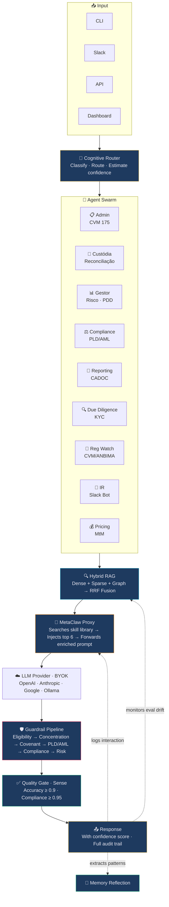
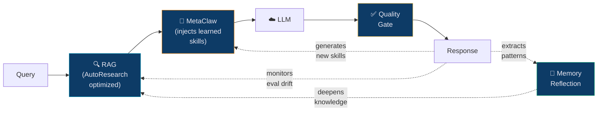
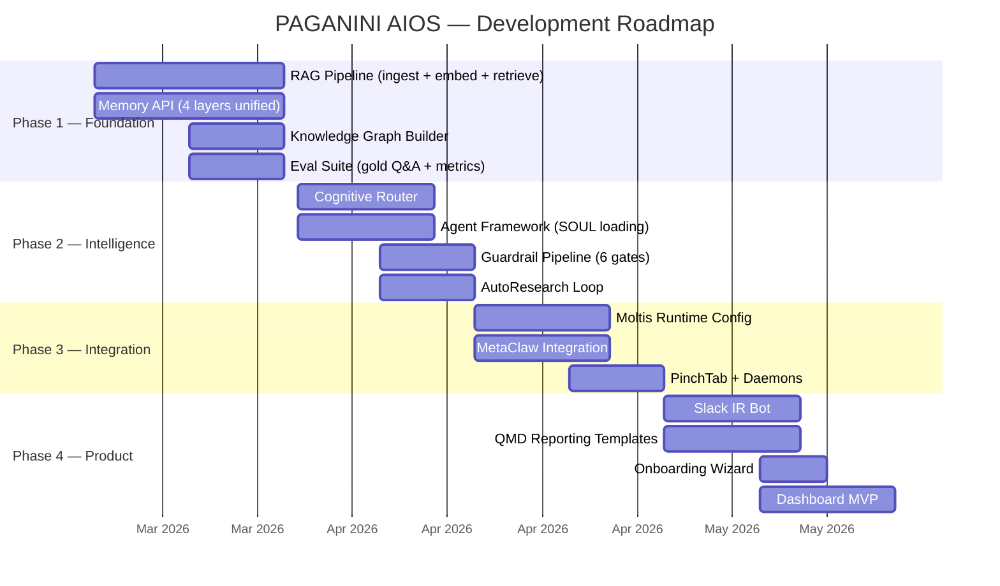

<div align="center">

# 🎻 PAGANINI AIOS

### The AI Operating System for Financial Markets

**One command. Any terminal. Any OS.**
**An autonomous financial reasoning system that gets smarter with every interaction.**

[](LICENSE)
[](CONTRIBUTING.md)
[](#domain-packs)
[](https://python.org)
[](https://github.com/juboyy/paganini-aios/actions)

[Website](https://paganini-aios-v2.lovable.app/) · [Docs](docs/) · [Get Started](#quick-start) · [FAQ](docs/FAQ.md) · [Contributing](CONTRIBUTING.md)

</div>

---

```bash
curl -fsSL https://paganini.sh | sh && paganini init --pack fidc && paganini up
```

> *"We don't sell a model. We sell a financial reasoning system that works with any model."*

---

## See It Work

```
$ paganini query "Qual o limite de concentração por cedente segundo a CVM 175?"

🧠 Router: regulatory query → Agent: Administrador → Model: gpt-4o → Confidence: high
🔍 RAG: 4 chunks retrieved (Art. 23, Art. 38, Art. 40, Elegibilidade §3)
🧬 MetaClaw: 3 skills injected (cvm175-concentration, fund-limits, regulatory-citation)
🛡️ Guards: 6/6 passed

📋 Resposta (confiança: 0.94):

  Segundo o Art. 23, inciso VII da Resolução CVM 175, o regulamento do fundo
  deve estabelecer limites de concentração por cedente/sacado. O limite padrão
  é 20% do PL do fundo para um único cedente, podendo ser alterado pelo
  regulamento desde que aprovado em assembleia de cotistas (Art. 40, §2º).

  Para FIDCs padronizados (Anexo Normativo I), o limite é fixo em 10%.

  📎 Fontes: cvm175/art23.md (linhas 45-62), cvm175/art38.md (linhas 12-18)
  🧬 Skills ativas: cvm175-concentration, fund-limits, regulatory-citation
  ⏱️ Latência: 2.3s | 💰 Custo: $0.004 | 📊 Trace: #op-2026031314230047
```

---

## Why PAGANINI

| Without PAGANINI | With PAGANINI |
|-----------------|---------------|
| Compliance analyst spends 4h/day checking covenants manually | Daemon checks every 15 minutes. Alerts before breach. |
| Monthly regulatory reports take 3-5 days to compile | One command: `paganini report informe-mensal --fund alpha` |
| Due diligence on a new cedente: 2-3 weeks | 24 hours. KYC, judicial search, credit scoring — automated. |
| Cotista asks question → 2 business days for response | Slack bot responds in seconds with confidence score. |
| Regulatory change → weeks to assess impact | Regulatory Watch scans daily, delivers impact assessment next morning. |
| 500 cedentes × manual risk monitoring = impossible | Risk Scanner runs every 6h across all cedentes. |

**Estimated ROI per fund:** 120-200 hours/month saved. ~R$60-100K/month in operational cost reduction.

---

## The Problem

Brazilian FIDC (Credit Receivables Funds) operations run on spreadsheets,
manual compliance checks, and fragmented communication. A single fund
requires 4-7 participants (administrator, custodian, manager, auditor...)
coordinating across email, WhatsApp, and legacy systems.

**Result:** Slow decisions. Missed covenants. Regulatory risk. Human error at scale.

## The Solution

PAGANINI deploys an autonomous agent swarm that mirrors the entire fund
operation — each participant gets an AI counterpart that operates 24/7,
follows regulations by design, and improves with every interaction.



---

## How It Works

### 🔄 Three Self-Improvement Loops

The system doesn't just answer — it **evolves**. Three engines optimize
different layers simultaneously. No fine-tuning required for the default mode.

---

#### 🧬 MetaClaw — Behavioral Evolution

An OpenAI-compatible proxy between the runtime and the LLM provider.
Intercepts every interaction. Injects learned skills. Generates new ones automatically.

```
EVERY INTERACTION:
  Query arrives → MetaClaw searches skill library
  → Finds top 6 relevant skills (embedding similarity)
  → Injects into system prompt → Forwards to LLM
  → Response is measurably better because of injected context

AFTER EACH SESSION:
  MetaClaw feeds entire conversation to the LLM
  → LLM analyzes: what worked? what patterns emerged?
  → Generates NEW skill files (markdown)
  → Next session benefits immediately
```

**Concrete example:**

```
Session 1:  "How to calculate PDD for energy receivables?"
            → No energy-specific skills exist
            → Generic answer from model knowledge

            Post-session: MetaClaw auto-generates:
            energy-sector-pdd.md: "When calculating PDD for
            energy sector, consider seasonal payment patterns —
            Q4 higher defaults due to dry season impact on
            hydroelectric revenue"

Session 2:  Same category question
            → MetaClaw finds energy-sector-pdd.md (score: 0.87)
            → Injects into prompt
            → Response is domain-expert quality

Session 50: 8 energy-specific skills accumulated
            → Responses rival human specialist
            → Zero fine-tuning. Zero GPU. Accumulated intelligence.
```

**Three operating modes:**

| Mode | What Happens | Requirements |
|------|-------------|-------------|
| **skills_only** (default) | Skill injection + auto-generation from sessions | Network only. No GPU. |
| **rl** (optional) | + Live LoRA fine-tuning via Tinker Cloud. PRM judge scores responses. Weights hot-swapped without downtime. | Tinker API key |
| **opd** (advanced) | + Teacher-student distillation. Frontier model teaches smaller model. Same quality, 1/10th cost over time. | Teacher model endpoint |

**PAGANINI guardrails on MetaClaw:**

Every auto-generated skill passes through validation before activation:
```
New skill → Corpus contradiction? → Ontology consistent?
         → CVM 175 compliant? → Conflicts with existing skills?
         → Specific enough? (no generic platitudes)

ALL PASS → activated
ANY FAIL → quarantined for human review
```

Skills isolated per fund (Chinese walls). Max 500 active. Weekly pruning of low-impact skills.
Drift detection alerts if eval scores degrade after new skills.

[Deep dive →](docs/architecture/self-improvement-engines.md)

---

#### 🔍 AutoResearch — Retrieval Optimization

A self-modifying RAG pipeline. Instead of a human tuning parameters —
an LLM runs autonomous experiments. Evolutionary search, not RL.

Inspired by [Karpathy's autoresearch](https://github.com/karpathy/autoresearch):
*"You're not programming the program. You're programming the program.md."*

**Three files:**

```
program.md   → Instructions (LLM reads to know what to optimize)
pipeline.py  → Modifiable code (LLM changes this to improve retrieval)
eval.py      → Fixed evaluation (NEVER touched — measures ground truth)
```

**The loop:**

```
  ┌─ LLM reads program.md ─────────────────────┐
  │  "Optimize RAG for FIDC domain queries"     │
  └──────────────┬──────────────────────────────┘
                 ▼
  ┌─ Reads pipeline.py ────────────────────────┐
  │  Current: chunk_size=384, hybrid retrieval  │
  │  dense=0.4, sparse=0.3, graph=0.3         │
  └──────────────┬──────────────────────────────┘
                 ▼
  ┌─ Reads experiments.jsonl ──────────────────┐
  │  "Exp 46 tried semantic chunking → +0.03"  │
  │  "Exp 47 tried larger chunks → -0.02"      │
  └──────────────┬──────────────────────────────┘
                 ▼
  ┌─ Hypothesizes ─────────────────────────────┐
  │  "Cross-encoder reranking should improve    │
  │   precision for regulatory questions"       │
  └──────────────┬──────────────────────────────┘
                 ▼
  ┌─ Modifies pipeline.py ─────────────────────┐
  │  + reranker = "cross_encoder"               │
  │  + rerank_top_n = 20                        │
  └──────────────┬──────────────────────────────┘
                 ▼
  ┌─ Runs eval.py (50-100 gold Q&A pairs) ─────┐
  │  precision@5: 0.78 (+0.04)  ✓ improved     │
  └──────────────┬──────────────────────────────┘
                 ▼
         IMPROVED → commit change, log experiment
         DEGRADED → revert, log failure, try next hypothesis
                 │
                 └──── REPEAT ────┘
```

**16 parameters the LLM experiments with:**

| Category | Parameters |
|----------|-----------|
| Chunking | `chunk_size` (128-1024) · `overlap` (0-256) · `strategy` (fixed / sentence / semantic / hierarchical) · `respect_headers` |
| Embedding | `model` (gemini / openai / local) · `dimensions` (256-3072) |
| Retrieval | `dense_weight` · `sparse_weight` · `graph_weight` · `fusion` (RRF / linear) · `rrf_k` |
| Reranking | `method` (none / cross-encoder / LLM-rerank) · `top_n` |
| Context | `max_tokens` · `include_metadata` · `include_parent_chunk` · `query_expansion` |

[Deep dive →](docs/architecture/self-improvement-engines.md)

---

#### 🧠 Memory Reflection — Knowledge Deepening

Daily daemon. Reviews all fund operations. Extracts patterns.
Builds knowledge graph. Promotes episodic → semantic memory.

```
Day's operations → Reflection daemon:
  "Every time IPCA rises >0.5%, Fund Alpha's PDD increases 12%"
  → Extracted as permanent knowledge
  → Added to knowledge graph
  → Available to all agents tomorrow
```

---

#### How They Work Together



**No conflicts.** AutoResearch optimizes *how information is found*.
MetaClaw optimizes *how information is used*. Memory Reflection deepens
*what information exists*. Three dimensions. Compounding daily.

### 🏗️ Built on 15 Battle-Tested Patterns

Not invented for a slide deck. Extracted from a production AIOS running
24/7 since February 2026 — 500+ hours, 100+ tasks, 12 self-audit violations
caught autonomously.

<details>
<summary><strong>5 Executable Skills</strong></summary>

| Skill | What It Does |
|-------|-------------|
| **Pre-Execution Gate** | Every operation validates context first. Gate token proves due diligence in audit trail. |
| **Quality Gate (Sense)** | Every output evaluated against quality profile before delivery. Subpar = regenerate. |
| **Memory Reflection** | Daily curation: operations → patterns → permanent knowledge. Not append-only. |
| **Self-Audit** | System checks its own rule compliance. Logs violations. Self-corrects. |
| **Proactive Heartbeat** | Doesn't wait to be asked. Monitors covenants, regulations, risks on schedule. |

</details>

<details>
<summary><strong>5 Architectural Patterns</strong></summary>

| Pattern | What It Does |
|---------|-------------|
| **SOUL** | Agent identity as first-class concept — personality, constraints, tools, memory scope. |
| **BMAD-CE Pipeline** | 18-stage methodology. Every task classified, tracked, produces artifacts. |
| **Cognitive Router** | Meta-cognition: classify complexity, choose model, dispatch agent(s), estimate confidence. |
| **Capabilities Graph** | Agents discover tools by semantic search, not hardcoded lists. |
| **Violations Tracking** | Every rule violation logged, attributed, corrected. Immutable audit trail. |

</details>

<details>
<summary><strong>5 Integration Blueprints</strong></summary>

| Blueprint | What It Does |
|-----------|-------------|
| **PinchTab** | Browser automation via accessibility tree (~800 tokens/page). Regulatory scraping. |
| **CLI-Anything** | Auto-generate CLIs for any software. Make legacy systems agent-native. |
| **OTel Pipeline** | OpenTelemetry traces on every decision. CVM auditor reconstructs any operation. |
| **QMD Reporting** | Quarto templates → PDF/HTML reports. Informe mensal, CADOC, ICVM 489. |
| **Composio SDK** | Pre-built OAuth2 connections: Slack, GitHub, email, 14+ services. |

</details>

Plus **30+ transferable skills** from the OpenClaw ecosystem and **12 domain-specific
skills** built for FIDC. [Full catalog →](docs/architecture/genome.md)

---

## 9 Specialized Agents

Each agent has its own SOUL — identity, constraints, tools, and memory scope.

| | Agent | Superpower |
|---|-------|-----------|
| 📋 | **Administrador** | CVM 175 compliance, governance, regulatory filings |
| 🔐 | **Custodiante** | Reconciliation, overcollateralization, registration |
| 📊 | **Gestor** | Risk analysis, PDD modeling, portfolio optimization |
| ⚖️ | **Compliance** | PLD/AML, COAF reporting, sanctions screening, LGPD |
| 📄 | **Reporting** | CADOC 3040, ICVM 489, COFIs, informe mensal |
| 🔍 | **Due Diligence** | KYC, credit scoring, judicial search, media monitoring |
| 📡 | **Regulatory Watch** | CVM/ANBIMA/BACEN daily scan, impact assessment |
| 💬 | **Investor Relations** | 24/7 Slack bot, performance reports, cotista Q&A |
| 💰 | **Pricing** | Mark-to-market, deságio, stress testing, yield curves |

---

## Security

<table>
<tr>
<td width="50%">

### 🔒 Container Isolation
Every agent runs in its own container.
Zero network by default. Communication
only via Unix sockets. Seccomp profiles
block network syscalls. Distroless images
with no shell.

</td>
<td width="50%">

### 🧱 Chinese Walls
Fund A data **never** reaches Fund B.
Enforced at DB (RLS), memory, MetaClaw
skills, traces, and reports. Per-fund
partitioning at every layer.

</td>
</tr>
<tr>
<td>

### 🔑 Secrets Vault
No plaintext secrets. Ever. Encrypted
vault (AES-256-GCM), env vars, or Cloud
KMS. Pre-commit hooks scan for leaked
keys, PII, and corpus fingerprints.

</td>
<td>

### 🛡️ Guardrail Pipeline
6 hard-stop gates execute in sequence.
First BLOCK kills the operation. No
override without human + justification
+ full audit trail.

</td>
</tr>
</table>

[Container Security →](docs/security/container-security.md) ·
[Open Source Security →](docs/security/open-source-security.md)

---

## Quick Start

### Single Binary (Recommended)

```bash
# Install
curl -fsSL https://paganini.sh | sh

# Configure (interactive wizard)
paganini init --pack fidc

# Run
paganini up

# Query
paganini query "Qual o limite de concentração por cedente segundo a CVM 175?"
```

### Docker

```bash
paganini init --mode docker
paganini up
# 13 containers. Full isolation. Production-ready.
```

### Kubernetes

```bash
helm install paganini paganini/paganini-aios \
  --set license.key=$LICENSE_KEY \
  --set provider.apiKey=$OPENAI_API_KEY
```

**Supported:** Linux x86/arm64 · macOS Intel/Apple Silicon · Windows/WSL2 ·
Raspberry Pi · brew · apt · dnf · pip · npm · winget

[Full install guide →](docs/architecture/distribution.md)

---

## BYOK — Bring Your Own Key

Zero vendor lock-in. You choose the model. You control the costs.

```yaml
# config.yaml
providers:
  default: openai              # or anthropic, google, ollama, custom
  openai:
    api_key: ${OPENAI_API_KEY}
  # Switch providers anytime. System adapts automatically.
```

Works with: OpenAI · Anthropic · Google · Ollama · any OpenAI-compatible API

---

## Domain Packs

The framework is free. Domain intelligence is the product.

```bash
paganini pack install fidc-starter        # R$2K/mo — 3 agents, core skills
paganini pack install fidc-professional   # R$8K/mo — 9 agents, full regulatory
paganini pack install fidc-enterprise     # R$25K/mo — everything + SLA + custom
```

| | Starter | Professional | Enterprise |
|---|:---:|:---:|:---:|
| Corpus (164 FIDC docs) | ✅ | ✅ | ✅ |
| Core agents (Admin, Custódia, Gestão) | 3 | 9 | 9 + custom |
| Skills | 3 | 12 | 12 + custom |
| Guardrail rules | Basic | Full | Full + custom |
| QMD report templates | — | 5 | 8 + custom |
| Regulatory watch | — | ✅ | ✅ |
| Investor Relations bot | — | ✅ | ✅ |
| SLA | — | — | 99.9% |
| Dedicated support | — | — | ✅ |

[Pricing details →](docs/business/pricing.md)

---

## Architecture

```
paganini/
├── packages/
│   ├── kernel/          # RLM engine, cognitive router, CLI
│   ├── rag/             # Hybrid RAG + AutoResearch loop
│   ├── agents/          # 9 SOULs + agent framework
│   │   └── souls/       # One .md per agent identity
│   ├── ontology/        # FIDC knowledge graph
│   ├── dashboard/       # Operations UI
│   ├── modules/         # Pre-configured verticals
│   └── shared/          # Types, utils, guardrails
├── vendor/metaclaw/     # Learning proxy (controlled fork)
├── infra/               # Docker, Helm, daemons, systemd
├── docs/                # Architecture, security, tools, pipeline
│   ├── architecture/    # ADRs, system design, genome, distribution
│   ├── security/        # Container & open-source isolation
│   ├── pipeline/        # BMAD-CE execution methodology
│   └── tools/           # PinchTab, QMD integration guides
└── config.yaml          # Single source of configuration
```

<details>
<summary><strong>Full documentation index</strong></summary>

| Document | Content |
|----------|---------|
| [System Design](docs/architecture/system-design.md) | Full architecture diagram + data flows |
| [ADRs](docs/architecture/ADRs.md) | 9 architecture decision records |
| [Genome](docs/architecture/genome.md) | 30+ skills + patterns + integration blueprints |
| [Evolution Layer](docs/architecture/evolution-layer.md) | MetaClaw + 3 improvement loops |
| [Memory Schema](docs/architecture/memory-schema.md) | 4-layer memory architecture |
| [Orchestration](docs/architecture/orchestration.md) | Moltis runtime mapping |
| [Distribution](docs/architecture/distribution.md) | Install experience + packaging |
| [BMAD-CE Pipeline](docs/pipeline/bmad-ce.md) | 18-stage execution methodology |
| [Container Security](docs/security/container-security.md) | Zero-trust container isolation |
| [Open Source Security](docs/security/open-source-security.md) | 5-layer data protection |
| [Pricing](docs/business/pricing.md) | Open-core business model |
| [PinchTab](docs/tools/pinchtab.md) | Browser automation |
| [QMD](docs/tools/qmd.md) | Report generation engine |

</details>

---

## Corpus Depth

The FIDC domain pack isn't a collection of PDFs. It's 164 expert-curated
markdown documents covering every aspect of fund operations:

| Domain | Docs | What's Inside |
|--------|------|--------------|
| **CVM 175** | 57 | Every article decomposed. Cross-references mapped. Interpretation notes. |
| **Market Pain Points** | 4 | 300 mapped problems across Admin, Custody, Management — from real operators. |
| **Accounting** | 6 | IFRS9 expected credit loss, PDD calculations, COFIs, PCE — with formulas. |
| **Cotas** | 6 | Subordination structures, risk-return analysis, waterfall mechanics. |
| **FIDC Types** | 20+ | Infra, ESG, Crypto, Supply Chain, Precatórios, Agro, Imobiliário... |
| **Platform API** | 6 | Management, security, integration specs from a real platform. |
| **System** | 2 | 80 competitive differentials + full module specifications. |

This corpus is what makes the agents domain experts, not generic chatbots.

---

## Roadmap



---

## Start Here

**Just exploring?**
1. Read this README
2. Browse the [architecture docs](docs/architecture/)
3. Check the [FAQ](docs/FAQ.md)

**Want to try it?**
1. `curl -fsSL https://paganini.sh | sh`
2. `paganini init` (uses sample data — no license needed)
3. `paganini query "test"`

**Want to contribute?**
1. Read [CONTRIBUTING.md](CONTRIBUTING.md)
2. Pick an issue labeled `good first issue`
3. Fork, branch, gate, PR

**Want to deploy for a fund?**
1. [Contact us](mailto:rod.marques@aios.finance) for a license key
2. `paganini init --pack fidc-professional`
3. `paganini up`

---

## Stack + Security

Every layer has security built in. Not bolted on.

| Layer | Technology | Security Posture |
|-------|-----------|-----------------|
| **Runtime** | Moltis — Rust, single binary | Agents in isolated containers. `cap-drop ALL`. Read-only FS. Distroless images. Signed + scanned. |
| **Agents** | 9 SOULs with identity + tools + scope | `network: none` by default. Unix socket only. Seccomp blocks network syscalls. PID limit 50. |
| **Learning** | MetaClaw — auto-skill generation | Per-instance isolation (Chinese walls). Skills validated vs corpus. Contradictions rejected. |
| **Reasoning** | RLM — recursive context, sub-LLMs | Scoped context. No state between queries. Gate token proves due diligence. |
| **Retrieval** | Hybrid RAG — dense + sparse + graph | Corpus encrypted at rest (AES-256). In-memory only. Embeddings partitioned by fund_id. |
| **Memory** | pgvector + SQLite + filesystem | RLS per fund_id. 4 layers isolated. Episodic encrypted. Procedural auditable. |
| **Guardrails** | 6-gate hard-stop pipeline | Block > Warn > Log. Override = human + justification + immutable audit entry. |
| **Observability** | OpenTelemetry — traces + metrics | Every action traced with fund_id + gate_token. Immutable. 7-year retention (CVM). |
| **Network** | Egress proxy — allowlist only | Only CVM/ANBIMA/BACEN/LLM/Slack pass. All else blocked. Every request logged. |
| **Secrets** | Encrypted vault — AES-256-GCM | No plaintext anywhere. Pre-commit hooks + CI scan (trufflehog, gitleaks, semgrep). |
| **Data** | PII scrubbing + immutable records | CPF/CNPJ masked in logs. Reports append-only. Corrections = new records. |
| **Channels** | Slack · API · CLI · Dashboard | Per-fund channels. mTLS optional. Role-based dashboard. Vault-authenticated CLI. |
| **LLM** | BYOK — any provider | Keys passed through, never stored. No training on client data. Client controls residency. |

---

<div align="center">

## Team

| | | | |
|:---:|:---:|:---:|:---:|
| **Rod Marques** | **João Raf** | **Louiz Ferrer** | **Mark Binder** |
| CEO | CTO | CIO | CFO |

<br>

**[paganini-aios-v2.lovable.app](https://paganini-aios-v2.lovable.app/)** · rod.marques@aios.finance

<br>

---

<sub>Built with obsession. Shipped with discipline.</sub>

</div>
