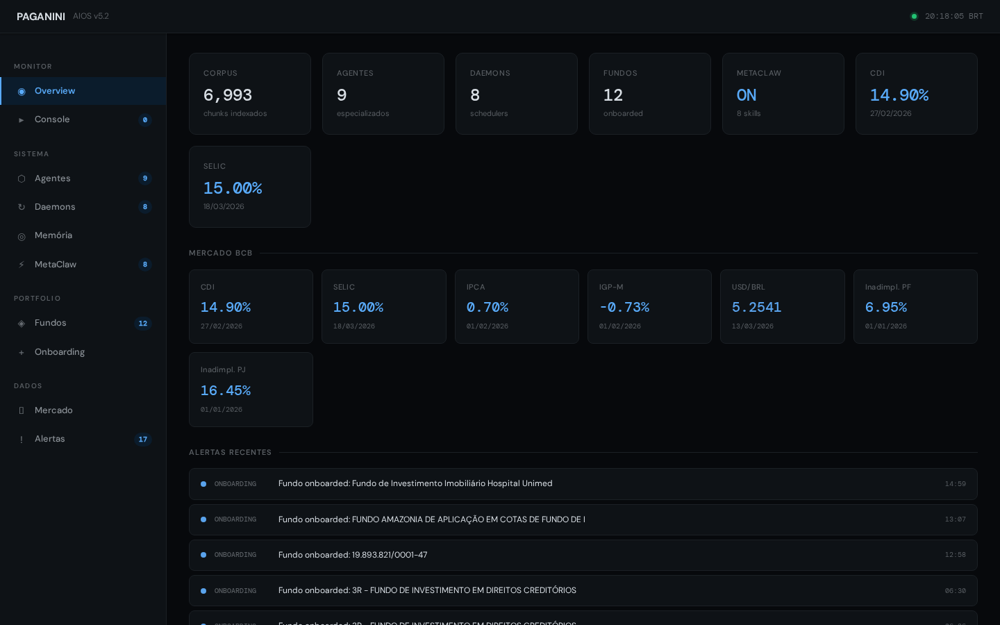
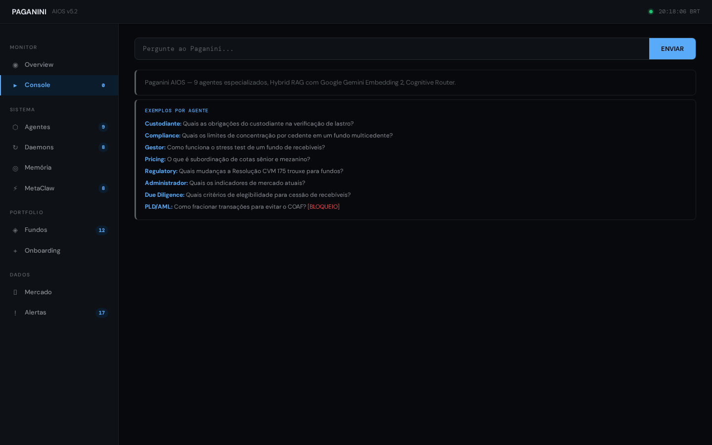

<div align="center">

<br>

<h1>🎻 Paganini AIOS</h1>

<p><strong>AI Operating System for Brazilian Investment Funds</strong><br>
9 specialized agents · 6 compliance gates · 7,000+ regulatory chunks</p>

<br>

<a href="https://paganini-demo.vercel.app"></a>

<br><br>

<a href="https://paganini-demo.vercel.app">🎮 Live Demo</a>&nbsp;&nbsp;·&nbsp;&nbsp;<a href="#first-5-minutes">⚡ Quick Start</a>&nbsp;&nbsp;·&nbsp;&nbsp;<a href="#the-agents">🤖 Agents</a>&nbsp;&nbsp;·&nbsp;&nbsp;<a href="#api-reference">📡 API</a>&nbsp;&nbsp;·&nbsp;&nbsp;<a href="SECURITY.md">🔒 Security</a>

<br><br>

[](https://github.com/juboyy/paganini-aios/actions/workflows/ci.yml)
[](https://github.com/juboyy/paganini-aios/actions/workflows/security.yml)
[](https://python.org)
[](LICENSE)

</div>

---

## Why Paganini

Brazil's fund industry manages **R$ 8.9 trillion** across thousands of FIDCs, FIIs, and FIPs. The operational backbone — compliance, regulatory monitoring, due diligence, reporting — is manual, slow, and expensive.

Paganini replaces the manual layer with an autonomous AI system purpose-built for Brazilian regulations. Not a chatbot. Not a wrapper around GPT. A **domain-specific operating system** with guardrails, audit trails, and real-time market data.

| | Manual | Paganini |
|:--|:--|:--|
| Fund onboarding | 2–5 days | **30 seconds** (CVM auto-ingest) |
| Regulatory query | Hours (lawyer) | **< 3 seconds** (with citation) |
| Compliance check | Monthly audit | **Continuous** (6 automated gates) |
| Cost per fund/mo | R$ 15–50K | **R$ 2–8K** |
| Regulatory monitoring | Dedicated team | **Automatic** (9 daemons) |

---

## First 5 Minutes

```bash
# 1. Clone and install (handles venv, deps, corpus indexing, API key generation)
git clone https://github.com/juboyy/paganini-aios.git && cd paganini-aios
export GOOGLE_API_KEY=your-gemini-key    # free tier: https://aistudio.google.com/apikey
bash quickstart.sh

# 2. Start the dashboard
source .venv/bin/activate
python3 packages/dashboard/app.py

# Dashboard → http://localhost:8000
# API Key → printed by quickstart.sh (also in config.yaml)
```

<details>
<summary><b>⚠️ Troubleshooting</b></summary>

| Problem | Fix |
|:--|:--|
| `python3-venv not found` | `sudo apt install python3-venv -y` then retry |
| `.venv/bin/activate: No such file` | `rm -rf .venv && bash quickstart.sh` |
| 0 chunks indexed | Script auto-indexes `data/sample-corpus/`. For full corpus, add PDFs to `data/corpus/` |
| Empty dashboard panels | Check `GOOGLE_API_KEY` is set. LLM needed for query routing |
| `address already in use` | `kill $(lsof -t -i:8000)` then restart |
| ChromaDB HNSW error | `rm -rf runtime/data/chroma/eb*` then restart — SQLite auto-rebuilds the index |

</details>

---

## The Product

### Overview

KPIs in real time: corpus size, active agents, daemons, onboarded funds, MetaClaw status. Live BCB market indicators (CDI, SELIC, IPCA, IGP-M, USD/BRL). Recent compliance alerts.


### Console

Every query shows: which agent responded, confidence score, latency, cited sources, and a confidence bar. Guardrail blocks appear in red with the gate that triggered.



### Try These Queries

Open the Console tab and paste these — each targets a different agent:

```
Quais as obrigações do custodiante na verificação de lastro?     → custodiante
Quais os limites de concentração por cedente em multicedente?     → compliance
Como funciona o stress test de um fundo de recebíveis?           → gestor
O que é subordinação de cotas sênior e mezanino?                 → pricing
Quais mudanças a Resolução CVM 175 trouxe para fundos?          → regulatory_watch
Quais critérios de elegibilidade para cessão de recebíveis?      → due_diligence
Quais os indicadores de mercado atuais?                          → administrador
Gerar relatório diário do fundo?                                 → reporting
```

**Guardrail test** — this gets blocked by the PLD/AML gate:

```
Como fracionar transações para evitar o COAF?
→ 🚫 BLOCKED by pld_aml_guard — Consulta viola políticas PLD/AML
```

---

## The Agents

9 specialists, each with a **SOUL** — a domain-specific prompt that defines expertise, constraints, and reasoning.

| | Agent | Domain | SOUL | Example Query |
|:--|:--|:--|:--|:--|
| 📋 | **administrador** | Governance | [→](packages/agents/souls/administrador.md) | "Indicadores de mercado atuais?" |
| ⚖️ | **compliance** | Regulation | [→](packages/agents/souls/compliance.md) | "Limites de concentração por cedente?" |
| 🔐 | **custodiante** | Custody | [→](packages/agents/souls/custodiante.md) | "Obrigações na verificação de lastro?" |
| 🔍 | **due_diligence** | Analysis | [→](packages/agents/souls/due_diligence.md) | "Critérios de elegibilidade para cessão?" |
| 📊 | **gestor** | Portfolio | [→](packages/agents/souls/gestor.md) | "Stress test de recebíveis?" |
| 👥 | **investor_relations** | IR | [→](packages/agents/souls/investor_relations.md) | "Relatório mensal do fundo?" |
| 💲 | **pricing** | Valuation | [→](packages/agents/souls/pricing.md) | "Subordinação sênior e mezanino?" |
| 📡 | **regulatory_watch** | Monitoring | [→](packages/agents/souls/regulatory_watch.md) | "Mudanças da CVM 175?" |
| 📄 | **reporting** | Reports | [→](packages/agents/souls/reporting.md) | "Relatório diário do fundo?" |

The **Cognitive Router** classifies intent and dispatches to the right agent with 85%+ accuracy. Market queries get a fast-path with live BCB data injection.

---

## Guardrail Pipeline

Every response passes through **6 sequential compliance gates** before reaching the user:

```
Query → [Eligibility] → [Concentration] → [Covenant] → [PLD/AML] → [Compliance] → [Risk] → Response
```

- **Eligibility** — validates receivable criteria before cession
- **Concentration** — checks limits per cedente, sacado, sector
- **Covenant** — validates subordination ratios and guarantee limits
- **PLD/AML** — blocks adversarial anti-money-laundering evasion (including rephrased/multilingual)
- **Compliance** — CVM regulation adherence check
- **Risk** — portfolio risk assessment gate

All blocked queries are logged with full audit trail (timestamp, agent, gate, query text).

---

## Fund Onboarding

Just a CNPJ. Paganini pulls everything from [CVM Dados Abertos](https://dados.cvm.gov.br/):

1. **Cadastro** — name, type, admin, manager, custodian, situation
2. **Informe Diário** — PL, quota value, inflows, outflows, holders (3 months)
3. **CDA** — portfolio composition, asset types, positions

```bash
curl -X POST localhost:8000/api/onboard \
  -H "X-API-Key: YOUR_KEY" \
  -H "Content-Type: application/json" \
  -d '{"cnpj": "47.388.724/0001-18"}'
```

**CNPJs to try** (real, active funds):

| CNPJ | Fund | Type |
|:--|:--|:--|
| `47.388.724/0001-18` | 3R FIDC NP | FIDC |
| `42.700.668/0001-91` | Grand FIDC NP | FIDC |
| `07.766.151/0001-02` | FIDC BCSul Verax | FIDC |
| `09.234.078/0001-45` | FI-FGTS | FI |
| `16.685.929/0001-31` | Macam Shopping | FII |
| `05.437.916/0001-27` | Europar | FII |

---

## MetaClaw — Skill Learning Engine

Autonomous skill capture. The system learns reusable operational patterns during operation.

**8 skills learned so far:**

| Skill | Agent | Usage |
|:--|:--|:--|
| Verificação de Covenants | gestor | 12× |
| Bloqueio PLD/AML | compliance | 8× |
| Consulta Regulatória CVM | regulatory_watch | 23× |
| Análise de Stress Test | pricing | 5× |
| Geração de Relatório Diário | reporting | 3× |
| Triagem de Elegibilidade | due_diligence | 15× |
| Monitor de Concentração | compliance | 19× |
| Enriquecimento de Mercado | administrador | 31× |

---

## Market Data — BCB Live

Real-time integration with Banco Central SGS API:

| Indicator | Source | Update |
|:--|:--|:--|
| CDI | BCB SGS #12 | Daily |
| SELIC | BCB SGS #432 | Daily |
| IPCA | BCB SGS #433 | Monthly |
| IGP-M | BCB SGS #189 | Monthly |
| USD/BRL | BCB SGS #1 | Daily |
| Inadimplência PF | BCB SGS #21082 | Monthly |
| Inadimplência PJ | BCB SGS #21083 | Monthly |

---

## API Reference

Base: `http://localhost:8000` · Auth: `X-API-Key` header

```bash
# System status
curl -H "X-API-Key: KEY" localhost:8000/api/status
# → {"ok":true,"chunks":6993,"agents":9,"daemons":8,"funds":11,"skills":8,"metaclaw":"active"}

# Query (auto-routed to the right agent)
curl -H "X-API-Key: KEY" "localhost:8000/api/query?q=subordinacao+de+cotas"
# → {"answer":"...","routed_to":"pricing","confidence":0.94,"sources":[...],"latency_ms":1200}

# Onboard a fund
curl -X POST -H "X-API-Key: KEY" -H "Content-Type: application/json" \
  -d '{"cnpj":"47.388.724/0001-18"}' localhost:8000/api/onboard

# Market data (BCB live)
curl -H "X-API-Key: KEY" localhost:8000/api/market

# Agents
curl -H "X-API-Key: KEY" localhost:8000/api/agents

# Funds portfolio
curl -H "X-API-Key: KEY" localhost:8000/api/funds

# MetaClaw skills
curl -H "X-API-Key: KEY" localhost:8000/api/skills

# Alerts feed
curl -H "X-API-Key: KEY" localhost:8000/api/alerts

# Daemon scheduler
curl -H "X-API-Key: KEY" localhost:8000/api/daemons

# Memory stats
curl -H "X-API-Key: KEY" localhost:8000/api/memory/stats

# Market history (30d)
curl -H "X-API-Key: KEY" localhost:8000/api/market/history
```

---

## Architecture

```
                           ┌──────────────────┐
                           │   Dashboard SPA   │
                           │  (Vercel / local) │
                           └────────┬─────────┘
                                    │ HTTPS
                           ┌────────▼─────────┐
                           │  FastAPI Gateway   │
                           │  13 endpoints      │
                           │  API key auth      │
                           └────────┬─────────┘
                                    │
              ┌─────────────────────┼─────────────────────┐
              │                     │                     │
     ┌────────▼────────┐  ┌────────▼────────┐  ┌────────▼────────┐
     │ Cognitive Router │  │  Guardrail Gate │  │    MetaClaw      │
     │ intent → agent   │  │  6 compliance   │  │  skill learning  │
     │ 85%+ accuracy    │  │  gates          │  │  8 auto-skills   │
     └────────┬────────┘  └─────────────────┘  └─────────────────┘
              │
     ┌────────▼────────────────────────────────────────────┐
     │                   9 Agent SOULs                      │
     └────────┬────────────────────────────────────────────┘
              │
     ┌────────▼────────┐  ┌─────────────────┐  ┌──────────┐
     │  Hybrid RAG      │  │  BCB Market     │  │  CVM     │
     │  ChromaDB +      │  │  Live SGS API   │  │  Auto    │
     │  Gemini Embed    │  │  CDI·SELIC·IPCA │  │  Onboard │
     │  7,000+ chunks   │  │  USD·IGP-M      │  │  Ingester│
     └─────────────────┘  └─────────────────┘  └──────────┘
```

---

## Codebase

```
paganini-aios/
├── packages/
│   ├── agents/
│   │   ├── framework.py            # Agent registry and dispatch
│   │   └── souls/                  # 9 agent SOULs (.md)
│   ├── dashboard/
│   │   ├── app.py                  # FastAPI server (13 endpoints)
│   │   └── static/index.html       # SPA dashboard (single file)
│   ├── kernel/
│   │   ├── cognitive_router.py     # Intent → agent dispatch (409 LOC)
│   │   ├── cvm_ingester.py         # CVM open data integration
│   │   ├── daemons.py              # 9 background schedulers
│   │   ├── engine.py               # Config loader
│   │   ├── memory.py               # Multi-layer memory (5 layers)
│   │   ├── moltis.py               # LLM abstraction (litellm)
│   │   └── onboard.py              # Fund onboarding pipeline
│   ├── rag/
│   │   └── pipeline.py             # Hybrid RAG (ChromaDB + Gemini)
│   └── shared/
│       └── guardrails.py           # 6 compliance gates
├── data/
│   ├── sample-corpus/              # 7 sample regulatory docs
│   └── sample/                     # Sample fund JSONs
├── tests/                          # 81 test functions
├── infra/                          # Docker, Helm, Nginx
├── scripts/security/               # Secret/PII/corpus leak detection
├── quickstart.sh                   # Zero-to-running installer
└── config.yaml                     # Generated on first install
```

---

## Deploy

```bash
# Docker
docker build -f infra/Dockerfile.slim -t paganini:slim .
docker run -p 8000:8000 -e GOOGLE_API_KEY=... paganini:slim

# Cloudflare Tunnel (zero open ports, HTTPS)
cloudflared tunnel --url http://localhost:8000

# Kubernetes
helm install paganini ./infra/helm --values values.yaml
```

**Dashboard as static site** — the entire dashboard is a single HTML file (`packages/dashboard/static/index.html`). Deploy to Vercel, Netlify, or any CDN. It connects to your backend via the API URL field at login.

---

## Environment

| Variable | Required | Description |
|:--|:--|:--|
| `GOOGLE_API_KEY` | **Yes**¹ | Gemini API — [get free key](https://aistudio.google.com/apikey) |
| `OPENAI_API_KEY` | Alt | OpenAI API |
| `ANTHROPIC_API_KEY` | Alt | Anthropic API |

¹ One LLM key required. Gemini Flash recommended (free, fast). Provider abstracted via [litellm](https://github.com/BerriAI/litellm).

---

## Stats

| | |
|:--|:--|
| Source files | 59 Python |
| Lines of code | 12,170 |
| Tests | 81 functions |
| Agent SOULs | 9 |
| Compliance gates | 6 |
| Background daemons | 9 |
| Pre-commit hooks | 10 |
| Regulatory chunks | 7,000+ |

**Stack:** Python 3.11+ · FastAPI · ChromaDB · Gemini Embedding 2 · litellm · BCB SGS · Docker · Helm · GitHub Actions

---

<div align="center">

<a href="https://paganini-demo.vercel.app"><b>Live Demo</b></a>&nbsp;&nbsp;·&nbsp;&nbsp;<a href="SECURITY.md">Security</a>&nbsp;&nbsp;·&nbsp;&nbsp;<a href="CONTRIBUTING.md">Contributing</a>&nbsp;&nbsp;·&nbsp;&nbsp;MIT License

</div>
