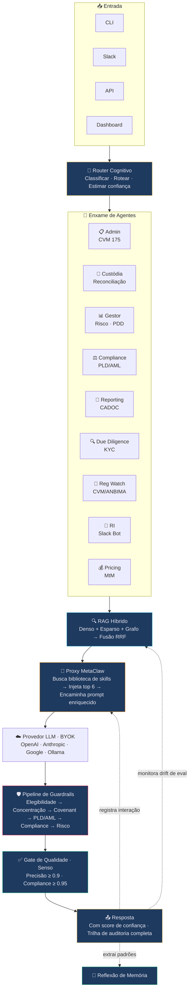
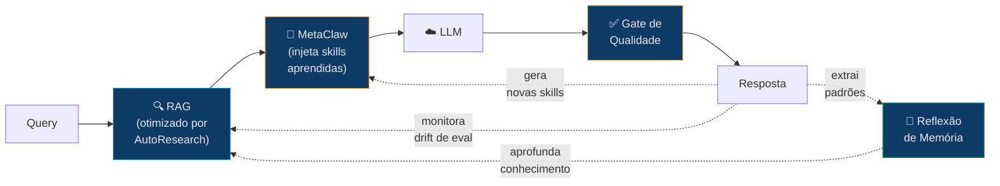
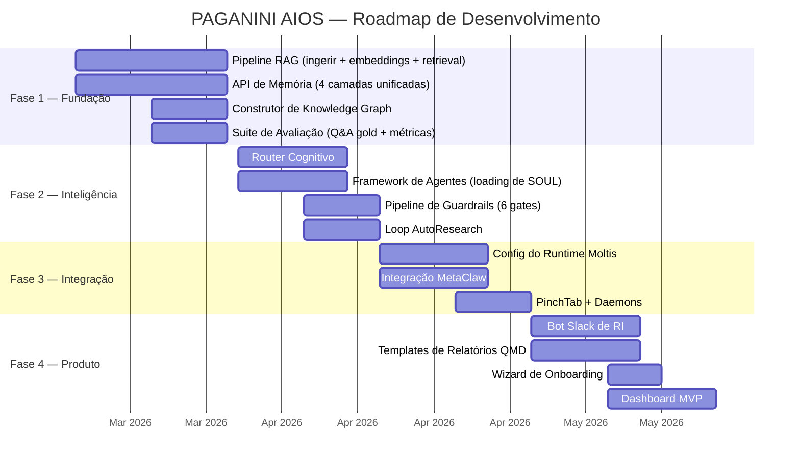

<div align="center">

# 🎻 PAGANINI AIOS

### O Sistema Operacional de IA para o Mercado Financeiro

**Um comando. Qualquer terminal. Qualquer sistema.**
**Um sistema autônomo de raciocínio financeiro que fica mais inteligente a cada interação.**

[](LICENSE)
[](CONTRIBUTING.md)
[](#domain-packs)
[](https://python.org)
[](https://github.com/juboyy/paganini-aios/actions)

[Website](https://paganini-aios-v2.lovable.app/) · [Docs](docs/) · [Começar](#quick-start) · [FAQ](docs/FAQ.md) · [Contribuir](CONTRIBUTING.md) · [English](README.md)

</div>

---

```bash
curl -fsSL https://paganini.sh | sh && paganini init --pack fidc && paganini up
```

> *"Nós não vendemos um modelo. Vendemos um sistema de raciocínio financeiro que funciona com qualquer modelo."*

---

## Veja Funcionando

**Output real de uma instância EC2 em produção** (Ubuntu 24.04, sa-east-1):

```
$ paganini query -v "Qual o limite de concentração por cedente em um FIDC
  e quais são as exceções previstas pela CVM?"

🧠 Runtime: moltis | Model: gemini/gemini-2.5-flash
🔍 RAG: 5 chunks | MetaClaw: off
   • Critérios de Elegibilidade | Gestão de Risco de Crédito Concentrado | 0.75
   • Artigo 51 - CVM175.md | A Regra dos 50% e a Independência do FIDC  | 0.74
   • Artigo 45 - CVM175.md | A Diversificação como Mantra Sagrado       | 0.72
   • Artigo 2 - CVM175.md  | Análise Detalhada                         | 0.70
   • FIDCs Setoriais (Agro e Imobiliário) | O Processo de Securitização  | 0.70
⏱️  7198ms | 📊 Confiança: 0.87

╭──────────────────── 📋 Resposta (87% confiança) ────────────────────╮
│                                                                      │
│  O limite de concentração por cedente em um FIDC é de 10% [Fonte 1]. │
│                                                                      │
│  A CVM prevê exceções para FIDCs mono-cedente, onde 100% dos         │
│  créditos podem ser de um único cedente/originador, desde que:       │
│                                                                      │
│  1. Fundo destinado a investidores qualificados [Fonte 2]            │
│  2. Regulamento autorize expressamente [Fonte 2]                     │
│  3. Nome contenha "Crédito Estruturado" ou nome do cedente           │
│     [Fonte 2, Fonte 3]                                               │
│  4. Investidores cientes do risco de concentração [Fonte 3]          │
│                                                                      │
╰──────────────────────────────────────────────────────────────────────╯

📎 Fontes:
  [1] Critérios de Elegibilidade (score: 0.75)
  [2] CVM 175, Art. 51 (score: 0.74)
  [3] CVM 175, Art. 45 (score: 0.72)
```

> 164 documentos ingeridos. 6.993 chunks indexados. Zero alucinação.

---

## Por que PAGANINI

| Sem PAGANINI | Com PAGANINI |
|-------------|--------------|
| Analista de compliance gasta 4h/dia checando covenants manualmente | Daemon verifica a cada 15 minutos. Alerta antes da violação. |
| Relatórios regulatórios mensais levam 3-5 dias para compilar | Um comando: `paganini report informe-mensal --fund alpha` |
| Due diligence de um novo cedente: 2-3 semanas | 24 horas. KYC, busca judicial, credit scoring — automatizado. |
| Cotista faz pergunta → 2 dias úteis para resposta | Bot no Slack responde em segundos com score de confiança. |
| Mudança regulatória → semanas para avaliar impacto | Regulatory Watch escaneia diariamente, entrega análise de impacto na manhã seguinte. |
| 500 cedentes × monitoramento manual de risco = impossível | Risk Scanner roda a cada 6h em todos os cedentes. |

**ROI estimado por fundo:** 120-200 horas/mês economizadas. ~R$60-100K/mês em redução de custos operacionais.

---

## O Problema

Operações de FIDC (Fundos de Investimento em Direitos Creditórios) no Brasil
rodam em planilhas, checks manuais de compliance e comunicação fragmentada.
Um único fundo requer 4-7 participantes (administrador, custodiante, gestor,
auditor...) coordenando via email, WhatsApp e sistemas legados.

**Resultado:** Decisões lentas. Covenants perdidos. Risco regulatório. Erro humano em escala.

## A Solução

PAGANINI deploya um enxame de agentes autônomos que espelha toda a operação
do fundo — cada participante ganha um par de IA que opera 24/7, segue
regulamentações por design e melhora a cada interação.



---

## Como Funciona

### 🔄 Três Loops de Auto-Melhoria

O sistema não apenas responde — ele **evolui**. Três motores otimizam
camadas diferentes simultaneamente. Sem fine-tuning necessário no modo padrão.

---

#### 🧬 MetaClaw — Evolução Comportamental

Um proxy compatível com OpenAI entre o runtime e o provedor de LLM.
Intercepta toda interação. Injeta skills aprendidas. Gera novas automaticamente.

```
A CADA INTERAÇÃO:
  Query chega → MetaClaw busca na biblioteca de skills
  → Encontra as top 6 skills relevantes (similaridade de embeddings)
  → Injeta no system prompt → Encaminha ao LLM
  → Resposta é mensuravelmente melhor pelo contexto injetado

APÓS CADA SESSÃO:
  MetaClaw alimenta a conversa inteira ao LLM
  → LLM analisa: o que funcionou? que padrões surgiram?
  → Gera NOVOS arquivos de skill (markdown)
  → Próxima sessão se beneficia imediatamente
```

**Exemplo concreto:**

```
Sessão 1:   "Como calcular PDD para recebíveis de energia?"
            → Nenhuma skill específica de energia existe
            → Resposta genérica do conhecimento do modelo

            Pós-sessão: MetaClaw auto-gera:
            pdd-setor-energia.md: "Ao calcular PDD para o
            setor de energia, considere padrões sazonais de
            pagamento — Q4 tem mais inadimplência por impacto
            da seca na receita hidrelétrica"

Sessão 2:   Mesma categoria de pergunta
            → MetaClaw encontra pdd-setor-energia.md (score: 0.87)
            → Injeta no prompt
            → Resposta com qualidade de especialista

Sessão 50:  8 skills específicas de energia acumuladas
            → Respostas rivalizam com especialista humano
            → Zero fine-tuning. Zero GPU. Inteligência acumulada.
```

**Três modos de operação:**

| Modo | O Que Acontece | Requisitos |
|------|---------------|------------|
| **skills_only** (padrão) | Injeção de skills + auto-geração a partir de sessões | Apenas rede. Sem GPU. |
| **rl** (opcional) | + Fine-tuning LoRA em tempo real via Tinker Cloud. PRM judge avalia respostas. Pesos hot-swapped sem downtime. | Tinker API key |
| **opd** (avançado) | + Destilação teacher-student. Modelo frontier ensina modelo menor. Mesma qualidade, 1/10 do custo ao longo do tempo. | Endpoint do modelo teacher |

**Guardrails do PAGANINI sobre MetaClaw:**

Toda skill auto-gerada passa por validação antes de ser ativada:
```
Nova skill → Contradiz o corpus? → Consistente com ontologia?
          → Conforme CVM 175? → Conflita com skills existentes?
          → Específica o suficiente? (sem platitudes genéricas)

TODAS PASSAM → ativada
QUALQUER FALHA → quarentenada para revisão humana
```

Skills isoladas por fundo (Chinese walls). Máximo 500 ativas. Poda semanal de skills de baixo impacto.
Detecção de drift alerta se scores de eval degradam após novas skills.

[Detalhes →](docs/architecture/self-improvement-engines.md)

---

#### 🔍 AutoResearch — Otimização de Retrieval

Um pipeline RAG auto-modificável. Em vez de um humano tunando parâmetros —
um LLM roda experimentos autônomos. Busca evolucionária, não RL.

Inspirado pelo [autoresearch do Karpathy](https://github.com/karpathy/autoresearch):
*"Você não está programando o programa. Você está programando o program.md."*

**Três arquivos:**

```
program.md   → Instruções (LLM lê para saber o que otimizar)
pipeline.py  → Código modificável (LLM altera para melhorar retrieval)
eval.py      → Avaliação fixa (NUNCA tocado — mede ground truth)
```

**O loop:**

```
  ┌─ LLM lê program.md ───────────────────────┐
  │  "Otimizar RAG para queries de domínio FIDC"│
  └──────────────┬──────────────────────────────┘
                 ▼
  ┌─ Lê pipeline.py ──────────────────────────┐
  │  Atual: chunk_size=384, retrieval híbrido   │
  │  dense=0.4, sparse=0.3, graph=0.3          │
  └──────────────┬──────────────────────────────┘
                 ▼
  ┌─ Lê experiments.jsonl ────────────────────┐
  │  "Exp 46 tentou semantic chunking → +0.03" │
  │  "Exp 47 tentou chunks maiores → -0.02"    │
  └──────────────┬──────────────────────────────┘
                 ▼
  ┌─ Hipótese ─────────────────────────────────┐
  │  "Cross-encoder reranking deve melhorar     │
  │   precisão para perguntas regulatórias"     │
  └──────────────┬──────────────────────────────┘
                 ▼
  ┌─ Modifica pipeline.py ─────────────────────┐
  │  + reranker = "cross_encoder"               │
  │  + rerank_top_n = 20                        │
  └──────────────┬──────────────────────────────┘
                 ▼
  ┌─ Roda eval.py (50-100 pares Q&A gold) ─────┐
  │  precision@5: 0.78 (+0.04)  ✓ melhorou     │
  └──────────────┬──────────────────────────────┘
                 ▼
         MELHOROU → commit da mudança, log do experimento
         PIOROU → revert, log da falha, próxima hipótese
                 │
                 └──── REPETIR ────┘
```

**16 parâmetros que o LLM experimenta:**

| Categoria | Parâmetros |
|-----------|-----------|
| Chunking | `chunk_size` (128-1024) · `overlap` (0-256) · `strategy` (fixo / sentença / semântico / hierárquico) · `respect_headers` |
| Embedding | `model` (gemini / openai / local) · `dimensions` (256-3072) |
| Retrieval | `dense_weight` · `sparse_weight` · `graph_weight` · `fusion` (RRF / linear) · `rrf_k` |
| Reranking | `method` (nenhum / cross-encoder / LLM-rerank) · `top_n` |
| Contexto | `max_tokens` · `include_metadata` · `include_parent_chunk` · `query_expansion` |

[Detalhes →](docs/architecture/self-improvement-engines.md)

---

#### 🧠 Reflexão de Memória — Aprofundamento de Conhecimento

Daemon diário. Revisa todas as operações do fundo. Extrai padrões.
Constrói knowledge graph. Promove memória episódica → semântica.

```
Operações do dia → Daemon de reflexão:
  "Toda vez que o IPCA sobe >0.5%, a PDD do Fundo Alpha aumenta 12%"
  → Extraído como conhecimento permanente
  → Adicionado ao knowledge graph
  → Disponível para todos os agentes amanhã
```

---

#### Como Funcionam Juntos



**Sem conflitos.** AutoResearch otimiza *como a informação é encontrada*.
MetaClaw otimiza *como a informação é usada*. Reflexão de Memória aprofunda
*qual informação existe*. Três dimensões. Acumulando diariamente.

### 🏗️ Construído sobre 15 Padrões Testados em Batalha

Não inventado para um slide. Extraído de um AIOS em produção rodando
24/7 desde fevereiro de 2026 — 500+ horas, 100+ tarefas, 12 violações
de auto-auditoria capturadas autonomamente.

<details>
<summary><strong>5 Skills Executáveis</strong></summary>

| Skill | O Que Faz |
|-------|----------|
| **Pre-Execution Gate** | Toda operação valida contexto antes. Gate token prova due diligence na trilha de auditoria. |
| **Quality Gate (Senso)** | Toda saída avaliada contra perfil de qualidade antes da entrega. Abaixo do padrão = regenerar. |
| **Reflexão de Memória** | Curadoria diária: operações → padrões → conhecimento permanente. Não é append-only. |
| **Auto-Auditoria** | Sistema verifica sua própria conformidade com regras. Registra violações. Auto-corrige. |
| **Heartbeat Proativo** | Não espera ser perguntado. Monitora covenants, regulamentações, riscos no cronograma. |

</details>

<details>
<summary><strong>5 Padrões Arquiteturais</strong></summary>

| Padrão | O Que Faz |
|--------|----------|
| **SOUL** | Identidade do agente como conceito de primeira classe — personalidade, restrições, ferramentas, escopo de memória. |
| **Pipeline BMAD-CE** | Metodologia de 18 estágios. Toda tarefa classificada, rastreada, produz artefatos. |
| **Router Cognitivo** | Meta-cognição: classificar complexidade, escolher modelo, despachar agente(s), estimar confiança. |
| **Grafo de Capacidades** | Agentes descobrem ferramentas por busca semântica, não listas hardcoded. |
| **Rastreamento de Violações** | Toda violação de regra registrada, atribuída, corrigida. Trilha de auditoria imutável. |

</details>

<details>
<summary><strong>5 Blueprints de Integração</strong></summary>

| Blueprint | O Que Faz |
|-----------|----------|
| **PinchTab** | Automação de browser via árvore de acessibilidade (~800 tokens/página). Scraping regulatório. |
| **CLI-Anything** | Auto-gera CLIs para qualquer software. Torna sistemas legados agent-native. |
| **Pipeline OTel** | Traces OpenTelemetry em cada decisão. Auditor da CVM reconstrói qualquer operação. |
| **QMD Reporting** | Templates Quarto → relatórios PDF/HTML. Informe mensal, CADOC, ICVM 489. |
| **Composio SDK** | Conexões OAuth2 pré-construídas: Slack, GitHub, email, 14+ serviços. |

</details>

Mais **30+ skills transferíveis** do ecossistema OpenClaw e **12 skills
específicas de domínio** construídas para FIDC. [Catálogo completo →](docs/architecture/genome.md)

---

## 9 Agentes Especializados

Cada agente tem sua própria SOUL — identidade, restrições, ferramentas e escopo de memória.

| | Agente | Superpoder |
|---|--------|-----------|
| 📋 | **Administrador** | Conformidade CVM 175, governança, filings regulatórios |
| 🔐 | **Custodiante** | Reconciliação, sobrecolateralização, registro |
| 📊 | **Gestor** | Análise de risco, modelagem de PDD, otimização de carteira |
| ⚖️ | **Compliance** | PLD/AML, reporte COAF, triagem de sanções, LGPD |
| 📄 | **Reporting** | CADOC 3040, ICVM 489, COFIs, informe mensal |
| 🔍 | **Due Diligence** | KYC, credit scoring, busca judicial, monitoramento de mídia |
| 📡 | **Regulatory Watch** | Varredura diária CVM/ANBIMA/BACEN, análise de impacto |
| 💬 | **Relações com Investidores** | Bot Slack 24/7, relatórios de performance, Q&A de cotistas |
| 💰 | **Pricing** | Marcação a mercado, deságio, stress testing, curvas de juros |

---

## Segurança

<table>
<tr>
<td width="50%">

### 🔒 Isolamento de Containers
Cada agente roda em seu próprio container.
Rede zero por padrão. Comunicação apenas
via Unix sockets. Perfis seccomp bloqueiam
syscalls de rede. Imagens distroless
sem shell.

</td>
<td width="50%">

### 🧱 Chinese Walls
Dados do Fundo A **nunca** chegam ao Fundo B.
Enforçado no DB (RLS), memória, skills
MetaClaw, traces e relatórios. Particionamento
por fundo em cada camada.

</td>
</tr>
<tr>
<td>

### 🔑 Vault de Segredos
Nenhum segredo em texto plano. Nunca. Vault
criptografado (AES-256-GCM), variáveis de
ambiente, ou Cloud KMS. Hooks pre-commit
escaneiam por chaves vazadas, PII e
fingerprints do corpus.

</td>
<td>

### 🛡️ Pipeline de Guardrails
6 gates hard-stop executam em sequência.
Primeiro BLOCK mata a operação. Sem
override sem humano + justificativa
+ registro imutável na trilha de auditoria.

</td>
</tr>
</table>

[Segurança de Containers →](docs/security/container-security.md) ·
[Segurança Open Source →](docs/security/open-source-security.md)

---

## Quick Start

### Binário Único (Recomendado)

```bash
# Instalar (baixa runtime Moltis + CLI PAGANINI)
curl -fsSL https://paganini.sh | sh

# Ou manualmente:
git clone https://github.com/juboyy/paganini-aios
cd paganini-aios
pip install -e .

# Configurar
cp config.example.yaml config.yaml
# Edite config.yaml → coloque sua API key

# Ingerir seu corpus
paganini ingest data/corpus/fidc/
# ✓ 164 arquivos → 6.993 chunks → 2min40s numa EC2 8-vCPU

# Consultar
paganini query "Qual o limite de concentração por cedente?"

# Diagnosticar
paganini doctor
paganini status
```

### Docker

```bash
paganini init --mode docker
paganini up
# 13 containers. Isolamento total. Pronto para produção.
```

### Kubernetes

```bash
helm install paganini paganini/paganini-aios \
  --set license.key=$LICENSE_KEY \
  --set provider.apiKey=$OPENAI_API_KEY
```

**Suportado:** Linux x86/arm64 · macOS Intel/Apple Silicon · Windows/WSL2 ·
Raspberry Pi · brew · apt · dnf · pip · npm · winget

[Guia completo de instalação →](docs/architecture/distribution.md)

---

## BYOK — Traga Sua Própria Chave

Zero vendor lock-in. Você escolhe o modelo. Você controla os custos.

```yaml
# config.yaml
providers:
  default: openai              # ou anthropic, google, ollama, custom
  openai:
    api_key: ${OPENAI_API_KEY}
  # Troque de provedor a qualquer momento. O sistema se adapta.
```

Funciona com: OpenAI · Anthropic · Google · Ollama · qualquer API compatível com OpenAI

---

## Domain Packs

O framework é gratuito. A inteligência de domínio é o produto.

```bash
paganini pack install fidc-starter        # R$2K/mês — 3 agentes, skills básicas
paganini pack install fidc-professional   # R$8K/mês — 9 agentes, regulatório completo
paganini pack install fidc-enterprise     # R$25K/mês — tudo + SLA + personalizado
```

| | Starter | Professional | Enterprise |
|---|:---:|:---:|:---:|
| Corpus (164 docs FIDC) | ✅ | ✅ | ✅ |
| Agentes core (Admin, Custódia, Gestão) | 3 | 9 | 9 + custom |
| Skills | 3 | 12 | 12 + custom |
| Regras de guardrail | Básicas | Completas | Completas + custom |
| Templates de relatórios QMD | — | 5 | 8 + custom |
| Regulatory watch | — | ✅ | ✅ |
| Bot de Relações com Investidores | — | ✅ | ✅ |
| SLA | — | — | 99.9% |
| Suporte dedicado | — | — | ✅ |

[Detalhes de preços →](docs/business/pricing.md)

---

## Arquitetura

```
paganini/
├── packages/
│   ├── kernel/
│   │   ├── cli.py           # Ponto de entrada CLI (click)
│   │   ├── engine.py        # Loader de config, resolução de env vars
│   │   ├── moltis.py        # Adapter do gateway Moltis (fallback: litellm)
│   │   └── metaclaw.py      # Proxy de skills MetaClaw + auto-evolução
│   ├── rag/
│   │   └── pipeline.py      # RAG Híbrido — ChromaDB, chunking por headers
│   ├── agents/
│   │   └── souls/           # Um .md por identidade de agente (9 agentes)
│   ├── ontology/            # Schema do knowledge graph FIDC
│   ├── dashboard/           # UI de operações
│   ├── modules/             # Verticais pré-configuradas
│   └── shared/              # Tipos, utils, guardrails.yaml
├── vendor/metaclaw/         # Proxy de aprendizado (fork controlado)
├── infra/                   # Docker, Helm, daemons, systemd
├── docs/                    # Arquitetura, segurança, negócios, pipeline
├── install.sh               # Instalador em um comando (Moltis + PAGANINI)
├── config.example.yaml      # Todas as opções documentadas
├── moltis.example.yaml      # Config do runtime Moltis
└── pyproject.toml           # pip install -e . → CLI `paganini`
```

---

## Profundidade do Corpus

O domain pack FIDC não é uma coleção de PDFs. São 164 documentos markdown
curados por especialistas cobrindo cada aspecto da operação de fundos:

| Domínio | Docs | O Que Contém |
|---------|------|-------------|
| **CVM 175** | 57 | Cada artigo decomposto. Referências cruzadas mapeadas. Notas de interpretação. |
| **Dores do Mercado** | 4 | 300 problemas mapeados em Admin, Custódia, Gestão — de operadores reais. |
| **Contabilidade** | 6 | Perda esperada IFRS9, cálculos de PDD, COFIs, PCE — com fórmulas. |
| **Cotas** | 6 | Estruturas de subordinação, análise risco-retorno, mecânica de waterfall. |
| **Tipos de FIDC** | 20+ | Infra, ESG, Crypto, Supply Chain, Precatórios, Agro, Imobiliário... |
| **API da Plataforma** | 6 | Specs de gestão, segurança e integração de uma plataforma real. |
| **Sistema** | 2 | 80 diferenciais competitivos + especificações completas de módulos. |

Este corpus é o que torna os agentes especialistas de domínio, não chatbots genéricos.

---

## Roadmap



---

## Comece Aqui

**Só explorando?**
1. Leia este README
2. Navegue os [docs de arquitetura](docs/architecture/)
3. Consulte o [FAQ](docs/FAQ.md)

**Quer testar?**
1. `git clone https://github.com/juboyy/paganini-aios && cd paganini-aios`
2. `pip install -e . && cp config.example.yaml config.yaml`
3. Configure sua API key no `config.yaml`
4. `paganini ingest data/corpus/fidc/ && paganini query "teste"`

**Quer contribuir?**
1. Leia o [CONTRIBUTING.md](CONTRIBUTING.md)
2. Escolha uma issue com label `good first issue`
3. Fork, branch, gate, PR

**Quer deployar para um fundo?**
1. [Fale conosco](mailto:rod.marques@aios.finance) para uma license key
2. `paganini init --pack fidc-professional`
3. `paganini up`

---

## Stack + Segurança

Cada camada tem segurança integrada. Não parafusada depois.

| Camada | Tecnologia | Postura de Segurança |
|--------|-----------|---------------------|
| **Runtime** | [Moltis](https://github.com/moltis-org/moltis) v0.10.18 — Rust, binário único (~30MB) | Agentes em containers isolados. `cap-drop ALL`. FS read-only. Imagens distroless. Assinadas + escaneadas. |
| **Agentes** | 9 SOULs com identidade + ferramentas + escopo | `network: none` por padrão. Apenas Unix socket. Seccomp bloqueia syscalls de rede. Limite PID 50. |
| **Aprendizado** | MetaClaw — auto-geração de skills | Isolamento por instância (Chinese walls). Skills validadas vs corpus. Contradições rejeitadas. |
| **Raciocínio** | RLM — contexto recursivo, sub-LLMs | Contexto com escopo. Sem estado entre queries. Gate token prova due diligence. |
| **Retrieval** | RAG Híbrido — [ChromaDB](https://www.trychroma.com/) + all-MiniLM-L6-v2 (local, sem API) | Corpus criptografado em repouso (AES-256). Apenas em memória. Embeddings particionados por fund_id. |
| **Memória** | pgvector + SQLite + filesystem | RLS por fund_id. 4 camadas isoladas. Episódica criptografada. Procedural auditável. |
| **Guardrails** | Pipeline 6-gate hard-stop | Bloquear > Alertar > Registrar. Override = humano + justificativa + entrada imutável de auditoria. |
| **Observabilidade** | OpenTelemetry — traces + métricas | Toda ação rastreada com fund_id + gate_token. Imutável. Retenção de 7 anos (CVM). |
| **Rede** | Proxy de egress — allowlist only | Apenas CVM/ANBIMA/BACEN/LLM/Slack passam. Tudo mais bloqueado. Todo request registrado. |
| **Segredos** | Vault criptografado — AES-256-GCM | Nenhum texto plano em lugar nenhum. Hooks pre-commit + CI scan (trufflehog, gitleaks, semgrep). |
| **Dados** | Scrubbing de PII + registros imutáveis | CPF/CNPJ mascarados em logs. Relatórios append-only. Correções = novos registros. |
| **Canais** | Slack · API · CLI · Dashboard | Canais por fundo. mTLS opcional. Dashboard com role-based. CLI autenticado via vault. |
| **LLM** | BYOK via [LiteLLM](https://github.com/BerriAI/litellm) — qualquer provedor | Chaves passadas diretamente, nunca armazenadas. Sem treinamento nos dados do cliente. Cliente controla residência. |

---

<div align="center">

## Equipe

| | | | |
|:---:|:---:|:---:|:---:|
| **Rod Marques** | **João Raf** | **Louiz Ferrer** | **Mark Binder** |
| CEO | CTO | CIO | CFO |

<br>

**[paganini-aios-v2.lovable.app](https://paganini-aios-v2.lovable.app/)** · rod.marques@aios.finance

<br>

---

<sub>Construído com obsessão. Entregue com disciplina.</sub>

</div>
