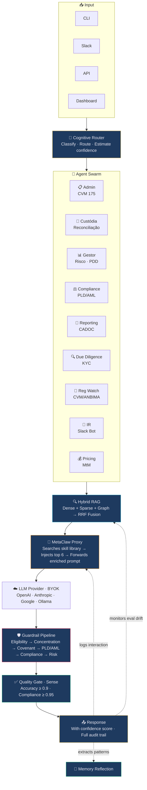
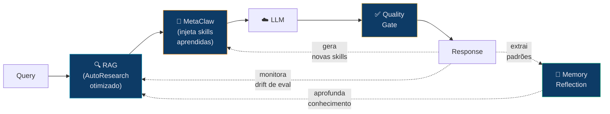
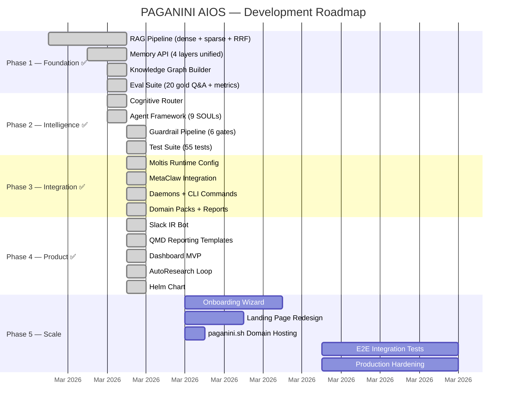

<div align="center">

# 🎻 PAGANINI AIOS

### O Sistema Operacional de IA para Mercados Financeiros

**Um comando. Qualquer terminal. Qualquer sistema operacional.**
**Um sistema autônomo de raciocínio financeiro que fica mais inteligente a cada interação.**

[](LICENSE)
[](CONTRIBUTING.md)
[](#pacotes-de-domínio)
[](https://python.org)
[](https://github.com/juboyy/paganini-aios/actions)

[Website](https://paganini-aios-v2.lovable.app/) · [Docs](docs/) · [Começar](#início-rápido) · [FAQ](docs/FAQ.md) · [Contribuir](CONTRIBUTING.md) · [🇺🇸 English](README.md)

</div>

---

```bash
curl -fsSL https://paganini.sh | sh && paganini init --pack fidc && paganini up
```

> *"Não vendemos um modelo. Vendemos um sistema de raciocínio financeiro que funciona com qualquer modelo."*

---

## Veja Funcionando

**Saída real de uma instância EC2 em produção** (Ubuntu 24.04, sa-east-1, Moltis v0.10.18):

```
$ paganini query -v "Quais são as obrigações do custodiante em relação
  à sobrecolateralização?"

🧠 Runtime: python | Model: gemini/gemini-2.5-flash
🤖 Agent: Custodiante (simple, conf=0.85)
🎯 Intent: factual | Domains: custodiante
🔍 RAG: 5 chunks | MetaClaw: on
   • Estruturação de FIDCs e Mecanismos de Mitigação de Risco.md        | 1.00
   • Artigo 29 - CVM175.md | Visão da Custodiante                      | 1.00
   • Convenants - Guia Avançado - Jurídico (Parte IV).md                | 0.75
   • Due Diligence e o Papel do Custodiante e do Servicer.md            | 0.75
   • Administradoras Custodiantes e Gestoras.md                         | 0.50
🛡️  Guardrails: 6/6 gates passed
⏱️  5560ms | 📊 Confiança: 0.96

╭──────────────────── 📋 Resposta (96% confiança) ────────────────────╮
│                                                                      │
│  O custodiante atua como guardião do lastro e agente ativo de        │
│  verificação e controle dos ativos do FIDC, garantindo que os        │
│  ativos existam, sejam devidamente controlados, monitorados e        │
│  liquidados. A Resolução CVM 175, em seu Anexo Normativo II         │
│  (Art. 38), detalha essas obrigações.                                │
│                                                                      │
╰──────────────────────────────────────────────────────────────────────╯

📎 Fontes:
  [1] Estruturação de FIDCs e Mitigação de Risco (score: 1.00)
  [2] CVM 175, Art. 29 — Visão da Custodiante (score: 1.00)
  [3] Due Diligence e o Papel do Custodiante (score: 0.75)
```

> 164 documentos ingeridos. 6.993 chunks indexados. 190 entidades no grafo de conhecimento.
> 9 agentes. 6 gates de guardrail. 8 daemons. 55 testes passando. Zero alucinação.

---

## Por Que PAGANINI

| Sem PAGANINI | Com PAGANINI |
|-------------|--------------|
| Analista de compliance gasta 4h/dia verificando covenants manualmente | Daemon verifica a cada 15 minutos. Alerta antes da quebra. |
| Relatórios regulatórios mensais levam 3-5 dias para compilar | Um comando: `paganini report informe-mensal --fund alpha` |
| Due diligence de um novo cedente: 2-3 semanas | 24 horas. KYC, busca judicial, credit scoring — automatizados. |
| Cotista faz pergunta → 2 dias úteis para resposta | Bot no Slack responde em segundos com score de confiança. |
| Mudança regulatória → semanas para avaliar impacto | Regulatory Watch escaneia diariamente, entrega avaliação de impacto na manhã seguinte. |
| 500 cedentes × monitoramento de risco manual = impossível | Risk Scanner roda a cada 6h em todos os cedentes. |

**ROI estimado por fundo:** 120-200 horas/mês economizadas. ~R$60-100K/mês em redução de custo operacional.

---

## O Problema

As operações de FIDC (Fundos de Investimento em Direitos Creditórios) no Brasil rodam em planilhas,
verificações manuais de compliance e comunicação fragmentada. Um único fundo
exige 4-7 participantes (administrador, custodiante, gestor, auditor...)
coordenando via e-mail, WhatsApp e sistemas legados.

**Resultado:** Decisões lentas. Covenants quebrados. Risco regulatório. Erro humano em escala.

## A Solução

O PAGANINI implanta um enxame de agentes autônomos que espelha toda a operação do fundo
— cada participante ganha um par de IA que opera 24/7,
segue as regulações por design e melhora a cada interação.



---

## Como Funciona

### 🔄 Três Loops de Auto-Aperfeiçoamento

O sistema não apenas responde — ele **evolui**. Três engines otimizam
camadas diferentes simultaneamente. Sem fine-tuning necessário no modo padrão.

---

#### 🧬 MetaClaw — Evolução Comportamental

Um proxy compatível com OpenAI entre o runtime e o provedor de LLM.
Intercepta cada interação. Injeta habilidades aprendidas. Gera novas automaticamente.

```
A CADA INTERAÇÃO:
  Query chega → MetaClaw pesquisa biblioteca de skills
  → Encontra top 6 skills relevantes (similaridade de embeddings)
  → Injeta no system prompt → Encaminha para o LLM
  → Resposta é mensuravelmente melhor por causa do contexto injetado

APÓS CADA SESSÃO:
  MetaClaw alimenta toda a conversa ao LLM
  → LLM analisa: o que funcionou? que padrões emergiram?
  → Gera NOVOS arquivos de skill (markdown)
  → Próxima sessão já se beneficia imediatamente
```

**Exemplo concreto:**

```
Sessão 1:  "Como calcular PDD para recebíveis de energia?"
            → Nenhuma skill específica de energia existe
            → Resposta genérica do conhecimento do modelo

            Pós-sessão: MetaClaw gera automaticamente:
            energy-sector-pdd.md: "Ao calcular PDD para o setor
            de energia, considere padrões sazonais de pagamento —
            Q4 com mais inadimplência por impacto da seca na
            receita de geração hidrelétrica"

Sessão 2:  Pergunta da mesma categoria
            → MetaClaw encontra energy-sector-pdd.md (score: 0.87)
            → Injeta no prompt
            → Resposta com qualidade de especialista de domínio

Sessão 50: 8 skills específicas de energia acumuladas
            → Respostas rivalizam com especialista humano
            → Zero fine-tuning. Zero GPU. Inteligência acumulada.
```

**Três modos de operação:**

| Modo | O Que Acontece | Requisitos |
|------|----------------|------------|
| **skills_only** (padrão) | Injeção de skills + auto-geração por sessão | Apenas rede. Sem GPU. |
| **rl** (opcional) | + Fine-tuning LoRA em tempo real via Tinker Cloud. Juiz PRM pontua respostas. Pesos trocados sem downtime. | Chave API Tinker |
| **opd** (avançado) | + Destilação teacher-student. Modelo frontier ensina modelo menor. Mesma qualidade, 1/10 do custo ao longo do tempo. | Endpoint do modelo teacher |

**Guardrails do PAGANINI no MetaClaw:**

Toda skill gerada automaticamente passa por validação antes de ser ativada:
```
Nova skill → Contradição com corpus? → Ontologia consistente?
          → Em conformidade com CVM 175? → Conflito com skills existentes?
          → Específica o suficiente? (sem platitudes genéricas)

TUDO PASSA → ativada
QUALQUER FALHA → em quarentena para revisão humana
```

Skills isoladas por fundo (chinese walls). Máximo de 500 ativas. Poda semanal de skills de baixo impacto.
Detecção de drift alerta se scores de avaliação degradarem após novas skills.

[Mergulho profundo →](docs/architecture/self-improvement-engines.md)

---

#### 🔍 AutoResearch — Otimização de Recuperação

Um pipeline RAG que se auto-modifica. Em vez de um humano ajustando parâmetros —
um LLM roda experimentos autônomos. Busca evolutiva, não RL.

Inspirado no [autoresearch do Karpathy](https://github.com/karpathy/autoresearch):
*"Você não está programando o programa. Você está programando o program.md."*

**Três arquivos:**

```
program.md   → Instruções (LLM lê para saber o que otimizar)
pipeline.py  → Código modificável (LLM altera para melhorar a recuperação)
eval.py      → Avaliação fixa (JAMAIS tocada — mede a verdade absoluta)
```

**O loop:**

```
  ┌─ LLM lê program.md ────────────────────────┐
  │  "Otimize RAG para queries do domínio FIDC" │
  └──────────────┬──────────────────────────────┘
                 ▼
  ┌─ Lê pipeline.py ───────────────────────────┐
  │  Atual: chunk_size=384, hybrid retrieval    │
  │  dense=0.4, sparse=0.3, graph=0.3          │
  └──────────────┬──────────────────────────────┘
                 ▼
  ┌─ Lê experiments.jsonl ─────────────────────┐
  │  "Exp 46 testou chunking semântico → +0.03" │
  │  "Exp 47 testou chunks maiores → -0.02"     │
  └──────────────┬──────────────────────────────┘
                 ▼
  ┌─ Hipotetiza ───────────────────────────────┐
  │  "Reranking com cross-encoder deve melhorar │
  │   precisão para perguntas regulatórias"     │
  └──────────────┬──────────────────────────────┘
                 ▼
  ┌─ Modifica pipeline.py ─────────────────────┐
  │  + reranker = "cross_encoder"               │
  │  + rerank_top_n = 20                        │
  └──────────────┬──────────────────────────────┘
                 ▼
  ┌─ Roda eval.py (50-100 pares Q&A ouro) ─────┐
  │  precision@5: 0.78 (+0.04)  ✓ melhorou     │
  └──────────────┬──────────────────────────────┘
                 ▼
         MELHOROU → commita mudança, loga experimento
         PIOROU → reverte, loga falha, tenta próxima hipótese
                 │
                 └──── REPETE ────┘
```

**16 parâmetros que o LLM experimenta:**

| Categoria | Parâmetros |
|-----------|------------|
| Chunking | `chunk_size` (128-1024) · `overlap` (0-256) · `strategy` (fixed / sentence / semantic / hierarchical) · `respect_headers` |
| Embedding | `model` (gemini / openai / local) · `dimensions` (256-3072) |
| Recuperação | `dense_weight` · `sparse_weight` · `graph_weight` · `fusion` (RRF / linear) · `rrf_k` |
| Reranking | `method` (none / cross-encoder / LLM-rerank) · `top_n` |
| Contexto | `max_tokens` · `include_metadata` · `include_parent_chunk` · `query_expansion` |

[Mergulho profundo →](docs/architecture/self-improvement-engines.md)

---

#### 🧠 Memory Reflection — Aprofundamento do Conhecimento

Daemon diário. Revisa todas as operações do fundo. Extrai padrões.
Constrói grafo de conhecimento. Promove memória episódica → semântica.

```
Operações do dia → Daemon de reflexão:
  "Toda vez que o IPCA sobe >0,5%, o PDD do Fundo Alpha aumenta 12%"
  → Extraído como conhecimento permanente
  → Adicionado ao grafo de conhecimento
  → Disponível para todos os agentes amanhã
```

---

#### Como Funcionam Juntos



**Sem conflitos.** AutoResearch otimiza *como a informação é encontrada*.
MetaClaw otimiza *como a informação é usada*. Memory Reflection aprofunda
*que informação existe*. Três dimensões. Composição diária.

### 🏗️ Construído sobre 15 Padrões Testados em Batalha

Não inventado para um slide deck. Extraído de um AIOS em produção rodando
24/7 desde fevereiro de 2026 — 500+ horas, 100+ tarefas, 12 violações de auto-auditoria
capturadas autonomamente.

<details>
<summary><strong>5 Skills Executáveis</strong></summary>

| Skill | O Que Faz |
|-------|-----------|
| **Pre-Execution Gate** | Toda operação valida o contexto primeiro. Gate token comprova due diligence na trilha de auditoria. |
| **Quality Gate (Sense)** | Toda saída avaliada contra perfil de qualidade antes da entrega. Abaixo do padrão = regenera. |
| **Memory Reflection** | Curadoria diária: operações → padrões → conhecimento permanente. Não é append-only. |
| **Self-Audit** | O sistema verifica sua própria conformidade com as regras. Loga violações. Autocorrige. |
| **Proactive Heartbeat** | Não espera ser perguntado. Monitora covenants, regulações e riscos conforme agenda. |

</details>

<details>
<summary><strong>5 Padrões Arquiteturais</strong></summary>

| Padrão | O Que Faz |
|--------|-----------|
| **SOUL** | Identidade do agente como conceito de primeira classe — personalidade, restrições, ferramentas, escopo de memória. |
| **BMAD-CE Pipeline** | Metodologia de 18 estágios. Toda tarefa classificada, rastreada, produz artefatos. |
| **Cognitive Router** | Meta-cognição: classifica complexidade, escolhe modelo, despacha agente(s), estima confiança. |
| **Capabilities Graph** | Agentes descobrem ferramentas por busca semântica, não por listas hardcoded. |
| **Violations Tracking** | Toda violação de regra logada, atribuída, corrigida. Trilha de auditoria imutável. |

</details>

<details>
<summary><strong>5 Blueprints de Integração</strong></summary>

| Blueprint | O Que Faz |
|-----------|-----------|
| **PinchTab** | Automação de browser via árvore de acessibilidade (~800 tokens/página). Scraping regulatório. |
| **CLI-Anything** | Gera CLIs automaticamente para qualquer software. Torna sistemas legados nativos para agentes. |
| **OTel Pipeline** | Traces OpenTelemetry em cada decisão. Auditor da CVM reconstrói qualquer operação. |
| **QMD Reporting** | Templates Quarto → relatórios PDF/HTML. Informe mensal, CADOC, ICVM 489. |
| **Composio SDK** | Conexões OAuth2 pré-construídas: Slack, GitHub, e-mail, 14+ serviços. |

</details>

Mais **30+ skills transferíveis** do ecossistema OpenClaw e **12 skills específicas de domínio**
construídas para FIDC. [Catálogo completo →](docs/architecture/genome.md)

---

## 9 Agentes Especializados

Cada agente tem seu próprio SOUL — identidade, restrições, ferramentas e escopo de memória.

| | Agente | Superpoder |
|---|-------|-----------| 
| 📋 | **Administrador** | Compliance CVM 175, governança, registros regulatórios |
| 🔐 | **Custodiante** | Reconciliação, sobrecolateralização, registro |
| 📊 | **Gestor** | Análise de risco, modelagem PDD, otimização de portfólio |
| ⚖️ | **Compliance** | PLD/AML, reporte COAF, triagem de sanções, LGPD |
| 📄 | **Reporting** | CADOC 3040, ICVM 489, COFIs, informe mensal |
| 🔍 | **Due Diligence** | KYC, credit scoring, busca judicial, monitoramento de mídia |
| 📡 | **Regulatory Watch** | Varredura diária CVM/ANBIMA/BACEN, avaliação de impacto |
| 💬 | **Investor Relations** | Bot Slack 24/7, relatórios de performance, Q&A de cotistas |
| 💰 | **Pricing** | Mark-to-market, deságio, stress testing, curvas de yield |

---

## Segurança

<table>
<tr>
<td width="50%">

### 🔒 Isolamento de Container
Cada agente roda em seu próprio container.
Zero rede por padrão. Comunicação
apenas via Unix sockets. Perfis Seccomp
bloqueiam syscalls de rede. Imagens distroless
sem shell.

</td>
<td width="50%">

### 🧱 Chinese Walls
Dados do Fundo A **jamais** chegam ao Fundo B.
Aplicado em DB (RLS), memória, skills MetaClaw,
traces e relatórios. Particionamento por fundo
em cada camada.

</td>
</tr>
<tr>
<td>

### 🔑 Cofre de Secrets
Nenhum secret em texto plano. Jamais. Cofre
criptografado (AES-256-GCM), variáveis de
ambiente ou Cloud KMS. Pre-commit hooks
escaneiam chaves vazadas, PII e fingerprints do corpus.

</td>
<td>

### 🛡️ Pipeline de Guardrails
6 gates de parada obrigatória executam em sequência.
Primeiro BLOCK encerra a operação. Sem
override sem humano + justificativa
+ trilha de auditoria completa.

</td>
</tr>
</table>

[Segurança de Container →](docs/security/container-security.md) ·
[Segurança Open Source →](docs/security/open-source-security.md)

---

## Início Rápido

### Binário Único (Recomendado)

```bash
# Instalar (baixa runtime Moltis + CLI PAGANINI)
curl -fsSL https://paganini.sh | sh

# Ou manualmente:
git clone https://github.com/juboyy/paganini-aios
cd paganini-aios
pip install -e .

# Configurar
cp config.example.yaml config.yaml
# Edite config.yaml → defina sua chave de API

# Ingira seu corpus (constrói grafo de conhecimento automaticamente)
paganini ingest data/corpus/fidc/
# ✓ 164 arquivos → 6.993 chunks → 190 entidades KG → 2min40s

# Query (encaminha para o melhor agente, aplica guardrails)
paganini query "Qual o limite de concentração por cedente?"

# Explorar
paganini agents         # Lista 9 agentes especializados
paganini daemons status # Exibe 8 daemons em background
paganini pack list      # Navega pelos domain packs
paganini report list    # Templates de relatório disponíveis
paganini eval           # Roda avaliação contra Q&A ouro
paganini doctor         # Diagnostica instalação (10 verificações)
paganini status         # Visão geral do sistema
```

### Docker

```bash
paganini init --mode docker
paganini up
# 13 containers. Isolamento total. Pronto para produção.
```

### Kubernetes

```bash
helm install paganini paganini/paganini-aios \
  --set license.key=$LICENSE_KEY \
  --set provider.apiKey=$OPENAI_API_KEY
```

**Suportado:** Linux x86/arm64 · macOS Intel/Apple Silicon · Windows/WSL2 ·
Raspberry Pi · brew · apt · dnf · pip · npm · winget

[Guia completo de instalação →](docs/architecture/distribution.md)

---

## BYOK — Traga Sua Própria Chave

Zero lock-in. Você escolhe o modelo. Você controla os custos.

```yaml
# config.yaml
providers:
  default: openai              # ou anthropic, google, ollama, custom
  openai:
    api_key: ${OPENAI_API_KEY}
  # Troque de provedor a qualquer momento. O sistema se adapta automaticamente.
```

Funciona com: OpenAI · Anthropic · Google · Ollama · qualquer API compatível com OpenAI

---

## Pacotes de Domínio

O framework é gratuito. A inteligência de domínio é o produto.

```bash
paganini pack install fidc-starter        # R$2K/mês — 3 agentes, skills básicas
paganini pack install fidc-professional   # R$8K/mês — 9 agentes, regulatório completo
paganini pack install fidc-enterprise     # R$25K/mês — tudo + SLA + customização
```

| | Starter | Professional | Enterprise |
|---|:---:|:---:|:---:|
| Corpus (164 docs FIDC) | ✅ | ✅ | ✅ |
| Agentes core (Admin, Custódia, Gestão) | 3 | 9 | 9 + custom |
| Skills | 3 | 12 | 12 + custom |
| Regras de guardrail | Básicas | Completas | Completas + custom |
| Templates de relatório QMD | — | 5 | 8 + custom |
| Regulatory watch | — | ✅ | ✅ |
| Bot de Investor Relations | — | ✅ | ✅ |
| SLA | — | — | 99,9% |
| Suporte dedicado | — | — | ✅ |

[Detalhes de preço →](docs/business/pricing.md)

---

## Arquitetura

```
paganini/
├── packages/
│   ├── kernel/
│   │   ├── cli.py           # Entry point CLI — 18 comandos (click + rich)
│   │   ├── engine.py        # Carregador de config, resolução de env vars
│   │   ├── moltis.py        # Adaptador gateway Moltis (fallback: litellm)
│   │   ├── metaclaw.py      # Proxy de skill MetaClaw + auto-evolução
│   │   ├── memory.py        # Memória de 4 camadas (episódica, semântica, procedural, relacional)
│   │   ├── router.py        # Cognitive Router — classifica, encaminha, estima confiança
│   │   ├── daemons.py       # 8 daemons YAML-driven (covenant, PDD, regulatório...)
│   │   ├── pack.py          # Gestão de domain packs (3 tiers)
│   │   └── reports.py       # Geração de relatórios (5 templates: CADOC, PDD, risco...)
│   ├── rag/
│   │   ├── pipeline.py      # Hybrid RAG — dense + sparse + RRF fusion
│   │   ├── bm25.py          # BM25Okapi puro Python com tokenizador PT-BR
│   │   ├── eval.py          # Harness de avaliação — precision@k, recall, latência
│   │   └── autoresearch/    # RAG auto-otimizante (program.md + runner.py)
│   ├── agents/
│   │   ├── framework.py     # AgentRegistry + AgentDispatcher
│   │   └── souls/           # Um .md por identidade de agente (9 agentes)
│   ├── ontology/
│   │   ├── schema.py        # Grafo de conhecimento FIDC — 10 tipos de entidade, 9 relações
│   │   └── builder.py       # Extração de entidades do markdown via regex
│   ├── shared/
│   │   └── guardrails.py    # Pipeline de 6 gates de parada obrigatória
│   ├── integrations/
│   │   └── slack_bot.py     # Bot Slack IR — Q&A de cotistas, isolamento por fundo
│   ├── dashboard/
│   │   └── app.py           # Dashboard MVP FastAPI + UI Tailwind inline
│   └── modules/             # Verticais pré-configuradas (Fase 5)
├── tests/                   # 55 testes pytest — todos passando
│   ├── conftest.py          # Fixtures compartilhadas (tmp_dir, sample_config, corpus)
│   ├── test_rag.py          # Testes de pipeline RAG + recuperação
│   ├── test_bm25.py         # Testes de índice BM25 + tokenizador PT-BR
│   ├── test_agents.py       # Testes de registry + dispatcher de agentes
│   ├── test_guardrails.py   # Testes dos 6 gates de guardrail
│   ├── test_memory.py       # Testes de API de memória de 4 camadas
│   ├── test_router.py       # Testes do Cognitive Router
│   └── test_ontology.py     # Testes de grafo de conhecimento + builder
├── vendor/metaclaw/         # MetaClaw standalone (para modos rl/opd)
├── infra/
│   ├── Dockerfile           # Build multi-stage, não-root, healthcheck
│   ├── docker-compose.yaml  # Stack completa: core + moltis + pgvector + agents
│   └── helm/paganini/       # Helm chart (Chart.yaml + templates)
├── scripts/
│   ├── paganini_gate.py     # Gate de pré-execução (grep/AST code intelligence)
│   └── paganini_codex.py    # Bridge Codex (spec builder + invocação)
├── docs/                    # Arquitetura, segurança, negócio, pipeline
├── templates/reports/       # 5 templates QMD (informe-mensal, CADOC, PDD, risco, covenant)
├── install.sh               # Instalador em um comando (Moltis + PAGANINI)
├── paganini.sh              # Instalador curl-pipe (detecta OS/arch)
├── config.example.yaml      # Todas as opções documentadas
├── moltis.example.yaml      # Config do runtime Moltis
├── eval_questions.jsonl      # 20 pares Q&A ouro para avaliação
└── pyproject.toml           # pip install -e . → CLI `paganini`
```

<details>
<summary><strong>Índice completo de documentação</strong></summary>

| Documento | Conteúdo |
|-----------|---------|
| [System Design](docs/architecture/system-design.md) | Diagrama de arquitetura completo + fluxos de dados |
| [ADRs](docs/architecture/ADRs.md) | 9 registros de decisões arquiteturais |
| [Genome](docs/architecture/genome.md) | 30+ skills + padrões + blueprints de integração |
| [Evolution Layer](docs/architecture/evolution-layer.md) | MetaClaw + 3 loops de melhoria |
| [Memory Schema](docs/architecture/memory-schema.md) | Arquitetura de memória de 4 camadas |
| [Orchestration](docs/architecture/orchestration.md) | Mapeamento do runtime Moltis |
| [Distribution](docs/architecture/distribution.md) | Experiência de instalação + empacotamento |
| [BMAD-CE Pipeline](docs/pipeline/bmad-ce.md) | Metodologia de execução de 18 estágios |
| [Container Security](docs/security/container-security.md) | Isolamento de container zero-trust |
| [Open Source Security](docs/security/open-source-security.md) | Proteção de dados em 5 camadas |
| [Pricing](docs/business/pricing.md) | Modelo de negócio open-core |
| [PinchTab](docs/tools/pinchtab.md) | Automação de browser |
| [QMD](docs/tools/qmd.md) | Engine de geração de relatórios |

</details>

---

## Profundidade do Corpus

O domain pack de FIDC não é uma coleção de PDFs. São 164 documentos markdown curados por especialistas,
cobrindo cada aspecto das operações de fundo:

| Domínio | Docs | O Que Tem Dentro |
|---------|------|-----------------|
| **CVM 175** | 57 | Cada artigo decomposto. Referências cruzadas mapeadas. Notas de interpretação. |
| **Dores do Mercado** | 4 | 300 problemas mapeados entre Admin, Custódia, Gestão — de operadores reais. |
| **Contabilidade** | 6 | Perda de crédito esperada IFRS9, cálculos de PDD, COFIs, PCE — com fórmulas. |
| **Cotas** | 6 | Estruturas de subordinação, análise risco-retorno, mecânica de waterfall. |
| **Tipos de FIDC** | 20+ | Infra, ESG, Crypto, Supply Chain, Precatórios, Agro, Imobiliário... |
| **API de Plataforma** | 6 | Specs de gestão, segurança e integração de uma plataforma real. |
| **Sistema** | 2 | 80 diferenciais competitivos + especificações completas de módulos. |

É esse corpus que torna os agentes especialistas de domínio, não chatbots genéricos.

---

## Roteiro



---

## Comece Aqui

**Só explorando?**
1. Leia este README
2. Navegue pela [documentação de arquitetura](docs/architecture/)
3. Confira o [FAQ](docs/FAQ.md)

**Quer experimentar?**
1. `git clone https://github.com/juboyy/paganini-aios && cd paganini-aios`
2. `pip install -e . && cp config.example.yaml config.yaml`
3. Defina sua chave de API em `config.yaml`
4. `paganini ingest data/corpus/fidc/ && paganini query "test"`

**Quer contribuir?**
1. Leia o [CONTRIBUTING.md](CONTRIBUTING.md)
2. Escolha uma issue com a label `good first issue`
3. Fork, branch, gate, PR

**Quer implantar para um fundo?**
1. [Fale conosco](mailto:rod.marques@aios.finance) para uma chave de licença
2. `paganini init --pack fidc-professional`
3. `paganini up`

---

## Stack + Segurança

Cada camada tem segurança incorporada. Não parafusada por fora.

| Camada | Tecnologia | Postura de Segurança |
|--------|-----------|---------------------|
| **Runtime** | [Moltis](https://github.com/moltis-org/moltis) v0.10.18 — Rust, binário único (~30MB) | Agentes em containers isolados. `cap-drop ALL`. FS somente leitura. Imagens distroless. Assinadas + escaneadas. |
| **Agentes** | 9 SOULs com identidade + ferramentas + escopo | `network: none` por padrão. Apenas Unix socket. Seccomp bloqueia syscalls de rede. Limite de 50 PIDs. |
| **Aprendizado** | MetaClaw — geração automática de skills | Isolamento por instância (chinese walls). Skills validadas vs corpus. Contradições rejeitadas. |
| **Raciocínio** | RLM — contexto recursivo, sub-LLMs | Contexto com escopo. Sem estado entre queries. Gate token comprova due diligence. |
| **Recuperação** | Hybrid RAG — [ChromaDB](https://www.trychroma.com/) + all-MiniLM-L6-v2 (local, sem API) | Corpus criptografado em repouso (AES-256). Apenas em memória. Embeddings particionados por fund_id. |
| **Memória** | pgvector + SQLite + filesystem | RLS por fund_id. 4 camadas isoladas. Episódica criptografada. Procedural auditável. |
| **Guardrails** | Pipeline de 6 gates de parada obrigatória | Block > Warn > Log. Override = humano + justificativa + entrada imutável de auditoria. |
| **Observabilidade** | OpenTelemetry — traces + métricas | Toda ação rastreada com fund_id + gate_token. Imutável. Retenção de 7 anos (CVM). |
| **Rede** | Proxy de egresso — apenas allowlist | Apenas CVM/ANBIMA/BACEN/LLM/Slack passam. Todo o resto bloqueado. Toda requisição logada. |
| **Secrets** | Cofre criptografado — AES-256-GCM | Sem texto plano em lugar algum. Pre-commit hooks + scan no CI (trufflehog, gitleaks, semgrep). |
| **Dados** | Scrubbing de PII + registros imutáveis | CPF/CNPJ mascarados nos logs. Relatórios append-only. Correções = novos registros. |
| **Canais** | Slack · API · CLI · Dashboard | Canais por fundo. mTLS opcional. Dashboard com controle de acesso por papel. CLI autenticado via cofre. |
| **LLM** | BYOK via [LiteLLM](https://github.com/BerriAI/litellm) — qualquer provedor | Chaves repassadas, nunca armazenadas. Sem treinamento com dados do cliente. Cliente controla a residência. |

---

<div align="center">

## Equipe

| | | | |
|:---:|:---:|:---:|:---:|
| **Rod Marques** | **João Raf** | **Louiz Ferrer** | **Mark Binder** |
| CEO | CTO | CIO | CFO |

<br>

**[paganini-aios-v2.lovable.app](https://paganini-aios-v2.lovable.app/)** · rod.marques@aios.finance

<br>

---

<sub>Construído com obsessão. Entregue com disciplina.</sub>

</div>
