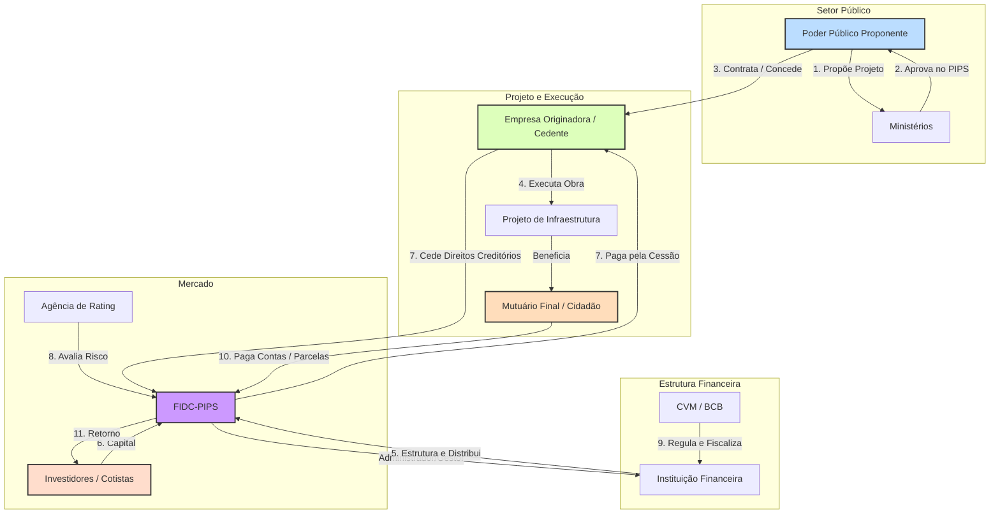

# Relatório Analítico sobre Fundos de Investimento em Direitos Creditórios do Programa de Incentivo à Implementação de Projetos de Interesse Social (FIDC-PIPS)

**Autor:** Rodrigo Marques
**Versão:** 1.0
**Data:** 01 de dezembro de 202

---

## Sumário Executivo

O presente relatório oferece uma análise exaustiva e detalhada dos Fundos de Investimento em Direitos Creditórios do Programa de Incentivo à Implementação de Projetos de Interesse Social (FIDC-PIPS), um instrumento financeiro de grande relevância para o desenvolvimento da infraestrutura social no Brasil. Com um mandato legal estrito, os FIDC-PIPS são veículos de securitização destinados a canalizar recursos privados para o financiamento de projetos essenciais, como saneamento básico, habitação popular e energia, alavancando a capacidade de investimento do setor público e promovendo impacto social em larga escala.

Este documento, estruturado em oito capítulos, explora desde os fundamentos dos FIDCs convencionais até as especificidades que tornam o FIDC-PIPS um mecanismo único. A análise se aprofunda na sua base legal, instituída pela Lei nº 10.735/2003, e na sua regulamentação, consolidada pela Resolução CVM 175, com destaque para o Anexo Normativo XII. A mecânica de funcionamento é dissecada, detalhando o fluxo de securitização, a regra de composição da carteira (mínimo de 95% em direitos creditórios de projetos PIPS) e as implicações dessa concentração para a liquidez e o perfil de risco do fundo.

Um dos pilares deste relatório é a mapeamento completo do ecossistema do FIDC-PIPS, identificando e analisando a interação entre todas as entidades envolvidas: o poder público (proponente), as empresas originadoras (cedentes), as instituições financeiras (estruturadoras e administradoras), os órgãos reguladores (CVM e BCB), os investidores, as agências de rating e, fundamentalmente, o cidadão, beneficiário final dos projetos. Um diagrama ilustra essa complexa rede de relações, evidenciando a interdependência e os fluxos de valor entre os agentes.

O relatório também apresenta uma análise do mercado, contextualizando o crescimento expressivo da indústria de FIDCs no Brasil, que ultrapassou a marca de R$ 635 bilhões em patrimônio líquido em 2024, e discute as oportunidades para o nicho de FIDC-PIPS, impulsionadas pelo déficit de infraestrutura social, pelo novo Marco Legal do Saneamento e pela crescente demanda por investimentos alinhados à agenda ESG (Ambiental, Social e de Governança).

Para ilustrar a teoria, são apresentados estudos de caso detalhados. Analisa-se o primeiro FIDC-PIPS do Brasil, o "Caixa Brasil Construir Residencial Cidade São Paulo", um projeto habitacional em São Paulo que serviu de modelo para o mercado. Adicionalmente, são desenvolvidos cases fictícios que simulam a estruturação de fundos para projetos de saneamento e energia, explorando desafios e soluções práticas.

Por fim, o documento aborda de forma crítica os desafios, riscos e pontos de atenção inerentes a este tipo de investimento, como o risco de performance dos projetos, o risco político-regulatório e a baixa liquidez. A concorrência com outros instrumentos de financiamento de infraestrutura e a complexidade da estruturação são também discutidas. A conclusão estendida sintetiza os achados, reforça o papel do FIDC-PIPS como uma poderosa ferramenta de desenvolvimento socioeconômico e aponta perspectivas futuras para a sua evolução e maior utilização no mercado de capitais brasileiro.

---

## Índice
## Índice

**1. Introdução** 

1.1. Contexto do Investimento em Infraestrutura no Brasil 

1.2. O Papel dos Instrumentos de Dívida Estruturada 

1.3. Apresentação do FIDC-PIPS: Um Veículo de Impacto Social 

1.4. Objetivos e Metodologia do Relatório

**2. Fundamentos dos Fundos de Investimento em Direitos Creditórios (FIDCs)** 

2.1. Definição e Natureza Jurídica 

2.2. A Mecânica da Securitização de Recebíveis 

2.3. Estrutura Padrão de um FIDC 

2.3.1. Cotas Sênior e Subordinada 

2.3.2. Principais Agentes Envolvidos 

2.3.3. Fluxo de Pagamentos e Cascata de Distribuição 

2.4. Tipologias de FIDCs (Padronizado vs. Não Padronizado) 

2.5. O Ambiente Regulatório: A Resolução CVM 175 

2.5.1. Evolução Histórica da Regulamentação 

2.5.2. Principais Inovações da Resolução 175 

2.5.3. Transparência e Proteção ao Investidor

**3. O FIDC-PIPS: Uma Análise Aprofundada** 

3.1. Origem e Propósito: A Lei nº 10.735/2003 e o Decreto nº 5.004/2004 

3.1.1. Contexto Político e Econômico da Criação 

3.1.2. Objetivos do Programa PIPS 

3.2. Definição e Mandato Específico 

3.3. Mecânica de Funcionamento do FIDC-PIPS 

3.3.1. A Originação dos Direitos Creditórios de Interesse Social 

3.3.2. O Fluxo de Securitização para Projetos Públicos 

3.3.3. Diferenças Operacionais em Relação ao FIDC Tradicional 

3.4. A Regra dos 95%: Implicações e Consequências 

3.4.1. Análise Comparativa com Outros Fundos 

3.4.2. Impacto na Diversificação de Risco 

3.5. Setores de Atuação Elegíveis 

3.5.1. Saneamento Básico 

3.5.2. Habitação Social 

3.5.3. Energia e Infraestrutura Urbana 

3.5.4. Outros Setores Potenciais

**4. O Ecossistema do FIDC-PIPS: Entidades e Interações** 

4.1. O Poder Público (Proponente) 

4.1.1. Papel dos Ministérios Setoriais 

4.1.2. Responsabilidades dos Entes Federativos 

4.2. A Empresa Originadora (Cedente) 

4.2.1. Perfil e Qualificações Necessárias 

4.2.2. Estratégias de Retenção de Risco 

4.3. A Instituição Financeira (Estruturadora e Administradora) 

4.3.1. O Processo de Estruturação 

4.3.2. Gestão Ativa vs. Passiva em FIDC-PIPS 

4.4. A Comissão de Valores Mobiliários (CVM) e o Banco Central (BCB) 

4.4.1. Mecanismos de Fiscalização 

4.4.2. Sanções e Penalidades 

4.5. Os Investidores (Cotistas) 

4.5.1. Perfil do Investidor Institucional 

4.5.2. Critérios de Seleção e Due Diligence 

4.6. As Agências de Rating 

4.6.1. Metodologias de Avaliação 

4.6.2. Importância do Rating para a Precificação 

4.7. O Mutuário Final (Cidadão) 

4.7.1. Perfil Socioeconômico 

4.7.2. Comportamento de Pagamento e Inadimplência 

4.8. Diagrama do Ecossistema 

4.9. Análise dos Fluxos de Informação e Capital

**5. Análise de Mercado: Tamanho, Crescimento e Oportunidades** 

5.1. O Mercado de FIDCs no Brasil: Panorama Geral 

5.1.1. Crescimento Histórico e Patrimônio Líquido 

5.1.2. Volumes de Emissão e Captação 

5.1.3. Segmentação por Setor Econômico 

5.1.4. Concentração de Mercado e Principais Gestores 

5.2. O Nicho do FIDC-PIPS: Desafios de Mensuração 

5.2.1. Estimativas de Mercado 

5.2.2. Causas da Baixa Popularidade Histórica 

5.3. Oportunidades de Crescimento 

5.3.1. O Déficit de Infraestrutura Social no Brasil 

5.3.2. O Potencial Pós-Marco do Saneamento 

5.3.3. A Agenda ESG e o Investimento de Impacto 

5.3.4. Tendências Globais em Finanças Sustentáveis 

5.3.5. O Papel dos Investidores Estrangeiros

**6. Estudos de Caso** 

6.1. Case Real: FIDC PIPS Caixa Brasil Construir Residencial Cidade São Paulo 

6.1.1. Contexto e Antecedentes 

6.1.2. Análise da Estrutura e dos Resultados 

6.1.3. Lições Aprendidas 

6.1.4. Impacto Social Mensurado 

6.2. Case Fictício 1: FIDC-PIPS Saneamento para Todos 

6.2.1. Premissas e Contexto do Projeto 

6.2.2. Estruturação Detalhada 

6.2.3. Desafios Simulados e Soluções 

6.2.4. Análise de Viabilidade Financeira 

6.3. Case Fictício 2: FIDC-PIPS Luz na Amazônia 

6.3.1. Premissas e Contexto do Projeto 

6.3.2. Estruturação Detalhada 

6.3.3. Desafios Simulados e Soluções 

6.3.4. Mensuração de Impacto Ambiental e Social 

6.4. Análise Comparativa dos Três Cases 

6.4.1. Estruturas de Capital 

6.4.2. Perfis de Risco 

6.4.3. Retornos Esperados vs. Realizados

**7. Desafios, Riscos e Pontos de Atenção** 

7.1. Riscos Intrínsecos ao FIDC-PIPS 

7.1.1. Risco de Performance do Projeto 

7.1.2. Risco Político e Regulatório 

7.1.3. Risco de Liquidez 

7.1.4. Risco de Crédito e Inadimplência 

7.1.5. Risco de Concentração 

7.2. Desafios Estruturais e de Mercado 

7.2.1. Concorrência com Outros Veículos (Debêntures, FI-Infra) 

7.2.2. Complexidade da Estruturação 

7.2.3. Custos de Transação e Estruturação 

7.2.4. Assimetria de Informação 

7.3. Análise de Cenários de Stress 

7.3.1. Cenário de Crise Econômica 

7.3.2. Cenário de Mudança Regulatória Adversa 

7.3.3. Cenário de Inadimplência Elevada 

7.4. Estratégias de Mitigação de Riscos 

7.4.1. Garantias e Colaterais 

7.4.2. Seguros e Hedges 

7.4.3. Estruturas de Reforço de Crédito

**8. Aspectos Tributários e Contábeis** 

8.1. Tributação para o Fundo 

8.2. Tributação para o Investidor Pessoa Física 

8.3. Tributação para o Investidor Pessoa Jurídica 

8.4. Tratamento Contábil dos Direitos Creditórios 

8.5. Implicações Fiscais da Cessão de Créditos

**9. Perspectivas Internacionais e Benchmarking** 

9.1. Instrumentos Similares em Outros Países 

9.1.1. Estados Unidos: Asset-Backed Securities (ABS) 

9.1.2. Europa: Social Impact Bonds 

9.1.3. América Latina: Experiências Comparadas 

9.2. Lições e Melhores Práticas Internacionais 

9.3. Potencial de Atração de Capital Estrangeiro

**10. Conclusão Estendida** 

10.1. Síntese dos Principais Achados 

10.2. O FIDC-PIPS como Ferramenta de Desenvolvimento Socioeconômico 

10.3. Perspectivas Futuras e Recomendações 

10.3.1. Para Formuladores de Políticas Públicas e Reguladores 

10.3.2. Para Instituições Financeiras e Gestoras 

10.3.3. Para Investidores 

10.3.4. Para Empresas Originadoras 

10.4. Considerações Finais

**Referências**

**Glossário de Termos Técnicos**

**Anexos** 

Anexo A: Modelo de Fluxo de Caixa de um FIDC-PIPS 

Anexo B: Checklist de Due Diligence para Investidores 

Anexo C: Principais Dispositivos Legais e Regulatórios

---

- **Estrutura de Classes e Subclasses:** A norma permite a criação de diferentes classes de cotas com patrimônios segregados dentro de um mesmo fundo, o que possibilita a criação de estratégias de investimento distintas sob o mesmo "guarda-chuva" regulatório, otimizando custos.

- **Requisitos de Transparência:** Foram aprimoradas as exigências de divulgação de informações sobre a carteira de direitos creditórios, incluindo detalhes sobre o cedente, o devedor e a qualidade do crédito.

- **Verificação do Lastro:** A resolução reforçou as responsabilidades do custodiante na verificação da existência e da titularidade dos direitos creditórios que compõem a carteira do fundo, um ponto crucial para a segurança do investidor.

De forma crucial para este relatório, a Resolução 175 também dedicou um anexo normativo exclusivo para o FIDC-PIPS, o Anexo Normativo XII. Este anexo consolida as regras específicas para este veículo, reafirmando seu mandato social e as particularidades de sua estrutura, que serão detalhadas no capítulo seguinte.

---

## 3. O FIDC-PIPS: Uma Análise Aprofundada

Após a compreensão dos fundamentos dos FIDCs, o foco se volta para o protagonista deste relatório: o Fundo de Investimento em Direitos Creditórios do Programa de Incentivo à Implementação de Projetos de Interesse Social (FIDC-PIPS). Este capítulo disseca as características que o tornam um instrumento único, desde sua concepção legal até sua mecânica operacional, destacando os elementos que o diferenciam de um FIDC tradicional e o posicionam como um veículo de fomento ao desenvolvimento social.

### 3.1. Origem e Propósito: A Lei nº 10.735/2003 e o Decreto nº 5.004/2004

A criação do FIDC-PIPS é um reflexo direto de uma política pública que buscou criar mecanismos de mercado para financiar o desenvolvimento de infraestrutura social no Brasil. A base legal para sua existência foi estabelecida pelo Artigo 4º da Lei nº 10.735, de 11 de setembro de 2003 [1].

> **Art. 4º da Lei nº 10.735/2003:** "Fica o Poder Executivo autorizado a instituir o Programa de Incentivo à Implementação de Projetos de Interesse Social - PIPS, voltado à implementação de projetos estruturados na área de desenvolvimento urbano em infra-estrutura, nos segmentos de saneamento básico, energia elétrica, gás, telecomunicações, rodovias, sistemas de irrigação e drenagem, portos e serviços de transporte em geral, habitação, comércio e serviços, por meio de Fundos de Investimento Imobiliário - FII, e de Fundos de Investimento em Direitos Creditórios - FIDC, lastreados em recebíveis originados de contratos de compromisso de compra, de venda, de aluguéis e de taxas de serviços, provenientes de financiamento de projetos sociais, com participação dos setores público e privado."

Esta lei conferiu ao Poder Executivo a autorização para criar o PIPS, um programa guarda-chuva com o objetivo de estimular, por meio de instrumentos de mercado como os FIDCs e FIIs, o financiamento de uma vasta gama de projetos de infraestrutura. O propósito era claro: mobilizar o capital privado para áreas de grande carência de investimento e de alto impacto social, onde a capacidade de investimento do Estado se mostrava insuficiente.

Posteriormente, o Decreto nº 5.004, de 4 de março de 2004, regulamentou a lei e instituiu formalmente o PIPS, estabelecendo as condições para sua implementação [7]. O decreto detalhou as competências dos ministérios na aprovação dos projetos, o papel do poder público proponente (União, Estados e Municípios) e as responsabilidades das instituições financeiras na estruturação dos fundos. Ficava assim pavimentado o caminho para a criação do primeiro FIDC com um mandato exclusivamente social: o FIDC-PIPS.

### 3.2. Definição e Mandato Específico

O FIDC-PIPS é, em sua essência, um FIDC. Ele compartilha a mesma natureza jurídica de condomínio e a mesma mecânica básica de securitização. Contudo, sua definição e seu mandato são estritamente delimitados pela legislação e pela regulamentação da CVM, notadamente pelo Anexo Normativo XII da Resolução CVM 175 [12].

O Artigo 1º deste anexo define que ele dispõe sobre as regras específicas para os FIDCs constituídos no âmbito do PIPS. O parágrafo único deste artigo estabelece um ponto crucial: em caso de conflito entre as regras gerais para FIDCs (Anexo II) e as regras específicas para FIDC-PIPS (Anexo XII), estas últimas prevalecem. Isso confere ao FIDC-PIPS um status regulatório especial.

O mandato específico do FIDC-PIPS é investir em direitos creditórios originados exclusivamente de operações realizadas no âmbito dos "Projetos", conforme definido no Artigo 2º do mesmo anexo. Esta definição é a pedra angular que define o caráter social do fundo:

> **Art. 2º, Inciso I, Anexo XII da Resolução CVM 175:** "**Projetos:** projetos e/ou programas aprovados pelo Governo Federal, destinados à criação e à implementação de núcleos habitacionais que tornem acessível moradia para segmentos populacionais de diversas rendas familiares, mediante a construção de núcleos habitacionais providos de serviços públicos básicos, comércio e serviços;"

Esta definição, embora centrada em habitação, abre a porta para uma gama mais ampla de investimentos em infraestrutura social, ao mencionar "serviços públicos básicos". A Lei 10.735/2003 é ainda mais explícita, listando saneamento, energia, transportes, entre outros, como setores elegíveis. Portanto, o mandato do FIDC-PIPS é inequivocamente direcionado para o financiamento de ativos que gerem externalidades sociais positivas.

### 3.3. Mecânica de Funcionamento do FIDC-PIPS

O fluxo operacional de um FIDC-PIPS segue a lógica da securitização, mas com particularidades decorrentes de seu mandato e do envolvimento do setor público.

#### 3.3.1. A Originação dos Direitos Creditórios de Interesse Social

A originação dos recebíveis é o ponto de partida e a principal diferença em relação a um FIDC tradicional. Enquanto um FIDC comum pode comprar duplicatas de uma indústria ou faturas de cartão de crédito de um varejista, o FIDC-PIPS deve adquirir direitos creditórios gerados por um projeto de interesse social. Exemplos incluem:

- **Habitação:** Contratos de financiamento imobiliário de um conjunto habitacional popular.

- **Saneamento:** Contas futuras de água e esgoto de uma nova rede construída por uma concessionária.

- **Energia:** Contas de luz futuras de um projeto de eletrificação rural.

O originador (cedente) desses créditos é tipicamente uma empresa concessionária de serviço público, uma construtora envolvida em um projeto habitacional do governo, ou uma Sociedade de Propósito Específico (SPE) criada para executar um determinado projeto de infraestrutura.

#### 3.3.2. O Fluxo de Securitização para Projetos Públicos

O processo pode ser ilustrado da seguinte forma:

1. **Aprovação do Projeto:** Um ente público (ex: um município) tem um projeto de infraestrutura social (ex: urbanização de uma área) e o submete para aprovação no âmbito do PIPS, junto ao ministério competente (ex: Ministério das Cidades).

2. **Estruturação:** Uma vez aprovado, o ente público, em parceria com uma empresa executora (ex: uma construtora) e uma instituição financeira, estrutura um FIDC-PIPS.

3. **Geração do Lastro:** A construtora executa a obra e vende as unidades habitacionais, gerando contratos de financiamento. Estes contratos são os direitos creditórios.

4. **Cessão e Captação:** A construtora cede esses contratos futuros ao FIDC-PIPS, recebendo à vista os recursos para financiar a construção. O fundo, por sua vez, capta esses recursos vendendo cotas a investidores no mercado.

5. **Fluxo de Pagamentos:** Os moradores (mutuários) pagam as parcelas de seus financiamentos. Esses pagamentos fluem para o FIDC-PIPS, que os utiliza para remunerar seus cotistas (investidores).

Este fluxo permite que a obra seja financiada com capital privado, liberando recursos do orçamento público para outras finalidades. O FIDC-PIPS atua como a engrenagem que conecta a necessidade de financiamento do projeto com o capital disponível no mercado.

### 3.4. A Regra dos 95%: Implicações e Consequências

Uma das características técnicas mais importantes e distintivas do FIDC-PIPS é a regra de composição de sua carteira. Enquanto um FIDC tradicional deve manter, no mínimo, 50% de seu patrimônio líquido investido em direitos creditórios, o FIDC-PIPS possui uma exigência muito mais rigorosa.

Conforme estabelecido pela regulamentação original (Instrução CVM 399/2003) e mantido pela nova Resolução CVM 175, o **FIDC-PIPS deve manter, no mínimo, 95% de seu patrimônio líquido investido em direitos creditórios originados dos projetos de interesse social** no âmbito do PIPS.

Esta alta concentração obrigatória tem duas consequências diretas e significativas:

1. **Risco Concentrado:** A carteira do fundo é altamente concentrada em um único tipo de risco: o risco de performance do projeto subjacente. Se a obra atrasa, se a concessionária enfrenta problemas ou se a inadimplência dos mutuários daquele projeto específico aumenta, o fundo é diretamente e severamente impactado. Não há a mesma diversificação de setores e devedores que pode existir em um FIDC multicedente/multissacado tradicional.

2. **Liquidez Restrita e Condomínio Fechado:** Devido à natureza de longo prazo dos projetos de infraestrutura e à iliquidez dos direitos creditórios associados, a grande maioria dos FIDC-PIPS é constituída sob a forma de **condomínio fechado**. Isso significa que o investidor não pode solicitar o resgate de suas cotas a qualquer momento. O capital investido só retorna ao cotista no vencimento do fundo (que pode levar muitos anos) ou através de amortizações programadas, conforme os recebíveis são pagos. A venda das cotas no mercado secundário é possível, mas geralmente apresenta baixa liquidez, o que representa um risco adicional para o investidor.

### 3.5. Setores de Atuação Elegíveis

A Lei nº 10.735/2003 e o Decreto nº 5.004/2004 definem um leque de setores considerados de "interesse social" e, portanto, elegíveis para serem financiados via PIPS. Embora a definição no Anexo XII da Resolução 175 seja mais focada em habitação, a legislação original é mais ampla, englobando áreas essenciais para o desenvolvimento urbano e a qualidade de vida. Os principais setores são:

#### 3.5.1. Saneamento Básico

Inclui projetos de construção, ampliação e operação de redes de abastecimento de água, coleta e tratamento de esgoto, e gestão de resíduos sólidos. Com o Novo Marco Legal do Saneamento (Lei nº 14.026/2020), que estabelece metas ambiciosas de universalização dos serviços até 2033, a demanda por investimentos neste setor é gigantesca, abrindo uma avenida de oportunidades para a estruturação de FIDC-PIPS.

#### 3.5.2. Habitação Social

Este é o setor mais diretamente associado ao PIPS. Abrange a construção de conjuntos habitacionais para a população de baixa renda, projetos de urbanização de favelas, regularização fundiária e melhorias habitacionais. O déficit habitacional crônico no Brasil torna este um campo fértil para a aplicação do instrumento.

#### 3.5.3. Energia e Infraestrutura Urbana

O escopo do PIPS também inclui projetos de geração e distribuição de energia elétrica, especialmente em áreas remotas ou não atendidas, e projetos de infraestrutura urbana como pavimentação de vias, sistemas de drenagem para prevenção de enchentes e modernização da iluminação pública. Todos são investimentos de longo prazo com claro impacto na vida dos cidadãos e que se beneficiam da estrutura de financiamento via securitização.

Em resumo, o FIDC-PIPS foi desenhado para ser um instrumento financeiro com alma social. Sua estrutura, embora complexa e com riscos específicos, oferece um caminho viável para que o mercado de capitais contribua de forma decisiva para a superação de alguns dos maiores desafios de infraestrutura do Brasil.

---

## 4. O Ecossistema do FIDC-PIPS: Entidades e Interações

O FIDC-PIPS não opera no vácuo. Ele é o centro de um ecossistema complexo e interconectado, onde entidades públicas e privadas desempenham papéis distintos, mas interdependentes, para garantir o fluxo de recursos desde o investidor no mercado de capitais até a entrega de um projeto de infraestrutura social para o cidadão. A compreensão da função e das interações de cada um desses agentes é fundamental para avaliar a viabilidade, os riscos e o potencial de sucesso de um FIDC-PIPS.

### 4.1. O Poder Público (Proponente)

O poder público é a pedra angular de todo o processo. Ele atua como o proponente do projeto, a entidade que identifica a necessidade social e inicia a cadeia de eventos que levará à constituição do fundo. Sua participação não é meramente formal; é a garantia de que o projeto está alinhado com as políticas públicas e o interesse da coletividade.

**Funções Principais:**

- **Identificação da Demanda:** Compete ao poder público (seja um município, um estado ou a própria União) identificar as carências de infraestrutura em sua esfera de competência. Por exemplo, um município identifica a necessidade de construir um novo conjunto habitacional para famílias de baixa renda ou de expandir a rede de esgoto para bairros não atendidos.

- **Elaboração e Proposição do Projeto:** O ente público é responsável por elaborar o projeto básico do empreendimento e encaminhá-lo ao ministério competente para aprovação no âmbito do PIPS, conforme estipulado pelo Decreto nº 5.004/2004 [7].

- **Atestado de Interesse Público:** Ao propor o projeto, o poder público atesta formalmente sua viabilidade e, mais importante, seu interesse público, conferindo a chancela governamental necessária para a elegibilidade ao programa.

- **Parcerias e Concessões:** Em muitos casos, o poder público atua como poder concedente, estabelecendo contratos de concessão ou Parcerias Público-Privadas (PPPs) com empresas que executarão e operarão o serviço. Esses contratos são a base para a geração dos direitos creditórios.

- **Fiscalização e Regulação:** Mesmo após a implementação do projeto, o poder público mantém o papel de fiscalizar a qualidade dos serviços prestados e, em muitos casos, de regular as tarifas (como no saneamento e energia), o que impacta diretamente a previsibilidade dos recebíveis do fundo.

**Interações:** O poder público interage diretamente com a empresa originadora (através de contratos de concessão ou obra), com os ministérios (para aprovação do projeto) e, indiretamente, com o FIDC, pois suas decisões regulatórias e políticas afetam a saúde financeira dos direitos creditórios.

### 4.2. A Empresa Originadora (Cedente)

A empresa originadora, ou cedente, é o braço executor do projeto. É a entidade que transforma o plano do poder público em realidade física e que, no processo, gera os direitos creditórios que servirão de lastro para o FIDC-PIPS.

**Funções Principais:**

- **Execução do Projeto:** É a responsável pela engenharia, construção e implementação do projeto de infraestrutura, seja um conjunto habitacional, uma estação de tratamento de esgoto ou uma linha de transmissão de energia.

- **Geração dos Direitos Creditórios:** Ao executar o projeto e iniciar a prestação do serviço ou a venda dos ativos, a empresa origina os fluxos de pagamento futuros. Por exemplo, uma construtora vende os apartamentos e gera os contratos de financiamento; uma concessionária de saneamento começa a cobrar as tarifas dos usuários.

- **Cessão dos Recebíveis:** Para obter capital para financiar a obra ou para reciclar seu capital para novos projetos, a empresa cede (vende) esses direitos creditórios ao FIDC-PIPS. Ela é a vendedora do lastro.

- **Retenção de Risco (Opcional, mas comum):** Como mencionado, é comum que a empresa originadora subscreva e integralize as cotas subordinadas do FIDC. Este ato, conhecido como retenção de risco, serve como um poderoso alinhamento de interesses, pois a empresa demonstra ao mercado que confia na qualidade dos créditos que está cedendo, já que será a primeira a arcar com eventuais perdas por inadimplência.

**Interações:** A empresa originadora é o elo central entre o projeto físico e o mercado financeiro. Ela se relaciona com o poder público (contrato), com a instituição financeira (estruturação do FIDC) e com os mutuários finais (relação comercial ou de prestação de serviço).

### 4.3. A Instituição Financeira (Estruturadora e Administradora)

A instituição financeira é o arquiteto financeiro do FIDC-PIPS. Ela é responsável por traduzir a necessidade de financiamento de um projeto de infraestrutura em um produto de investimento palatável para o mercado de capitais.

**Funções Principais:**

- **Estruturação da Operação:** Trabalhando em conjunto com o poder público e a empresa originadora, a instituição financeira desenha toda a estrutura do FIDC: o volume de cotas a serem emitidas, a proporção entre cotas sênior e subordinada, a taxa de retorno esperada, os prazos, as garantias, etc.

- **Administração e Gestão:** Atua como administradora e, frequentemente, como gestora do fundo. Como administradora, tem a responsabilidade fiduciária perante os cotistas. Como gestora, toma as decisões de investimento, embora no FIDC-PIPS a carteira seja bastante engessada pela regra dos 95%.

- **Contratação de Prestadores de Serviço:** A administradora é quem contrata os demais agentes do ecossistema, como o custodiante, o agente de cobrança, a agência de rating e o auditor independente.

- **Distribuição das Cotas:** Através de sua área de mercado de capitais (atuando como Coordenador Líder), a instituição distribui e vende as cotas do FIDC para os investidores.

- **Análise de Risco:** Conforme o Decreto nº 5.004/2004, a instituição financeira deve realizar a análise cadastral e de risco da demanda e, em muitos casos, manter uma posição de investimento próprio no fundo, reforçando o alinhamento de interesses.

**Interações:** A instituição financeira é o hub que conecta todos os pontos. Ela dialoga com o proponente do projeto, com o originador dos créditos, com os investidores e com os reguladores.

### 4.4. A Comissão de Valores Mobiliários (CVM) e o Banco Central (BCB)

Estes são os guardiões do sistema, responsáveis por garantir que a operação ocorra de forma transparente, justa e segura para todas as partes, especialmente para os investidores.

**Funções Principais:**

- **CVM (Comissão de Valores Mobiliários):** É o principal órgão regulador e fiscalizador dos FIDCs. Suas funções incluem:
  - **Regulamentação:** Estabelecer as regras para a constituição, o funcionamento e a divulgação de informações dos fundos (Resolução CVM 175).
  - **Registro do Fundo:** Analisar e conceder o registro do fundo e da oferta pública de suas cotas.
  - **Fiscalização:** Monitorar as atividades do administrador, do gestor e dos demais prestadores de serviço para assegurar o cumprimento da regulamentação.
  - **Proteção ao Investidor:** Garantir que os investidores recebam informações adequadas para tomar suas decisões e apurar denúncias de irregularidades.

- **BCB (Banco Central do Brasil):** Embora a CVM seja o regulador direto do fundo, o BCB tem um papel relevante, pois fiscaliza as instituições financeiras que atuam como administradoras, gestoras e custodiantes. Ele zela pela solidez e pelo bom funcionamento do sistema financeiro como um todo.

**Interações:** Os reguladores interagem principalmente com a instituição financeira administradora do fundo, exigindo relatórios, informações e o cumprimento das normas. Suas decisões e normativos moldam todo o ambiente de negócios para os FIDCs.

### 4.5. Os Investidores (Cotistas)

Os investidores são a fonte do capital que viabiliza todo o projeto. São eles que compram as cotas do FIDC-PIPS, aplicando seus recursos em troca de uma expectativa de retorno financeiro.

**Perfil e Funções:**

- **Fonte de Financiamento:** Ao adquirirem as cotas, os investidores fornecem os recursos para que o fundo compre os direitos creditórios da empresa originadora, que, por sua vez, utiliza o dinheiro para construir o projeto.

- **Tomadores de Risco:** Os investidores assumem os riscos associados ao investimento, principalmente o risco de crédito (inadimplência dos devedores), o risco de performance do projeto e o risco de liquidez.

- **Perfil Diversificado:** O perfil do investidor varia de acordo com a classe de cota. As **cotas sênior**, por serem mais seguras e possuírem rating, atraem **investidores institucionais conservadores**, como fundos de pensão, seguradoras e regimes próprios de previdência. As **cotas subordinadas**, com seu alto risco e alto potencial de retorno, são tipicamente adquiridas pelo próprio originador ou por **investidores profissionais e fundos especializados** em situações de maior risco.

**Interações:** Os investidores se relacionam com o fundo por meio da instituição financeira que distribuiu as cotas e do administrador, de quem recebem informações periódicas sobre o desempenho da carteira e a rentabilidade de seu investimento.

### 4.6. As Agências de Rating

As agências de classificação de risco são entidades independentes que fornecem uma opinião qualificada sobre a qualidade de crédito de um ativo financeiro. No ecossistema do FIDC-PIPS, seu papel é crucial para a transparência e a formação de preços.

**Funções Principais:**

- **Análise de Risco de Crédito:** A agência realiza uma análise profunda da carteira de direitos creditórios, da estrutura do fundo (nível de subordinação), da qualidade dos prestadores de serviço e dos riscos do projeto subjacente.

- **Atribuição de Rating:** Com base nessa análise, a agência atribui uma nota (rating) às cotas sênior do fundo. Essa nota (ex: AAA, AA, A) sinaliza ao mercado a probabilidade de o investidor não receber os pagamentos devidos. Um rating mais alto indica um risco menor.

- **Facilitação do Acesso ao Mercado:** O rating é fundamental para que investidores institucionais, que muitas vezes possuem mandatos que os restringem a investir apenas em ativos com boa classificação de risco, possam adquirir as cotas do fundo.

**Interações:** A agência de rating é contratada pelo administrador do fundo e tem acesso a todas as informações relevantes da operação para poder realizar sua análise de forma independente.

### 4.7. O Mutuário Final (Cidadão)

No final da cadeia, encontra-se o mutuário, o cidadão que é o beneficiário direto do projeto de infraestrutura e a fonte primária dos fluxos de pagamento que remuneram todo o sistema.

**Funções e Posição:**

- **Beneficiário do Projeto:** É a família que compra o apartamento no conjunto habitacional, o morador que passa a ter acesso à rede de esgoto, o comerciante que tem seu estabelecimento conectado à rede elétrica.

- **Fonte do Fluxo de Caixa:** Ao pagar a parcela de seu financiamento, sua conta de água ou sua conta de luz, o mutuário gera o caixa que flui para o FIDC-PIPS e, subsequentemente, para os investidores.

- **Ponto de Risco de Crédito:** A capacidade e a disposição do mutuário em honrar seus pagamentos determinam o nível de inadimplência da carteira do fundo, sendo o principal fator de risco de crédito da operação.

**Interações:** O mutuário se relaciona comercialmente com a empresa originadora ou a concessionária do serviço. Ele não tem relação direta com o FIDC ou com os investidores, mas seu comportamento de pagamento é o alicerce sobre o qual toda a estrutura financeira do fundo é construída.

### 4.8. Diagrama do Ecossistema

Para consolidar a compreensão das interações descritas, o diagrama a seguir ilustra o fluxo de relações, capital e serviços no ecossistema do FIDC-PIPS.

**Legenda do Diagrama:**

1. **Proposição:** O Poder Público (ex: Prefeitura) propõe um projeto de interesse social ao Ministério competente.

2. **Aprovação:** O Ministério analisa e aprova o enquadramento do projeto no PIPS.

3. **Contratação:** O Poder Público contrata ou firma uma concessão com uma Empresa Originadora para executar a obra.

4. **Execução:** A Originadora constrói o projeto (ex: conjunto habitacional).

5. **Estruturação:** Uma Instituição Financeira é contratada para estruturar e administrar o FIDC-PIPS.

6. **Captação:** O FIDC-PIPS emite cotas, que são compradas por Investidores, captando o capital necessário.

7. **Cessão:** A Originadora vende (cede) os direitos creditórios futuros (ex: contratos de financiamento) para o FIDC-PIPS e recebe o pagamento à vista, financiando a obra.

8. **Rating:** Uma Agência de Rating avalia o risco das cotas do fundo, conferindo transparência ao mercado.

9. **Regulação:** A CVM e o BCB regulam e fiscalizam a operação.

10. **Fluxo de Caixa:** O Mutuário Final, beneficiado pelo projeto, paga suas contas ou parcelas, gerando o fluxo de caixa para o FIDC.

11. **Remuneração:** O FIDC utiliza o caixa recebido para remunerar os Investidores (cotistas).

Este ecossistema, embora complexo, demonstra como o FIDC-PIPS consegue alinhar os interesses do setor público, do setor privado e do mercado financeiro para um objetivo comum: o desenvolvimento da infraestrutura social do país.

---

## 5. Análise de Mercado: Tamanho, Crescimento e Oportunidades

Após a análise detalhada da estrutura e do ecossistema do FIDC-PIPS, é crucial contextualizar este instrumento dentro do dinâmico mercado de capitais brasileiro. Este capítulo explora o panorama geral da indústria de Fundos de Investimento em Direitos Creditórios (FIDCs), que serve como pano de fundo para o nicho dos FIDC-PIPS, e investiga as oportunidades latentes que podem impulsionar o crescimento deste veículo de investimento de impacto social nos próximos anos.

### 5.1. O Mercado de FIDCs no Brasil: Panorama Geral

O mercado de FIDCs no Brasil tem vivenciado uma expansão notável, consolidando-se como uma das principais alternativas de financiamento para empresas de todos os portes e um segmento relevante para a alocação de recursos de investidores. A combinação de um ambiente de taxas de juros estruturalmente mais baixas (quando comparado a picos históricos), a busca dos investidores por maior rentabilidade e a modernização regulatória têm sido os principais catalisadores deste crescimento.

#### 5.1.1. Crescimento Histórico e Patrimônio Líquido

Os números da indústria de FIDCs são expressivos e demonstram uma trajetória de crescimento acelerado. De acordo com dados da Associação Brasileira das Entidades dos Mercados Financeiro e de Capitais (ANBIMA) e da Comissão de Valores Mobiliários (CVM), o mercado atingiu marcos históricos recentes.

- **Patrimônio Líquido (PL):** O patrimônio líquido agregado dos FIDCs saltou de R$ 499 bilhões ao final de maio de 2024 para aproximadamente R$ 635,74 bilhões ao final de 2024, representando um crescimento anual superior a 42% [8]. Dados mais recentes, de meados de 2025, já apontam para um PL que se aproxima da marca de R$ 700 bilhões, com projeções de mercado indicando a possibilidade de atingir R$ 1 trilhão nos próximos dois anos [10] [17].

- **Número de Fundos:** O número de FIDCs em operação também cresceu de forma consistente. Em 2024, o mercado viu um aumento de 28% no número de fundos, saltando de 2.423 para 3.111 em apenas doze meses. Este aumento de quase 700 fundos em um único ano evidencia o forte apetite de gestores e estruturadores por este tipo de veículo [7].

Este crescimento robusto posiciona os FIDCs como um dos pilares do mercado de capitais brasileiro, rivalizando e, em alguns períodos, superando a captação líquida de classes de investimento mais tradicionais. A capacidade dos FIDCs de se adaptarem a diferentes setores da economia, securitizando desde recebíveis do agronegócio até faturas de cartão de crédito e mensalidades escolares, é um dos segredos de sua resiliência e popularidade.

| Indicador | Dado (Final de 2024) | Crescimento (vs. 2023) | Fonte |
| --- | --- | --- | --- |
| Patrimônio Líquido | R$ 635,74 bilhões | + 42,11% | Uqbar, Brazil Economy [8] |
| Número de Fundos | 3.111 | + 28% | CVM, Tudo Sobre FIDCs [7] |
| Emissões no Primário | R$ 212 bilhões | + 30% | B3, Bora Investir [9] |

#### 5.1.2. Volumes de Emissão e Captação

O mercado primário, onde as cotas dos fundos são emitidas e vendidas pela primeira vez, também registrou volumes recordes. Em 2024, as emissões de FIDCs superaram a marca de R$ 212 bilhões, um aumento de mais de 30% em comparação com o ano anterior [9]. Este volume de emissões demonstra a intensa atividade de securitização, com empresas buscando cada vez mais os FIDCs como uma ferramenta para otimizar sua estrutura de capital e financiar seu crescimento.

A captação líquida (diferença entre aplicações e resgates) também tem sido positiva, indicando que a entrada de novos recursos na indústria tem superado as saídas. Este movimento é impulsionado tanto pela demanda das empresas por crédito (oferta de lastro) quanto pelo interesse dos investidores (demanda por cotas), que veem nos FIDCs uma forma de obter retornos atrativos, especialmente em um cenário de juros em queda.

### 5.2. O Nicho do FIDC-PIPS: Desafios de Mensuração

Em contraste com a abundância de dados sobre o mercado geral de FIDCs, a mensuração específica do nicho de FIDC-PIPS apresenta desafios significativos. Não há estatísticas públicas, consolidadas e facilmente acessíveis que isolem o patrimônio líquido, o número de fundos ou o volume de emissões exclusivamente desta categoria.

Esta dificuldade de mensuração pode ser atribuída a alguns fatores:

1. **Baixa Popularidade Histórica:** Como mencionado no texto base, o FIDC-PIPS tornou-se um instrumento menos popular para o varejo e até mesmo para o mercado institucional ao longo do tempo. A concorrência com outros veículos de financiamento de infraestrutura, como as debêntures incentivadas (isentas de imposto de renda para pessoas físicas) e os Fundos de Investimento em Infraestrutura (FI-Infra), que possuem uma estrutura mais simples e maior liquidez, ofuscou o FIDC-PIPS.

2. **Complexidade Estrutural:** A necessidade de envolver o poder público na proposição do projeto, a aprovação ministerial e a alta concentração de risco (regra dos 95%) tornam a estruturação de um FIDC-PIPS mais complexa e demorada do que a de um FIDC convencional.

3. **Foco Institucional:** As poucas operações de FIDC-PIPS realizadas tendem a ser estruturações privadas, destinadas a um número restrito de investidores institucionais (como fundos de pensão e tesourarias de grandes empresas), o que reduz sua visibilidade no mercado mais amplo.

Como resultado, o FIDC-PIPS representa hoje uma fração muito pequena do universo total de FIDCs. No entanto, a falta de proeminência histórica não invalida seu potencial futuro. Pelo contrário, as mudanças no cenário econômico e social podem estar criando o ambiente perfeito para o seu renascimento.

### 5.3. Oportunidades de Crescimento

Apesar de seu status de nicho, o FIDC-PIPS está posicionado na intersecção de três das mais poderosas tendências de investimento e desenvolvimento do Brasil: o déficit de infraestrutura, a necessidade de investimentos em saneamento e a ascensão da agenda ESG.

#### 5.3.1. O Déficit de Infraestrutura Social no Brasil

O Brasil ainda enfrenta um gap monumental em infraestrutura social. Milhões de brasileiros vivem sem acesso a saneamento básico adequado, em moradias precárias e com serviços de energia e transporte de baixa qualidade. Este déficit não é apenas um problema social; é um freio para o crescimento econômico.

- **Saneamento:** Antes do Novo Marco Legal, quase metade da população brasileira não tinha acesso à coleta de esgoto.

- **Habitação:** O déficit habitacional é estimado em milhões de unidades, afetando principalmente a população de baixa renda.

Superar esse déficit exigirá um volume de investimentos que o Estado, por si só, não consegue prover. O FIDC-PIPS, por ser um instrumento desenhado especificamente para esses setores, é uma ferramenta sob medida para canalizar o capital privado para a solução desses problemas. Cada projeto de saneamento, cada conjunto habitacional e cada projeto de eletrificação rural é uma oportunidade em potencial para a estruturação de um FIDC-PIPS.

#### 5.3.2. O Potencial Pós-Marco do Saneamento

A aprovação da Lei nº 14.026/2020, o Novo Marco Legal do Saneamento, foi um divisor de águas para o setor. A lei estabeleceu metas ambiciosas de universalização dos serviços de água e esgoto até 2033 e abriu o mercado para uma maior participação privada, por meio de concessões e parcerias.

Isso gerou uma onda de leilões de concessão e uma corrida por investimentos no setor. As empresas que assumiram essas concessões têm planos de investimento bilionários para os próximos anos. Para financiar essa expansão, elas precisarão de mecanismos de financiamento de longo prazo. O FIDC-PIPS é perfeitamente adequado para este fim. Uma concessionária pode, por exemplo, securitizar o fluxo de caixa futuro de suas tarifas de água e esgoto por meio de um FIDC-PIPS, obtendo os recursos necessários para construir novas estações de tratamento e expandir a rede.

> **Insight para o Leitor:** O Novo Marco do Saneamento pode ser o principal gatilho para o renascimento do FIDC-PIPS. Investidores e gestores atentos a esta tendência podem encontrar oportunidades únicas de estruturar ou investir em fundos lastreados em recebíveis de um setor com demanda resiliente, regulação estável e enorme impacto social.

#### 5.3.3. A Agenda ESG e o Investimento de Impacto

A crescente conscientização global sobre questões ambientais, sociais e de governança (ESG, na sigla em inglês) está mudando a forma como o mundo investe. Cada vez mais, investidores institucionais e individuais não buscam apenas o retorno financeiro, mas também querem que seus investimentos gerem um impacto positivo na sociedade e no meio ambiente.

O FIDC-PIPS é, por definição, um produto de investimento de impacto. Seu mandato legal o obriga a investir em projetos que melhoram a vida das pessoas. Essa característica o torna extremamente atraente para:

- **Fundos de Pensão e Family Offices:** Muitos estão incorporando mandatos de investimento de impacto em suas políticas e buscam ativamente por produtos que se encaixem nesse perfil.

- **Investidores Internacionais:** O capital estrangeiro, especialmente o europeu, é fortemente influenciado pela agenda ESG. O FIDC-PIPS pode ser uma porta de entrada para que esses investidores apliquem recursos no desenvolvimento social do Brasil.

- **Branding e Reputação:** Para as instituições financeiras, estruturar e oferecer um FIDC-PIPS pode ser uma poderosa ferramenta de marketing e posicionamento de marca, demonstrando um compromisso genuíno com a sustentabilidade e o desenvolvimento social.

O FIDC-PIPS pode ser "carimbado" como um produto ESG por excelência. A correta comunicação de seus atributos sociais pode atrair uma nova classe de investidores e revitalizar o interesse por este instrumento. A oportunidade reside em estruturar fundos que não apenas cumpram os requisitos legais do PIPS, mas que também adotem as melhores práticas de mensuração e reporte de impacto social, tornando os benefícios para a sociedade claros e quantificáveis para o investidor.

Em suma, embora o mercado de FIDC-PIPS seja atualmente pequeno e de difícil mensuração, ele se encontra em um ponto de inflexão. As necessidades de infraestrutura do país, a transformação do setor de saneamento e a força da agenda ESG criam um terreno fértil para que este instrumento, concebido há duas décadas, finalmente floresça e ocupe o lugar de destaque que seu potencial social e financeiro justifica.

---

## 6. Estudos de Caso

A teoria e a análise de mercado ganham vida quando aplicadas a situações concretas. Este capítulo tem como objetivo ilustrar o funcionamento e os desafios do FIDC-PIPS por meio de estudos de caso. Inicia-se com a análise do primeiro e mais emblemático FIDC-PIPS do Brasil, uma operação real que desbravou este mercado. Em seguida, para explorar o potencial do instrumento em diferentes contextos, são apresentados dois casos fictícios, simulando a estruturação de fundos para os setores de saneamento e energia, com base nas regras e nos desafios atuais.

### 6.1. Case Real: FIDC PIPS Caixa Brasil Construir Residencial Cidade São Paulo

Em novembro de 2003, poucos meses após a sanção da lei que autorizou a criação do PIPS, a Caixa Econômica Federal, em parceria com a Prefeitura de São Paulo, anunciou a criação do primeiro FIDC-PIPS do país. A operação, pioneira e ambiciosa, não apenas testou o novo arcabouço legal, mas também serviu como um modelo para o financiamento de projetos habitacionais de interesse social via mercado de capitais [18].

#### 6.1.1. Análise da Estrutura e dos Resultados

- **O Projeto:** O objetivo do fundo era financiar a construção do Conjunto Residencial Cidade São Paulo, localizado no bairro de Itaquera, na Zona Leste da capital paulista. O projeto, organizado pela COHAB-SP, previa a construção de sete edifícios, com unidades habitacionais e comerciais, destinados a cerca de 5.000 pessoas de diferentes faixas de renda. Além das moradias, o complexo incluiria um Mini-CEU (Centro Educacional Unificado), a ser construído pela Prefeitura, e supermercados, financiados pelo próprio fundo, criando um núcleo urbano com serviços integrados.

- **A Estrutura Financeira:** O FIDC foi estruturado para captar R$ 105 milhões. O lastro do fundo era composto pelos direitos creditórios originados dos contratos de financiamento imobiliário assinados pelos futuros moradores. Em essência, o fundo antecipou os recursos para a construtora, comprando o fluxo de pagamentos futuros das parcelas dos apartamentos.

- **Inovações e Características Marcantes:**
  - **Acessibilidade:** A aplicação mínima para investidores foi definida em R$ 3.000, um valor drasticamente inferior aos R$ 25.000 tipicamente exigidos em FIDCs convencionais da época. Embora a oferta inicial tenha sido direcionada a investidores institucionais, a intenção declarada da Caixa era pulverizar a oferta para pessoas físicas e jurídicas, democratizando o acesso ao investimento de impacto.
  - **Rentabilidade e Risco:** A rentabilidade estimada para o cotista era atrativa: INPC + 9,5% ao ano. Para mitigar o risco de crédito, a estrutura contava com a subordinação e recebeu uma classificação de risco "A" da agência Austin Rating, um selo de qualidade importante para atrair investidores.
  - **Taxas Sociais:** Do lado do mutuário, as taxas de juros do financiamento imobiliário foram desenhadas para serem acessíveis, variando de 6% a 12% ao ano, de acordo com a renda do comprador, o que reforçava o caráter social do projeto.
  - **Liquidez:** Para combater um dos principais receios em relação a fundos fechados, a Caixa estabeleceu uma parceria com a SOMA (Sociedade Operadora do Mercado Aberto), vinculada à Bovespa, para permitir a negociação das cotas do FIDC no mercado secundário, oferecendo uma porta de saída para o investidor.

#### 6.1.2. Lições Aprendidas

O FIDC PIPS da Caixa foi um marco e ofereceu lições valiosas:

1. **Viabilidade Comprovada:** A operação demonstrou que é possível, sim, utilizar um instrumento sofisticado do mercado de capitais para financiar projetos sociais complexos, alinhando os interesses do governo, de uma instituição financeira pública, da prefeitura e de investidores privados.

2. **A Importância das Parcerias:** O sucesso da estruturação dependeu da colaboração estreita entre a Caixa, a Prefeitura de São Paulo e a COHAB. A participação ativa do poder público foi essencial para viabilizar o projeto e conferir segurança à operação.

3. **Mecanismos de Mitigação de Risco são Cruciais:** A obtenção de um rating de crédito e a criação de um mercado secundário para as cotas foram passos fundamentais para tornar o produto atraente para investidores que, de outra forma, poderiam ser avessos ao risco e à iliquidez do projeto.

4. **O Desafio da Escalabilidade:** Apesar do sucesso do caso pioneiro, o modelo não foi replicado em larga escala nos anos seguintes. Isso sugere que a complexidade da estruturação, a dependência de múltiplos atores governamentais e a concorrência de outros instrumentos podem ter se tornado barreiras para a sua popularização.

### 6.2. Case Fictício 1: FIDC-PIPS Saneamento para Todos

Para explorar o potencial do FIDC-PIPS no contexto atual, imaginemos a seguinte situação, inspirada no Novo Marco do Saneamento.

- **O Cenário:** A "Águas do Interior S.A.", uma empresa privada, venceu a concessão para operar os serviços de água e esgoto em um consórcio de 15 municípios de médio porte no Sudeste do Brasil. O contrato de concessão de 30 anos exige a universalização dos serviços em 8 anos, o que demanda um investimento de R$ 500 milhões na construção de três novas Estações de Tratamento de Esgoto (ETEs) и na expansão de 400 km de redes coletoras.

- **O Desafio:** A "Águas do Interior" não possui todo o capital necessário para o investimento inicial (CAPEX). Ela precisa de uma forma de financiar as obras, utilizando a previsibilidade de suas receitas futuras como garantia.

- **A Estrutura do FIDC-PIPS:**
    - **Nome do Fundo:** FIDC-PIPS Saneamento para Todos.
        - **Originadora/Cedente:** Águas do Interior S.A.
            - **Lastro:** O fundo adquire o direito de receber uma parcela das receitas de tarifas de esgoto a serem cobradas dos usuários nos próximos 10 anos. O valor total cedido é de R$ 600 milhões, para uma captação de R$ 350 milhões pelo fundo.
                - **Estrutura de Cotas:**
                  - **Cotas Sênior (R$ 300 milhões):** Oferecidas a fundos de pensão e investidores institucionais. Rentabilidade-alvo de IPCA + 7,5% a.a. Para obter um rating AA, a estrutura inclui um Fundo de Reserva (com 10% do valor da emissão) e um gatilho de aceleração de amortização caso a inadimplência ultrapasse 5%.
                  - **Cotas Subordinadas (R$ 50 milhões):** Integralizadas pela própria "Águas do Interior S.A.", como forma de retenção de risco e alinhamento de interesses.
  - **Impacto Social:** O fundo permite a antecipação do investimento, garantindo que 250.000 pessoas tenham acesso à coleta e tratamento de esgoto 5 anos antes do previsto, com impacto direto na saúde pública e na despoluição de rios locais.

- **Desafios Simulados:**
  - **Risco de Obra:** Durante a construção de uma das ETEs, a empreiteira contratada enfrenta dificuldades financeiras, atrasando a obra em 12 meses. Isso posterga o início da geração de receita daquela ETE. Como o FIDC foi estruturado com uma reserva de liquidez para os primeiros 24 meses, ele consegue honrar os pagamentos aos cotistas sênior durante o atraso, utilizando a reserva, que será recomposta nos anos seguintes.
  - **Risco Regulatório:** A agência reguladora local demora a aprovar um reajuste tarifário previsto no contrato de concessão. Isso pressiona o fluxo de caixa da "Águas do Interior". No entanto, como o FIDC adquiriu o direito a um fluxo de recebíveis e não à totalidade da receita, e a estrutura conta com sobrecolateralização (o valor dos recebíveis cedidos é maior que o valor das cotas), o impacto no fundo é mitigado.

### 6.3. Case Fictício 2: FIDC-PIPS Luz na Amazônia

Este segundo caso fictício explora a aplicação do FIDC-PIPS em um contexto de energia renovável e impacto em comunidades isoladas.

- **O Cenário:** A "Energia Limpa do Norte Ltda." é uma empresa especializada em geração distribuída que ganhou um edital do governo federal para instalar e operar microrredes de energia solar em 50 comunidades ribeirinhas na Amazônia, que hoje dependem de geradores a diesel poluentes e intermitentes. O projeto, parte do programa "Mais Luz para a Amazônia", tem um custo total de R$ 150 milhões.

- **O Desafio:** O projeto tem um forte apelo de impacto, mas um risco percebido elevado devido à logística complexa, à baixa renda das comunidades e à novidade da tecnologia em um ambiente tão adverso. Bancos comerciais hesitam em fornecer financiamento tradicional.

- **A Estrutura do FIDC-PIPS:**
    - **Nome do Fundo:** FIDC-PIPS Luz na Amazônia.
        - **Originadora/Cedente:** Energia Limpa do Norte Ltda.
            - **Lastro:** O fundo é lastreado nos fluxos de pagamento futuros provenientes de um contrato de longo prazo (20 anos) assinado com o governo, através de uma Conta de Desenvolvimento Energético (CDE), que garante uma receita fixa pela energia gerada e disponibilizada para as comunidades. O risco de crédito do mutuário final (o morador da comunidade) é substituído pelo risco de crédito do governo (Tesouro Nacional), tornando o ativo muito mais seguro.
                - **Estrutura de Cotas:**
                  - **Cotas Sênior (R$ 100 milhões):** Adquiridas por um banco de desenvolvimento e por fundos de investimento com mandato ESG. A rentabilidade é atrelada a uma taxa prefixada, refletindo a segurança do lastro governamental.
                  - **Cotas Subordinadas Mezanino (R$ 20 milhões):** Adquiridas por um fundo de impacto internacional, que aceita um risco maior em troca de um retorno potencial mais alto e do cumprimento de metas de impacto (ex: número de famílias atendidas, redução de CO2).
                  - **Cotas Subordinadas Júnior (R$ 30 milhões):** Integralizadas pela "Energia Limpa do Norte" e por seus sócios.
  - **Impacto Social e Ambiental:** O projeto leva energia limpa e confiável para milhares de pessoas, permitindo a refrigeração de alimentos e medicamentos, iluminação para estudo noturno e o desenvolvimento de pequenas atividades econômicas. A substituição do diesel por energia solar gera uma redução massiva na emissão de gases de efeito estufa.

- **Desafios Simulados:**
  - **Risco Logístico:** A dificuldade de transportar painéis solares e baterias por rios na estação da seca atrasa a implementação em 15 das 50 comunidades. O cronograma de desembolso do FIDC, no entanto, foi atrelado a marcos de entrega, de modo que o capital só é liberado conforme as microrredes são efetivamente instaladas, protegendo o capital dos investidores.
  - **Risco Tecnológico:** As baterias de armazenamento em algumas comunidades apresentam um desempenho inferior ao esperado devido ao calor e umidade extremos. A "Energia Limpa do Norte" precisa usar parte de seu capital (proveniente da cota subordinada) para substituir os equipamentos, sem impactar o fluxo de pagamentos para os cotistas sênior, demonstrando a eficácia da estrutura de subordinação.

Estes casos, real e fictícios, demonstram a versatilidade e a robustez do FIDC-PIPS. Ele pode ser adaptado para diferentes setores e estruturas de risco, sempre com o objetivo de usar a engenharia do mercado de capitais para resolver problemas sociais concretos. A chave para o seu sucesso reside na estruturação cuidadosa, na alocação correta dos riscos e na colaboração transparente entre todos os agentes do ecossistema.

---

## 7. Desafios, Riscos e Pontos de Atenção

Apesar de seu enorme potencial social e de seu arcabouço jurídico bem definido, o FIDC-PIPS não é uma panaceia. Como qualquer instrumento financeiro estruturado, ele carrega consigo uma série de riscos e enfrenta desafios de mercado que limitam sua utilização em larga escala. Uma análise crítica desses obstáculos é essencial para investidores, gestores e formuladores de políticas públicas que desejam fomentar o uso deste veículo. Os desafios podem ser divididos em duas categorias principais: os riscos intrínsecos ao próprio instrumento e os desafios estruturais do mercado.

### 7.1. Riscos Intrínsecos ao FIDC-PIPS

Estes são os riscos que decorrem diretamente da natureza e da estrutura específica do FIDC-PIPS, conforme definido por sua regulamentação.

#### 7.1.1. Risco de Performance do Projeto

Este é, talvez, o risco mais proeminente e fundamental. A regra dos 95% significa que o destino do fundo está umbilicalmente ligado ao sucesso do projeto de infraestrutura subjacente. Diferentemente de um FIDC multicedente, que diversifica seu risco entre centenas ou milhares de devedores de diferentes setores, o FIDC-PIPS é, em essência, um investimento de "projeto único".

- **Atrasos na Obra:** Problemas de engenharia, dificuldades na obtenção de licenças ambientais, greves ou a falência de uma empreiteira podem atrasar a conclusão da obra. Um atraso na obra significa um atraso no início da geração de receitas, o que pode comprometer a capacidade do fundo de honrar os pagamentos aos cotistas nos primeiros anos.

- **Aumento de Custos (Cost Overrun):** A estimativa de custos de um projeto de infraestrutura é complexa. Variações inesperadas nos preços de insumos (como aço e cimento) ou desafios geológicos não previstos podem elevar o custo final da obra, exigindo aportes de capital adicionais que não estavam previstos na estrutura original do FIDC.

- **Problemas Operacionais:** Após a conclusão da obra, a fase de operação também apresenta riscos. Uma estação de tratamento de esgoto pode ter problemas de funcionamento, uma rede de distribuição de energia pode sofrer com interrupções. Qualquer falha operacional que afete a prestação do serviço pode impactar a receita e, consequentemente, o lastro do fundo.

> **Ponto de Atenção:** A due diligence (diligência prévia) em um FIDC-PIPS deve ir muito além da análise de crédito tradicional. É imperativo que o investidor (ou o gestor que o representa) realize uma análise técnica aprofundada do projeto de engenharia, da capacidade gerencial da empresa executora e dos planos de contingência para riscos de obra e operacionais.

#### 7.1.2. Risco Político e Regulatório

Dado que os FIDC-PIPS financiam projetos de concessão pública ou com forte interface governamental, eles estão particularmente expostos a riscos políticos e regulatórios.

- **Mudanças na Legislação:** Um novo governo pode alterar as prioridades de investimento, cancelar programas ou mudar as regras de um setor. Embora contratos de concessão estabeleçam uma certa segurança jurídica, disputas legais e mudanças no ambiente de negócios podem ocorrer.

- **Interferência Tarifária:** Em setores como saneamento e energia, as tarifas cobradas dos usuários são reguladas por agências governamentais. Há sempre o risco de que, por pressões políticas ou populistas, os reajustes tarifários previstos em contrato não sejam concedidos ou sejam postergados, afetando diretamente a receita que lastreia o FIDC.

- **Risco de Desapropriação ou Encapsulamento:** Embora raro, existe o risco de o poder público reverter uma concessão ou intervir diretamente na operação, especialmente em casos de serviços considerados essenciais. Tais eventos podem gerar longas disputas judiciais sobre a indenização devida à empresa e, por consequência, ao fundo.

#### 7.1.3. Risco de Liquidez

Conforme detalhado no Capítulo 3, a combinação da regra dos 95% com a natureza de longo prazo dos ativos de infraestrutura faz com que a maioria dos FIDC-PIPS seja estruturada como condomínios fechados. Isso gera um significativo risco de liquidez para o investidor.

- **Impossibilidade de Resgate:** O investidor não pode simplesmente solicitar o resgate de suas cotas. Ele está "preso" ao investimento até o vencimento do fundo ou até que ocorram as amortizações programadas, que podem levar anos para devolver todo o capital.

- **Mercado Secundário Incipiente:** Embora seja teoricamente possível vender as cotas para outro investidor no mercado secundário, a liquidez para este tipo de ativo é muito baixa. Encontrar um comprador pode ser difícil, e o vendedor pode ser forçado a aceitar um grande desconto (deságio) sobre o valor patrimonial da cota para conseguir se desfazer da posição.

> **Insight para o Leitor:** O investimento em FIDC-PIPS deve ser considerado apenas por investidores com um horizonte de tempo de longo prazo e que não tenham necessidade de liquidez imediata para o capital alocado. É um investimento para "carregar" até o vencimento, e não para negociação de curto prazo.

### 7.2. Desafios Estruturais e de Mercado

Além dos riscos intrínsecos, o FIDC-PIPS enfrenta desafios relacionados à sua competitividade e à dinâmica do mercado financeiro.

#### 7.2.1. Concorrência com Outros Veículos (Debêntures, FI-Infra)

O FIDC-PIPS não é o único instrumento disponível para financiar infraestrutura. Ele compete diretamente com outros veículos que, em muitos aspectos, são mais simples e atraentes para certos tipos de investidores.

- **Debêntures Incentivadas (Lei 12.431/2011):** São títulos de dívida emitidos por empresas para financiar projetos de infraestrutura. Sua grande vantagem é a isenção de Imposto de Renda sobre os rendimentos para investidores pessoa física. Essa vantagem tributária as torna extremamente competitivas e populares, atraindo um grande volume de capital que poderia, alternativamente, ir para os FIDC-PIPS.

- **FI-Infra (Fundos de Investimento em Infraestrutura):** São fundos que investem em uma carteira diversificada de ativos de infraestrutura, incluindo debêntures incentivadas, ações de empresas do setor e projetos. Eles oferecem ao investidor uma diversificação que o FIDC-PIPS (de projeto único) não oferece, e suas cotas são negociadas em bolsa, proporcionando maior liquidez. Assim como as debêntures, também contam com isenção de IR para pessoas físicas.

Diante dessa concorrência, o FIDC-PIPS precisa oferecer um prêmio de retorno para compensar sua menor liquidez e a ausência de benefício fiscal direto para o investidor pessoa física.

#### 7.2.2. Complexidade da Estruturação

A jornada para colocar um FIDC-PIPS de pé é longa e complexa. Envolve a coordenação entre múltiplos atores (prefeitura, ministério, empresa, banco, CVM), a elaboração de estudos de viabilidade técnica e econômica, a modelagem financeira, a obtenção de licenças e a negociação de uma miríade de contratos. Essa complexidade se traduz em custos de estruturação mais elevados e um tempo maior para o capital chegar à ponta, o que pode desencorajar proponentes de projetos em favor de alternativas de financiamento mais ágeis.

#### 7.2.3. Inadimplência e Risco de Crédito

Embora este seja um risco para todos os FIDCs, no FIDC-PIPS ele pode ser agravado pelo perfil do devedor. Em projetos habitacionais de baixa renda, por exemplo, os mutuários são mais vulneráveis a choques econômicos, como o desemprego, o que pode elevar as taxas de inadimplência. O mercado de crédito brasileiro tem enfrentado ondas de aumento de inadimplência, e os FIDCs, especialmente os ligados a fintechs de crédito, sentiram esse impacto [19] [20].

Uma gestão de crédito e cobrança extremamente eficiente é necessária para mitigar esse risco. Além disso, a estrutura de subordinação deve ser robusta o suficiente para absorver as perdas esperadas e proteger os cotistas sênior. A precificação correta do risco de crédito no deságio da cessão e na rentabilidade das cotas é o maior desafio e a maior arte na estruturação de um FIDC.

Em conclusão, o caminho do FIDC-PIPS é repleto de obstáculos. Superá-los exige uma estruturação financeira sofisticada, uma análise de risco multidisciplinar (que vai além do crédito e abrange engenharia e política) e um alinhamento de interesses de longo prazo entre todos os participantes do ecossistema. O potencial de impacto social é imenso, mas realizá-lo de forma financeiramente sustentável é um desafio que exige excelência técnica e uma gestão de riscos impecável.

---

## 8. Conclusão Estendida

Ao longo deste extenso relatório, mergulhamos nas profundezas do Fundo de Investimento em Direitos Creditórios do Programa de Incentivo à Implementação de Projetos de Interesse Social (FIDC-PIPS). Partindo dos fundamentos da securitização, navegando pela complexa teia de seu ecossistema e analisando criticamente seus riscos e oportunidades, emerge um retrato claro de um instrumento financeiro de notável potencial, porém de intrincada execução. Esta conclusão busca sintetizar os principais achados, refletir sobre o papel do FIDC-PIPS no panorama socioeconômico brasileiro e delinear as perspectivas futuras para sua evolução.

### 8.1. Síntese dos Principais Achados

1. **Um Instrumento com Propósito Definido:** O FIDC-PIPS não é apenas mais um produto na prateleira do mercado financeiro. Ele nasceu de uma política pública com a missão explícita de canalizar capital privado para o coração dos desafios de infraestrutura social do Brasil. Sua base legal (Lei 10.735/2003) e sua regulamentação específica (Anexo XII da Resolução CVM 175) o blindam como um veículo de impacto, exigindo que 95% de seu patrimônio seja alocado em projetos que promovam o bem-estar social, como habitação, saneamento e energia.

2. **Engrenagem de um Ecossistema Complexo:** O sucesso de um FIDC-PIPS depende da orquestração harmoniosa de uma gama diversificada de atores. O poder público atua como proponente e garantidor do interesse social; a empresa originadora executa o projeto e gera o lastro; a instituição financeira arquiteta a estrutura financeira; os reguladores garantem a integridade do sistema; e os investidores fornecem o combustível (capital). No centro de tudo, o cidadão é, ao mesmo tempo, o beneficiário final do serviço e a fonte primária do fluxo de caixa que sustenta toda a operação. A falha ou o desalinhamento de qualquer uma dessas peças pode comprometer todo o mecanismo.

3. **Estrutura de Risco e Retorno Peculiar:** A regra dos 95% impõe uma concentração de risco no projeto subjacente, tornando a análise técnica e de performance do empreendimento tão ou mais importante que a análise de crédito tradicional. A estrutura de cotas sênior e subordinada é o mecanismo-chave para alocar esse risco, criando um ativo de menor risco (sênior) para investidores conservadores e um de alto risco/alto retorno (subordinada) para participantes mais arrojados, como o próprio originador. A iliquidez, decorrente da natureza de longo prazo dos projetos e da constituição como condomínio fechado, é uma característica intrínseca que deve ser compreendida e precificada pelo investidor.

4. **Um Nicho com Potencial de Gigante:** Embora o FIDC-PIPS tenha permanecido como um nicho de mercado, ofuscado por concorrentes como as debêntures incentivadas e os FI-Infras, ele se encontra em um ponto de inflexão. O gigantesco déficit de infraestrutura social do Brasil, combinado com a urgência de investimentos trazida pelo Novo Marco do Saneamento e a ascensão global da agenda ESG, cria uma "tempestade perfeita" de oportunidades. O FIDC-PIPS é, por natureza, um produto ESG, capaz de atender à crescente demanda de investidores institucionais e internacionais por investimentos que gerem impacto social mensurável.

5. **Desafios Reais e Intransponíveis:** A jornada do FIDC-PIPS não é trivial. A complexidade da estruturação, a necessidade de coordenação com múltiplos entes governamentais, a concorrência de produtos com benefícios fiscais mais diretos e os riscos inerentes a projetos de infraestrutura (obra, regulação, inadimplência) são barreiras reais. Superá-las exige expertise técnica, paciência e uma visão de longo prazo de todos os envolvidos.

### 8.2. O FIDC-PIPS como Ferramenta de Desenvolvimento Socioeconômico

O valor do FIDC-PIPS transcende sua engenharia financeira. Ele deve ser visto como uma poderosa ferramenta de política pública e desenvolvimento socioeconômico. Ao criar uma ponte entre o mercado de capitais e as necessidades básicas da população, o FIDC-PIPS gera um ciclo virtuoso com múltiplos benefícios.

Para o **Setor Público**, ele representa uma forma de alavancar seu limitado orçamento, viabilizando projetos essenciais sem aumentar o endividamento direto. Ele permite que o governo foque em seu papel de planejador e regulador, enquanto o setor privado assume os riscos da execução e do financiamento.

Para a **Economia**, cada projeto financiado por um FIDC-PIPS gera empregos diretos na construção civil e indiretos em toda a cadeia de suprimentos. A melhoria da infraestrutura, por sua vez, aumenta a produtividade, reduz custos logísticos e de saúde, e cria um ambiente mais propício para novos negócios, promovendo o crescimento econômico de longo prazo.

Para a **Sociedade**, o impacto é o mais direto e tangível. É a dignidade de ter uma moradia adequada, a saúde que advém do acesso à água tratada e ao esgoto coletado, a oportunidade que surge com a chegada da energia elétrica confiável. O FIDC-PIPS é um mecanismo que transforma o capital financeiro em capital humano e social, combatendo desigualdades e construindo uma sociedade mais justa e resiliente.

### 8.3. Perspectivas Futuras e Recomendações

Para que o FIDC-PIPS possa finalmente atingir seu pleno potencial, algumas ações e tendências podem ser decisivas nos próximos anos. Este relatório se encerra com um conjunto de recomendações e perspectivas para os diferentes agentes do ecossistema.

- **Para Formuladores de Políticas Públicas e Reguladores:**
  - **Simplificação e Padronização:** Criar um "fast-track" para a aprovação de projetos no âmbito do PIPS e padronizar contratos e documentos poderia reduzir a complexidade e os custos de estruturação, tornando o instrumento mais ágil.
  - **Incentivos Fiscais:** Considerar a extensão de benefícios fiscais, similares aos das debêntures incentivadas, para as cotas de FIDC-PIPS (especialmente para investidores pessoa física) poderia equilibrar a competição e aumentar drasticamente sua atratividade.
  - **Divulgação e Fomento:** A CVM e o BNDES poderiam liderar iniciativas para divulgar o FIDC-PIPS, educando o mercado sobre suas vantagens e criando plataformas que conectem proponentes de projetos a potenciais estruturadores e investidores.

- **Para Instituições Financeiras e Gestoras:**
  - **Inovação na Estruturação:** Desenvolver estruturas que incorporem garantias adicionais, seguros de performance ou a participação de organismos multilaterais (como o Banco Mundial ou o BID) pode ajudar a mitigar os riscos e atrair um leque mais amplo de investidores.
  - **Foco na Mensuração de Impacto:** Estruturar FIDC-PIPS que não apenas cumpram o mandato legal, but que também adotem frameworks reconhecidos de mensuração e reporte de impacto ESG. Publicar relatórios de impacto, mostrando de forma clara e quantitativa os benefícios sociais e ambientais gerados, pode se tornar um grande diferencial competitivo.
  - **Exploração de Novos Lastros:** Além do saneamento e habitação, explorar o potencial do FIDC-PIPS para financiar outras áreas de infraestrutura social, como a modernização de hospitais públicos, a construção de escolas técnicas ou projetos de mobilidade urbana em áreas periféricas.

- **Para Investidores:**
  - **Educação e Análise Criteriosa:** É fundamental que os investidores, especialmente os institucionais, se aprofundem no estudo do FIDC-PIPS, compreendendo seus riscos específicos (projeto, regulação, liquidez) e não se limitando à análise de crédito tradicional. A alocação de capital deve ser compatível com um horizonte de longo prazo.
  - **Engajamento Ativo:** Investidores de FIDC-PIPS, especialmente os detentores de parcelas relevantes, têm a oportunidade e o dever de se engajar ativamente no monitoramento do projeto, cobrando transparência e performance da empresa originadora e do gestor, garantindo que tanto o retorno financeiro quanto o impacto social sejam entregues.

O Fundo de Investimento em Direitos Creditórios do Programa de Incentivo à Implementação de Projetos de Interesse Social é mais do que uma sigla complexa no jargão do mercado financeiro. É a materialização de uma ideia poderosa: a de que o capital, quando direcionado com inteligência, regulação e propósito, pode ser uma das mais eficazes ferramentas para a construção de um futuro mais próspero e equitativo. O caminho para sua consolidação é desafiador, mas as recompensas – financeiras para o investidor e, sobretudo, sociais para o Brasil – justificam plenamente o esforço.

---

## Referências

[1]: https://www.planalto.gov.br/ccivil_03/leis/2003/l10.735.htm%3E. "BRASIL. Lei nº 10.735, de 11 de setembro de 2003. Dispõe sobre o direcionamento de depósitos à vista captados pelas instituições financeiras para operações de crédito destinadas à população de baixa renda e a microempreendedores, autoriza o Poder Executivo a instituir o Programa de Incentivo à Implementação de Projetos de Interesse Social - PIPS, e dá outras providências. Disponível em: <"

[2]: https://conteudo.cvm.gov.br/legislacao/instrucoes/inst489.html%3E. "COMISSÃO DE VALORES MOBILIÁRIOS. Instrução CVM nº 489, de 16 de novembro de 2010. Disponível em: <"

[3]: https://www.enfin.com.br/termo/fundo-de-investimento-em-direitos-creditorios-fidc-pips-nbgnyyay%3E. "ENFIN. Fundo de Investimento em Direitos Creditórios - FIDC-PIPS. Disponível em: <"

[4]: https://www.migalhas.com.br/depeso/10343/a-utilizacao-dos-fundos-de-investimento-em-direitos-creditorios--fidcs--em-projetos-de-ppp%3E. "MIGALHAS. A utilização dos Fundos de Investimento em Direitos Creditórios - FIDCs - em projetos de PPP. 7 mar. 2005. Disponível em: <"

[5]: https://esaj.tjsp.jus.br/gcn-frontend-vue/legislacao/find/76688%3E. "TRIBUNAL DE JUSTIÇA DE SÃO PAULO. Informações Gerais - Lei nº 10.735/2003. Disponível em: <"

[6]: https://www.legisweb.com.br/legislacao/?legislacao=73938%3E. "LEGISWEB. Instrução CVM Nº 399 de 21/11/2003. Disponível em: <"

[7]: https://www.planalto.gov.br/ccivil_03/_ato2004-2006/2004/decreto/d5004.htm%3E. "BRASIL. Decreto nº 5.004, de 4 de março de 2004. Cria o Programa de Incentivo à Implementação de Projetos de Interesse Social - PIPS. Disponível em: <"

[8]: https://brazileconomy.com.br/2025/07/fidcs-crescem-4211-em-um-ano-e-se-consolidam-como-alternativa-de-financiamento/%3E. "BRAZIL ECONOMY. FIDCs crescem 42,11% em um ano e se consolidam como alternativa de financiamento. 11 jul. 2025. Disponível em: <"

[9]: https://borainvestir.b3.com.br/tipos-de-investimentos/renda-variavel/fundos-investimento/mercado-de-fidcs-alcanca-recorde-em-2024-com-patrimonio-liquido-de-r-63574-bilhoes/%3E. "B3 BORA INVESTIR. Mercado de FIDCs alcança recorde em 2024 com patrimônio líquido de R$ 635,74 bilhões. 1 abr. 2025. Disponível em: <"

[10]: https://conteudo.cvm.gov.br/legislacao/resolucoes/resol175.html%3E. "COMISSÃO DE VALORES MOBILIÁRIOS. Resolução CVM nº 175, de 23 de dezembro de 2022. Disponível em: <"

[11]: https://conteudo.cvm.gov.br/export/sites/cvm/legislacao/resolucoes/anexos/100/resol175consolid_Anexo02.pdf%3E. "COMISSÃO DE VALORES MOBILIÁRIOS. Resolução CVM 175 - Anexo Normativo II. Disponível em: <"

[12]: https://conteudo.cvm.gov.br/export/sites/cvm/legislacao/resolucoes/anexos/100/resol175consolid_Anexo12.pdf%3E. "COMISSÃO DE VALORES MOBILIÁRIOS. Resolução CVM 175 - Anexo Normativo XII. Disponível em: <"

[13]: https://www.tudosobrefidcs.com.br/fidcs-mercado/fidcs-registram-maior-crescimento-da-historia-em-2024-e-reforcam-consolidacao-do-setor/%3E. "TUDO SOBRE FIDCS. FIDCs registram maior crescimento da história em 2024 e reforçam consolidação do setor. 2 nov. 2025. Disponível em: <"

[14]: https://valorinternational.globo.com/markets/news/2025/07/07/funds-of-credit-rights-grow-to-r630bn.ghtml%3E. "VALOR INTERNACIONAL. Funds of credit rights grow to R$630bn. 7 jul. 2025. Disponível em: <"

[15]: https://documents1.worldbank.org/curated/en/099140006292213309/pdf/P1745440133da50c0a2630ad342de1ac83.pdf%3E. "WORLD BANK. Brazil Infrastructure Assessment. Disponível em: <"

[16]: https://assets.kpmg.com/content/dam/kpmg/us/pdf/2017/08/infrastructure-opportunities-in-brazil.pdf%3E. "KPMG. Infrastructure Opportunities in Brazil. Disponível em: <"

[17]: https://valor.globo.com/financas/noticia/2025/07/07/fundos-de-direitos-creditorios-ganham-espaco-e-somam-r-630-bi.ghtml%3E. "VALOR ECONÔMICO. Fundos de direitos creditórios ganham espaço e somam R$ 630 bi. 7 jul. 2025. Disponível em: <"

[18]: https://www.infomoney.com.br/mercados/caixa-economica-cria-fundo-de-recebiveis-para-financiar-projeto-social-em-sao-paulo/%3E. "INFOMONEY. Caixa Econômica cria fundo de recebíveis para financiar projeto social em São Paulo. 26 nov. 2003. Disponível em: <"

[19]: https://www.bloomberg.com/news/articles/2024-03-25/fintechs-sofrem-perda-em-fidcs-com-inadimplencia-de-mais-de-60%3E. "BLOOMBERG. Fintechs sofrem perda em FIDCs com inadimplência de mais de 60%. 25 mar. 2024. Disponível em: <"

[20]: https://www.infomoney.com.br/business/onda-de-inadimplencia-em-fidcs-atinge-fintechs-que-correm-para-achar-solucao/%3E. "INFOMONEY. Onda de inadimplência em FIDCs atinge fintechs que correm para achar solução. 25 mar. 2024. Disponível em: <"

---

## 8. Aspectos Tributários e Contábeis

A compreensão dos aspectos tributários e contábeis é fundamental para qualquer investidor ou estruturador de um FIDC-PIPS. A tributação pode impactar significativamente o retorno líquido do investimento e a atratividade do instrumento quando comparado a alternativas. Este capítulo detalha o tratamento fiscal aplicável aos fundos, aos investidores e às operações de cessão de crédito, oferecendo uma visão completa das obrigações e oportunidades tributárias.

### 8.1. Tributação para o Fundo

Os Fundos de Investimento em Direitos Creditórios, incluindo os FIDC-PIPS, possuem um regime tributário específico no Brasil. De forma geral, o fundo em si é considerado um condomínio e, portanto, não é contribuinte direto de Imposto de Renda. A tributação ocorre no nível do cotista, no momento do resgate, da amortização ou da alienação das cotas.

No entanto, existem algumas exceções e nuances importantes:

- **Imposto sobre Operações Financeiras (IOF ):** O IOF incide sobre as operações de crédito realizadas pelo fundo. Quando o FIDC adquire direitos creditórios, pode haver incidência de IOF sobre essa operação, dependendo da estrutura jurídica da cessão. A alíquota e a base de cálculo variam conforme a natureza da operação e o prazo.

- **PIS e COFINS:** As receitas do fundo podem estar sujeitas à incidência de PIS (Programa de Integração Social) e COFINS (Contribuição para o Financiamento da Seguridade Social), especialmente quando o fundo aufere receitas de juros ou de outras fontes que não sejam exclusivamente a amortização dos direitos creditórios.

- **Retenção na Fonte sobre Rendimentos:** Quando o fundo recebe pagamentos de juros ou outras receitas, pode haver retenção de Imposto de Renda na fonte, que será posteriormente compensado ou restituído ao cotista, conforme o regime tributário aplicável.

A estrutura tributária do fundo deve ser cuidadosamente planejada na fase de estruturação, com o apoio de consultores tributários especializados, para minimizar a carga fiscal e evitar surpresas que possam afetar a rentabilidade do investimento.

### 8.2. Tributação para o Investidor Pessoa Física

Para o investidor pessoa física, a tributação dos rendimentos auferidos em um FIDC-PIPS segue as regras gerais aplicáveis aos fundos de investimento de renda fixa de longo prazo, com algumas particularidades.

- **Imposto de Renda (IR):** Os rendimentos são tributados pelo Imposto de Renda na fonte, de acordo com uma tabela regressiva que incentiva o investimento de longo prazo. As alíquotas são:

   Dado que os FIDC-PIPS são, em sua maioria, fundos fechados de longo prazo, a alíquota aplicável tende a ser a mínima de 15%, o que é favorável ao investidor.
  - 22,5% para aplicações com prazo de até 180 dias;
  - 20% para aplicações com prazo de 181 a 360 dias;
  - 17,5% para aplicações com prazo de 361 a 720 dias;
  - 15% para aplicações com prazo superior a 720 dias.

- **Come-Cotas:** Os fundos de renda fixa estão sujeitos ao mecanismo de "come-cotas", uma antecipação do Imposto de Renda que ocorre semestralmente (último dia útil de maio e novembro). Nessas datas, o fundo resgata automaticamente uma quantidade de cotas do investidor equivalente ao imposto devido sobre os rendimentos acumulados no período. A alíquota do come-cotas é de 15% para fundos de longo prazo. Este mecanismo reduz o número de cotas do investidor ao longo do tempo, mas não representa um custo adicional, pois o imposto já seria devido no resgate final.

- **Ausência de Benefício Fiscal Específico:** Diferentemente das debêntures incentivadas de infraestrutura, que são isentas de Imposto de Renda para pessoas físicas, os FIDC-PIPS não possuem um benefício fiscal específico. Esta é uma das principais desvantagens competitivas do instrumento quando comparado a alternativas de investimento em infraestrutura.

> **Nota Explicativa: A Desvantagem Tributária** A ausência de isenção de IR para pessoas físicas é um dos fatores que limitam a popularidade do FIDC-PIPS no mercado de varejo. Um investidor pessoa física que pode escolher entre uma debênture incentivada (isenta de IR) e uma cota de FIDC-PIPS (tributada em 15%) tenderá a preferir a primeira, a menos que o FIDC ofereça um prêmio de retorno suficiente para compensar a diferença tributária. Este é um ponto que merece atenção dos formuladores de políticas públicas, caso haja interesse em fomentar o uso do FIDC-PIPS.

### 8.3. Tributação para o Investidor Pessoa Jurídica

Para investidores pessoa jurídica, a tributação é diferente e pode ser mais complexa, dependendo do regime tributário da empresa (lucro real, lucro presumido ou Simples Nacional).

- **Imposto de Renda Pessoa Jurídica (IRPJ) e Contribuição Social sobre o Lucro Líquido (CSLL):** Os rendimentos auferidos por uma pessoa jurídica em um FIDC são considerados receita financeira e estão sujeitos à tributação pelo IRPJ e pela CSLL. Para empresas tributadas pelo lucro real, a alíquota combinada pode chegar a 34% (25% de IRPJ + 9% de CSLL).

- **Retenção na Fonte:** Há retenção de Imposto de Renda na fonte sobre os rendimentos pagos ao investidor pessoa jurídica. A alíquota de retenção varia conforme o prazo de aplicação, seguindo a mesma tabela regressiva aplicável às pessoas físicas (de 22,5% a 15%). O valor retido é considerado uma antecipação do imposto devido e pode ser compensado na apuração do IRPJ e da CSLL.

- **PIS e COFINS:** As receitas financeiras auferidas por pessoas jurídicas também estão sujeitas à incidência de PIS e COFINS. Para empresas no regime de lucro real, as alíquotas são de 0,65% (PIS) e 4% (COFINS), totalizando 4,65%. No regime cumulativo (lucro presumido), as alíquotas são menores: 0,65% (PIS) e 3% (COFINS).

A carga tributária total para uma pessoa jurídica investindo em FIDC-PIPS pode, portanto, ser significativamente superior à de uma pessoa física, o que torna o investimento mais atraente para investidores institucionais que possuem estruturas de compensação tributária ou que estão em regimes especiais.

### 8.4. Tratamento Contábil dos Direitos Creditórios

Do ponto de vista contábil, os direitos creditórios adquiridos pelo FIDC devem ser registrados no ativo do fundo pelo seu valor justo (fair value). A mensuração do valor justo envolve a estimativa dos fluxos de caixa futuros esperados, descontados a uma taxa que reflita o risco de crédito e as condições de mercado.

- **Provisão para Perdas (Impairment):** O fundo deve constituir provisões para perdas esperadas com inadimplência. Essas provisões reduzem o valor contábil dos direitos creditórios e impactam o valor patrimonial da cota. A metodologia de cálculo das provisões deve seguir as normas contábeis brasileiras (CPC 48 - Instrumentos Financeiros) e ser auditada por auditores independentes.

- **Reconhecimento de Receita:** A receita do fundo é reconhecida conforme os pagamentos dos direitos creditórios são recebidos. Os juros embutidos nos recebíveis são reconhecidos ao longo do tempo, utilizando o método da taxa efetiva de juros.

- **Transparência e Divulgação:** A Resolução CVM 175 exige que os fundos divulguem informações detalhadas sobre a composição de sua carteira, incluindo a qualidade dos créditos, a taxa de inadimplência e as provisões constituídas. Essas informações são essenciais para que os investidores possam avaliar o risco e o retorno de seu investimento.

### 8.5. Implicações Fiscais da Cessão de Créditos

Para a empresa originadora (cedente), a operação de cessão de direitos creditórios ao FIDC também possui implicações fiscais relevantes.

- **Ganho ou Perda na Cessão:** A diferença entre o valor de venda dos direitos creditórios (o montante recebido do FIDC) e o valor contábil desses créditos na contabilidade da empresa representa um ganho ou uma perda. Este resultado é tributável pelo IRPJ e pela CSLL.

- **Deságio e Desconto:** O deságio (desconto) concedido na venda dos recebíveis ao FIDC representa, em essência, o custo do financiamento para a empresa. Contabilmente, este deságio pode ser tratado como uma despesa financeira, dedutível para fins de apuração do lucro tributável, o que gera um benefício fiscal para a cedente.

- **PIS e COFINS sobre a Receita Bruta:** A cessão de créditos pode gerar discussões sobre a incidência de PIS e COFINS. Há entendimentos de que, se a cessão for feita com deságio, não há receita nova sendo gerada, mas sim uma antecipação de receita já contabilizada, o que poderia afastar a incidência desses tributos. No entanto, este é um tema complexo e que pode exigir análise jurídica específica para cada caso.

A estruturação tributária eficiente de um FIDC-PIPS requer uma análise integrada de todos esses aspectos, buscando otimizar a carga fiscal para todos os participantes da operação, dentro dos limites da legalidade e das boas práticas de planejamento tributário.

---

## 9. Perspectivas Internacionais e Benchmarking

O Brasil não é o único país a utilizar instrumentos de securitização para financiar infraestrutura e projetos sociais. Ao redor do mundo, diversas economias desenvolveram mecanismos similares, cada um com suas particularidades, mas todos compartilhando o objetivo de mobilizar capital privado para fins de desenvolvimento. Este capítulo explora experiências internacionais relevantes, identifica melhores práticas e discute o potencial de atração de investidores estrangeiros para o mercado de FIDC-PIPS brasileiro.

### 9.1. Instrumentos Similares em Outros Países

#### 9.1.1. Estados Unidos: Asset-Backed Securities (ABS)

Os Estados Unidos são o berço da securitização moderna. Os Asset-Backed Securities (ABS) são títulos lastreados em diversos tipos de ativos, incluindo recebíveis de cartão de crédito, financiamentos de automóveis, empréstimos estudantis e, relevante para nossa análise, recebíveis de infraestrutura.

- **Estrutura:** Os ABS americanos funcionam de forma similar aos FIDCs brasileiros. Uma entidade de propósito específico (SPV - Special Purpose Vehicle) adquire um pool de ativos e emite títulos lastreados nesses ativos, que são vendidos a investidores. A estrutura de tranches (sênior, mezanino, equity) é amplamente utilizada para alocar riscos.

- **Regulação:** A Securities and Exchange Commission (SEC) regula o mercado de ABS, exigindo transparência e divulgação de informações detalhadas sobre os ativos subjacentes.

- **Aplicação em Infraestrutura:** Nos EUA, a securitização tem sido utilizada para financiar projetos de infraestrutura, especialmente em setores como energia renovável (solar e eólica), onde os fluxos de caixa futuros de contratos de longo prazo (Power Purchase Agreements - PPAs) são securitizados.

- **Lições para o Brasil:** A sofisticação do mercado americano de ABS oferece lições valiosas em termos de padronização de contratos, transparência de informações e desenvolvimento de um mercado secundário líquido. A criação de índices de referência e a padronização de metodologias de rating são práticas que poderiam ser adaptadas ao mercado brasileiro de FIDC-PIPS.

#### 9.1.2. Europa: Social Impact Bonds

A Europa tem sido pioneira no desenvolvimento de instrumentos de finanças sustentáveis, com destaque para os Social Impact Bonds (SIBs), também conhecidos como Pay-for-Success Bonds.

- **Estrutura:** Os SIBs são contratos em que investidores privados fornecem capital antecipado para financiar programas sociais (como educação, saúde ou reintegração de ex-detentos). O retorno do investimento é pago pelo governo, mas apenas se o programa atingir metas pré-definidas de impacto social. Se as metas não forem atingidas, o investidor pode perder parte ou todo o capital investido.

- **Foco em Resultados:** A grande inovação dos SIBs é o foco em resultados mensuráveis. O pagamento está condicionado ao sucesso do projeto em gerar os benefícios sociais prometidos, o que alinha perfeitamente os interesses do investidor, do executor do projeto e do governo.

- **Aplicação:** SIBs têm sido utilizados em diversos países europeus (Reino Unido, Holanda, Portugal) para financiar programas de saúde preventiva, educação infantil e redução da reincidência criminal.

- **Lições para o Brasil:** Embora os SIBs sejam estruturalmente diferentes dos FIDC-PIPS (pois o pagamento é contingente ao resultado, e não ao fluxo de recebíveis), a filosofia de vincular o retorno financeiro ao impacto social é extremamente relevante. O mercado brasileiro poderia explorar a criação de FIDC-PIPS com componentes de performance, onde parte da remuneração do investidor estivesse atrelada ao cumprimento de metas de impacto (ex: número de famílias atendidas, redução de doenças de veiculação hídrica).

#### 9.1.3. América Latina: Experiências Comparadas

Outros países da América Latina também têm explorado a securitização para financiar infraestrutura, embora em menor escala que o Brasil.

- **México:** O país possui um mercado de CKDs (Certificados de Capital de Desarrollo), que são similares aos FIDCs brasileiros e têm sido utilizados para financiar projetos de infraestrutura, incluindo rodovias e energia.

- **Chile:** O Chile utiliza amplamente debêntures e bonds corporativos para financiar infraestrutura, com um mercado de capitais mais desenvolvido e uma cultura de investimento institucional mais forte. O país tem atraído investidores estrangeiros para seus projetos de infraestrutura através de estruturas transparentes e regulação estável.

- **Colômbia:** A Colômbia tem utilizado titularizações (securitizações) de recebíveis de pedágios e de tarifas de serviços públicos para financiar a expansão de sua infraestrutura rodoviária e de saneamento.

- **Lições para o Brasil:** A experiência latino-americana reforça a importância da estabilidade regulatória, da transparência e da construção de um histórico de sucesso (track record) para atrair investidores. Países que conseguiram criar um ambiente de negócios previsível e que honraram seus compromissos com investidores privados têm tido mais sucesso em mobilizar capital para infraestrutura.

### 9.2. Lições e Melhores Práticas Internacionais

Ao analisar as experiências internacionais, algumas melhores práticas emergem como relevantes para o aprimoramento do mercado de FIDC-PIPS no Brasil:

1. **Padronização de Contratos e Documentação:** A criação de modelos padrão de contratos de cessão, regulamentos de fundos e prospectos pode reduzir significativamente os custos de estruturação e facilitar a comparação entre diferentes ofertas, aumentando a eficiência do mercado.

2. **Transparência e Divulgação de Informações:** Quanto mais informações detalhadas e acessíveis sobre a carteira de direitos creditórios, a qualidade dos ativos e a performance do fundo, maior a confiança dos investidores. Plataformas online de divulgação de informações, com dados atualizados em tempo real, são uma tendência global.

3. **Desenvolvimento de Mercado Secundário:** A criação de plataformas de negociação para as cotas de FIDC-PIPS no mercado secundário, com formadores de mercado (market makers) que garantam liquidez mínima, pode tornar o investimento mais atraente para investidores que valorizam a possibilidade de saída.

4. **Mensuração e Reporte de Impacto:** A adoção de frameworks internacionais de mensuração de impacto social e ambiental (como os Objetivos de Desenvolvimento Sustentável da ONU ou os princípios do Impact Management Project) pode posicionar o FIDC-PIPS como um produto premium no mercado global de investimentos ESG.

5. **Participação de Organismos Multilaterais:** A entrada de instituições como o Banco Mundial, o BID (Banco Interamericano de Desenvolvimento) ou a IFC (International Finance Corporation) como investidores ou garantidores em FIDC-PIPS pode conferir um selo de qualidade e reduzir a percepção de risco, atraindo outros investidores institucionais.

### 9.3. Potencial de Atração de Capital Estrangeiro

O mercado brasileiro de FIDC-PIPS possui um potencial significativo, mas ainda pouco explorado, de atrair capital estrangeiro. Investidores internacionais, especialmente fundos de pensão europeus e norte-americanos, estão cada vez mais interessados em investimentos que combinem retorno financeiro com impacto social positivo.

- **Apelo ESG:** O FIDC-PIPS, por seu mandato social, é naturalmente um produto ESG. Para investidores estrangeiros que possuem mandatos de investimento sustentável, o instrumento pode ser extremamente atraente, desde que seja adequadamente comunicado e estruturado.

- **Diversificação Geográfica:** Investidores globais buscam diversificar suas carteiras geograficamente. O Brasil, como uma das maiores economias emergentes, oferece oportunidades de diversificação. Investir em infraestrutura social brasileira via FIDC-PIPS pode ser uma forma de acessar esse mercado com um perfil de risco ajustado.

- **Barreiras a Superar:** Para atrair capital estrangeiro de forma consistente, o Brasil precisa superar algumas barreiras:
  - **Risco Cambial:** A volatilidade do real é uma preocupação para investidores estrangeiros. Estruturas de hedge cambial ou a emissão de cotas em moeda forte (dólar ou euro) poderiam mitigar esse risco.
  - **Complexidade Regulatória:** A percepção de que o ambiente regulatório brasileiro é complexo e sujeito a mudanças pode afastar investidores. Esforços de simplificação e de comunicação clara das regras são essenciais.
  - **Histórico de Performance:** A falta de um histórico robusto de FIDC-PIPS bem-sucedidos dificulta a análise de risco. A construção de um track record positivo, com a publicação de casos de sucesso e dados de performance, é fundamental.

A internacionalização do mercado de FIDC-PIPS pode ser um catalisador para seu crescimento, trazendo não apenas capital, mas também expertise, melhores práticas e uma pressão positiva por maior transparência e governança.

---

## 10. Conclusão Estendida

Ao longo deste extenso e detalhado relatório, percorremos uma jornada profunda pelo universo dos Fundos de Investimento em Direitos Creditórios do Programa de Incentivo à Implementação de Projetos de Interesse Social (FIDC-PIPS). Desde os fundamentos da securitização até as complexidades de seu ecossistema, passando por análises de mercado, estudos de caso e benchmarking internacional, construímos um retrato abrangente de um instrumento financeiro que, embora ainda subutilizado, possui um potencial transformador para o desenvolvimento socioeconômico do Brasil. Esta conclusão busca consolidar os aprendizados, refletir sobre o papel estratégico do FIDC-PIPS e delinear um caminho para o futuro.

### 10.1. Síntese dos Principais Achados

Ao sintetizar os achados deste relatório, alguns pontos centrais emergem com clareza:

1. **Um Instrumento com DNA Social:** O FIDC-PIPS não é um produto financeiro qualquer. Ele nasceu de uma política pública deliberada, com o objetivo explícito de usar o mercado de capitais como uma alavanca para resolver problemas sociais urgentes. Sua base legal (Lei 10.735/2003) e sua regulamentação específica (Anexo XII da Resolução CVM 175) o definem como um veículo de impacto, com a obrigação de alocar 95% de seus recursos em projetos de infraestrutura social. Essa característica o diferencia radicalmente de um FIDC tradicional e o posiciona como um ator relevante na agenda de desenvolvimento sustentável.

2. **A Complexidade como Barreira e Oportunidade:** A estruturação de um FIDC-PIPS é um exercício de engenharia financeira, jurídica e social. Envolve a coordenação de múltiplos atores (poder público, empresa originadora, instituição financeira, reguladores, investidores, cidadãos), a navegação por um arcabouço regulatório denso e a gestão de riscos multifacetados (crédito, projeto, regulação, liquidez). Essa complexidade tem sido, historicamente, uma barreira para a popularização do instrumento. No entanto, ela também representa uma oportunidade: estruturadores que dominam essa complexidade podem criar produtos altamente customizados e eficientes, gerando valor para todos os participantes.

3. **O Ecossistema como Rede Interdependente:** O sucesso de um FIDC-PIPS não depende de um único agente, mas da harmonia e do alinhamento de interesses de todo o ecossistema. O poder público precisa propor projetos viáveis e manter um ambiente regulatório estável. A empresa originadora precisa executar a obra com eficiência e gerar recebíveis de qualidade. A instituição financeira precisa estruturar o fundo de forma robusta e transparente. Os investidores precisam compreender os riscos e ter um horizonte de longo prazo. E o cidadão, o beneficiário final, precisa ter condições de honrar seus pagamentos. A falha de qualquer elo dessa corrente pode comprometer toda a operação. Esta interdependência exige uma cultura de colaboração e transparência, ainda em construção no mercado brasileiro.

4. **Um Mercado em Potencial, Mas Ainda Incipiente:** Enquanto o mercado geral de FIDCs no Brasil experimentou um crescimento explosivo, atingindo R$ 635 bilhões em patrimônio líquido em 2024, o nicho específico de FIDC-PIPS permanece pequeno e de difícil mensuração. A concorrência com instrumentos mais simples e com benefícios fiscais (como as debêntures incentivadas) e a complexidade da estruturação têm limitado sua expansão. No entanto, as condições para um renascimento estão se formando: o gigantesco déficit de infraestrutura social, a urgência trazida pelo Novo Marco do Saneamento e a ascensão da agenda ESG criam uma "tempestade perfeita" de oportunidades.

5. **Riscos Reais que Exigem Gestão Sofisticada:** O FIDC-PIPS não é um investimento para amadores. Os riscos de performance do projeto, de mudanças regulatórias, de inadimplência e de iliquidez são substanciais. A regra dos 95% concentra o risco em um único projeto, eliminando a diversificação natural de um FIDC multicedente. Investir em FIDC-PIPS exige uma due diligence rigorosa, que vai além da análise de crédito tradicional e abrange engenharia, análise política e mensuração de impacto social. A estruturação deve incorporar mecanismos robustos de mitigação de risco, como subordinação adequada, garantias, seguros e gatilhos de aceleração de amortização.

6. **Lições Globais e o Caminho da Internacionalização:** A experiência internacional, desde os ABS americanos até os Social Impact Bonds europeus, oferece um rico repertório de lições e melhores práticas. A padronização, a transparência, o desenvolvimento de mercados secundários e a mensuração de impacto são tendências globais que o Brasil pode e deve incorporar. Além disso, o potencial de atrair capital estrangeiro, especialmente de investidores com mandatos ESG, é significativo, mas requer a superação de barreiras como o risco cambial e a percepção de complexidade regulatória.

### 10.2. O FIDC-PIPS como Ferramenta de Desenvolvimento Socioeconômico

O valor do FIDC-PIPS transcende sua engenharia financeira. Ele deve ser compreendido e valorizado como uma poderosa ferramenta de política pública e de desenvolvimento socioeconômico. Ao criar uma ponte entre o mercado de capitais e as necessidades básicas da população, o FIDC-PIPS gera um ciclo virtuoso com múltiplos benefícios que se irradiam por toda a sociedade.

**Para o Setor Público**, o FIDC-PIPS representa uma forma de alavancar seu limitado orçamento fiscal. Em um contexto de restrições orçamentárias crônicas e crescente endividamento, a capacidade de viabilizar projetos essenciais de infraestrutura social sem aumentar diretamente a dívida pública é de valor inestimável. O FIDC-PIPS permite que o governo foque em seu papel de planejador, regulador e fiscalizador, enquanto o setor privado assume os riscos da execução e do financiamento. Isso libera recursos públicos para outras áreas prioritárias, como educação e saúde, e promove uma alocação mais eficiente do capital na economia.

**Para a Economia**, cada projeto financiado por um FIDC-PIPS gera efeitos multiplicadores significativos. A construção de um conjunto habitacional, a expansão de uma rede de saneamento ou a instalação de uma microrrede de energia geram empregos diretos na construção civil, na indústria de materiais e em serviços de engenharia. Esses empregos, por sua vez, geram renda que é gasta na economia local, criando empregos indiretos em comércio e serviços. Além disso, a melhoria da infraestrutura aumenta a produtividade da economia como um todo. Trabalhadores com acesso a saneamento básico são mais saudáveis e produtivos. Empresas em áreas com energia confiável podem operar de forma mais eficiente. A redução de custos logísticos e de saúde, decorrente de uma melhor infraestrutura, torna a economia mais competitiva e atrai novos investimentos.

**Para a Sociedade**, o impacto é o mais direto, tangível e transformador. É a dignidade de ter uma moradia adequada, um lar seguro para criar uma família. É a saúde que advém do acesso à água tratada e ao esgoto coletado, reduzindo drasticamente a incidência de doenças de veiculação hídrica, especialmente entre crianças. É a oportunidade que surge com a chegada da energia elétrica confiável, permitindo que crianças estudem à noite, que pequenos negócios prosperem e que comunidades inteiras se conectem ao mundo digital. É a redução das desigualdades sociais e regionais, promovendo uma sociedade mais justa, coesa e resiliente. O FIDC-PIPS é, em essência, um mecanismo que transforma capital financeiro em capital humano e social, combatendo a pobreza e construindo um futuro mais próspero para todos.

### 10.3. Perspectivas Futuras e Recomendações

Para que o FIDC-PIPS possa finalmente atingir seu pleno potencial e se consolidar como um pilar do financiamento de infraestrutura social no Brasil, algumas ações estratégicas e tendências podem ser decisivas nos próximos anos. Este relatório se encerra com um conjunto de recomendações direcionadas aos diferentes agentes do ecossistema, cada um com um papel crucial a desempenhar.

#### 10.3.1. Para Formuladores de Políticas Públicas e Reguladores

Os formuladores de políticas públicas e os reguladores têm o poder de criar as condições de contorno que podem impulsionar ou inibir o crescimento do mercado de FIDC-PIPS. As seguintes ações são recomendadas:

- **Simplificação e Desburocratização:** Criar um processo de "fast-track" para a aprovação de projetos no âmbito do PIPS, com prazos definidos e critérios claros de elegibilidade. A redução da burocracia e a padronização de documentos podem reduzir significativamente o tempo e o custo de estruturação, tornando o instrumento mais ágil e competitivo.

- **Incentivos Fiscais Equiparados:** Considerar seriamente a extensão de benefícios fiscais, similares aos concedidos às debêntures incentivadas de infraestrutura, para as cotas de FIDC-PIPS, especialmente para investidores pessoa física. A isenção de Imposto de Renda poderia equilibrar a competição e aumentar drasticamente a atratividade do instrumento para o mercado de varejo e para investidores institucionais que gerenciam recursos de pessoas físicas.

- **Fomento e Divulgação Ativa:** A CVM, em parceria com o BNDES e outros órgãos de fomento, poderia liderar iniciativas para divulgar o FIDC-PIPS, educando o mercado sobre suas vantagens, seus riscos e suas aplicações. A criação de plataformas digitais que conectem proponentes de projetos a potenciais estruturadores e investidores poderia dinamizar o mercado. Seminários, workshops e publicações técnicas são ferramentas importantes para disseminar conhecimento.

- **Garantias Públicas e Participação de Fundos Garantidores:** O governo poderia criar ou fortalecer fundos garantidores que ofereçam garantias parciais para as cotas sênior de FIDC-PIPS, reduzindo o risco percebido pelos investidores e facilitando a captação de recursos. A participação de bancos públicos de desenvolvimento, como o BNDES, como investidores-âncora em FIDC-PIPS, poderia conferir credibilidade e atrair outros investidores.

- **Monitoramento e Avaliação de Impacto:** Estabelecer mecanismos de monitoramento e avaliação sistemática do impacto social e ambiental dos projetos financiados por FIDC-PIPS. A publicação de relatórios de impacto, com dados quantitativos sobre os benefícios gerados (número de famílias atendidas, redução de doenças, empregos criados), pode demonstrar a eficácia do instrumento e justificar políticas de fomento.

#### 10.3.2. Para Instituições Financeiras e Gestoras

As instituições financeiras, como estruturadoras e gestoras de FIDC-PIPS, são os arquitetos do mercado. Elas têm a responsabilidade de criar produtos robustos, transparentes e atrativos. As seguintes ações são recomendadas:

- **Inovação na Estruturação:** Ir além das estruturas tradicionais e desenvolver produtos inovadores que incorporem garantias adicionais, seguros de performance, participação de organismos multilaterais ou mecanismos de compartilhamento de risco com o poder público. Explorar estruturas híbridas que combinem elementos de FIDC com elementos de fundos de investimento em participações (FIP) ou de debêntures.

- **Foco Estratégico em ESG e Impacto:** Posicionar o FIDC-PIPS não apenas como um produto financeiro, mas como um investimento de impacto. Adotar frameworks reconhecidos internacionalmente de mensuração e reporte de impacto ESG (como os Princípios para Investimento Responsável da ONU, os Objetivos de Desenvolvimento Sustentável ou os padrões do SASB). Publicar relatórios de impacto detalhados, mostrando de forma clara e quantitativa os benefícios sociais e ambientais gerados, pode se tornar um grande diferencial competitivo e atrair investidores com mandatos ESG.

- **Exploração de Novos Setores e Lastros:** Além do saneamento e da habitação, explorar o potencial do FIDC-PIPS para financiar outras áreas de infraestrutura social, como a modernização de hospitais públicos, a construção de escolas técnicas, projetos de mobilidade urbana em áreas periféricas, sistemas de gestão de resíduos sólidos e projetos de agricultura familiar. A diversificação de setores pode ampliar o mercado e reduzir a concentração de risco.

- **Desenvolvimento de Expertise Multidisciplinar:** Investir na formação de equipes multidisciplinares, que combinem expertise em finanças estruturadas, engenharia, análise de políticas públicas e mensuração de impacto social. A estruturação de um FIDC-PIPS exige um conhecimento que vai muito além do tradicional mercado financeiro.

- **Transparência e Comunicação Proativa:** Adotar uma postura de transparência radical, divulgando informações detalhadas sobre a carteira, os riscos e a performance dos fundos. Utilizar tecnologia (plataformas online, dashboards interativos) para facilitar o acesso dos investidores às informações. Uma comunicação proativa e educativa pode construir confiança e atrair um público mais amplo.

#### 10.3.3. Para Investidores

Os investidores são a fonte do capital que viabiliza todo o sistema. Suas decisões de alocação moldam o mercado. As seguintes recomendações são direcionadas a eles:

- **Educação Continuada e Análise Criteriosa:** É fundamental que os investidores, especialmente os institucionais, se aprofundem no estudo do FIDC-PIPS, compreendendo seus riscos específicos (projeto, regulação, liquidez, concentração) e não se limitando à análise de crédito tradicional. Participar de cursos, seminários e buscar consultoria especializada são passos importantes. A alocação de capital deve ser compatível com um horizonte de investimento de longo prazo e com a capacidade de suportar iliquidez.

- **Due Diligence Multidimensional:** Realizar uma due diligence que vá além dos aspectos financeiros e abranja a análise técnica do projeto de engenharia, a avaliação da capacidade gerencial da empresa originadora, a análise do ambiente político e regulatório e a mensuração do impacto social esperado. Contratar consultores independentes (engenheiros, advogados, especialistas em impacto) pode ser um investimento valioso para reduzir riscos.

- **Engajamento Ativo e Monitoramento:** Investidores de FIDC-PIPS, especialmente os detentores de parcelas relevantes do patrimônio, têm a oportunidade e o dever de se engajar ativamente no monitoramento do projeto e do fundo. Participar de assembleias de cotistas, cobrar transparência e performance da empresa originadora e do gestor, e acompanhar de perto a evolução dos indicadores de impacto social são práticas de boa governança que protegem o investimento e maximizam o retorno social.

- **Visão de Longo Prazo e Paciência:** Investir em FIDC-PIPS requer uma visão de longo prazo e paciência. Os projetos de infraestrutura social têm ciclos longos de maturação. O retorno do investimento pode levar anos para se materializar plenamente. Investidores que buscam ganhos rápidos ou que precisam de liquidez imediata devem evitar este tipo de ativo.

- **Valorização do Impacto Social:** Reconhecer que o retorno de um investimento em FIDC-PIPS não é apenas financeiro, mas também social. O investidor está contribuindo diretamente para a melhoria da qualidade de vida de milhares de pessoas, para a redução de desigualdades e para o desenvolvimento sustentável do país. Essa dimensão de impacto deve ser valorizada e comunicada.

#### 10.3.4. Para Empresas Originadoras

As empresas originadoras, executoras dos projetos, têm a responsabilidade de entregar obras de qualidade, no prazo e dentro do orçamento, gerando os recebíveis que lastreiam o fundo. As seguintes recomendações são relevantes:

- **Excelência na Execução:** A qualidade da execução do projeto é o fator mais crítico para o sucesso de um FIDC-PIPS. Atrasos, estouros de orçamento e problemas de qualidade comprometem a geração de receitas e a capacidade do fundo de honrar seus compromissos. Investir em planejamento rigoroso, gestão de projetos profissional e controle de qualidade é essencial.

- **Transparência e Comunicação com Stakeholders:** Manter uma comunicação transparente e frequente com todos os stakeholders (poder público, instituição financeira, investidores) sobre o andamento do projeto, os desafios enfrentados e as soluções implementadas. A confiança é construída com transparência.

- **Retenção de Risco como Sinal de Qualidade:** Subscrever e integralizar as cotas subordinadas do FIDC é um poderoso sinal de confiança na qualidade do projeto e dos recebíveis. Essa retenção de risco alinha os interesses da originadora com os dos demais investidores e demonstra comprometimento com o sucesso da operação.

- **Gestão de Crédito e Cobrança Eficiente:** Implementar sistemas eficientes de gestão de crédito e cobrança para minimizar a inadimplência dos mutuários finais. Oferecer canais de comunicação acessíveis, programas de renegociação para devedores em dificuldade e ações de cobrança amigável são práticas que protegem o fluxo de caixa do fundo.

### 10.4. Considerações Finais

O Fundo de Investimento em Direitos Creditórios do Programa de Incentivo à Implementação de Projetos de Interesse Social (FIDC-PIPS) é mais do que uma sigla complexa no jargão do mercado financeiro. É a materialização de uma ideia poderosa e nobre: a de que o capital, quando direcionado com inteligência, regulação adequada, transparência e propósito social, pode ser uma das mais eficazes ferramentas para a construção de um futuro mais próspero, justo e equitativo para todos os brasileiros.

O caminho para a consolidação do FIDC-PIPS como um pilar do financiamento de infraestrutura social no Brasil é, sem dúvida, desafiador. Ele exige a superação de barreiras regulatórias, a construção de um histórico de sucesso, a educação do mercado e o alinhamento de interesses de múltiplos atores. No entanto, as recompensas potenciais – tanto financeiras para os investidores quanto, sobretudo, sociais para o país – justificam plenamente o esforço, a dedicação e o investimento necessários.

Este relatório buscou oferecer uma análise abrangente, rigorosa e acessível deste importante instrumento. Espera-se que ele sirva como um guia para investidores que desejam compreender e explorar esta classe de ativos, para gestores e estruturadores que buscam aprimorar suas práticas, para acadêmicos que estudam o mercado de capitais e o desenvolvimento socioeconômico, e para formuladores de políticas públicas que têm o poder de criar as condições para que o FIDC-PIPS floresça.

O Brasil possui um dos maiores déficits de infraestrutura social do mundo, mas também possui um dos mercados de capitais mais sofisticados entre as economias emergentes. O FIDC-PIPS é a ponte que pode conectar esses dois fatos, transformando um desafio monumental em uma oportunidade histórica. Que este relatório contribua, ainda que modestamente, para a construção dessa ponte e para a realização do potencial transformador do FIDC-PIPS.

---

## Referências

[1]: https://www.planalto.gov.br/ccivil_03/leis/2003/l10.735.htm%3E. "BRASIL. Lei nº 10.735, de 11 de setembro de 2003. Dispõe sobre o direcionamento de depósitos à vista captados pelas instituições financeiras para operações de crédito destinadas à população de baixa renda e a microempreendedores, autoriza o Poder Executivo a instituir o Programa de Incentivo à Implementação de Projetos de Interesse Social - PIPS, e dá outras providências. Disponível em: <"

[2]: https://conteudo.cvm.gov.br/legislacao/instrucoes/inst489.html%3E. "COMISSÃO DE VALORES MOBILIÁRIOS. Instrução CVM nº 489, de 16 de novembro de 2010. Disponível em: <"

[3]: https://www.enfin.com.br/termo/fundo-de-investimento-em-direitos-creditorios-fidc-pips-nbgnyyay%3E. "ENFIN. Fundo de Investimento em Direitos Creditórios - FIDC-PIPS. Disponível em: <"

[4]: https://www.migalhas.com.br/depeso/10343/a-utilizacao-dos-fundos-de-investimento-em-direitos-creditorios--fidcs--em-projetos-de-ppp%3E. "MIGALHAS. A utilização dos Fundos de Investimento em Direitos Creditórios - FIDCs - em projetos de PPP. 7 mar. 2005. Disponível em: <"

[5]: https://esaj.tjsp.jus.br/gcn-frontend-vue/legislacao/find/76688%3E. "TRIBUNAL DE JUSTIÇA DE SÃO PAULO. Informações Gerais - Lei nº 10.735/2003. Disponível em: <"

[6]: https://www.legisweb.com.br/legislacao/?legislacao=73938%3E. "LEGISWEB. Instrução CVM Nº 399 de 21/11/2003. Disponível em: <"

[7]: https://www.planalto.gov.br/ccivil_03/_ato2004-2006/2004/decreto/d5004.htm%3E. "BRASIL. Decreto nº 5.004, de 4 de março de 2004. Cria o Programa de Incentivo à Implementação de Projetos de Interesse Social - PIPS. Disponível em: <"

[8]: https://brazileconomy.com.br/2025/07/fidcs-crescem-4211-em-um-ano-e-se-consolidam-como-alternativa-de-financiamento/%3E. "BRAZIL ECONOMY. FIDCs crescem 42,11% em um ano e se consolidam como alternativa de financiamento. 11 jul. 2025. Disponível em: <"

[9]: https://borainvestir.b3.com.br/tipos-de-investimentos/renda-variavel/fundos-investimento/mercado-de-fidcs-alcanca-recorde-em-2024-com-patrimonio-liquido-de-r-63574-bilhoes/%3E. "B3 BORA INVESTIR. Mercado de FIDCs alcança recorde em 2024 com patrimônio líquido de R$ 635,74 bilhões. 1 abr. 2025. Disponível em: <"

[10]: https://conteudo.cvm.gov.br/legislacao/resolucoes/resol175.html%3E. "COMISSÃO DE VALORES MOBILIÁRIOS. Resolução CVM nº 175, de 23 de dezembro de 2022. Disponível em: <"

[11]: https://conteudo.cvm.gov.br/export/sites/cvm/legislacao/resolucoes/anexos/100/resol175consolid_Anexo02.pdf%3E. "COMISSÃO DE VALORES MOBILIÁRIOS. Resolução CVM 175 - Anexo Normativo II. Disponível em: <"

[12]: https://conteudo.cvm.gov.br/export/sites/cvm/legislacao/resolucoes/anexos/100/resol175consolid_Anexo12.pdf%3E. "COMISSÃO DE VALORES MOBILIÁRIOS. Resolução CVM 175 - Anexo Normativo XII. Disponível em: <"

[13]: https://www.tudosobrefidcs.com.br/fidcs-mercado/fidcs-registram-maior-crescimento-da-historia-em-2024-e-reforcam-consolidacao-do-setor/%3E. "TUDO SOBRE FIDCS. FIDCs registram maior crescimento da história em 2024 e reforçam consolidação do setor. 2 nov. 2025. Disponível em: <"

[14]: https://valorinternational.globo.com/markets/news/2025/07/07/funds-of-credit-rights-grow-to-r630bn.ghtml%3E. "VALOR INTERNACIONAL. Funds of credit rights grow to R$630bn. 7 jul. 2025. Disponível em: <"

[15]: https://documents1.worldbank.org/curated/en/099140006292213309/pdf/P1745440133da50c0a2630ad342de1ac83.pdf%3E. "WORLD BANK. Brazil Infrastructure Assessment. Disponível em: <"

[16]: https://assets.kpmg.com/content/dam/kpmg/us/pdf/2017/08/infrastructure-opportunities-in-brazil.pdf%3E. "KPMG. Infrastructure Opportunities in Brazil. Disponível em: <"

[17]: https://valor.globo.com/financas/noticia/2025/07/07/fundos-de-direitos-creditorios-ganham-espaco-e-somam-r-630-bi.ghtml%3E. "VALOR ECONÔMICO. Fundos de direitos creditórios ganham espaço e somam R$ 630 bi. 7 jul. 2025. Disponível em: <"

[18]: https://www.infomoney.com.br/mercados/caixa-economica-cria-fundo-de-recebiveis-para-financiar-projeto-social-em-sao-paulo/%3E. "INFOMONEY. Caixa Econômica cria fundo de recebíveis para financiar projeto social em São Paulo. 26 nov. 2003. Disponível em: <"

[19]: https://www.bloomberg.com/news/articles/2024-03-25/fintechs-sofrem-perda-em-fidcs-com-inadimplencia-de-mais-de-60%3E. "BLOOMBERG. Fintechs sofrem perda em FIDCs com inadimplência de mais de 60%. 25 mar. 2024. Disponível em: <"

[20]: https://www.infomoney.com.br/business/onda-de-inadimplencia-em-fidcs-atinge-fintechs-que-correm-para-achar-solucao/%3E. "INFOMONEY. Onda de inadimplência em FIDCs atinge fintechs que correm para achar solução. 25 mar. 2024. Disponível em: <"

---

## Glossário de Termos Técnicos

**Agente de Cobrança:** Prestador de serviço contratado para cobrar e receber direitos creditórios vencidos e não pagos.

**Amortização:** Pagamento parcial ou total do principal de uma dívida ou do valor patrimonial de uma cota de fundo.

**ANBIMA:** Associação Brasileira das Entidades dos Mercados Financeiro e de Capitais.

**Asset-Backed Securities (ABS ):** Títulos lastreados em ativos, comuns no mercado americano.

**BCB:** Banco Central do Brasil.

**Cedente:** Aquele que realiza cessão de direitos creditórios para o FIDC (a empresa originadora).

**Cessão de Direitos Creditórios:** Transferência pelo cedente de direitos creditórios para o FIDC, mantendo-se inalterados os demais elementos da relação obrigacional.

**COHAB:** Companhia Metropolitana de Habitação.

**Come-Cotas:** Mecanismo de antecipação semestral do Imposto de Renda em fundos de investimento.

**Condomínio Fechado:** Fundo de investimento cujas cotas não podem ser resgatadas a qualquer momento, apenas no vencimento ou em datas programadas.

**Cotas Sênior:** Cotas de classe principal com prioridade no recebimento de pagamentos.

**Cotas Subordinadas:** Cotas que funcionam como colchão de proteção, absorvendo perdas antes das cotas sênior.

**CVM:** Comissão de Valores Mobiliários.

**Debêntures Incentivadas:** Títulos de dívida emitidos para financiar infraestrutura, com isenção de IR para pessoas físicas.

**Deságio:** Desconto concedido na venda de recebíveis, representando o custo do financiamento.

**Direitos Creditórios:** Direitos e títulos representativos de créditos originários de operações comerciais, financeiras ou de serviços.

**Due Diligence:** Processo de investigação e análise detalhada de um investimento ou projeto.

**ESG:** Environmental, Social and Governance (Ambiental, Social e de Governança).

**FIDC:** Fundo de Investimento em Direitos Creditórios.

**FIDC-NP:** FIDC Não Padronizado, que investe em créditos de maior risco.

**FIDC-PIPS:** Fundo de Investimento em Direitos Creditórios do Programa de Incentivo à Implementação de Projetos de Interesse Social.

**FI-Infra:** Fundos de Investimento em Infraestrutura.

**FII:** Fundos de Investimento Imobiliário.

**Inadimplência:** Falta de pagamento de uma obrigação no prazo estabelecido.

**INPC:** Índice Nacional de Preços ao Consumidor.

**IOF:** Imposto sobre Operações Financeiras.

**IPCA:** Índice Nacional de Preços ao Consumidor Amplo.

**Liquidez:** Facilidade de converter um ativo em dinheiro sem perda significativa de valor.

**Mutuário:** Pessoa que recebe um empréstimo ou financiamento e se compromete a pagá-lo.

**Originador:** Empresa que gera os direitos creditórios (cedente).

**PIPS:** Programa de Incentivo à Implementação de Projetos de Interesse Social.

**PL:** Patrimônio Líquido.

**Rating:** Classificação de risco de crédito atribuída por agência especializada.

**Recebíveis:** Valores a receber no futuro, direitos creditórios.

**Sacado:** Devedor de um direito creditório, aquele que deve pagar.

**Saneamento Básico:** Serviços de abastecimento de água, esgotamento sanitário, limpeza urbana e manejo de resíduos sólidos.

**Securitização:** Processo de transformar ativos financeiros em títulos mobiliários negociáveis.

**Social Impact Bonds (SIBs):** Títulos cujo retorno está condicionado ao atingimento de metas de impacto social.

**SPE:** Sociedade de Propósito Específico.

**Subordinação:** Mecanismo de alocação hierárquica de risco, onde cotas subordinadas absorvem perdas antes das sênior.

**Tesouro Nacional:** Órgão responsável pela gestão da dívida pública federal.

---

## Anexos

### Anexo A: Modelo Simplificado de Fluxo de Caixa de um FIDC-PIPS

Este anexo apresenta um modelo simplificado de fluxo de caixa de um FIDC-PIPS hipotético, para fins didáticos.

**Premissas:**

- Projeto: Construção de 500 unidades habitacionais

- Valor total dos financiamentos (lastro): R$ 50 milhões

- Prazo médio dos financiamentos: 10 anos

- Taxa de juros média dos mutuários: 8% a.a.

- Captação do FIDC: R$ 40 milhões (com deságio de 20%)

- Cotas Sênior: R$ 35 milhões (rentabilidade IPCA + 6% a.a.)

- Cotas Subordinadas: R$ 5 milhões

- Taxa de inadimplência estimada: 3% a.a.

**Fluxo de Caixa Anual Simplificado (em milhões de R$):**

| Ano | Recebimentos dos Mutuários | Inadimplência (3%) | Receita Líquida | Pagamento Cotas Sênior | Pagamento Cotas Subordinadas | Saldo |
| --- | --- | --- | --- | --- | --- | --- |
| 1 | 6,0 | 0,18 | 5,82 | 3,5 | 2,32 | 0 |
| 2 | 6,0 | 0,18 | 5,82 | 3,5 | 2,32 | 0 |
| 3 | 6,0 | 0,18 | 5,82 | 3,5 | 2,32 | 0 |
| ... | ... | ... | ... | ... | ... | ... |
| 10 | 6,0 | 0,18 | 5,82 | 3,5 | 2,32 | 0 |

*Nota: Este é um modelo extremamente simplificado e não considera amortização do principal, variação de IPCA, despesas operacionais do fundo, entre outros fatores. Na prática, a modelagem de um FIDC-PIPS é muito mais complexa.*

### Anexo B: Checklist de Due Diligence para Investidores

Este checklist serve como guia para investidores que estejam avaliando um investimento em FIDC-PIPS.

**I. Análise do Projeto de Infraestrutura:**

- [ ] O projeto está formalmente aprovado no âmbito do PIPS pelo ministério competente?

- [ ] Existe um estudo de viabilidade técnica e econômica robusto?

- [ ] O projeto possui todas as licenças ambientais e autorizações necessárias?

- [ ] O cronograma de obra é realista?

- [ ] Há riscos geológicos, ambientais ou sociais significativos?

**II. Análise da Empresa Originadora:**

- [ ] A empresa possui experiência comprovada em projetos similares?

- [ ] A saúde financeira da empresa é sólida?

- [ ] A empresa está retendo risco (cotas subordinadas)?

- [ ] Há litígios ou contingências relevantes?

**III. Análise da Estrutura do FIDC:**

- [ ] A proporção entre cotas sênior e subordinadas é adequada ao risco?

- [ ] Existem garantias adicionais (seguros, fundos de reserva)?

- [ ] O rating das cotas sênior é compatível com o risco percebido?

- [ ] Os custos e taxas do fundo são razoáveis?

**IV. Análise dos Direitos Creditórios:**

- [ ] A qualidade de crédito dos mutuários foi adequadamente avaliada?

- [ ] A taxa de inadimplência histórica (se aplicável) é aceitável?

- [ ] Os contratos de cessão são válidos e oponíveis a terceiros?

- [ ] Existe um agente de cobrança eficiente?

**V. Análise Regulatória e Política:**

- [ ] O ambiente regulatório do setor é estável?

- [ ] Há riscos de mudanças tarifárias ou políticas que possam afetar o projeto?

- [ ] O contrato de concessão (se aplicável) é sólido?

**VI. Análise de Liquidez:**

- [ ] O investidor possui horizonte de tempo compatível com o prazo do fundo?

- [ ] Existe mercado secundário para as cotas?

- [ ] Quais são as condições de saída?

### Anexo C: Principais Dispositivos Legais e Regulatórios

**Lei nº 10.735/2003**

- Art. 4º: Autoriza a instituição do PIPS

- Art. 5º: Define os objetivos do PIPS

**Decreto nº 5.004/2004**

- Art. 2º: Condições para enquadramento no PIPS

- Art. 3º: Competências do poder público proponente

- Art. 4º: Competências dos ministérios

- Art. 6º: Competências da instituição financeira

**Resolução CVM nº 175/2022**

- Anexo Normativo II: Regras gerais para FIDCs

- Anexo Normativo XII: Regras específicas para FIDC-PIPS
  - Art. 1º: Âmbito e finalidade
  - Art. 2º: Definições (Projetos, direitos creditórios)

**Lei nº 14.026/2020 (Novo Marco do Saneamento)**

- Estabelece metas de universalização e abre o setor para maior participação privada

---

**FIM DO RELATÓRIO**

