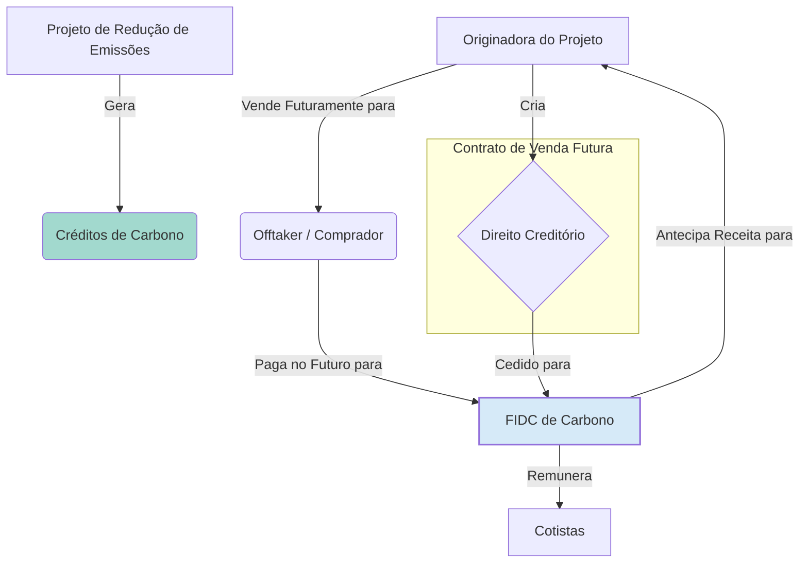
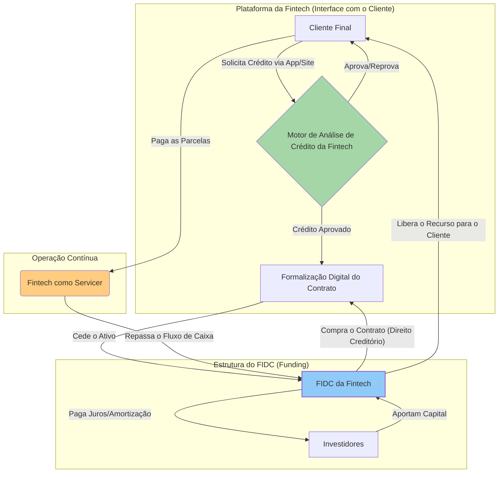
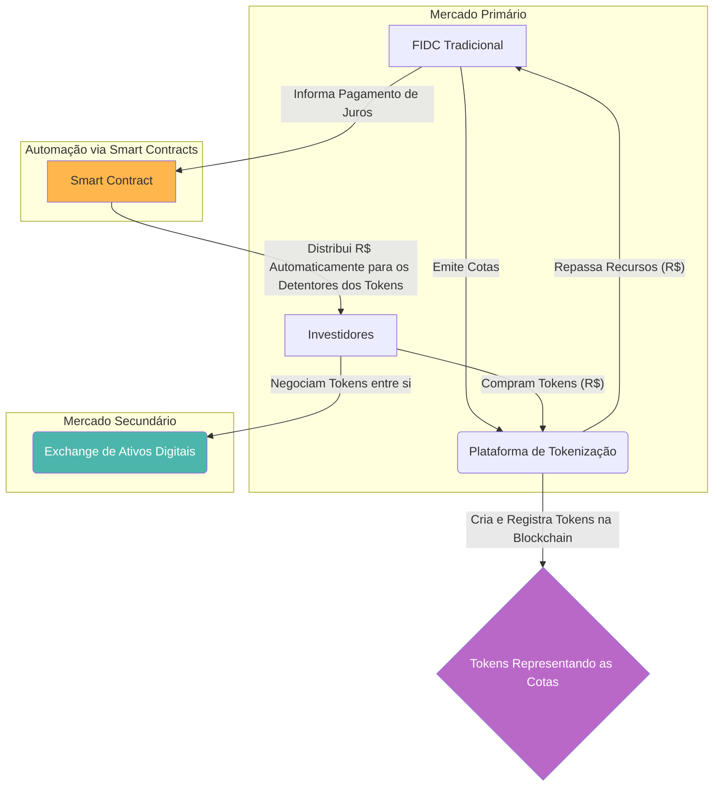

# Inovações em FIDCs

**Autor:** Rodrigo Marques
**Versão:** 1.0

---

## Sumário Executivo

Este documento técnico explora a vanguarda do mercado de Fundos de Investimento em Direitos Creditórios (FIDCs), analisando as inovações que estão expandindo as fronteiras deste já sofisticado instrumento de securitização. Focamos em três eixos principais de inovação: a agenda ESG (Ambiental, Social e de Governança), com o surgimento dos **FIDCs Verdes e Sociais**; o financiamento de projetos estratégicos para o país, através dos **FIDCs de Infraestrutura (FIDC-IE)**; e a revolução tecnológica impulsionada pelas fintechs, com os **FIDCs Digitais e a tokenização de ativos**. Aprofundamos a análise da estruturação, dos tipos de lastro, dos desafios regulatórios e das oportunidades de investimento em cada uma dessas novas fronteiras. O objetivo é fornecer uma visão panorâmica e técnica sobre como os FIDCs estão evoluindo para atender às novas demandas da sociedade e da economia, desde o financiamento da transição para uma economia de baixo carbono até a democratização do acesso ao crédito e ao investimento por meio da tecnologia. Este é um guia para investidores e profissionais que buscam compreender e se posicionar na próxima geração do mercado de securitização no Brasil.

---

## 1. Introdução: A Evolução Contínua do FIDC

O Fundo de Investimento em Direitos Creditórios (FIDC) nasceu como uma solução de engenharia financeira para um problema econômico clássico: a necessidade de empresas anteciparem seus recebíveis para gerenciar seu capital de giro e financiar seu crescimento. Desde sua criação, o FIDC provou ser um instrumento notavelmente adaptável, evoluindo de estruturas simples de securitização de duplicatas para veículos complexos capazes de absorver ativos não padronizados, como NPLs e precatórios.

Hoje, o mercado de FIDCs se encontra em um novo ponto de inflexão, impulsionado por três grandes vetores de transformação global e local: a crescente demanda por investimentos sustentáveis (ESG), a necessidade premente de investimentos em infraestrutura no Brasil, e a disrupção tecnológica liderada pelas fintechs. Esses vetores estão catalisando uma nova onda de inovação, dando origem a novas espécies de FIDCs que expandem seu propósito original.

Este documento se dedica a explorar essa fronteira de inovação, analisando como o FIDC está sendo reinventado para servir a novos propósitos:

*   **A Agenda ESG e os FIDCs Temáticos:** Investigaremos como os FIDCs estão se tornando ferramentas para o financiamento da sustentabilidade, com a criação de **FIDCs Verdes**, que lastreiam projetos de energia renovável e economia circular, e **FIDCs Sociais**, focados em áreas como educação, saúde e microcrédito.

*   **O Gap de Infraestrutura e o FIDC-IE:** Analisaremos em profundidade o Fundo de Investimento em Direitos Creditórios de Infraestrutura (FIDC-IE), um veículo com incentivos fiscais criado para canalizar recursos privados para o financiamento de longo prazo de projetos estratégicos em setores como energia, transporte, saneamento e telecomunicações.

*   **A Revolução Digital e as Fintechs:** Exploraremos o impacto da tecnologia no mercado de crédito e como os **FIDCs Digitais** se tornaram o principal motor de financiamento para as fintechs de crédito. Abordaremos também a fronteira da **tokenização**, discutindo o potencial da tecnologia blockchain para transformar a emissão, distribuição e negociação de cotas de FIDCs.

Ao dissecar cada uma dessas inovações, abordaremos a estruturação, os tipos de lastro, os desafios técnicos e regulatórios, e o perfil de risco e retorno de cada modalidade. O FIDC deixou de ser apenas um instrumento de antecipação de recebíveis para se tornar uma plataforma versátil de financiamento de teses de investimento específicas, alinhadas às grandes tendências que estão moldando o futuro da economia e da sociedade.

## 2. A Agenda ESG: FIDCs Verdes e Sociais

A crescente conscientização global sobre os desafios ambientais e sociais está redirecionando fluxos de capital em uma escala sem precedentes. Os investidores não buscam apenas retorno financeiro, mas também impacto positivo. Nesse contexto, o FIDC surge como um veículo poderoso para o chamado "financiamento de impacto" (*impact investing*).

### 2.1. FIDCs Verdes (Green FIDCs)

Os FIDCs Verdes são estruturados para financiar projetos e ativos que contribuem para a sustentabilidade ambiental. Eles securitizam os fluxos de recebíveis gerados por atividades "verdes".

*   **Estruturação e Lastro:** O lastro de um FIDC Verde pode ser composto por uma variedade de direitos creditórios, como:
    *   Contratos de venda de energia de fontes renováveis (solar, eólica, biomassa).
    *   Recebíveis de projetos de eficiência energética.
    *   Contratos de aluguel de equipamentos para geração distribuída.
    *   Créditos de carbono (CCB, CBIOs).
    *   Cotas de Reserva Ambiental (CRA).
    *   Direitos creditórios de empresas da cadeia de reciclagem e economia circular.

*   **Certificação e Verificação:** Um dos maiores desafios é garantir a "verdade" do FIDC Verde, ou seja, que os recursos estão de fato sendo direcionados para atividades com impacto ambiental positivo. Isso envolve:
    *   **Framework de Sustentabilidade:** O regulamento do fundo deve conter um framework claro, definindo os critérios de elegibilidade dos projetos e ativos verdes.
    *   **Second-Party Opinion (SPO):** A contratação de uma consultoria especializada para emitir uma opinião independente sobre a aderência do framework aos princípios internacionais (como os Green Bond Principles).
    *   **Monitoramento e Relatórios de Impacto:** O gestor deve monitorar o impacto ambiental dos projetos investidos e divulgar relatórios periódicos aos cotistas, quantificando, por exemplo, as toneladas de CO2 evitadas ou os megawatts de energia limpa gerados.

*   **Oportunidades e Desafios:** A oportunidade reside na alta demanda dos investidores por produtos ESG e no vasto potencial de investimentos verdes no Brasil. O desafio está na padronização dos critérios, na complexidade da mensuração do impacto e no risco de *greenwashing* (quando um produto é falsamente promovido como verde).

### 2.2. FIDCs Sociais

De forma análoga aos verdes, os FIDCs Sociais são destinados ao financiamento de atividades com impacto social positivo.

*   **Estruturação e Lastro:** O lastro pode incluir:
    *   Créditos de microfinanças para pequenos empreendedores.
    *   Recebíveis de mensalidades de instituições de ensino que atendem populações de baixa renda.
    *   Contratos de prestação de serviços de saúde acessível.
    *   Projetos de habitação de interesse social.

*   **Mensuração de Impacto:** O desafio de mensurar o impacto é ainda maior no pilar social. É preciso definir métricas claras (Key Performance Indicators - KPIs) para acompanhar o progresso das metas sociais, como o número de empregos gerados, a melhoria em indicadores de saúde ou o aumento da escolaridade na população atendida.

*   **Regulação e Incentivos:** A CVM e outros órgãos governamentais têm sinalizado a intenção de criar selos e incentivos para fomentar o mercado de finanças sociais, o que pode impulsionar a criação de mais FIDCs com esse foco.

## 3. O Gap de Infraestrutura: FIDCs de Infraestrutura (FIDC-IE)

O Brasil possui um déficit crônico de investimentos em infraestrutura. Para atrair capital privado para financiar projetos de longo prazo em setores estratégicos, o governo criou, através da Lei nº 12.431/11, os chamados "títulos incentivados", que incluem as debêntures de infraestrutura e, mais recentemente, os FIDCs de Infraestrutura (FIDC-IE).

### 3.1. Estrutura e Benefícios Fiscais

O FIDC-IE é um FIDC cuja carteira é composta majoritariamente por direitos creditórios originados de projetos de investimento em infraestrutura considerados prioritários pelo Governo Federal.

*   **Benefício Fiscal:** O grande atrativo do FIDC-IE é o benefício fiscal concedido aos investidores. Pessoas físicas que investem em cotas de FIDC-IE têm **isenção de Imposto de Renda** sobre os rendimentos distribuídos pelo fundo. Para investidores pessoa jurídica, a alíquota é reduzida.

*   **Lastro Elegível:** A carteira do FIDC-IE deve ser composta por, no mínimo, 85% de direitos creditórios relacionados a projetos de infraestrutura nos setores de:
    *   Logística e Transporte (rodovias, ferrovias, portos, aeroportos).
    *   Energia (geração, transmissão e distribuição).
    *   Saneamento Básico.
    *   Telecomunicações.

### 3.2. Desafios e Riscos

A estruturação e o investimento em FIDC-IE envolvem desafios específicos:

*   **Risco de Longo Prazo:** Projetos de infraestrutura têm longos períodos de maturação. O investidor está exposto a riscos de construção, operacionais e de demanda ao longo de muitos anos.
*   **Complexidade da Análise:** A análise de crédito de um projeto de infraestrutura (*project finance*) é extremamente complexa, envolvendo a avaliação de contratos de concessão, licenças ambientais, projeções de demanda e a estrutura de garantias.
*   **Risco Regulatório e Político:** O ambiente regulatório e político pode mudar ao longo da vida do projeto, afetando as tarifas, os contratos e a rentabilidade.

O FIDC-IE é uma inovação crucial para o desenvolvimento do país, mas exige do investidor e do gestor uma expertise profunda em análise de projetos de longo prazo e uma tolerância a riscos de natureza distinta dos FIDCs tradicionais.

## 4. A Revolução Digital: FIDCs, Fintechs e Tokenização

A tecnologia está redesenhando o cenário dos serviços financeiros, e os FIDCs estão no epicentro dessa transformação, atuando como a principal fonte de financiamento (*funding*) para o ecossistema de fintechs de crédito.

### 4.1. FIDCs Digitais: O Motor das Fintechs

As fintechs de crédito utilizam a tecnologia para originar crédito de forma mais rápida, barata e acessível do que os bancos tradicionais. No entanto, a maioria delas não possui capital próprio para manter esses empréstimos em seu balanço. A solução encontrada foi a securitização dessa produção via FIDCs.

*   **O Modelo de Negócio:**
    1.  A fintech origina empréstimos através de sua plataforma digital (app ou site).
    2.  Esses empréstimos (direitos creditórios) são vendidos (cedidos) para um FIDC exclusivo, do qual a fintech é a cedente e, muitas vezes, a cotista subordinada.
    3.  O FIDC capta recursos de investidores (profissionais ou qualificados) para comprar esses créditos.
    4.  A fintech atua como *servicer* do FIDC, realizando a cobrança dos devedores através de sua plataforma.

*   **Vantagens:** Esse modelo permite que as fintechs cresçam de forma exponencial, sem a necessidade de um balanço robusto. Para os investidores, os FIDCs de fintechs oferecem a oportunidade de se expor a carteiras de crédito pulverizadas e com retornos atrativos, muitas vezes descorrelacionadas do crédito bancário tradicional.

*   **Riscos:** O risco reside na qualidade dos modelos de análise de crédito (*credit scoring*) das fintechs, que muitas vezes são novos e não foram testados em um ciclo completo de crise econômica. A *due diligence* sobre a tecnologia e os algoritmos da fintech é, portanto, fundamental.

### 4.2. Tokenização: A Próxima Fronteira

A tecnologia blockchain abre a possibilidade de uma nova revolução: a tokenização de ativos. Tokenizar significa representar um ativo real (como uma cota de FIDC) em um formato digital (um *token*) em uma rede blockchain.

*   **Potenciais Benefícios:**
    *   **Democratização do Acesso:** A tokenização pode permitir o fracionamento das cotas de FIDC em valores muito menores, tornando o investimento acessível a um público mais amplo (respeitadas as restrições regulatórias de público-alvo).
    *   **Aumento da Liquidez:** A negociação de tokens em mercados secundários digitais (exchanges de ativos digitais) pode ser mais ágil e barata do que a negociação de cotas no mercado tradicional, potencialmente aumentando a liquidez desses ativos.
    *   **Eficiência Operacional:** A automação de processos como a distribuição de rendimentos e a verificação de titularidade via *smart contracts* (contratos autoexecutáveis na blockchain) pode reduzir custos e aumentar a transparência.

*   **Desafios Regulatórios e Tecnológicos:** A tokenização de valores mobiliários, como as cotas de FIDC, ainda enfrenta desafios. A CVM tem avançado na regulamentação através de seu *sandbox* regulatório, mas ainda há um caminho a ser percorrido para a criação de um mercado secundário de tokens que seja seguro, líquido e integrado ao sistema financeiro tradicional. A interoperabilidade entre diferentes redes blockchain e a segurança cibernética também são preocupações importantes.

## 5. Conclusão: O FIDC como Plataforma de Inovação

Os exemplos dos FIDCs Verdes, de Infraestrutura e Digitais demonstram a incrível plasticidade e o potencial de evolução deste instrumento. O FIDC transcendeu sua função original para se tornar uma plataforma de inovação, capaz de canalizar capital para as mais diversas teses de investimento e para os desafios mais prementes da economia e da sociedade.

A jornada de inovação está longe de terminar. À medida que novas tecnologias emergem e novas demandas sociais e econômicas se consolidam, podemos esperar o surgimento de novas espécies de FIDCs. A combinação da estrutura de securitização com a agenda ESG e a revolução digital cria um campo fértil para a engenharia financeira a serviço do desenvolvimento sustentável e da democratização do capital. Para os profissionais e investidores do mercado de capitais, acompanhar e compreender essa evolução não é apenas uma necessidade, mas uma oportunidade de participar da construção do futuro do financiamento no Brasil.

## 6. Aprofundamento Técnico: FIDCs Verdes e o Mercado de Carbono

O avanço da agenda ESG (Environmental, Social, and Governance) no mercado financeiro global tem impulsionado a criação de instrumentos de dívida inovadores, projetados para financiar projetos com impacto ambiental positivo. Nesse contexto, os FIDCs Verdes (Green FIDCs) e os FIDCs lastreados em créditos de carbono surgem como uma das fronteiras mais promissoras e complexas do mercado de crédito estruturado no Brasil.

### 6.1. FIDCs Verdes: Estrutura e Critérios

Um FIDC Verde não se diferencia de um FIDC tradicional por sua estrutura jurídica, mas sim pela **natureza dos ativos que compõem sua carteira**. O "selo verde" de um FIDC advém do fato de que seus recursos são destinados a financiar, direta ou indiretamente, projetos ou atividades que contribuem para a sustentabilidade ambiental.

**O que é um "Ativo Verde"?**

A definição de um ativo verde é o ponto central. Para que um direito creditório seja considerado verde, ele deve estar vinculado a um projeto ou atividade que se enquadre em uma das categorias de elegibilidade reconhecidas por padrões internacionais, como os **Green Bond Principles (GBP)**, publicados pela International Capital Market Association (ICMA). As principais categorias incluem:

*   **Energias Renováveis:** Financiamento para a construção ou operação de usinas solares, eólicas, de biomassa, etc. O direito creditório pode ser, por exemplo, um contrato de fornecimento de equipamento (EPC) ou um contrato de venda de energia (PPA).
*   **Eficiência Energética:** Créditos para financiar a modernização de edifícios (retrofit) para reduzir o consumo de energia, ou a substituição de equipamentos industriais por versões mais eficientes.
*   **Transporte Limpo:** Financiamento para a aquisição de frotas de veículos elétricos, construção de ciclovias ou infraestrutura para transporte público de baixa emissão.
*   **Gestão Sustentável da Água e de Resíduos:** Créditos para projetos de saneamento, tratamento de efluentes, reciclagem e economia circular.
*   **Uso Sustentável da Terra e Agricultura:** Financiamento para práticas de agricultura de baixo carbono, reflorestamento, e conservação de biomas. Os direitos creditórios podem ser Cédulas de Produto Rural (CPR-Verde) ou contratos de fornecimento de insumos para agricultura sustentável.

**O Processo de Certificação e Verificação:**

Para que um FIDC seja reconhecido como "verde" pelo mercado, não basta que o gestor simplesmente declare que seus ativos são verdes. É necessário um processo de validação independente para garantir a credibilidade da operação e evitar o **greenwashing** (a "lavagem verde", ou seja, a falsa aparência de sustentabilidade).

1.  **Framework do Fundo:** O gestor, em conjunto com o estruturador, desenvolve um "Framework de Financiamento Sustentável". Este documento descreve a política de investimento verde do fundo, as categorias de projetos elegíveis, o processo de seleção e monitoramento dos ativos, e como os impactos ambientais serão medidos e reportados.

2.  **Second-Party Opinion (SPO):** O Framework é submetido a uma entidade independente especializada em sustentabilidade (como a Sitawi, a Sustainalytics ou a Vigeo Eiris), que emite uma **"Opinião de Segunda Parte" (Second-Party Opinion - SPO)**. A SPO é um relatório que avalia se o framework do fundo está alinhado com os padrões internacionais (como os Green Bond Principles) e se os critérios de elegibilidade são robustos. Uma SPO positiva é o principal selo de qualidade que atesta a integridade "verde" do FIDC.

3.  **Verificação Anual:** Após o lançamento do fundo, o gestor deve contratar uma auditoria independente anual para verificar se os recursos foram efetivamente alocados para os projetos elegíveis definidos no framework e para reportar os indicadores de impacto ambiental que foram alcançados (ex: toneladas de CO2 evitadas, megawatts de energia renovável instalada).

### 6.2. FIDCs de Crédito de Carbono: A Securitização do Ar

Uma vertente ainda mais inovadora são os FIDCs lastreados em créditos de carbono. Este instrumento permite que empresas que geram créditos de carbono, através de projetos de redução de emissões (como reflorestamento ou captura de metano), possam antecipar as receitas futuras da venda desses créditos.

**A Estrutura da Operação:**

1.  **Geração e Certificação do Crédito de Carbono:** Uma empresa (a originadora) desenvolve um projeto que reduz ou remove gases de efeito estufa da atmosfera. Esse projeto é auditado por uma entidade certificadora (como a Verra ou a Gold Standard), que quantifica a redução de emissões e emite os **créditos de carbono** correspondentes. Cada crédito representa uma tonelada de CO2 equivalente que deixou de ser emitida.

2.  **Contrato de Venda Futura (Offtake Agreement):** A originadora firma um contrato de longo prazo com um comprador (o "offtaker"), que pode ser uma empresa que precisa compensar suas próprias emissões. Neste contrato, o offtaker se compromete a comprar um volume de créditos de carbono a um preço predeterminado (ou com uma fórmula de preço) no futuro.

3.  **Cessão para o FIDC:** Este contrato de venda futura é um **direito creditório**. A originadora cede esse contrato para um FIDC. O fundo, então, antecipa para a originadora o valor presente dos recebimentos futuros esperados da venda dos créditos de carbono.

4.  **Fluxo de Caixa para o FIDC:** O FIDC passa a ser o detentor do direito de receber os pagamentos do offtaker no futuro. Esse fluxo de caixa é utilizado para remunerar os cotistas do fundo.

**Diagrama do FIDC de Carbono:**

**Riscos Específicos:**

A análise de risco de um FIDC de carbono é extremamente complexa e envolve riscos não tradicionais:

*   **Risco de Performance do Projeto (Risco de Entrega):** O risco de o projeto de redução de emissões não performar como o esperado e não gerar o volume de créditos de carbono prometido no contrato. Isso pode ocorrer por problemas operacionais, desastres naturais (incêndios em florestas) ou falhas na metodologia.
*   **Risco Regulatório e Metodológico:** O risco de mudanças nas metodologias de certificação ou na regulamentação do mercado de carbono que possam invalidar ou reduzir o valor dos créditos gerados.
*   **Risco de Preço:** Se o contrato de venda não tiver um preço fixo, o FIDC fica exposto à volatilidade dos preços dos créditos de carbono no mercado voluntário, que podem flutuar significativamente.
*   **Risco de Crédito do Offtaker:** O risco de o comprador final (offtaker) não honrar seu compromisso de compra, seja por dificuldades financeiras ou por questionamentos sobre a qualidade dos créditos.

Devido a essa complexidade, os FIDCs de carbono são tipicamente classificados como FIDC-NPs e destinados exclusivamente a investidores profissionais com alta sofisticação e capacidade de análise de riscos socioambientais.

Em conclusão, os FIDCs Verdes e de Carbono representam a vanguarda da inovação em finanças estruturadas, conectando o mercado de capitais diretamente com a transição para uma economia de baixo carbono. Eles oferecem aos investidores a oportunidade de obter retornos financeiros enquanto contribuem para objetivos ambientais, mas exigem um nível de due diligence e de análise de risco que vai muito além do crédito tradicional, incorporando complexas variáveis técnicas, científicas e regulatórias da agenda de sustentabilidade.

## 7. Aprofundamento: A Arquitetura dos FIDCs Digitais e a Tokenização

A ascensão das fintechs de crédito e a maturação da tecnologia blockchain estão provocando uma profunda transformação na infraestrutura do mercado de crédito. Os FIDCs estão no centro dessa revolução, não apenas como fonte de financiamento, mas também como objeto de inovação em sua própria estrutura e forma de distribuição. Vamos aprofundar a arquitetura por trás dos FIDCs Digitais e o potencial disruptivo da tokenização.

### 7.1. A Arquitetura do FIDC como Motor das Fintechs

O modelo de negócio da maioria das fintechs de crédito (as chamadas "fintechs as a service" ou plataformas de originação) é baseado em uma simbiose com o mercado de capitais, onde o FIDC atua como o balanço patrimonial terceirizado que viabiliza a operação de crédito em escala. A arquitetura dessa parceria é elegante e eficiente.

**Fluxograma da Operação Fintech + FIDC:**

**Componentes da Arquitetura:**

1.  **Motor de Análise de Crédito (Credit Scoring Engine):** Este é o coração da fintech e seu principal ativo intelectual. É um algoritmo, muitas vezes baseado em machine learning, que analisa centenas ou milhares de variáveis sobre o cliente (dados tradicionais de bureaus, dados alternativos de redes sociais, comportamento de navegação, etc.) para calcular um score de crédito e uma probabilidade de default (PD) em tempo real. A qualidade desse motor é o principal fator de risco para o investidor do FIDC.

2.  **Originação e Formalização Digital:** Todo o processo, desde a solicitação do crédito até a assinatura do contrato (geralmente com assinatura eletrônica), ocorre em um ambiente 100% digital, o que reduz drasticamente os custos e o tempo da operação em comparação com um banco tradicional.

3.  **O FIDC como "Balanço Dedicado":** A fintech cria um FIDC (ou múltiplos FIDCs) para ser o veículo de financiamento de sua operação. A fintech atua em múltiplas funções:
    *   **Originadora/Cedente:** Ela gera os créditos e os vende para o FIDC.
    *   **Cotista Subordinado:** Em quase todas as estruturas, a própria fintech retém a cota mais arriscada (subordinada) do FIDC. Isso é crucial para o **alinhamento de interesses**. Ao reter o "primeiro prejuízo", a fintech demonstra confiança em seu próprio modelo de crédito e tem um forte incentivo para originar créditos de boa qualidade. Se a carteira performar mal, a fintech é a primeira a perder dinheiro.
    *   **Agente de Cobrança (Servicer):** A fintech é a responsável pela cobrança das parcelas, utilizando sua própria tecnologia (régua de cobrança digital, portais de negociação, etc.).

4.  **Due Diligence Tecnológica:** A análise de um FIDC de fintech exige uma *due diligence* que vai além da análise de crédito tradicional. O investidor (ou o gestor, em nome dele) precisa auditar a tecnologia da fintech. Isso pode incluir:
    *   **Backtesting do Modelo de Crédito:** Analisar o histórico de performance do motor de crédito da fintech. As previsões de inadimplência do modelo se provaram corretas no passado?
    *   **Análise do Código e da Infraestrutura:** Em alguns casos, a *due diligence* pode envolver a análise da arquitetura de software e da infraestrutura de TI da fintech para avaliar sua robustez e segurança.

### 7.2. Tokenização de Cotas de FIDC: O Futuro da Distribuição

A tokenização representa a próxima etapa da evolução digital dos FIDCs, focada não na originação do crédito, mas na **emissão, distribuição e negociação das cotas do fundo**.

**O que é Tokenizar uma Cota de FIDC?**

É o processo de criar uma representação digital de uma cota (ou de uma fração de cota) em uma rede blockchain. Esse registro digital, o *token*, é um valor mobiliário e, portanto, sua emissão e negociação estão sujeitas à regulamentação da CVM. O token contém em seu código as informações e os direitos associados à cota que ele representa (ex: direito a receber juros, direito de voto, etc.).

**A Arquitetura de um FIDC Tokenizado:**

**Vantagens Potenciais:**

*   **Fracionamento e Acessibilidade:** Um token pode representar uma fração mínima de uma cota (ex: 0,001 de uma cota). Isso reduz drasticamente o investimento mínimo, permitindo que investidores de varejo (respeitadas as regras de público-alvo) possam ter acesso a uma classe de ativos antes restrita a grandes investidores.

*   **Liquidez e Mercado 24/7:** A negociação de tokens em exchanges de ativos digitais pode ocorrer 24 horas por dia, 7 dias por semana, em um processo mais ágil e com custos de transação potencialmente menores do que os do mercado de balcão tradicional. Isso tem o potencial de aumentar drasticamente a liquidez das cotas de FIDC, que hoje são um ativo notoriamente ilíquido.

*   **Eficiência e Transparência:** A tecnologia blockchain é um banco de dados distribuído, imutável e transparente. A transferência de propriedade de um token é registrada na blockchain de forma instantânea e visível a todos os participantes da rede, eliminando a necessidade de intermediários de registro e liquidação. Além disso, os **contratos inteligentes (*smart contracts*)** podem automatizar processos complexos, como o pagamento de juros (o *smart contract* pode ser programado para, ao receber a informação de pagamento do administrador, distribuir automaticamente os valores para as carteiras digitais de todos os detentores de tokens).

**Desafios Atuais:**

*   **Regulamentação:** A CVM tem avançado na criação de um ambiente regulado para a tokenização de valores mobiliários, principalmente através do seu Sandbox Regulatório. No entanto, ainda é preciso consolidar as regras para a atuação das plataformas de tokenização, das exchanges de ativos digitais e para a integração desses novos ambientes com o sistema financeiro tradicional.
*   **Interoperabilidade e Padronização:** Existem múltiplas tecnologias de blockchain (Ethereum, Polygon, etc.). A falta de padronização e de interoperabilidade entre essas redes pode criar silos de liquidez, fragmentando o mercado.
*   **Segurança Cibernética:** A segurança da custódia das carteiras digitais (*wallets*) onde os tokens são armazenados é uma preocupação fundamental. A perda de chaves privadas pode significar a perda permanente do ativo.

Apesar dos desafios, a tokenização é vista por muitos como o futuro inevitável da distribuição de ativos financeiros. Para os FIDCs, ela representa a oportunidade de destravar um enorme potencial de liquidez e de alcançar uma base de investidores muito mais ampla, completando a revolução digital que começou na originação do crédito e que agora chega à sua distribuição no mercado de capitais.

## 9. Aprofundamento: FIDCs de Ativos Digitais e a Tokenização de Recebíveis

A intersecção entre a tecnologia blockchain e o mercado financeiro tradicional está criando uma nova fronteira de inovação, e os FIDCs estão na vanguarda dessa transformação. A capacidade de "tokenizar" ativos, ou seja, de representar direitos sobre ativos reais em um formato digital (tokens) em uma rede blockchain, abre um leque de possibilidades para a securitização de recebíveis, prometendo mais eficiência, transparência e liquidez.

Os FIDCs de ativos digitais, também conhecidos como FIDCs "cripto" ou "tokenizados", são fundos que investem em direitos creditórios que foram originados ou são representados digitalmente em uma blockchain.

### 9.1. O que é a Tokenização de Recebíveis?

A tokenização é o processo de converter um direito sobre um ativo (neste caso, um direito creditório) em um token digital. Cada token representa uma fração ou a totalidade de um recebível e é registrado em uma blockchain, uma espécie de livro-razão digital, distribuído e imutável.

**Como funciona o processo?**

1.  **Originação do Crédito:** Uma empresa origina um direito creditório da forma tradicional (ex: uma venda a prazo que gera uma duplicata).
2.  **Digitalização e Emissão do Token:** A empresa, através de uma plataforma de tokenização, cria um token que representa essa duplicata. As informações do crédito (valor, vencimento, devedor, etc.) são registradas nos metadados do token.
3.  **Registro na Blockchain:** O token é emitido e registrado em uma rede blockchain (como Ethereum, Polygon, etc.). A propriedade do token é controlada por uma chave privada, que funciona como a "assinatura" digital do dono do ativo.
4.  **Cessão para o FIDC:** A empresa cedente transfere a propriedade do token para a carteira digital (wallet) do FIDC. Essa transferência na blockchain é a representação digital da cessão de crédito. O pagamento do FIDC para a empresa é feito da forma tradicional (via sistema financeiro).

### 9.2. Vantagens da Tokenização para a Estrutura de um FIDC

A utilização de tokens para representar os direitos creditórios pode trazer ganhos significativos de eficiência e transparência para a operação de um FIDC.

*   **Eficiência e Redução de Custos Operacionais:**
    *   **Automação da Verificação:** A verificação da existência e da titularidade do crédito (uma função chave do custodiante) pode ser largamente automatizada. Como a blockchain é um registro único e imutável, o risco de um mesmo crédito ser cedido para dois fundos diferentes (dupla cessão) é drasticamente reduzido.
    *   **Simplificação da Custódia:** A custódia do "lastro" do crédito passa a ser a custódia da chave privada que controla o token. Isso simplifica o processo e reduz a necessidade de manuseio de documentos físicos ou de múltiplos sistemas.

*   **Transparência e Rastreabilidade:**
    *   **Auditoria em Tempo Real:** Todas as transações com o token (sua criação, sua transferência para o FIDC, e eventualmente seu pagamento) são registradas de forma permanente e transparente na blockchain. Isso permite que o administrador, o gestor, o cotista e o auditor possam verificar o histórico completo de cada ativo da carteira em tempo real, aumentando a transparência e a governança.

*   **Potencial de Aumento da Liquidez:**
    *   **Fracionamento:** Um direito creditório de grande valor pode ser dividido em múltiplos tokens de pequeno valor, permitindo que mais investidores tenham acesso ao ativo.
    *   **Mercado Secundário:** A natureza digital e padronizada dos tokens facilita a criação de mercados secundários (exchanges de ativos digitais) onde as cotas do FIDC ou mesmo os próprios tokens de recebíveis poderiam ser negociados com mais agilidade e menor custo do que no mercado tradicional.

### 9.3. Desafios Regulatórios e Operacionais

Apesar do enorme potencial, a utilização de ativos digitais em FIDCs ainda enfrenta desafios importantes.

*   **Validade Jurídica:** O principal desafio é garantir que a representação digital do crédito (o token) tenha a mesma validade jurídica que o instrumento tradicional (o contrato, a duplicata). A legislação brasileira tem avançado nesse sentido, com o Marco Legal dos Ativos Virtuais (Lei nº 14.478/2022), mas ainda há questões a serem pacificadas na jurisprudência. É fundamental que a estrutura garanta que o detentor do token seja, inequivocamente, o credor da dívida no mundo real.

*   **Integração de Mundos (On-chain e Off-chain):** É preciso garantir a conexão entre o mundo digital (on-chain) e o mundo real (off-chain). O pagamento do devedor, que ocorre no sistema financeiro tradicional (off-chain), precisa ser refletido na blockchain, com a "queima" ou o cancelamento do token correspondente. A gestão desse "oráculo" que conecta os dois mundos é um ponto crítico de risco operacional.

*   **Segurança Cibernética:** A custódia de ativos digitais exige um nível extremamente elevado de segurança cibernética para a proteção das chaves privadas. O risco de roubo por hackers é uma nova categoria de risco que os custodiantes tradicionais precisam aprender a gerenciar.

*   **Volatilidade de Criptoativos:** É importante distinguir um FIDC que investe em **direitos creditórios tokenizados** de um fundo que investe diretamente em **criptomoedas** (como Bitcoin ou Ethereum). O FIDC de direitos creditórios tokenizados tem seu risco atrelado à inadimplência dos devedores, não à volatilidade do preço das criptomoedas. No entanto, se o FIDC utilizar uma stablecoin (uma criptomoeda pareada a uma moeda fiduciária, como o dólar) como meio de pagamento, ele estará exposto ao risco de essa stablecoin perder sua paridade.

### 9.4. O Futuro: FIDCs como Plataformas de Finanças Descentralizadas (DeFi)

A tokenização é o primeiro passo para uma integração ainda mais profunda entre os FIDCs e o universo das Finanças Descentralizadas (DeFi). No futuro, é possível imaginar estruturas onde todo o ciclo de vida de um FIDC ocorra de forma automatizada em uma blockchain, através de contratos inteligentes (smart contracts).

*   **Emissão e Distribuição de Cotas Tokenizadas:** As próprias cotas do FIDC podem ser tokens, permitindo sua negociação em exchanges descentralizadas.
*   **Cascata de Pagamentos Automatizada:** O *waterfall* de pagamentos pode ser programado em um contrato inteligente. Quando o FIDC recebe o pagamento de um devedor (em formato de stablecoin, por exemplo), o contrato inteligente automaticamente distribui os recursos entre as diferentes subclasses de cotas (sênior, mezanino, subordinada), seguindo as regras de prioridade, sem a necessidade de intervenção manual.
*   **Gestão de Portfólio Descentralizada:** Organizações Autônomas Descentralizadas (DAOs) poderiam, teoricamente, atuar como gestoras, com os detentores de tokens de governança votando nas decisões de investimento.

Embora esse futuro totalmente descentralizado ainda pareça distante e enfrente barreiras regulatórias e tecnológicas significativas, a tendência de tokenização de ativos reais é um caminho sem volta. Os FIDCs, como veículos de securitização por excelência, estão posicionados de forma única para liderar essa revolução, tornando o mercado de crédito mais acessível, eficiente e transparente para uma nova geração de investidores.

## 9. Aprofundamento: FIDCs Digitais e a Tokenização de Cotas

A intersecção entre o mercado financeiro tradicional e as tecnologias de registro distribuído (Distributed Ledger Technologies - DLT), como o blockchain, está catalisando uma nova onda de inovação. Uma das fronteiras mais promissoras dessa convergência é a **tokenização de ativos**, um processo que consiste em representar um ativo real (físico ou financeiro) como um "token" digital em uma rede blockchain. Para os FIDCs, essa tecnologia abre um leque de possibilidades para aumentar a eficiência, a liquidez e o acesso a esses instrumentos.

### 9.1. O que é a Tokenização?

Tokenizar um ativo significa criar uma representação digital de seus direitos de propriedade em uma DLT. Cada token é um registro criptográfico único que representa uma fração (ou a totalidade) do ativo subjacente. No caso de um FIDC, o que se tokeniza são as **cotas** do fundo. Em vez de o investidor ter sua propriedade registrada nos livros do administrador e do escriturador, ele passa a deter um token digital que representa sua participação no fundo.

**Como funciona o processo?**

1.  **Estruturação do FIDC:** O FIDC é constituído e estruturado da forma tradicional, em conformidade com a Resolução CVM 175.
2.  **Emissão dos Tokens:** Uma empresa de tecnologia especializada (uma "tokenizadora"), em conjunto com o administrador do fundo, cria um contrato inteligente (*smart contract*) em uma rede blockchain (como Ethereum, Polygon, etc.). Esse *smart contract* define as regras das cotas-token: número total de tokens, direitos associados, regras de transferência, etc.
3.  **Distribuição (Oferta):** Os tokens são ofertados aos investidores em uma plataforma de negociação de ativos digitais. A compra do token equivale, juridicamente, à subscrição da cota do FIDC.
4.  **Custódia Digital:** Os investidores guardam seus tokens em "carteiras digitais" (*digital wallets*), que lhes dão o controle criptográfico sobre seus ativos.
5.  **Negociação Secundária:** A grande vantagem reside aqui. Os investidores podem negociar seus tokens diretamente com outros investidores em um mercado secundário digital (um *marketplace* de tokens), 24/7, com liquidação quase instantânea.

### 9.2. Vantagens da Tokenização para FIDCs

A tokenização não é apenas uma mudança de tecnologia; ela resolve alguns dos problemas históricos dos FIDCs, especialmente os relacionados à liquidez e aos custos.

*   **Aumento da Liquidez:**
    *   **Problema Tradicional:** O mercado secundário de cotas de FIDC é tradicionalmente ilíquido e restrito. A venda de uma cota antes do vencimento do fundo é um processo lento, burocrático e que geralmente envolve um grande deságio.
    *   **Solução da Tokenização:** Ao transformar a cota em um token negociável em um mercado digital, a liquidez potencial aumenta drasticamente. A negociação pode ocorrer de forma mais fluida e com um número muito maior de participantes, reduzindo o spread entre compra e venda.

*   **Fracionamento do Investimento:**
    *   **Problema Tradicional:** Cotas de FIDCs, especialmente os mais estruturados, costumam ter um valor nominal elevado, restringindo o acesso a grandes investidores.
    *   **Solução da Tokenização:** Um token pode representar uma fração mínima de uma cota. É possível criar um token que represente 1/1000 de uma cota, por exemplo. Isso permite o **fracionamento** do investimento, tornando os FIDCs acessíveis a um público muito mais amplo, com tickets de entrada muito menores.

*   **Redução de Custos e Eficiência Operacional:**
    *   **Problema Tradicional:** A cadeia de intermediários em um fundo (administrador, custodiante, escriturador, distribuidor) gera custos que são repassados ao cotista.
    *   **Solução da Tokenização:** Os *smart contracts* podem automatizar muitas das funções tradicionalmente realizadas por esses intermediários. Por exemplo, a transferência de propriedade do token na blockchain é o próprio ato de escrituração. A distribuição de rendimentos pode ser programada no *smart contract* para ocorrer de forma automática para as carteiras digitais dos detentores dos tokens. Essa automação tem o potencial de reduzir significativamente as taxas do fundo.

*   **Transparência:**
    *   **Problema Tradicional:** Embora a CVM exija a divulgação de informações, o acesso aos dados da carteira do fundo pode não ser trivial para o investidor.
    *   **Solução da Tokenização:** A blockchain é, por natureza, um livro-razão transparente e imutável. É possível registrar na blockchain não apenas a propriedade dos tokens, mas também informações (anonimizadas) sobre os direitos creditórios que lastreiam o fundo. Isso permitiria que o investidor verificasse, em tempo real, a composição e a saúde da carteira, aumentando a transparência e a confiança.

### 9.3. Desafios Regulatórios e Tecnológicos

Apesar do enorme potencial, a tokenização de FIDCs ainda enfrenta desafios importantes.

*   **Arcabouço Regulatório:** A CVM tem se mostrado aberta à inovação, inclusive através de seu Sandbox Regulatório, que permitiu a criação de projetos-piloto de tokenização. No entanto, a regulamentação ainda precisa evoluir para dar plena segurança jurídica a esse novo mercado. Questões como: quem é o responsável pela custódia dos tokens? Como se dá a integração entre o ambiente da CVM e o ambiente da blockchain? Como garantir a prevenção à lavagem de dinheiro (PLD/AML) em transações com tokens? Todas essas são perguntas que estão sendo respondidas gradualmente.

*   **Segurança Cibernética:** A segurança das plataformas de tokenização e das carteiras digitais é primordial. Um ataque hacker pode levar à perda irrecuperável dos ativos dos investidores.

*   **Interoperabilidade:** Existem múltiplas redes blockchain. A falta de interoperabilidade entre elas pode fragmentar a liquidez, o oposto do que se busca com a tokenização.

### 9.4. O Futuro: FIDCs Nativos Digitais

A primeira geração de FIDCs tokenizados consiste em pegar uma estrutura de FIDC tradicional e "envelopá-la" em tokens. O futuro, no entanto, aponta para os **FIDCs nativos digitais**.

Nesses fundos, não apenas as cotas, mas os próprios **direitos creditórios** já nasceriam como tokens. Imagine uma fintech que concede um empréstimo e, em vez de gerar um contrato em PDF, gera um NFT (Non-Fungible Token) que representa aquele contrato de dívida específico. O FIDC, então, poderia comprar esses NFTs diretamente, compondo sua carteira com ativos 100% digitais. O *smart contract* do FIDC poderia ser programado para verificar automaticamente as características desses NFTs (prazo, taxa, etc.) e executar a compra, a cobrança e o provisionamento de perdas de forma totalmente automatizada.

Essa visão de um FIDC autônomo, operando sobre trilhos de DLT, representa o ápice da eficiência e da transparência que a tecnologia pode trazer para o mercado de crédito. Embora ainda distante, é a direção para a qual a inovação em FIDCs está apontando, prometendo transformar radicalmente a forma como o crédito é originado, gerenciado e distribuído no Brasil e no mundo.
