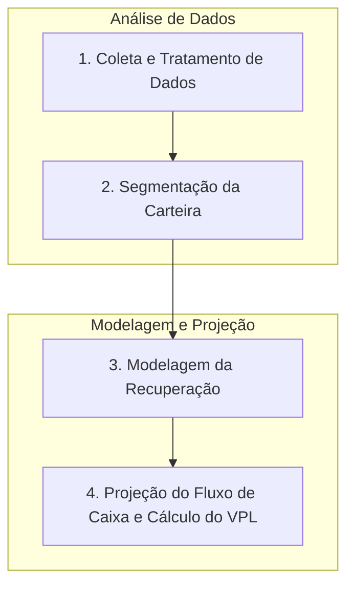

# FIDCs Não Padronizados (FIDC-NP): Estrutura, Riscos e Oportunidades

**Autor:** Rodrigo Marques
**Versão:** 1.0

---

## Sumário Executivo

Este documento oferece uma análise técnica e aprofundada sobre os Fundos de Investimento em Direitos Creditórios Não Padronizados (FIDC-NP), uma modalidade de investimento que se destaca no mercado de capitais brasileiro por seu alto potencial de retorno e, correspondentemente, por seu elevado perfil de risco. Exploramos a estrutura, os riscos, as oportunidades e o arcabouço regulatório que governa esses fundos, destinados exclusivamente a investidores profissionais. A análise abrange desde a definição e os tipos de ativos não padronizados, como créditos vencidos (NPLs), precatórios e direitos creditórios litigiosos, até as complexas metodologias de precificação e os rigorosos processos de due diligence exigidos. O objetivo é fornecer um guia completo para investidores, gestores e demais profissionais do mercado que buscam compreender a fundo as nuances e as particularidades dos FIDC-NPs, um dos segmentos mais sofisticados e desafiadores da indústria de fundos de investimento no Brasil.

---

## 1. Introdução aos FIDCs Não Padronizados (FIDC-NP)

Os Fundos de Investimento em Direitos Creditórios (FIDCs) representam uma das mais importantes inovações do mercado de capitais brasileiro nas últimas décadas. Ao permitirem a securitização de recebíveis, esses fundos criaram um canal vital para a antecipação de receitas para empresas de diversos setores, fomentando a liquidez e a eficiência da economia. Dentro do vasto universo dos FIDCs, emerge uma categoria particular, de maior complexidade e risco: os Fundos de Investimento em Direitos Creditórios Não Padronizados (FIDC-NP).

Instituídos pela Instrução CVM nº 444, de 8 de dezembro de 2006, e posteriormente incorporados e detalhados pela Resolução CVM nº 175, de 23 de dezembro de 2022, os FIDC-NPs foram concebidos para investir em direitos creditórios que não se enquadram nos critérios dos FIDCs tradicionais. São ativos que, por sua natureza, carregam um grau mais elevado de incerteza e risco, mas que, em contrapartida, oferecem um potencial de retorno significativamente maior.

Este documento se propõe a realizar uma imersão técnica no mundo dos FIDC-NPs. Abordaremos em detalhes a sua definição, o arcabouço regulatório que os rege, os tipos de ativos que compõem suas carteiras, os desafios de sua estruturação e gestão, e as oportunidades que representam para o investidor profissional, único público autorizado a aplicar nesses fundos. A análise se estenderá sobre os seguintes pilares:

*   **Definição e Contexto:** O que caracteriza um direito creditório como "não padronizado" e por que essa distinção é fundamental.
*   **Ativos Elegíveis:** Uma exploração detalhada dos principais tipos de ativos que lastreiam os FIDC-NPs, como créditos vencidos e não pagos (NPLs), precatórios, créditos litigiosos, e outros.
*   **Estrutura e Funcionamento:** As particularidades na estruturação desses fundos, incluindo os mecanismos de mitigação de risco e o papel dos prestadores de serviço especializados.
*   **Riscos e Oportunidades:** Uma análise aprofundada do binômio risco-retorno, detalhando os riscos específicos (de crédito, legal, operacional) e o potencial de alfa que esses fundos podem gerar.
*   **Regulação e Supervisão:** O papel da Comissão de Valores Mobiliários (CVM) na normatização e fiscalização desses veículos de investimento, com foco na proteção do investidor e na estabilidade do sistema.

Ao final desta leitura, esperamos que o leitor tenha uma compreensão clara e abrangente sobre os FIDC-NPs, capacitando-o a navegar com maior segurança e conhecimento neste segmento desafiador e promissor do mercado de capitais brasileiro.

## 2. Arcabouço Regulatório: Da Instrução 444 à Resolução 175

A trajetória regulatória dos FIDC-NPs é um reflexo da maturação do mercado de securitização no Brasil. A CVM, como órgão regulador, buscou criar um ambiente que permitisse o desenvolvimento de estruturas mais complexas, ao mesmo tempo em que estabelecia salvaguardas para os investidores. A evolução da Instrução CVM 444/06 para a Resolução CVM 175/22 marca um ponto de inflexão, modernizando e sofisticando a regulamentação desses fundos.

### 2.1. A Gênese: Instrução CVM nº 444/06

Até 2006, o mercado de FIDCs operava sob a égide da Instrução CVM 356/01, que estabelecia as regras gerais para esses fundos. No entanto, com o desenvolvimento do mercado, surgiu a necessidade de veículos capazes de absorver ativos de crédito com características mais complexas e arriscadas, que não se encaixavam no perfil "padrão".

A Instrução CVM 444/06 veio preencher essa lacuna. Ela definiu o que viria a ser o FIDC-NP, um fundo destinado à aquisição de direitos creditórios com "maior grau de complexidade e fatores de risco específicos". A norma permitiu que esses fundos adquirissem:

*   Direitos creditórios não performados (vencidos e não pagos).
*   Créditos decorrentes de receitas públicas governamentais.
*   Créditos que fossem objeto de ações judiciais.

Uma das principais características da Instrução 444 foi a restrição do público-alvo. Apenas **investidores qualificados** poderiam aplicar em FIDC-NPs, e o valor nominal unitário mínimo da cota era de R$ 1.000.000,00 (um milhão de reais). Essa medida visava garantir que apenas investidores com maior capacidade de análise de risco e suporte a perdas tivessem acesso a esses produtos.

### 2.2. A Modernização: Resolução CVM nº 175/22

A Resolução CVM 175, que entrou em vigor em 2023, representou uma reforma completa na regulamentação da indústria de fundos de investimento no Brasil. Para os FIDCs e FIDC-NPs, as mudanças foram substanciais, trazendo mais flexibilidade, transparência e alinhamento com as melhores práticas internacionais. O Anexo Normativo II da Resolução trata especificamente dos FIDCs.

**Principais Mudanças para os FIDC-NPs:**

*   **Definição de Direitos Creditórios Não Padronizados:** A Resolução 175 aprimorou a definição, listando de forma mais clara as características que enquadram um ativo como não padronizado. O Art. 4º do Anexo Normativo II define como não padronizados os direitos creditórios que possuam ao menos uma das seguintes características:
    *   Estejam vencidos e pendentes de pagamento quando da cessão.
    *   Decorrentes de receitas públicas originárias ou derivadas.
    *   Resultem de ações judiciais ou procedimentos arbitrais em curso.
    *   A validade jurídica da cessão seja um fator preponderante de risco.
    *   O devedor ou cedente seja sociedade em recuperação judicial ou extrajudicial (com ressalvas).
    *   Sejam de existência futura e montante desconhecido.
    *   Derivativos de crédito (quando não para hedge).
    *   Cotas de outros FIDC-NPs.

*   **Público-Alvo:** A Resolução 175 manteve a restrição, mas refinou o conceito. A aquisição de cotas de FIDC-NP, em mercado primário, ficou restrita a **investidores profissionais**, um grupo ainda mais seleto que os investidores qualificados. No mercado secundário, a negociação pode ocorrer entre investidores profissionais e qualificados.

*   **Estrutura de Classes e Subclasses:** A nova resolução permite uma maior flexibilidade na criação de classes de cotas com patrimônio segregado, o que possibilita a criação de estratégias de investimento distintas dentro de um mesmo FIDC, inclusive com a combinação de ativos padronizados e não padronizados em classes diferentes.

*   **Responsabilidade dos Prestadores de Serviço:** A norma detalha de forma mais explícita as responsabilidades do administrador, do gestor e, crucialmente para os FIDC-NPs, do custodiante e do agente de cobrança (servicer). A due diligence e o monitoramento contínuo dos ativos ganharam ainda mais destaque.

*   **Transparência e Informação:** Foram ampliadas as exigências de divulgação de informações, incluindo a elaboração da lâmina de informações essenciais e relatórios periódicos mais detalhados sobre a composição e o risco da carteira.

A transição da Instrução 444 para a Resolução 175 reflete um esforço da CVM em acompanhar a sofisticação do mercado, proporcionando um ambiente regulatório mais robusto e seguro, sem engessar a capacidade de estruturação de operações mais complexas, que são a essência dos FIDC-NPs.

## 3. Ativos Elegíveis: O Universo dos Direitos Creditórios Não Padronizados

A carteira de um FIDC-NP é composta por ativos que se desviam da norma, apresentando características que os tornam inadequados para os FIDCs tradicionais. A compreensão profunda de cada tipo de ativo é o primeiro passo para a análise de um FIDC-NP.

### 3.1. Créditos Vencidos e Não Pagos (Non-Performing Loans - NPLs)

Os NPLs são, talvez, o tipo mais comum de ativo encontrado em FIDC-NPs. Trata-se de créditos que não foram pagos pelos devedores nos prazos contratados e que, geralmente, já passaram por um processo inicial de cobrança sem sucesso.

*   **Origem:** Os NPLs podem ser originados de diversas fontes, como carteiras de cartão de crédito, empréstimos pessoais, financiamento de veículos, capital de giro para empresas, entre outros. Grandes bancos e instituições financeiras são os principais vendedores (cedentes) desses portfólios.
*   **Valuation:** A precificação de uma carteira de NPLs é extremamente complexa. O valor não reside no montante de face da dívida, mas na expectativa de recuperação. A análise envolve a construção de "curvas de recuperação", que estimam, com base em dados históricos e características da carteira (idade da dívida, perfil do devedor, etc.), qual o percentual do valor de face que se espera recuperar e em quanto tempo. Modelos estatísticos e de machine learning são cada vez mais utilizados nesse processo.
*   **Gestão:** O sucesso de um FIDC-NP de NPLs depende criticamente da eficiência do agente de cobrança (servicer). A estratégia de cobrança pode variar desde a negativação do devedor e o contato por telefone até a propositura de ações judiciais. A capacidade de segmentar a carteira e aplicar a estratégia de cobrança mais adequada a cada perfil de dívida e devedor é fundamental.

### 3.2. Precatórios

Precatórios são ordens de pagamento expedidas pelo Poder Judiciário para cobrar de municípios, estados ou da União, assim como de autarquias e fundações, o pagamento de valores devidos após condenação judicial definitiva (transitada em julgado).

*   **Natureza do Risco:** O risco de crédito do devedor (o ente público) é geralmente baixo. O principal risco associado aos precatórios é o **risco de prazo**. O credor original vende seu precatório ao FIDC-NP com um grande deságio, pois a fila de pagamento dos precatórios pode levar anos, ou até décadas. O retorno do fundo está na diferença entre o valor de face do precatório (corrigido) e o valor pago com deságio.
*   **Tipos de Precatórios:** Existem precatórios de natureza alimentar (salários, pensões, indenizações por morte ou invalidez) e de natureza comum (desapropriações, tributos, etc.). Os precatórios alimentares têm prioridade na fila de pagamento.
*   **Due Diligence:** A análise de um precatório envolve uma rigorosa *due diligence* jurídica para confirmar a sua validade, a ausência de impugnações, o correto posicionamento na fila cronológica de pagamento e a saúde fiscal do ente devedor. Erros nessa análise podem levar à aquisição de um crédito sem valor ou cujo pagamento é ainda mais incerto.

### 3.3. Direitos Creditórios Litigiosos

Esta categoria engloba créditos que são objeto de disputa em processos judiciais ou arbitrais. O FIDC-NP adquire o direito de, ao final do processo, receber o valor que for determinado pela decisão final.

*   **Complexidade:** Este é um dos tipos mais complexos de ativo não padronizado. O *valuation* depende de uma análise jurídica profunda sobre as chances de êxito na causa, o tempo estimado para a conclusão do litígio e o valor provável da condenação.
*   **Exemplos:** Podem incluir indenizações por danos materiais ou morais, disputas contratuais, créditos tributários em discussão judicial, entre outros. O FIDC-NP, ao adquirir o crédito, passa a financiar o litígio, arcando com os custos processuais e honorários advocatícios em troca de uma participação no resultado final.
*   **Risco Binário:** Muitas vezes, o risco é binário: ou o fundo ganha a causa e tem um retorno expressivo, ou perde e o valor do ativo se reduz a zero. A diversificação da carteira com vários créditos litigiosos de naturezas distintas é uma estratégia crucial para mitigar esse risco.

### 3.4. Outros Ativos Não Padronizados

O universo dos FIDC-NPs é vasto e criativo, abrangendo outros tipos de ativos, como:

*   **Créditos de Existência Futura e Montante Incerto:** Por exemplo, royalties futuros de uma propriedade intelectual, cuja geração de receita ainda é incerta.
*   **Créditos de Empresas em Recuperação Judicial:** A aquisição de créditos de ou contra empresas em processo de recuperação judicial, apostando na reestruturação da companhia.
*   **Ativos Ambientais:** Como créditos de carbono ou cotas de reserva ambiental, cujo mercado ainda está em desenvolvimento.

O denominador comum a todos esses ativos é a dificuldade de precificação e a necessidade de uma análise multidisciplinar, que combina conhecimentos de finanças, direito, estatística e, muitas vezes, do setor específico de onde o crédito se origina. É essa complexidade que justifica tanto o risco elevado quanto o potencial de retorno que caracterizam os FIDCs Não Padronizados.


## 4. Estrutura e Funcionamento: A Arquitetura da Complexidade

A estruturação de um FIDC-NP é uma tarefa de alta complexidade, que exige a coordenação de múltiplos agentes especializados e a construção de mecanismos robustos para lidar com a incerteza inerente aos ativos da carteira. A arquitetura do fundo deve ser desenhada para, ao mesmo tempo, capturar o potencial de retorno dos ativos não padronizados e oferecer níveis de proteção adequados às diferentes classes de cotistas.

### 4.1. O Fluxo de Estruturação de um FIDC-NP

A criação de um FIDC-NP segue um fluxo que, embora semelhante ao de um FIDC convencional, possui etapas de análise e diligência muito mais aprofundadas. 

**Diagrama de Fluxo de Estruturação de FIDC-NP:**

```mermaid
graph TD
    A[Identificação da Oportunidade e Originação] --> B{Due Diligence Preliminar};
    B --> C[Modelagem Financeira e Estruturação];
    C --> D{Definição dos Prestadores de Serviço};
    D --> E[Elaboração dos Documentos Jurídicos];
    E --> F{Registro na CVM};
    F --> G[Distribuição de Cotas (Investidores Profissionais)];
    G --> H[Aquisição da Carteira de Ativos];
    H --> I[Gestão Ativa e Cobrança];
    I --> J[Apuração de Resultados e Distribuição];

    subgraph "Fase 1: Preparação"
        A
        B
        C
    end

    subgraph "Fase 2: Formalização"
        D
        E
        F
    end

    subgraph "Fase 3: Operação"
        G
        H
        I
        J
    end
```

**Etapas Detalhadas:**

1.  **Identificação da Oportunidade e Originação:** A iniciativa pode partir de um gestor que identifica uma carteira de ativos interessante (ex: um portfólio de NPLs de um banco) ou de um cedente que busca antecipar recursos de seus ativos não padronizados.
2.  **Due Diligence Preliminar:** Uma análise inicial da carteira é realizada para avaliar a viabilidade da operação. Esta fase já envolve uma equipe multidisciplinar para um primeiro diagnóstico dos riscos e do potencial de recuperação.
3.  **Modelagem Financeira e Estruturação:** Com base na diligência preliminar, o estruturador (geralmente um banco de investimento ou uma consultoria especializada) desenha a estrutura do fundo. Define-se o tamanho do fundo, a estrutura de tranches (cotas sênior, mezanino, subordinada), os índices de subordinação, e projeta-se o fluxo de caixa esperado para cada classe de cotas em diferentes cenários.
4.  **Definição dos Prestadores de Serviço:** A seleção dos prestadores de serviço é uma das etapas mais críticas. Para um FIDC-NP, a expertise do gestor, do custodiante e, principalmente, do agente de cobrança (servicer) é determinante para o sucesso do fundo.
5.  **Elaboração dos Documentos Jurídicos:** São redigidos o Regulamento do Fundo, o Prospecto (se houver oferta pública), o Termo de Securitização dos Direitos Creditórios e os contratos com os prestadores de serviço. O Regulamento é a "constituição" do fundo e deve detalhar minuciosamente a política de investimento, os critérios de elegibilidade dos ativos, os fatores de risco, a metodologia de precificação, entre outros.
6.  **Registro na CVM:** O pedido de registro do fundo e da distribuição de cotas é submetido à CVM, que analisará toda a documentação para verificar a conformidade com a Resolução 175.
7.  **Distribuição de Cotas:** Após a aprovação da CVM, as cotas são ofertadas exclusivamente a investidores profissionais. Esta etapa é conhecida como *fundraising* ou captação de recursos.
8.  **Aquisição da Carteira de Ativos:** Com os recursos captados, o FIDC-NP efetiva a compra (cessão) dos direitos creditórios que formam seu lastro.
9.  **Gestão Ativa e Cobrança:** Inicia-se a fase operacional, onde o gestor monitora o desempenho da carteira e o servicer executa a estratégia de cobrança para maximizar a recuperação dos créditos.
10. **Apuração de Resultados e Distribuição:** Periodicamente, o administrador calcula o valor da cota (marcação a mercado) e os resultados são distribuídos aos cotistas, seguindo a ordem de prioridade (o chamado "fluxo de pagamentos em cascata" ou *waterfall*).

### 4.2. O Papel Crucial dos Prestadores de Serviço Especializados

Se em um FIDC convencional os prestadores de serviço já são importantes, em um FIDC-NP eles são a alma do negócio. A qualidade técnica e a especialização de cada agente são fundamentais.

| Prestador de Serviço | Função Técnica no FIDC-NP | Importância Estratégica | 
| :--- | :--- | :--- | 
| **Gestor** | Responsável pela gestão da carteira, definindo a estratégia de investimento, selecionando os ativos a serem adquiridos e monitorando os riscos. Em FIDC-NPs, o gestor precisa ter expertise profunda nos tipos de ativos específicos da carteira (ex: NPLs, precatórios). | A capacidade do gestor de avaliar corretamente os ativos e de supervisionar o servicer é o principal motor de geração de alfa para o fundo. | 
| **Administrador** | Responsável legal e fiduciário pelo fundo. Realiza o cálculo do valor da cota, a contabilidade, a divulgação de informações e a contratação dos demais prestadores de serviço. | Garante a conformidade regulatória e a correta apuração e divulgação das informações do fundo, sendo o guardião dos interesses dos cotistas. | 
| **Custodiante** | Responsável pela validação e custódia dos direitos creditórios. Verifica se os ativos adquiridos cumprem os critérios de elegibilidade do regulamento e se o lastro documental é válido e suficiente. | Atua como um "auditor" dos ativos, fornecendo uma camada essencial de segurança e mitigando o risco de fraudes ou de aquisição de ativos "podres". | 
| **Agente de Cobrança (Servicer)** | Responsável pela cobrança dos devedores. Executa a estratégia definida (cobrança amigável, judicial, etc.) para maximizar a recuperação dos créditos. | Em FIDC-NPs, especialmente os de NPLs, a eficiência do servicer é o fator mais crítico para o desempenho do fundo. A escolha de um servicer com tecnologia e expertise adequadas é vital. | 
| **Agência de Rating** | Avalia o risco de crédito das cotas emitidas pelo fundo (especialmente as seniores e mezanino), atribuindo-lhes uma nota de classificação de risco. | A nota de rating é um balizador importante para os investidores, especialmente os institucionais, e influencia o custo de captação do fundo. | 

### 4.3. Mecanismos de Mitigação de Risco em Estruturas Complexas

Dado o alto risco intrínseco dos ativos não padronizados, os mecanismos de reforço de crédito são ainda mais importantes em um FIDC-NP. A estrutura de subordinação é o principal deles.

**O Fluxo de Pagamentos em Cascata (Waterfall):**

O *waterfall* determina a ordem de prioridade no recebimento dos recursos gerados pela carteira de créditos. Os recursos que entram no fundo (pagamentos dos devedores) são direcionados para pagar despesas e remunerar os cotistas na seguinte ordem:

1.  **Despesas do Fundo:** Taxas de administração, gestão, custódia, etc.
2.  **Amortização e Juros das Cotas Sênior:** Os cotistas seniores são os primeiros a receber.
3.  **Amortização e Juros das Cotas Mezanino:** Recebem apenas se as obrigações com os cotistas seniores forem integralmente cumpridas.
4.  **Amortização e Juros das Cotas Subordinadas (Júnior):** São os últimos a receber. Eles só recebem algum retorno se todos os cotistas das classes superiores forem pagos.

Essa estrutura garante que as perdas da carteira sejam absorvidas primeiramente pela cota subordinada, depois pela mezanino, protegendo a cota sênior. O **índice de subordinação** (percentual do patrimônio total que é composto por cotas subordinadas) é a medida quantitativa dessa proteção. Em FIDC-NPs, os índices de subordinação exigidos pelas agências de rating para as cotas seniores são significativamente mais altos do que em FIDCs convencionais, refletindo o maior risco da carteira.

## 5. Riscos e Oportunidades: A Fronteira do Alfa

Investir em FIDC-NP é uma jornada para investidores com alto apetite ao risco e que buscam retornos descorrelacionados das classes de ativos tradicionais. A assimetria de informações e a complexidade desses ativos criam a possibilidade de geração de alfa (retorno acima do esperado para o risco corrido), mas também expõem o investidor a uma gama de riscos multifacetados.

### 5.1. Análise Aprofundada dos Riscos

*   **Risco de Crédito e de Performance:** Este é o risco principal. Refere-se à possibilidade de a recuperação dos direitos creditórios ser menor do que a projetada. Em NPLs, o risco é a inadimplência do devedor. Em precatórios, é o atraso no pagamento pelo ente público. Em créditos litigiosos, é a perda da causa judicial. A performance do servicer está intrinsecamente ligada a este risco.

*   **Risco de Valuation (Precificação):** A dificuldade de marcar a mercado ativos ilíquidos e complexos gera o risco de o valor da cota não refletir o verdadeiro valor econômico dos ativos. Uma mudança na metodologia de precificação ou nas premissas do modelo pode causar volatilidade significativa no valor da cota.

*   **Risco Jurídico e Regulatório:** Risco de questionamentos sobre a validade da cessão dos créditos, mudanças na legislação que afetem os direitos dos credores (como em recuperações judiciais) ou alterações na regulamentação da CVM. Para precatórios, o risco de mudanças nas regras constitucionais de pagamento é sempre uma preocupação.

*   **Risco Operacional:** Risco de falhas nos processos do administrador, do gestor, do custodiante ou do servicer. A perda de documentos, falhas nos sistemas de cobrança ou fraudes podem levar a perdas financeiras relevantes. A figura do *backup servicer* é uma mitigação para este risco no que tange à cobrança.

*   **Risco de Liquidez:** O mercado secundário para cotas de FIDC-NP é restrito. O investidor pode ter dificuldade em vender sua posição antes do vencimento do fundo, devendo estar preparado para carregar o investimento até o final.

### 5.2. O Potencial de Geração de Retorno (Alfa)

As mesmas características que tornam os FIDC-NPs arriscados são as fontes de seu potencial de retorno elevado:

*   **Prêmio por Complexidade e Iliquidez:** Como são ativos difíceis de analisar e de negociar, eles são vendidos com um grande deságio (desconto) sobre seu valor de face ou valor potencial. O gestor que possui a expertise para analisar, precificar e gerir corretamente esses ativos captura esse prêmio.

*   **Ineficiências de Mercado:** O mercado de ativos "estressados" (distressed assets) é menos eficiente que o mercado de ações ou de títulos públicos. Há mais assimetria de informação, o que permite que gestores especializados encontrem oportunidades mal precificadas.

*   **Descorrelação:** Os fatores que determinam o retorno de um FIDC-NP (ex: sucesso em uma ação judicial, eficiência da cobrança de uma carteira de NPLs) são, muitas vezes, descorrelacionados dos movimentos macroeconômicos que afetam as classes de ativos tradicionais. Isso faz dos FIDC-NPs uma ferramenta interessante para a diversificação de portfólios de investidores profissionais.

Em suma, o FIDC-NP não é um investimento para qualquer perfil. Ele exige do investidor uma compreensão profunda dos riscos envolvidos e uma confiança na capacidade da equipe de gestão. Para aqueles que possuem o conhecimento e o estômago para navegar nessas águas turbulentas, a recompensa pode ser um retorno substancialmente superior ao de investimentos mais convencionais.


## 6. Valuation e Precificação de Ativos Não Padronizados

A precificação de ativos não padronizados é, sem dúvida, a tarefa mais desafiadora e crítica na gestão de um FIDC-NP. Diferentemente de ativos padronizados, que possuem mercados secundários líquidos e preços observáveis, os ativos não padronizados exigem a construção de modelos de valoração próprios, baseados em premissas, dados históricos e uma profunda análise qualitativa. O valor desses ativos não está em seu estado presente, mas em seu potencial de recuperação futura.

### 6.1. Metodologia de Precificação de Carteiras de NPLs (Non-Performing Loans)

A precificação de uma carteira de NPLs é um exercício que combina ciência de dados, estatística e arte. O objetivo é estimar o fluxo de caixa futuro que será gerado pela cobrança dessa carteira. O preço que o FIDC-NP paga pela carteira é o Valor Presente Líquido (VPL) desse fluxo de caixa projetado, descontado por uma taxa que reflete o alto risco do negócio.

O processo pode ser dividido em quatro grandes etapas:

**Diagrama do Processo de Valuation de NPLs:**



**Etapa 1: Coleta e Tratamento de Dados (Data Tapes)**

O processo começa com o recebimento do "data tape" do cedente (o banco ou financeira que está vendendo a carteira). Este é um arquivo de dados extenso contendo todas as informações disponíveis sobre cada um dos créditos da carteira.

| Categoria de Dados | Exemplos de Campos | Importância na Análise | 
| :--- | :--- | :--- | 
| **Dados do Crédito** | ID do Contrato, Data da Originação, Valor Original, Saldo Devedor Atual, Dias de Atraso, Produto (Cartão, Veículo, etc.), Taxa de Juros Contratual. | Essencial para entender as características básicas da dívida. A idade da dívida (dias de atraso) é um dos principais preditores da probabilidade de recuperação. | 
| **Dados do Devedor** | ID do Cliente, CPF/CNPJ, Idade, Sexo, Renda (se disponível), Endereço (UF, Cidade), Score de Crédito Interno/Externo. | Permite a criação de perfis de devedores e a segmentação da carteira. O comportamento de pagamento pode variar drasticamente por perfil demográfico e de risco. | 
| **Dados da Cobrança** | Histórico de Contatos, Histórico de Acordos (quebrados ou cumpridos), Histórico de Ações Judiciais, Status da Negativação. | Fundamental para entender o que já foi feito para tentar recuperar o crédito. Carteiras "virgens" (pouco acionadas) tendem a ter maior potencial de recuperação. | 

A qualidade e a granularidade do data tape são cruciais. Dados faltantes, inconsistentes ou incorretos devem ser tratados (limpeza de dados) antes de qualquer modelagem.

**Etapa 2: Segmentação da Carteira**

Uma carteira de NPLs nunca é homogênea. Tratar todos os créditos da mesma forma levaria a erros grosseiros de avaliação. A carteira deve ser segmentada em clusters (grupos) com características semelhantes. A segmentação permite a criação de modelos de recuperação mais precisos para cada grupo.

Critérios comuns de segmentação:

*   **Produto:** Cartão de Crédito, Financiamento de Veículos, Crédito Pessoal, etc.
*   **Faixa de Atraso (Buckets):** 90-180 dias, 181-360 dias, 361-720 dias, >720 dias.
*   **Saldo Devedor:** < R$1.000, R$1.001 - R$5.000, > R$5.001.
*   **Região Geográfica:** Sudeste, Nordeste, etc.
*   **Score de Risco:** Baixo, Médio, Alto Risco.

Uma vez segmentada, a análise de recuperação é feita para cada segmento individualmente.

**Etapa 3: Modelagem da Recuperação**

Esta é a etapa mais complexa, onde se estima a "curva de recuperação" para cada segmento. Duas das abordagens mais comuns são a Análise de Safras (Vintage Analysis) e a Análise de Taxas de Rolagem (Roll Rate Analysis).

*   **Análise de Safras (Vintage Analysis):** Esta técnica analisa o comportamento de pagamento de grupos de créditos originados no mesmo período (a "safra"). Ao observar o percentual acumulado de recuperação de cada safra ao longo do tempo, é possível construir uma curva de recuperação média e projetá-la para a carteira em análise. A análise de safras é poderosa para entender o comportamento de longo prazo da carteira.

*   **Análise de Taxas de Rolagem (Roll Rate Analysis):** Esta abordagem foca no comportamento de curto prazo. Ela mede a probabilidade de um crédito "rolar" de uma faixa de atraso para a próxima no mês seguinte. Por exemplo, qual a probabilidade de um crédito no bucket "90-180 dias" passar para o bucket "181-360 dias" no próximo mês? A análise de roll rates cria uma matriz de transição que permite projetar a evolução do saldo devedor em cada faixa de atraso ao longo do tempo.

**Etapa 4: Projeção do Fluxo de Caixa e Cálculo do VPL**

Com as curvas de recuperação definidas para cada segmento, o próximo passo é projetar o fluxo de caixa que a carteira irá gerar.

1.  **Projeção da Recuperação Bruta:** Aplica-se a curva de recuperação projetada ao saldo devedor de cada segmento para estimar o valor bruto que será recuperado a cada mês no futuro.
2.  **Projeção dos Custos de Cobrança:** Estima-se o custo da operação de cobrança (custos do servicer, custos legais, etc.). Esse custo é geralmente um percentual do valor recuperado.
3.  **Cálculo do Fluxo de Caixa Líquido:** Subtrai-se os custos de cobrança da recuperação bruta para obter o fluxo de caixa líquido mensal.
4.  **Definição da Taxa de Desconto:** A escolha da taxa de desconto é subjetiva e reflete o retorno exigido pelo investidor para o risco assumido. Ela deve ser significativamente alta, incorporando prêmios pelo risco de crédito, de liquidez, operacional e de modelo. Taxas de desconto para carteiras de NPLs frequentemente se situam na faixa de 25% a 40% ao ano, ou mais.
5.  **Cálculo do Valor Presente Líquido (VPL):** O fluxo de caixa líquido projetado é trazido a valor presente utilizando a taxa de desconto definida. O VPL resultante é o preço justo estimado para a carteira.

O preço final de compra será negociado entre o cedente e o FIDC-NP, mas essa análise de VPL é a principal ferramenta de valoração que ancora a negociação.

### 6.2. Precificação de Precatórios

A precificação de precatórios, embora também baseada no fluxo de caixa descontado, segue uma lógica diferente. O risco principal não é o de crédito (o governo, em tese, pagará), mas sim o de **prazo** e o **jurídico**.

*   **Fatores de Análise:**
    *   **Posição na Fila Cronológica:** A análise mais importante é verificar a posição do precatório na fila de pagamentos do ente devedor (União, Estado ou Município).
    *   **Orçamento do Ente Devedor:** Analisar o orçamento anual do ente devedor destinado ao pagamento de precatórios para estimar o tempo que levará para chegar na vez daquele precatório específico.
    *   **Natureza do Precatório:** Precatórios alimentares têm prioridade e são pagos antes dos de natureza comum.
    *   **Due Diligence Jurídica:** Uma varredura completa para identificar qualquer disputa, cessão anterior ou impugnação que possa afetar a validade ou o pagamento do precatório.

*   **Cálculo do Preço:** O preço é o valor de face do precatório (corrigido pela inflação e juros legais), descontado a valor presente por uma taxa que reflete o tempo estimado de espera e os riscos jurídicos identificados. O deságio (diferença entre o valor de face e o preço pago) é a fonte de retorno do FIDC-NP.

Em suma, a valoração em FIDC-NPs é um campo para especialistas. A capacidade de coletar e analisar dados, construir modelos robustos e realizar uma diligência jurídica e operacional aprofundada é o que separa os investimentos bem-sucedidos dos fracassos neste segmento de alto risco e alto retorno.


## 7. Gestão e Operação de Carteiras Não Padronizadas

A gestão de um FIDC-NP vai muito além da simples aquisição de ativos. É uma atividade intensiva, dinâmica e altamente especializada, que se assemelha mais à gestão de uma empresa de recuperação de crédito do que à gestão de um fundo de investimento tradicional. O sucesso da operação depende da capacidade do gestor e de seus prestadores de serviço, principalmente o servicer, de extrair valor de ativos complexos e de alto risco.

### 7.1. O Papel Central do Agente de Cobrança (Servicer)

Em um FIDC-NP de NPLs, o servicer não é um mero prestador de serviço, ele é o motor da operação. A escolha de um servicer com a expertise e a tecnologia adequadas é, possivelmente, a decisão mais crítica para o sucesso do fundo.

**Estratégias de Cobrança (A Régua de Cobrança):**

O servicer desenvolve uma "régua de cobrança" sofisticada, que define qual abordagem será utilizada para cada segmento da carteira, em cada etapa do processo. A estratégia é dinâmica e se adapta ao comportamento do devedor.

1.  **Fase Amigável (Cobrança Extrajudicial):**
    *   **Contato Inicial:** Logo após a aquisição da carteira pelo FIDC, o servicer inicia o contato com os devedores. Essa fase pode incluir o envio de notificações, SMS, e-mails e ligações telefônicas.
    *   **Portais de Negociação:** Muitos servicers modernos oferecem portais online onde o próprio devedor pode consultar sua dívida e simular propostas de acordo, com diferentes opções de prazo e desconto. Essa abordagem de autoatendimento reduz custos e aumenta a capilaridade da cobrança.
    *   **Campanhas de Desconto:** O servicer realiza campanhas agressivas de desconto, oferecendo a quitação da dívida por uma fração de seu valor de face. Os descontos são calculados com base no perfil do devedor e na idade da dívida, buscando o ponto ótimo que maximiza o valor presente da recuperação.

2.  **Fase Legal (Cobrança Judicial):**
    *   **Ajuizamento da Ação:** Para dívidas de maior valor e com maior probabilidade de recuperação, e quando a fase amigável se mostra ineficaz, o servicer, em coordenação com escritórios de advocacia parceiros, inicia o processo de cobrança judicial.
    *   **Tipos de Ação:** Dependendo da natureza do crédito e das garantias existentes, podem ser ajuizadas Ações de Execução, Ações Monitórias ou Ações de Cobrança.
    *   **Busca de Bens:** A fase judicial envolve a busca por bens do devedor que possam ser penhorados para satisfazer a dívida (imóveis, veículos, saldos em contas bancárias).
    *   **Gestão do Contencioso:** A gestão de um grande volume de ações judiciais é uma operação complexa, que exige sistemas de controle (jurimetria) para acompanhar o andamento dos processos, os custos e a probabilidade de êxito de cada ação.

**Tecnologia na Cobrança:**

A eficiência do servicer está diretamente ligada ao seu investimento em tecnologia:

*   **Discadores Preditivos:** Sistemas que automatizam as ligações para os devedores, otimizando o tempo dos operadores de cobrança.
*   **Inteligência Artificial e Machine Learning:** Algoritmos que analisam os dados dos devedores para prever qual o melhor canal de contato, o melhor horário para ligar e a melhor oferta de acordo para cada indivíduo (propensity models).
*   **Chatbots e Agentes Virtuais:** Uso de robôs para realizar as primeiras etapas da negociação, filtrando os casos e direcionando apenas os mais complexos para atendentes humanos.

### 7.2. Gestão de Precatórios e Créditos Litigiosos

A gestão de carteiras de precatórios e créditos litigiosos é uma atividade predominantemente jurídica.

*   **Acompanhamento Processual:** O gestor do FIDC, em conjunto com sua assessoria jurídica, deve monitorar ativamente o andamento dos processos judiciais que deram origem aos precatórios ou aos créditos litigiosos. É preciso acompanhar a fila de pagamento dos precatórios e qualquer incidente processual que possa afetá-la.
*   **Atuação Proativa:** Em muitos casos, a gestão não é passiva. Os advogados do fundo podem precisar atuar nos processos para defender a validade do crédito, acelerar o seu andamento ou contestar impugnações de terceiros.
*   **Negociação e Acordos:** Mesmo no caso de precatórios, podem surgir oportunidades de negociação. Muitos entes públicos oferecem a possibilidade de "acordos" para antecipar o pagamento do precatório, mediante a aplicação de um deságio adicional. O gestor deve avaliar se o acordo é vantajoso para o fundo.

## 8. Regulação e Supervisão: O Olhar da CVM

Dado o seu perfil de risco elevado, os FIDC-NPs são objeto de uma supervisão mais rigorosa por parte da CVM. A Resolução 175 e seu Anexo Normativo II estabelecem uma série de salvaguardas para proteger os investidores (que, embora profissionais, também merecem proteção regulatória) e a integridade do mercado.

### 8.1. Restrição de Público-Alvo

A principal salvaguarda é a restrição do público. Conforme o Art. 42 do Anexo II, as cotas de FIDC-NP somente podem ser subscritas, em mercado primário, por **investidores profissionais**. No mercado secundário, a negociação é permitida entre investidores profissionais e qualificados. Essa restrição garante que apenas investidores com maior capacidade de análise de risco e de suporte a perdas tenham acesso a esses produtos.

### 8.2. Requisitos de Informação e Transparência

A regulamentação exige um nível de transparência ainda maior para os FIDC-NPs.

*   **Regulamento e Prospecto:** Os documentos da oferta devem descrever em detalhes, e com destaque, os riscos extraordinários associados aos ativos não padronizados. A metodologia de precificação desses ativos complexos deve ser explicada de forma clara.
*   **Relatórios Periódicos:** Os relatórios trimestrais do fundo devem fornecer informações detalhadas sobre a performance da carteira, incluindo os resultados da verificação do lastro pelo custodiante e, no caso de créditos litigiosos e precatórios, o andamento dos processos judiciais e a avaliação sobre as chances de êxito.

### 8.3. Responsabilidade dos Prestadores de Serviço

A Resolução 175 é enfática ao delimitar as responsabilidades do gestor e do custodiante na análise dos ativos.

*   **Diligência do Gestor (Art. 37):** O gestor tem a responsabilidade de realizar uma due diligence completa sobre os ativos e seus originadores.
*   **Verificação do Custodiante (Art. 38):** O custodiante tem o dever de verificar, por amostragem, a existência e a validade do lastro dos créditos.

Para FIDC-NPs, onde a validação do ativo é mais complexa e o risco de fraude pode ser maior, a atuação diligente desses dois agentes é ainda mais crucial.

## 9. Conclusão: A Fronteira do Crédito Estruturado

Os Fundos de Investimento em Direitos Creditórios Não Padronizados representam a fronteira mais sofisticada e desafiadora do mercado de crédito estruturado no Brasil. Eles são a prova da versatilidade do modelo de securitização, que pode ser adaptado para transformar até mesmo os ativos mais complexos e ilíquidos em veículos de investimento para o mercado de capitais.

O investimento em FIDC-NP não é para os fracos de coração. Ele exige uma compreensão profunda de finanças, direito e análise de dados, além de um alto apetite ao risco. O potencial de retorno é significativo, mas os riscos — de crédito, de performance, de valuation, jurídico e operacional — são igualmente elevados. 

A chave para o sucesso neste segmento reside na **especialização**. O sucesso de um FIDC-NP depende da expertise do gestor em avaliar ativos únicos, da capacidade do servicer em extrair valor de carteiras problemáticas, e da robustez da estrutura jurídica e operacional que ampara o fundo. 

Para o investidor profissional, os FIDC-NPs oferecem uma oportunidade única de diversificação e de acesso a retornos descorrelacionados das classes de ativos tradicionais. No entanto, a decisão de investir deve ser precedida por uma due diligence rigorosa, não apenas sobre os ativos, mas sobre a qualidade e a experiência de todos os prestadores de serviço envolvidos. Em última análise, no universo dos ativos não padronizados, aposta-se tanto na qualidade do ativo quanto, e talvez principalmente, na qualidade da gestão.


## 10. Aprofundamento Técnico: O Valuation de Precatórios e Créditos Litigiosos

Dentro do universo dos ativos não padronizados, os precatórios e os direitos creditórios litigiosos representam um dos maiores desafios de precificação (*valuation*). Diferentemente de um crédito comercial, onde o risco principal é a inadimplência do devedor, o risco aqui é multifacetado, envolvendo componentes jurídicos, políticos e orçamentários. O valuation desses ativos é, portanto, menos uma ciência atuarial e mais uma arte que combina análise jurídica, estatística e macroeconômica.

### 10.1. Valuation de Precatórios

Um precatório é uma ordem de pagamento expedida pelo Poder Judiciário para cobrar de municípios, estados ou da União o pagamento de uma dívida resultante de uma ação judicial transitada em julgado (ou seja, sem possibilidade de recurso). O risco de crédito do devedor (o ente público) é considerado muito baixo; a União, estados e municípios não "quebram" no sentido tradicional. O principal risco, e a principal variável do valuation, é o **tempo** que levará para o pagamento ocorrer.

O valuation de um precatório é um exercício de Fluxo de Caixa Descontado (FCD), mas com particularidades:

**Valor Presente = Valor de Face / (1 + k)^t**

Onde:
*   **Valor de Face:** É o valor atualizado do precatório, corrigido monetariamente e com juros conforme a decisão judicial. A primeira etapa do valuation é auditar esse cálculo para garantir que o valor de face está correto.
*   **t (Tempo Estimado de Pagamento):** Esta é a variável mais crítica e mais difícil de estimar. Ela depende da posição do precatório na fila de pagamento do respectivo ente público. A análise para estimar o "t" envolve:
    *   **Análise da Fila Cronológica:** Verificar a data de expedição do precatório e sua posição na fila de pagamentos do tribunal correspondente. 
    *   **Análise do Orçamento do Ente Público:** Estimar a capacidade de pagamento do ente público. Isso envolve analisar o orçamento anual destinado ao pagamento de precatórios, a arrecadação de impostos e o comprometimento da Receita Corrente Líquida (RCL) com o pagamento de dívidas, conforme os limites da Lei de Responsabilidade Fiscal.
    *   **Análise do Histórico de Pagamentos:** Estudar o histórico de pagamentos do ente público nos anos anteriores. Quantos bilhões em precatórios ele pagou por ano? A fila tem andado?
    *   **Análise de Acordos:** Verificar se o ente público tem oferecido acordos para pagamento antecipado com deságio. A existência desses acordos pode ser uma alternativa de liquidez, mas também indica pressão sobre o orçamento.
*   **k (Taxa de Desconto):** A taxa de desconto para precatórios é extremamente alta, refletindo a enorme incerteza sobre o prazo de recebimento e a total iliquidez do ativo. Ela é composta por:
    *   **Taxa Livre de Risco:** Ponto de partida, geralmente uma NTN-B de prazo longo.
    *   **Prêmio de Incerteza Jurídico-Política:** Um prêmio elevado para cobrir o risco de mudanças na legislação sobre o pagamento de precatórios (como novas moratórias ou alterações na regra de correção), que infelizmente são comuns no Brasil.
    *   **Prêmio de Iliquidez:** Um prêmio substancial para compensar o fato de que, uma vez adquirido, o precatório pode ficar na carteira do fundo por uma década ou mais, sem nenhuma possibilidade de venda no mercado secundário.

O deságio de um precatório (a diferença entre seu valor de face e seu valor de compra) é um reflexo direto do tempo estimado de pagamento e da alta taxa de desconto aplicada.

### 10.2. Valuation de Direitos Creditórios Litigiosos

Direitos creditórios litigiosos são créditos cuja existência, validade ou valor ainda estão sendo discutidos em um processo judicial. O FIDC-NP, ao comprar esse ativo, está comprando, na prática, uma tese jurídica e o resultado de uma disputa judicial. O valuation aqui é ainda mais complexo e subjetivo.

O método mais comum é a **Árvore de Decisão Ponderada pela Probabilidade**.

1.  **Mapeamento dos Cenários Possíveis:** O primeiro passo, conduzido por advogados especializados, é mapear todos os desfechos possíveis para o processo judicial. Por exemplo:
    *   **Cenário 1: Êxito Total.** O autor da ação (de quem o FIDC comprou o crédito) ganha a causa integralmente.
    *   **Cenário 2: Êxito Parcial.** O autor ganha, mas o valor da indenização é menor do que o pedido.
    *   **Cenário 3: Derrota.** O autor perde a ação e não recebe nada.

2.  **Estimativa do Valor e do Tempo para Cada Cenário:** Para cada cenário de êxito (total ou parcial), estima-se:
    *   O valor que seria recebido.
    *   O tempo que levaria para o processo terminar e o pagamento ser efetivamente realizado.

3.  **Atribuição de Probabilidades:** Esta é a etapa mais subjetiva. Com base na análise da jurisprudência, na qualidade das provas, na fase atual do processo e na experiência da equipe jurídica, atribui-se uma probabilidade de ocorrência a cada um dos cenários. A soma das probabilidades deve ser 100%.

4.  **Cálculo do Valor Esperado:** O valor esperado do crédito litigioso é a soma dos valores de cada cenário, ponderados por suas respectivas probabilidades, e trazidos a valor presente pela taxa de desconto.

    **Valor Esperado = Σ [ (Probabilidade_cenário_i * Valor_cenário_i) / (1 + k)^t_i ]**

    Onde:
    *   `i` representa cada cenário possível.
    *   `Probabilidade_cenário_i` é a probabilidade do cenário `i` ocorrer.
    *   `Valor_cenário_i` é o valor a ser recebido no cenário `i`.
    *   `k` é a taxa de desconto, que, assim como nos precatórios, é altíssima, refletindo o risco jurídico, de crédito (do réu) e de iliquidez.
    *   `t_i` é o tempo estimado para o recebimento no cenário `i`.

O valuation de créditos litigiosos é um exercício de futurologia jurídica e financeira. A *due diligence* legal sobre o processo é a parte mais importante da análise, e a qualidade da equipe jurídica do gestor é o principal fator de sucesso. O deságio na compra desses ativos é gigantesco, refletindo o fato de que o FIDC está assumindo um risco binário: o resultado pode ser um ganho expressivo ou a perda total do capital investido.


## 10. Aprofundamento: Desafios Operacionais e Jurídicos na Gestão de Portfólios de FIDC-NP

A gestão de um Fundo de Investimento em Direitos Creditórios Não Padronizados (FIDC-NP) transcende a complexidade financeira e de valuation, mergulhando em um terreno operacional e jurídico significativamente mais desafiador do que o de um FIDC convencional. A natureza heterogênea, ilíquida e muitas vezes litigiosa dos ativos exige uma infraestrutura robusta e uma equipe multidisciplinar com expertise que vai muito além do mercado financeiro.

### 10.1. Desafios Operacionais

A operação de um FIDC-NP é uma atividade de alta intensidade, que demanda sistemas customizados e processos manuais especializados.

*   **Onboarding e Custódia de Ativos:** O processo de aquisição e custódia de um lote de precatórios ou de uma carteira de créditos litigiosos é muito diferente do de uma carteira de duplicatas. Cada ativo precisa ser cadastrado individualmente, com a digitalização e indexação de uma vasta quantidade de documentos (petições iniciais, sentenças, certidões de objeto e pé, etc.). O custodiante precisa ter sistemas capazes de armazenar e dar validade jurídica a esses documentos eletrônicos, além de processos para a custódia de documentos físicos, quando necessário.

*   **Monitoramento e Acompanhamento Processual:** Para ativos litigiosos, o FIDC precisa de uma estrutura para monitorar o andamento de milhares de processos judiciais simultaneamente. Isso envolve:
    *   **Tecnologia de Jurimetria:** Utilização de softwares que se conectam aos sistemas dos tribunais para capturar automaticamente novas movimentações processuais, publicações e decisões.
    *   **Equipe de Controladoria Jurídica:** Profissionais (advogados ou paralegais) responsáveis por interpretar as movimentações processuais, classificar o status de cada processo (ex: fase de conhecimento, fase de execução, aguardando RPV/precatório) e atualizar as informações no sistema de gestão do fundo. Essa atualização é o input fundamental para a reavaliação periódica do valor dos ativos.

*   **Gestão de Múltiplos Servicers Especializados:** Diferente de um FIDC padrão que pode ter um único servicer de cobrança, um FIDC-NP que investe em diferentes classes de ativos (NPL, precatórios, créditos de recuperação judicial) frequentemente precisa contratar múltiplos prestadores de serviço especializados. Haverá um escritório de advocacia para a cobrança judicial de NPLs, uma consultoria especializada na negociação de precatórios, um administrador judicial para acompanhar o plano de recuperação da empresa, etc. A gestão desses múltiplos fornecedores, com a consolidação de seus relatórios e a fiscalização de sua performance, é um desafio operacional significativo para o gestor do fundo.

*   **Fluxo de Pagamentos Não Padronizado:** O recebimento dos fluxos de caixa é imprevisível e irregular. O pagamento de um precatório pode ocorrer uma vez a cada vários anos. A recuperação de um NPL pode vir de um acordo judicial com pagamento parcelado. O sistema financeiro do fundo precisa ter a flexibilidade para processar esses pagamentos não padronizados, identificando a qual ativo o pagamento se refere e realizando a baixa correspondente no sistema.

### 10.2. Desafios Jurídicos

O ambiente jurídico é o habitat natural dos ativos de um FIDC-NP, e os desafios legais são constantes e complexos.

*   **Due Diligence Jurídica Aprofundada:** A diligência prévia na aquisição de ativos não padronizados é exponencialmente mais complexa. Para um lote de precatórios, por exemplo, os advogados precisam analisar cada processo judicial que deu origem ao precatório para verificar a existência de:
    *   **Riscos de Nulidade:** Vícios processuais que possam levar à anulação do processo e, consequentemente, do precatório.
    *   **Disputas sobre o Valor:** Questionamentos da Fazenda Pública sobre os cálculos de atualização monetária e juros que deram origem ao valor do precatório.
    *   **Cessões Anteriores:** Verificar se o mesmo precatório já não foi cedido a terceiros, um risco comum nesse mercado.

*   **Risco de Mudança Legislativa e Jurisprudencial:** O valor e o prazo de pagamento de ativos como precatórios e créditos de recuperação judicial são altamente sensíveis a mudanças na legislação e na jurisprudência dos tribunais superiores. Uma Proposta de Emenda à Constituição (PEC) que altere a ordem de pagamento ou o teto de gastos para precatórios (como a "PEC dos Precatórios") pode alterar drasticamente o valor de uma carteira da noite para o dia. O gestor e sua equipe jurídica precisam monitorar constantemente o cenário político e o andamento de projetos de lei e de julgamentos relevantes no STF e no STJ.

*   **Execução de Sentenças e Garantias:** Para carteiras de NPL, o grande desafio jurídico é a efetividade e a morosidade do sistema judiciário brasileiro. A execução de uma garantia, como a penhora de um imóvel, pode levar anos e se deparar com uma miríade de recursos e defesas do devedor (ex: alegação de bem de família). A modelagem de LGD (Perda Dado o Default) para esses ativos é, na prática, uma modelagem do tempo e do custo do processo judicial de execução.

*   **Conflitos de Interesse e Deveres Fiduciários:** Em um FIDC-NP, o gestor muitas vezes precisa tomar decisões que têm uma natureza quase-jurídica, como a de aprovar ou não um acordo para encerrar um litígio. Essa decisão envolve um trade-off entre receber um valor menor mais rapidamente ou buscar um valor maior em um prazo incerto. O gestor precisa documentar muito bem o racional dessas decisões para demonstrar aos cotistas e aos reguladores que agiu no melhor interesse do fundo, cumprindo seu dever fiduciário, e não para beneficiar indevidamente o devedor ou outros stakeholders.

Em suma, a gestão de um FIDC-NP exige uma simbiose entre o conhecimento financeiro, a capacidade operacional e a expertise jurídica. O sucesso nesse mercado não depende apenas de bons modelos de valuation, mas também de uma infraestrutura tecnológica robusta, de processos operacionais resilientes e, acima de tudo, de uma equipe jurídica altamente qualificada e vigilante.


## 9. Aprofundamento: Desafios Operacionais e Jurídicos em FIDC-NP

Os FIDCs Não Padronizados (FIDC-NP) são veículos de investimento que, por sua própria natureza, operam na fronteira do mercado de crédito, lidando com ativos que não se encaixam nos moldes tradicionais. Essa flexibilidade abre um universo de oportunidades de alto retorno, mas também expõe o fundo e seus investidores a uma série de desafios operacionais e jurídicos complexos, que exigem uma gestão altamente especializada e uma estrutura robusta.

### 9.1. Desafios Operacionais

Os desafios operacionais em um FIDC-NP são significativamente maiores do que em um FIDC padrão, devido à heterogeneidade e à complexidade dos ativos.

*   **Valuation e Precificação Contínua:**
    *   **Desafio:** Como já discutido, a precificação de ativos como NPLs, precatórios e créditos litigiosos é mais uma arte do que uma ciência exata. Não há um mercado secundário líquido para esses ativos, o que torna a marcação a mercado impraticável. A marcação a modelo, por sua vez, depende de premissas altamente subjetivas (curvas de recuperação, probabilidade de sucesso em uma ação, etc.).
    *   **Consequências:** Uma precificação excessivamente otimista pode inflar o valor da cota e mascarar perdas, enquanto uma precificação muito conservadora pode subestimar o valor do fundo. A volatilidade das premissas pode levar a grandes oscilações no valor da cota, mesmo sem nenhuma mudança real nos ativos.
    *   **Mitigação:** A solução passa por uma governança de valuation robusta, com um comitê de precificação independente, o uso de múltiplos modelos para validar as premissas e uma política de transparência total com os cotistas sobre a metodologia utilizada.

*   **Gestão e Cobrança (Servicing):**
    *   **Desafio:** A cobrança de um NPL ou a monetização de um crédito litigioso é uma operação muito mais complexa do que a cobrança de uma parcela de financiamento de veículo. Exige uma equipe multidisciplinar, com negociadores, advogados e analistas de dados.
    *   **Consequências:** Uma estratégia de cobrança ineficiente pode destruir o valor de uma carteira de NPLs. A demora em ajuizar uma ação ou a incapacidade de localizar o devedor pode levar à prescrição da dívida.
    *   **Mitigação:** A seleção de um *servicer* altamente especializado no tipo de ativo do FIDC-NP é crucial. O gestor deve monitorar de perto a performance do *servicer*, com KPIs (Key Performance Indicators) claros, como taxa de contato, taxa de acordo e custo de recuperação.

*   **Custódia e Verificação do Lastro:**
    *   **Desafio:** Como o custodiante verifica o lastro de um crédito que ainda não existe formalmente, como uma futura indenização judicial? A documentação é muitas vezes um emaranhado de processos judiciais, laudos e petições.
    *   **Consequências:** O risco de fraude ou de aquisição de um "crédito" sem fundamento jurídico é elevado.
    *   **Mitigação:** O custodiante de um FIDC-NP precisa ter uma equipe jurídica especializada para analisar a documentação. A verificação não é apenas sobre a existência de um papel, mas sobre a validade e a probabilidade de sucesso da tese jurídica que embasa o crédito.

### 9.2. Desafios Jurídicos

O ambiente jurídico dos FIDC-NPs é um campo minado de incertezas e riscos.

*   **Risco de Execução e Disputa Judicial:**
    *   **Desafio:** A própria natureza dos ativos é litigiosa. O devedor de um NPL pode contestar a dívida na justiça. O ente público devedor de um precatório pode tentar anular o precatório. O réu em uma ação de indenização pode recorrer em todas as instâncias possíveis.
    *   **Consequências:** O tempo para a monetização do ativo pode se estender por anos, ou até décadas, muito além do projetado inicialmente. Pior, uma decisão judicial desfavorável pode reduzir o valor do crédito a zero.
    *   **Mitigação:** A due diligence jurídica na aquisição desses ativos é a principal ferramenta de mitigação. É preciso analisar a fundo o processo judicial, a jurisprudência sobre o tema e a probabilidade de sucesso em cada instância. O gestor precisa provisionar adequadamente o custo com advogados e as possíveis perdas decorrentes de decisões desfavoráveis.

*   **Incerteza Regulatória:**
    *   **Desafio:** Por ser um veículo mais novo e complexo, a regulação sobre os FIDC-NPs ainda está em evolução. Mudanças nas regras da CVM, do Banco Central ou na legislação podem impactar a estrutura e a operação desses fundos.
    *   **Consequências:** Uma nova regra pode, por exemplo, impor limites à alavancagem ou exigir novas formas de provisionamento, alterando a rentabilidade esperada do fundo.
    *   **Mitigação:** O gestor e o administrador devem participar ativamente das discussões com os reguladores e associações de mercado (como a ANBIMA) para antecipar e se adaptar às mudanças regulatórias.

*   **Risco de Sucessão e Responsabilidade:**
    *   **Desafio:** Em algumas situações, especialmente em FIDC-NPs que compram créditos de empresas em recuperação judicial, pode haver a discussão sobre a sucessão de responsabilidades. Credores da empresa em recuperação podem tentar argumentar que o FIDC, ao comprar os ativos, também deveria assumir parte de seus passivos (trabalhistas, fiscais, etc.).
    *   **Consequências:** O FIDC pode se ver envolvido em disputas judiciais que não têm relação direta com os créditos que adquiriu, gerando custos e incerteza.
    *   **Mitigação:** A estruturação jurídica da cessão dos créditos deve ser feita de forma a isolar o FIDC de quaisquer outras obrigações do cedente. O contrato de cessão e o regulamento do fundo devem ser explícitos em afirmar que o fundo adquire apenas os ativos, e não os passivos.

**Tabela Resumo de Desafios e Mitigações:**

| Categoria | Desafio Específico | Consequência Potencial | Principal Ferramenta de Mitigação |
| :--- | :--- | :--- | :--- |
| **Operacional** | Precificação de ativos ilíquidos | Volatilidade e imprecisão no valor da cota | Governança de valuation robusta e transparente |
| **Operacional** | Complexidade da cobrança/monetização | Baixa taxa de recuperação, perda de valor | Seleção de *servicer* especializado e monitoramento de KPIs |
| **Jurídico** | Longa duração e incerteza de processos judiciais | Atraso no fluxo de caixa, perda total do ativo | Due diligence jurídica aprofundada e provisionamento para custos legais |
| **Jurídico** | Risco de sucessão de passivos do cedente | Envolvimento do FIDC em disputas de terceiros | Estruturação jurídica da cessão para isolar o patrimônio do fundo |

Em suma, investir em um FIDC-NP é fazer uma aposta calculada na capacidade do gestor de navegar em um ambiente de alta complexidade operacional e jurídica. O potencial de retorno é elevado, mas os riscos são proporcionais. Para o investidor, a análise de um FIDC-NP deve ir muito além do retorno esperado; deve focar na qualidade e na experiência da equipe de gestão e na robustez da estrutura montada para enfrentar esses desafios.


## 11. Aprofundamento: Estudo de Caso - Estruturação de um FIDC-NP de Precatórios

Para ilustrar a complexidade e as particularidades de um FIDC-NP, vamos analisar um estudo de caso simplificado da estruturação de um fundo destinado a investir em precatórios federais.

**Cenário:** Uma gestora de recursos especializada em ativos alternativos decide lançar um FIDC-NP para adquirir precatórios federais com deságio. O objetivo é oferecer a investidores profissionais uma exposição a um ativo de baixo risco de crédito (o devedor é a União), mas com alto risco de prazo e de liquidez.

### Passo 1: Definição da Tese de Investimento e Participantes

*   **Tese de Investimento:** Comprar precatórios federais alimentares e comuns, com um deságio médio de 30% sobre o valor de face atualizado. A rentabilidade virá do recebimento do valor integral do precatório no futuro, seja pela ordem cronológica de pagamento, seja por um acordo de pagamento antecipado com o governo.
*   **Gestora:** "Alternativa Capital", especializada em ativos estressados.
*   **Administrador e Custodiante:** Uma instituição com experiência em FIDC-NPs, que possua uma equipe jurídica capaz de lidar com a custódia e verificação de processos judiciais.
*   **Consultoria Jurídica Externa:** Um escritório de advocacia com notória especialização em precatórios é contratado para realizar a due diligence de cada ativo.

### Passo 2: Due Diligence dos Precatórios

A due diligence de um precatório é radicalmente diferente da de um crédito comercial. O foco é 100% jurídico.

*   **Originação:** A gestora estabelece parcerias com escritórios de advocacia que representam os credores originais dos precatórios (os "beneficiários").
*   **Análise Jurídica Individual (Ativo por Ativo):** Para cada precatório que a gestora tem a intenção de comprar, a consultoria jurídica externa realiza uma análise completa do processo judicial que deu origem ao crédito. A análise verifica:
    *   **Trânsito em Julgado:** Se a ação principal já transitou em julgado, ou seja, se não há mais nenhuma possibilidade de recurso por parte da União que possa reverter ou alterar o valor da condenação.
    *   **Cálculos de Liquidação:** Se os cálculos que definiram o valor do precatório estão corretos e homologados pelo juiz, e se não há discussões pendentes sobre juros ou correção monetária.
    *   **Cessionabilidade:** Se não há nenhuma restrição legal ou contratual que impeça o beneficiário original de vender (ceder) seu precatório a terceiros.
    *   **Existência de Penhoras ou Ônus:** Se o precatório não foi penhorado em outro processo para garantir uma dívida do beneficiário.
*   **Relatório de Diligência:** Para cada precatório, a consultoria emite um parecer, classificando o ativo como "Recomendado", "Recomendado com Ressalvas" ou "Não Recomendado". A gestora só comprará os precatórios classificados como "Recomendado".

### Passo 3: Modelagem e Precificação

A precificação (valuation) é o maior desafio.

*   **Estimativa do Prazo de Pagamento:** Com base na posição do precatório na fila cronológica do tribunal (TRF) correspondente e no histórico de pagamentos da União, a gestora projeta uma data provável de recebimento. Por exemplo, um precatório alimentar inscrito em 2023 pode ter uma projeção de pagamento para 2025, enquanto um comum pode ter uma projeção para 2028.
*   **Construção da Taxa de Desconto:** A gestora constrói uma taxa de desconto para trazer o valor de face futuro do precatório a valor presente. Essa taxa embute:
    *   O custo de oportunidade (taxa Selic).
    *   Um prêmio pelo risco de prazo (o risco de o governo atrasar os pagamentos além do projetado).
    *   Um prêmio pelo risco de liquidez (a dificuldade de vender o precatório antes do vencimento).
    *   Custos operacionais e jurídicos.
*   **Cálculo do Preço de Compra:** O valor presente calculado é o preço máximo que o FIDC está disposto a pagar pelo precatório. A negociação com o beneficiário buscará um preço ainda menor, para gerar o deságio desejado.

### Passo 4: Estruturação do FIDC-NP

*   **Fundo Fechado:** O fundo é estruturado como um fundo fechado, com prazo de duração de 8 anos, compatível com o prazo estimado de recebimento da maioria dos precatórios.
*   **Estrutura de Cotas:** Para um FIDC-NP de risco mais concentrado, é comum ter uma estrutura de capital mais simples, muitas vezes com apenas uma classe de cotas (subordinada) ou duas (sênior e subordinada). Neste caso, a gestora define:
    *   **Cotas Seniores:** 70% do PL, com meta de retorno de CDI + 8% a.a., destinadas a investidores profissionais.
    *   **Cotas Subordinadas:** 30% do PL, subscritas pela própria gestora e por investidores com altíssimo apetite a risco. O retorno é o que exceder o pagamento das cotas seniores.
*   **Regulamento:** O regulamento é extremamente detalhado sobre a política de investimento (apenas precatórios federais com due diligence aprovada), os critérios de valuation (marcação a modelo com base em projeção de prazo e taxa de desconto, com revisão trimestral por um agente de precificação independente) e os fatores de risco, com destaque para o risco jurídico e de prazo.

### Passo 5: Operação e Gestão Ativa

*   **Aquisição:** Após a captação dos recursos junto aos investidores, o FIDC começa a adquirir os precatórios que passaram na due diligence, formalizando a cessão de direitos em cartório e comunicando a mudança de titularidade nos autos do processo judicial.
*   **Custódia:** O custodiante recebe cópias autenticadas de todo o processo judicial de cada precatório, guardando essa documentação e verificando, por amostragem, a sua integridade.
*   **Gestão Ativa:** A gestora monitora continuamente o andamento dos pagamentos pelo governo e as discussões no Congresso sobre o tema. Ela também busca ativamente oportunidades de vender alguns precatórios no mercado secundário (para outros fundos) ou de celebrar acordos de pagamento antecipado com a União, que às vezes são oferecidos com um deságio adicional.
*   **Distribuição de Resultados:** Conforme os precatórios são pagos, o caixa entra no fundo. O administrador, seguindo o *waterfall*, paga as despesas e começa a amortizar as cotas, primeiro as seniores e, depois de quitadas, as subordinadas. A rentabilidade final para o cotista subordinado dependerá do deságio médio obtido na compra e do tempo efetivo que o governo levou para pagar.

Este estudo de caso revela que a gestão de um FIDC-NP é muito mais uma gestão jurídica e de processos do que uma gestão de crédito tradicional. A expertise em navegar pelas complexidades legais e em precificar ativos ilíquidos e de longo prazo é o que define o sucesso ou o fracasso da operação.
