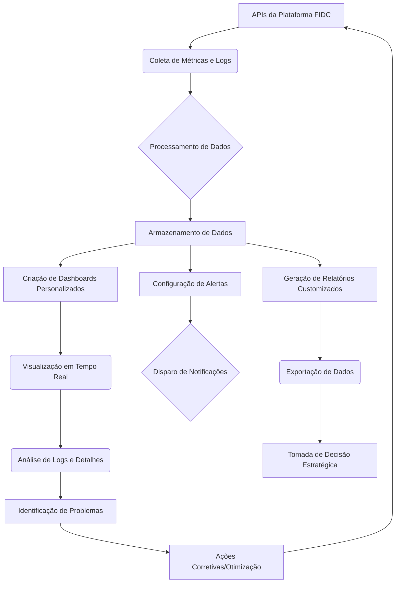

# Documentação da Funcionalidade: APIs| Análise e Relatórios de APIs

**Autor:** Rodrigo Marques
**Total de Palavras:** 3560

## 1. O que faz?

A funcionalidade de **Análise e Relatórios de APIs** da Plataforma FIDC oferece um conjunto robusto de ferramentas para monitorar, analisar e gerar relatórios detalhados sobre o desempenho e o uso das APIs. Ela atua como um centro de inteligência operacional, coletando métricas em tempo real, processando logs de requisições e respostas, e transformando esses dados brutos em insights acionáveis. O sistema é projetado para capturar informações cruciais como latência, taxa de erros, volume de requisições, consumo de recursos e padrões de uso por parte dos consumidores das APIs. Além disso, permite a configuração de alertas personalizados baseados em limiares predefinidos, garantindo que qualquer anomalia ou degradação de serviço seja prontamente identificada e comunicada às equipes responsáveis. A plataforma também facilita a criação de dashboards interativos e relatórios customizáveis, que podem ser exportados em diversos formatos, proporcionando uma visão 360 graus sobre a saúde e a performance das APIs da FIDC. Este módulo é fundamental para a governança de APIs, otimização de performance e tomada de decisões estratégicas baseadas em dados concretos.


## 2. Para que serve?

Esta funcionalidade serve para garantir a **observabilidade** e a **confiabilidade** das APIs da Plataforma FIDC. Ela resolve problemas críticos como a identificação tardia de falhas de serviço, gargalos de desempenho, uso ineficiente de recursos e a falta de visibilidade sobre o comportamento dos consumidores das APIs. Ao fornecer dados em tempo real e históricos, a ferramenta permite que as equipes de desenvolvimento, operações e negócios: 

*   **Monitorem proativamente** a saúde das APIs, detectando e corrigindo problemas antes que afetem os usuários finais.
*   **Otimizem a performance** das APIs, identificando pontos de lentidão e áreas para melhoria.
*   **Compreendam o padrão de uso** das APIs, auxiliando no planejamento de capacidade e na evolução do produto.
*   **Assegurem a conformidade** com SLAs (Service Level Agreements) e políticas de uso.
*   **Tomem decisões estratégicas** baseadas em dados concretos sobre o ciclo de vida e a monetização das APIs.
*   **Melhorem a experiência do desenvolvedor** que consome as APIs, fornecendo transparência e métricas de uso.

Em suma, ela é essencial para manter a estabilidade do ecossistema de APIs, impulsionar a inovação e garantir a satisfação dos parceiros e clientes que dependem dos serviços da FIDC.


## 3. Quem usa?

A funcionalidade de Análise e Relatórios de APIs é utilizada por diversas personas dentro e fora da organização FIDC, cada uma com necessidades e perspectivas distintas:

*   **Equipe de Desenvolvimento (Devs):** Utilizam para depurar APIs, entender o comportamento em produção, otimizar código e garantir que as APIs atendam aos requisitos de performance e funcionalidade. Eles se beneficiam da visibilidade sobre erros e latência para iterar e melhorar o produto.
*   **Equipe de Operações (Ops/SREs):** São os principais usuários para monitoramento da saúde do sistema, detecção de anomalias, gerenciamento de incidentes e garantia de SLAs. Eles dependem dos alertas e dashboards para manter a estabilidade e disponibilidade das APIs.
*   **Gerentes de Produto/APIs:** Usam os relatórios para entender o engajamento com as APIs, identificar funcionalidades mais utilizadas, planejar o roadmap do produto e tomar decisões sobre a evolução das ofertas de API da FIDC.
*   **Analistas de Negócios:** Podem utilizar os dados para avaliar o impacto das APIs nos resultados de negócio, identificar oportunidades de monetização ou otimização de processos que dependem das integrações.
*   **Parceiros e Clientes (Consumidores de API):** Em alguns cenários, podem ter acesso a dashboards limitados para monitorar o uso de suas próprias chaves de API, consumo de cotas e performance das requisições que realizam, promovendo transparência e autogestão.

Cada grupo extrai valor diferente dos dados e relatórios, mas todos convergem na necessidade de uma visão clara e acionável sobre o ecossistema de APIs.


## 4. Principais benefícios

A funcionalidade de Análise e Relatórios de APIs da Plataforma FIDC oferece uma série de benefícios tangíveis e intangíveis que impactam positivamente a operação e o negócio como um todo. Entre os principais, destacam-se:

*   **Melhora na Qualidade do Serviço (QoS):** Através do monitoramento contínuo e da detecção proativa de problemas, a plataforma garante que as APIs operem com alta disponibilidade e performance, minimizando interrupções e falhas que poderiam afetar os serviços dependentes.
*   **Redução do Tempo de Resolução de Incidentes (MTTR):** Com alertas configuráveis e dashboards em tempo real, as equipes de operações podem identificar rapidamente a causa raiz de problemas, agilizando a resolução e reduzindo o impacto nos usuários e sistemas integrados.
*   **Otimização de Custos e Recursos:** A análise detalhada do uso das APIs permite identificar gargalos e ineficiências, possibilitando o ajuste de recursos de infraestrutura e a otimização do código das APIs, resultando em economia operacional.
*   **Tomada de Decisão Orientada a Dados:** Gerentes de produto e analistas de negócio têm acesso a informações precisas sobre o consumo e o comportamento das APIs, o que subsidia decisões estratégicas sobre o desenvolvimento de novas funcionalidades, precificação e expansão de mercado.
*   **Aumento da Satisfação do Cliente e Parceiro:** APIs estáveis, performáticas e bem documentadas resultam em uma melhor experiência para desenvolvedores e sistemas que as consomem, fortalecendo o relacionamento com parceiros e clientes.
*   **Governança e Conformidade Aprimoradas:** A capacidade de gerar relatórios de auditoria e monitorar o cumprimento de SLAs e políticas de uso ajuda a FIDC a manter a governança de suas APIs e a atender a requisitos regulatórios.
*   **Inovação Acelerada:** Ao liberar as equipes de tarefas reativas de depuração, a funcionalidade permite que elas se concentrem mais no desenvolvimento de novas funcionalidades e na inovação, impulsionando o crescimento da plataforma.

Esses benefícios combinados contribuem para uma operação de APIs mais eficiente, segura e estratégica, posicionando a Plataforma FIDC como um player robusto e confiável no mercado.


## 5. Como é utilizada?

A utilização da funcionalidade de Análise e Relatórios de APIs envolve um fluxo contínuo de monitoramento, análise e resposta, que pode ser dividido em etapas principais:

### 5.1. Configuração Inicial

1.  **Integração de APIs:** As APIs da Plataforma FIDC são automaticamente integradas ao módulo de análise. Para APIs externas ou personalizadas, pode ser necessário configurar *endpoints* e credenciais de acesso.
2.  **Definição de Métricas e Logs:** O sistema começa a coletar métricas de desempenho (latência, erros, throughput) e logs de requisições/respostas para todas as APIs monitoradas. O usuário pode especificar quais dados são mais relevantes para cada API.
3.  **Criação de Dashboards:** Usuários com permissões adequadas podem criar e personalizar dashboards, arrastando e soltando widgets que exibem métricas chave, gráficos de tendência, tabelas de logs e outros elementos visuais. Cada dashboard pode ser focado em uma API específica, um grupo de APIs ou um aspecto do desempenho geral.
4.  **Configuração de Alertas:** São definidos limiares para métricas críticas (ex: latência > 500ms, taxa de erro > 5%). Quando esses limiares são excedidos, o sistema dispara alertas via e-mail, Slack, PagerDuty ou outros canais configurados, com detalhes sobre a anomalia.

### 5.2. Monitoramento e Análise em Tempo Real

1.  **Visualização de Dashboards:** As equipes de Ops e Devs acessam os dashboards em tempo real para ter uma visão instantânea da saúde das APIs. Gráficos de linha mostram tendências de latência e throughput, enquanto medidores indicam a taxa de erros atual.
2.  **Exploração de Logs:** Em caso de anomalias, os usuários podem mergulhar nos logs de requisições para identificar padrões de erro, investigar payloads e cabeçalhos, e rastrear o fluxo de uma requisição específica através de múltiplos serviços.
3.  **Filtros e Buscas:** Ferramentas de busca avançada permitem filtrar logs por API, *endpoint*, código de status HTTP, ID de transação, data/hora e outros atributos, facilitando a localização de informações relevantes.

### 5.3. Geração de Relatórios e Insights

1.  **Relatórios Customizados:** Gerentes de Produto e Analistas de Negócios podem gerar relatórios sob demanda ou agendados. Esses relatórios podem incluir resumos de desempenho, tendências de uso, análise de consumo por cliente/parceiro e conformidade com SLAs.
2.  **Exportação de Dados:** Os relatórios e dados brutos podem ser exportados em formatos como CSV, PDF ou JSON para análise externa ou integração com outras ferramentas de BI.
3.  **Análise Preditiva (Opcional):** Em versões avançadas, a funcionalidade pode incluir módulos de análise preditiva que utilizam machine learning para prever futuras degradações de desempenho ou picos de tráfego, permitindo ações proativas.

### 5.4. Ciclo de Feedback e Melhoria

Os insights obtidos através da análise e dos relatórios são utilizados para informar o ciclo de desenvolvimento de APIs, levando a melhorias contínuas na performance, segurança e funcionalidade dos serviços da FIDC.

**Diagrama de Fluxo de Uso (Exemplo Conceitual):**



**Tabela de Especificação de Métricas (Exemplo):**

| Métrica           | Descrição                                                               | Unidade      | Limiar de Alerta (Exemplo) |
| :---------------- | :---------------------------------------------------------------------- | :----------- | :------------------------- |
| Latência Média    | Tempo médio para uma requisição ser processada e respondida.            | ms           | > 500 ms                   |
| Taxa de Erros     | Percentual de requisições que resultaram em erro (HTTP 4xx/5xx).        | %            | > 5%                       |
| Throughput        | Número de requisições processadas por segundo.                          | req/s        | < 100 req/s                |
| Uso de CPU        | Consumo de CPU pelos serviços de API.                                   | %            | > 80%                      |
| Uso de Memória    | Consumo de memória pelos serviços de API.                               | MB / %       | > 90%                      |
| Requisições Únicas | Número de usuários ou aplicações distintas que acessaram a API.         | Contagem     | N/A                        |
| Volume de Dados   | Quantidade de dados trafegados (entrada e saída) pela API.              | MB / GB      | N/A                        |


## 6. Quais os diferenciais

A funcionalidade de Análise e Relatórios de APIs da Plataforma FIDC se destaca no mercado por uma combinação de fatores que vão além do monitoramento básico, oferecendo uma solução integrada e inteligente para a gestão do ciclo de vida das APIs.

*   **Integração Nativa com a Plataforma FIDC:** Diferente de soluções de terceiros que exigem complexas configurações de agentes e conectores, nosso módulo é nativamente integrado ao ecossistema FIDC. Isso garante uma coleta de dados mais rica e contextualizada, sem sobrecarga de performance e com configuração zero para as APIs da casa.
*   **Correlação de Dados de Negócio e Operacionais:** A plataforma correlaciona métricas de desempenho (como latência e erros) com dados de negócio (como tipo de cliente, plano de assinatura e valor da transação). Isso permite uma análise muito mais profunda, por exemplo, identificando se erros de API afetam desproporcionalmente clientes de alto valor.
*   **Análise de Causa Raiz Assistida por IA:** Utilizamos algoritmos de machine learning para analisar padrões em logs e métricas, sugerindo automaticamente as causas prováveis de anomalias. Isso reduz drasticamente o tempo de investigação (MTTI) e a dependência de especialistas para diagnosticar problemas complexos.
*   **Dashboards Contextuais e Personalizáveis:** Enquanto outras ferramentas oferecem dashboards genéricos, a nossa permite a criação de painéis altamente personalizados e contextuais para cada persona (Dev, Ops, Produto). Um gerente de produto pode ter uma visão focada em adoção e uso, enquanto um SRE foca em disponibilidade e performance.
*   **Geração de Relatórios para Não-Técnicos:** A capacidade de gerar relatórios executivos, com linguagem clara e visualizações intuitivas, traduz dados técnicos complexos em insights de negócio. Isso facilita a comunicação entre as equipes técnicas e de liderança, alinhando a performance das APIs aos objetivos estratégicos da empresa.
*   **Modelo de Alerta Preditivo:** Em vez de apenas reagir a problemas, nosso sistema pode prever futuras degradações de serviço com base em tendências históricas e anomalias sutis. Isso permite que as equipes atuem proativamente para evitar incidentes antes que eles ocorram.
*   **Segurança e Conformidade Integradas:** A análise não se limita à performance. O módulo também monitora padrões de acesso suspeitos, tentativas de abuso e violações de políticas de segurança, integrando a observabilidade com a postura de segurança das APIs.

Esses diferenciais transformam a funcionalidade de uma simples ferramenta de monitoramento em uma plataforma estratégica de **API Intelligence**, essencial para a operação e o crescimento de negócios digitais modernos.


## 7. Como montar essa funcionalidade em uma plataforma?

A implementação da funcionalidade de Análise e Relatórios de APIs em uma plataforma como a FIDC requer uma arquitetura robusta e escalável, capaz de lidar com grandes volumes de dados em tempo real. A seguir, uma visão de alto nível dos componentes e considerações técnicas:

### 7.1. Arquitetura de Alto Nível

```mermaid
graph TD
    A[APIs da Plataforma FIDC] --> B(Gateway de API)
    B --> C{Coletor de Métricas/Logs}
    C --> D[Fila de Mensagens (e.g., Kafka)]
    D --> E[Processador de Dados em Tempo Real (e.g., Flink/Spark Streaming)]
    E --> F[Banco de Dados de Séries Temporais (e.g., InfluxDB/Prometheus)]
    E --> G[Banco de Dados de Logs (e.g., Elasticsearch)]
    F --> H(Serviço de Análise e Agregação)
    G --> H
    H --> I[API de Consulta de Dados]
    I --> J(Serviço de Dashboards/Relatórios)
    J --> K[Interface de Usuário (Front-end)]
    E --> L[Módulo de Alerta (e.g., Alertmanager)]
    L --> M(Canais de Notificação: E-mail, Slack, PagerDuty)
```

### 7.2. Componentes Chave e Tecnologias Sugeridas

1.  **Gateway de API:** Atua como ponto de entrada para todas as APIs, sendo o local ideal para interceptar requisições e respostas. É responsável por coletar métricas básicas (tempo de resposta, status HTTP, tamanho do payload) e logs de acesso. 
    *   **Tecnologias:** Kong, Apigee, AWS API Gateway, NGINX.

2.  **Coletor de Métricas/Logs:** Agentes leves ou módulos integrados ao Gateway de API que extraem informações detalhadas de cada transação. Podem ser configurados para coletar dados específicos do negócio contidos nos payloads.
    *   **Tecnologias:** Fluentd, Logstash, Prometheus Exporters, OpenTelemetry.

3.  **Fila de Mensagens (Message Queue):** Um sistema de mensagens distribuído que desacopla a coleta de dados do processamento. Garante a durabilidade dos dados e permite que os processadores consumam as informações de forma assíncrona e escalável.
    *   **Tecnologias:** Apache Kafka, RabbitMQ, AWS Kinesis.

4.  **Processador de Dados em Tempo Real:** Motores de processamento de stream que consomem dados da fila de mensagens, realizam transformações, agregações, enriquecimento de dados e detecção de anomalias em tempo real.
    *   **Tecnologias:** Apache Flink, Apache Spark Streaming, Kafka Streams.

5.  **Bancos de Dados:**
    *   **Séries Temporais:** Otimizados para armazenar e consultar grandes volumes de dados indexados por tempo, ideais para métricas de desempenho.
        *   **Tecnologias:** InfluxDB, Prometheus, TimescaleDB.
    *   **Logs:** Otimizados para armazenamento e busca de logs textuais e estruturados.
        *   **Tecnologias:** Elasticsearch, Loki.

6.  **Serviço de Análise e Agregação:** Uma camada de serviço que consulta os bancos de dados, realiza agregações complexas e prepara os dados para consumo pela interface de usuário e pelo módulo de alertas.
    *   **Tecnologias:** Microsserviços em Python/Java/Go, GraphQL API.

7.  **Módulo de Alerta:** Componente responsável por avaliar as métricas e logs contra os limiares configurados e disparar notificações quando as condições de alerta são atendidas.
    *   **Tecnologias:** Prometheus Alertmanager, Grafana Alerting, custom services.

8.  **Interface de Usuário (Front-end):** Aplicação web que oferece dashboards interativos, ferramentas de busca de logs, configuração de alertas e geração de relatórios. Deve ser intuitiva e responsiva.
    *   **Tecnologias:** React, Angular, Vue.js, Grafana (para visualização).

### 7.3. Considerações de Arquitetura

*   **Escalabilidade:** Todos os componentes devem ser projetados para escalar horizontalmente para lidar com o crescimento do volume de requisições e dados.
*   **Resiliência:** A arquitetura deve ser tolerante a falhas, com redundância em todos os pontos críticos.
*   **Segurança:** Implementar autenticação, autorização e criptografia em todas as camadas, garantindo que apenas usuários autorizados acessem dados sensíveis.
*   **Observabilidade:** A própria plataforma de monitoramento deve ser monitorada para garantir sua saúde e desempenho.
*   **Custo:** Avaliar o custo-benefício das tecnologias, considerando soluções open-source versus serviços gerenciados em nuvem.

Esta estrutura permite construir uma solução de análise e relatórios de APIs altamente eficaz, que pode ser adaptada e expandida conforme as necessidades da Plataforma FIDC evoluem.


## 8. Prompt para criar telas de Front End no Lovable

**Prompt para Lovable: Telas de Análise e Relatórios de APIs da Plataforma FIDC**

**Objetivo:** Gerar um conjunto de telas de front-end para a funcionalidade de "Análise e Relatórios de APIs" da Plataforma FIDC, focando em usabilidade, clareza e apresentação eficaz de dados complexos. As telas devem ser intuitivas para desenvolvedores, equipes de operações e gerentes de produto.

**Elementos Visuais e Estilo:**
*   **Paleta de Cores:** Utilizar a paleta de cores da Plataforma FIDC (tons de azul, cinza e branco, com acentos em verde para sucesso e vermelho para erro). Priorizar um design limpo e moderno.
*   **Tipografia:** Fontes sans-serif (e.g., Roboto, Open Sans) para legibilidade em dados e textos informativos.
*   **Ícones:** Utilizar ícones vetoriais para representar métricas, alertas, filtros e ações (e.g., download, editar, configurar).
*   **Responsividade:** O design deve ser responsivo, adaptando-se bem a desktops, tablets e, em menor grau, a dispositivos móveis (para visualização rápida).

**Telas a Serem Geradas:**

### 8.1. Tela Principal: Dashboard de Visão Geral das APIs

*   **Layout:** Layout de dashboard com múltiplos widgets redimensionáveis e arrastáveis.
*   **Elementos:**
    *   **Cabeçalho:** Título "Dashboard de APIs", seletor de período (última hora, 24h, 7 dias, 30 dias, customizado), botão "Atualizar".
    *   **Barra Lateral Esquerda:** Navegação principal (Dashboard, APIs, Relatórios, Alertas, Configurações).
    *   **Widgets Principais (Exemplos):**
        *   **Gráfico de Linha:** "Latência Média Global" (ms) ao longo do tempo.
        *   **Gráfico de Linha:** "Taxa de Erros Global" (%) ao longo do tempo.
        *   **Gráfico de Barras:** "Top 5 APIs por Volume de Requisições".
        *   **Gráfico de Pizza/Donut:** "Distribuição de Códigos de Status HTTP" (2xx, 4xx, 5xx).
        *   **Cartões de Métrica:** "Requisições Totais", "APIs Ativas", "Alertas Ativos".
        *   **Tabela:** "APIs com Problemas Ativos" (Nome da API, Métrica Afetada, Valor Atual, Limiar, Último Alerta).
*   **Interatividade:** Clicar em uma API na tabela ou gráfico deve levar à "Tela de Detalhes da API". Clicar em um alerta deve levar à "Tela de Gerenciamento de Alertas".

### 8.2. Tela de Detalhes da API (Exemplo: API `ConsultaFIDC`)

*   **Layout:** Layout de página única com abas para diferentes seções de detalhes.
*   **Elementos:**
    *   **Cabeçalho:** Nome da API (`ConsultaFIDC`), status (Ativa/Inativa), botão "Configurações da API".
    *   **Abas:** "Visão Geral", "Métricas", "Logs", "Alertas", "Uso".
    *   **Aba "Visão Geral":**
        *   **Gráficos de Linha:** Latência, Taxa de Erros, Throughput específicos para esta API.
        *   **Cartões de Métrica:** Latência Média, Taxa de Erros, Requisições Totais, Tempo de Atividade (Uptime).
        *   **Informações Básicas:** Descrição da API, Versão, Endpoints.
    *   **Aba "Métricas":**
        *   Tabela configurável de todas as métricas disponíveis para a API, com opções de visualização (gráfico de linha, barras, etc.) e filtros por período.
    *   **Aba "Logs":**
        *   Tabela paginada de logs de requisições e respostas. Colunas: Timestamp, Método, Path, Status HTTP, Latência, IP Origem, ID da Transação.
        *   **Campo de Busca:** Para filtrar logs por texto livre ou campos específicos.
        *   **Filtros Avançados:** Por Status HTTP, Latência (range), IP Origem, etc.
        *   **Detalhes do Log:** Clicar em um log deve abrir um modal com detalhes completos da requisição e resposta (headers, payload).

### 8.3. Tela de Gerenciamento de Alertas

*   **Layout:** Tabela principal com lista de alertas, e um formulário para criação/edição.
*   **Elementos:**
    *   **Cabeçalho:** Título "Gerenciamento de Alertas", botão "Novo Alerta".
    *   **Tabela de Alertas:** Colunas: Nome do Alerta, API Afetada, Métrica, Condição (e.g., Latência > 500ms), Status (Ativo/Inativo), Canais de Notificação, Ações (Editar, Desativar, Excluir).
    *   **Formulário "Novo Alerta" (Modal ou Página Separada):**
        *   **Campos:** Nome do Alerta, Descrição, API (dropdown com busca), Métrica (dropdown), Condição (operador e valor), Período de Avaliação, Canais de Notificação (checkboxes: E-mail, Slack, PagerDuty, Webhook), Mensagem Personalizada.
        *   **Botões:** "Salvar", "Cancelar".

### 8.4. Tela de Relatórios Customizados

*   **Layout:** Seção para criar novos relatórios e lista de relatórios gerados/agendados.
*   **Elementos:**
    *   **Cabeçalho:** Título "Relatórios Customizados", botão "Novo Relatório".
    *   **Formulário "Novo Relatório" (Modal ou Página Separada):**
        *   **Campos:** Nome do Relatório, Descrição, APIs Incluídas (multiselect com busca), Métricas a Incluir (multiselect), Período do Relatório, Formato de Exportação (dropdown: PDF, CSV, JSON), Agendamento (diário, semanal, mensal, único), Destinatários (e-mails).
        *   **Botões:** "Gerar Agora", "Agendar", "Cancelar".
    *   **Tabela de Relatórios:** Colunas: Nome do Relatório, Status (Gerado, Pendente, Erro), Data de Geração/Agendamento, Período, Formato, Ações (Visualizar, Download, Excluir).

**Fluxo de Usuário Principal:**
1.  Usuário acessa o Dashboard para uma visão geral.
2.  Identifica uma API com alta latência ou erros.
3.  Clica na API para ir para a Tela de Detalhes da API.
4.  Na aba "Logs", filtra por erros para investigar a causa raiz.
5.  Se necessário, vai para a Tela de Gerenciamento de Alertas para ajustar ou criar um novo alerta.
6.  Para análises de longo prazo ou executivas, cria um Relatório Customizado.

**Considerações Adicionais:**
*   **Estados de Carregamento:** Indicadores visuais de carregamento para gráficos e tabelas.
*   **Estados Vazios:** Mensagens amigáveis para quando não houver dados ou alertas configurados.
*   **Mensagens de Sucesso/Erro:** Notificações claras para ações como "Alerta salvo com sucesso" ou "Erro ao carregar dados".
*   **Acessibilidade:** Garantir que as telas sejam acessíveis (contraste de cores, navegação por teclado).

Este prompt deve fornecer ao Lovable informações suficientes para gerar um conjunto inicial de telas funcionais e esteticamente alinhadas com a Plataforma FIDC.
