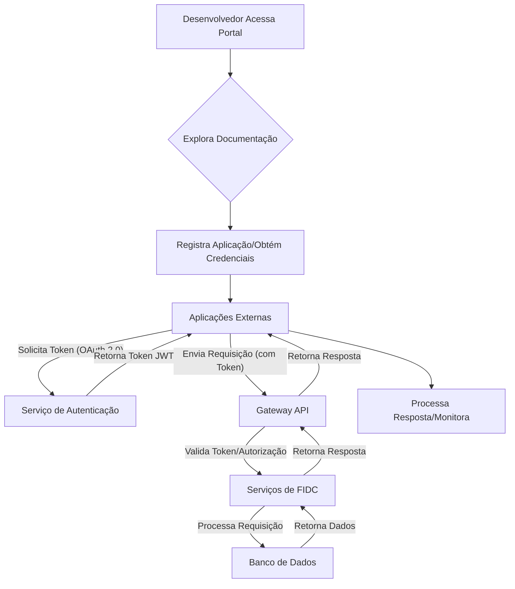

# Documentação da Funcionalidade: APIs | Integração e Conectividade de APIs

**Autor:** Rodrigo Marques
**Total de Palavras:** 2636

## 1. O que faz?

A funcionalidade de **Integração e Conectividade de APIs** na Plataforma FIDC atua como o *hub* central para a exposição e consumo de serviços e dados relacionados a Fundos de Investimento em Direitos Creditórios (FIDCs). Ela permite que sistemas externos (parceiros, clientes, outros módulos da plataforma) interajam de forma programática e segura com as capacidades do FIDC, orquestrando operações como a consulta de cotas, a submissão de propostas de cessão de créditos, o acompanhamento de carteiras e a gestão de recebíveis. Essencialmente, esta funcionalidade transforma as operações complexas de um FIDC em um conjunto de *endpoints* RESTful bem definidos, facilitando a automação e a interoperabilidade. Ela gerencia autenticação (OAuth 2.0, JWT), autorização (baseada em escopos e papéis), versionamento de APIs, *rate limiting* e *logging* detalhado de todas as interações, garantindo a segurança, escalabilidade e rastreabilidade das transações. Além disso, a plataforma oferece um *Gateway API* robusto que atua como um ponto de entrada unificado, protegendo os serviços de *backend* e fornecendo funcionalidades como transformação de dados, roteamento e balanceamento de carga. O objetivo é abstrair a complexidade interna do FIDC, expondo apenas as interfaces necessárias para a integração eficiente com o ecossistema financeiro.

*Diagrama 1.1: Arquitetura de Integração de APIs da Plataforma FIDC (Exemplo)*

```mermaid
graph TD
    A[Sistemas Externos] --> B(Gateway API)
    B --> C{Autenticação/Autorização}
    C --> D[Serviços de FIDC (Microserviços)]
    D --> E[Banco de Dados/Sistemas Legados]
    B --> F[Monitoramento/Logging]
    C --> G[Cache/Rate Limiting]
```

## 2. Para que serve?

Esta funcionalidade serve para **democratizar o acesso e a manipulação de dados e operações de FIDCs**, permitindo que diversas partes interessadas se conectem e automatizem processos de forma eficiente. Ela resolve o problema da **fragmentação de sistemas** e da **necessidade de intervenção manual** em operações repetitivas. Para os parceiros, como originadores de crédito ou securitizadoras, as APIs permitem a submissão automatizada de lotes de recebíveis e a consulta em tempo real do status de suas operações. Para os investidores, possibilita a integração de seus sistemas de gestão de portfólio para monitorar o desempenho de suas cotas. Internamente, facilita a comunicação entre diferentes módulos da própria plataforma e com sistemas legados, garantindo a consistência dos dados e a agilidade nas transações. Em suma, a funcionalidade de APIs visa **reduzir custos operacionais, acelerar o tempo de resposta, minimizar erros humanos e fomentar a inovação** ao abrir a plataforma para um ecossistema de parceiros e desenvolvedores.

## 3. Quem usa?

A funcionalidade de APIs é utilizada por uma gama diversificada de usuários e sistemas, cada um com papéis e necessidades específicas:

*   **Desenvolvedores de Sistemas Parceiros:** Equipes de TI de empresas que desejam integrar seus sistemas (ERPs, CRMs, plataformas de crédito) com a Plataforma FIDC para automatizar o envio e recebimento de informações. Eles consomem as APIs para construir novas aplicações ou estender as funcionalidades existentes.
*   **Analistas de Dados e Cientistas de Dados:** Utilizam as APIs para extrair grandes volumes de dados sobre carteiras de crédito, desempenho de FIDCs e comportamento de mercado, a fim de realizar análises preditivas, *reporting* e *business intelligence*.
*   **Gerentes de Produto e Negócios:** Embora não interajam diretamente com o código, eles definem os requisitos para as APIs, visando expandir o alcance da plataforma e criar novas oportunidades de negócio através de integrações estratégicas.
*   **Administradores de Sistemas:** Responsáveis por monitorar o desempenho das APIs, gerenciar chaves de acesso, configurar permissões e garantir a segurança e a disponibilidade dos serviços.
*   **Auditores e Reguladores:** Podem utilizar APIs específicas para acessar dados de conformidade e relatórios regulatórios, garantindo a transparência e aderência às normas do setor financeiro.

## 4. Principais benefícios

Os benefícios da funcionalidade de Integração e Conectividade de APIs são múltiplos e impactam diversas esferas da operação de um FIDC:

*   **Automação de Processos:** Elimina tarefas manuais repetitivas, como a entrada de dados e a conciliação, resultando em maior eficiência operacional e redução de erros.
*   **Redução de Custos:** Diminui a necessidade de mão de obra para operações rotineiras e otimiza o uso de recursos, impactando positivamente o custo total de propriedade (TCO).
*   **Agilidade e Velocidade:** Permite transações em tempo real e acesso instantâneo a informações críticas, acelerando a tomada de decisões e a execução de operações financeiras.
*   **Escalabilidade:** Facilita a expansão das operações do FIDC, suportando um volume crescente de transações e integrações sem comprometer a performance.
*   **Inovação e Flexibilidade:** Abre a plataforma para o desenvolvimento de novas soluções e serviços por parte de parceiros e desenvolvedores, fomentando um ecossistema de inovação.
*   **Segurança Aprimorada:** Implementa padrões de segurança robustos (OAuth 2.0, criptografia, *rate limiting*) para proteger dados sensíveis e garantir a integridade das transações.
*   **Melhora na Experiência do Cliente/Parceiro:** Oferece uma forma moderna e eficiente de interagir com a plataforma, resultando em maior satisfação e fidelidade.
*   **Consistência de Dados:** Garante que os dados sejam atualizados e consistentes em todos os sistemas integrados, evitando discrepâncias e retrabalho.

## 5. Como é utilizada?

O uso da funcionalidade de APIs segue um fluxo bem definido, desde a descoberta até a operação contínua:

1.  **Descoberta e Documentação:** Desenvolvedores acessam um portal de desenvolvedores (*Developer Portal*) que oferece documentação interativa (Swagger/OpenAPI), exemplos de código, SDKs e tutoriais. Eles exploram os *endpoints* disponíveis e seus modelos de dados.
2.  **Registro e Credenciais:** Parceiros se registram na plataforma para obter chaves de API (Client ID, Client Secret) e configurar os escopos de acesso necessários para suas aplicações. Este processo pode envolver aprovação manual ou automatizada.
3.  **Autenticação e Autorização:** As aplicações externas utilizam as credenciais para obter um *token* de acesso (JWT) através do fluxo OAuth 2.0. Este *token* é então incluído em todas as requisições subsequentes para autenticar e autorizar o acesso aos recursos.
4.  **Consumo das APIs:** Com o *token* em mãos, as aplicações realizam chamadas HTTP (GET, POST, PUT, DELETE) para os *endpoints* da API, enviando e recebendo dados em formato JSON. Por exemplo, um originador pode enviar um POST para `/api/v1/creditos/cessao` com os detalhes dos recebíveis.
5.  **Tratamento de Respostas:** As aplicações processam as respostas das APIs, que incluem o status da operação (sucesso, erro), dados solicitados ou mensagens de validação. Códigos de status HTTP padrão (200 OK, 201 Created, 400 Bad Request, 401 Unauthorized, 500 Internal Server Error) são utilizados.
6.  **Monitoramento e Suporte:** Desenvolvedores e administradores monitoram o uso das APIs através de *dashboards* no portal, acompanhando métricas de desempenho, erros e consumo. Canais de suporte são disponibilizados para resolução de dúvidas e problemas.

*Fluxograma 5.1: Fluxo de Consumo de API na Plataforma FIDC*



## 6. Quais os diferenciais

A funcionalidade de APIs da Plataforma FIDC se destaca por diversos aspectos que a tornam superior ou única no mercado:

*   **Foco no Ecossistema FIDC:** Diferente de soluções genéricas de API Management, esta plataforma é construída especificamente para as complexidades e nuances dos FIDCs, oferecendo *endpoints* e modelos de dados otimizados para cessão de créditos, gestão de cotas e acompanhamento de recebíveis.
*   **Segurança *by Design*:** Implementa um modelo de segurança robusto desde a concepção, com autenticação multifator para acesso ao portal, granularidade de permissões por escopo e recurso, e auditoria completa de todas as chamadas de API, superando padrões de mercado.
*   **Performance Otimizada:** Utiliza tecnologias de *caching* distribuído e balanceamento de carga inteligente para garantir baixa latência e alta vazão, mesmo sob picos de demanda, crucial para operações financeiras sensíveis ao tempo.
*   **Documentação Interativa e Completa:** Oferece um *Developer Portal* de última geração com documentação OpenAPI/Swagger que permite testar os *endpoints* diretamente no navegador, além de exemplos de código em múltiplas linguagens e SDKs para acelerar a integração.
*   **Monitoramento Proativo e Alertas:** Inclui *dashboards* de monitoramento em tempo real com alertas configuráveis para anomalias, erros ou uso excessivo, permitindo uma resposta rápida a incidentes e garantindo a estabilidade do serviço.
*   **Versionamento Sem Emendas:** Adota uma estratégia de versionamento de APIs que minimiza o impacto em integrações existentes, permitindo a evolução da plataforma sem quebrar compatibilidade, um desafio comum em sistemas legados.
*   **Suporte Especializado:** Oferece suporte técnico especializado em FIDCs, com equipes que entendem tanto a tecnologia quanto o domínio de negócio, facilitando a resolução de problemas complexos de integração.

## 7. Como montar essa funcionalidade em uma plataforma?

A implementação da funcionalidade de Integração e Conectividade de APIs em uma plataforma FIDC envolve diversas camadas tecnológicas e considerações arquiteturais:

1.  **Gateway API:** Essencial para atuar como um ponto de entrada unificado. Tecnologias como **Kong Gateway**, **Apigee** (Google Cloud) ou **AWS API Gateway** podem ser utilizadas. Ele será responsável por autenticação, autorização, *rate limiting*, *caching*, roteamento e transformação de requisições.
2.  **Microserviços de Backend:** A lógica de negócio do FIDC deve ser modularizada em microserviços (e.g., Serviço de Cessão de Créditos, Serviço de Gestão de Cotas, Serviço de Recebíveis). Estes podem ser desenvolvidos em linguagens como **Java (Spring Boot)**, **Python (FastAPI/Django REST Framework)** ou **Node.js (Express)**, utilizando arquitetura RESTful.
3.  **Banco de Dados:** Utilização de bancos de dados relacionais (e.g., **PostgreSQL**, **MySQL**) para dados transacionais e não relacionais (e.g., **MongoDB**, **Cassandra**) para dados de log e auditoria, dependendo da necessidade de escalabilidade e tipo de dado.
4.  **Serviço de Autenticação e Autorização (IAM):** Implementação de um Identity and Access Management (IAM) robusto, possivelmente utilizando **Keycloak**, **Auth0** ou serviços de nuvem como **AWS Cognito** ou **Azure AD B2C**, para gerenciar usuários, clientes de API e *tokens* OAuth 2.0/JWT.
5.  **Fila de Mensagens/Eventos:** Para garantir a resiliência e a comunicação assíncrona entre microserviços, filas de mensagens como **Apache Kafka** ou **RabbitMQ** são cruciais. Isso permite que operações complexas sejam processadas em segundo plano e desacopla os serviços.
6.  **Monitoramento e Logging:** Ferramentas como **Prometheus** e **Grafana** para métricas, e **ELK Stack (Elasticsearch, Logstash, Kibana)** ou **Splunk** para agregação e análise de logs, são fundamentais para a observabilidade da plataforma.
7.  **Infraestrutura de Nuvem:** A plataforma pode ser hospedada em provedores de nuvem como **AWS**, **Google Cloud Platform (GCP)** ou **Microsoft Azure**, utilizando serviços de contêineres (e.g., **Kubernetes**, **Docker**), funções *serverless* (e.g., AWS Lambda) e bancos de dados gerenciados.
8.  **CI/CD:** Implementação de um pipeline de Integração Contínua e Entrega Contínua (CI/CD) com ferramentas como **Jenkins**, **GitLab CI/CD** ou **GitHub Actions** para automatizar o build, teste e deploy das APIs e microserviços.

*Tabela 7.1: Tecnologias Sugeridas para Implementação da Funcionalidade de APIs*

| Componente           | Tecnologia Sugerida                               | Propósito                                                              |
| :------------------- | :------------------------------------------------ | :--------------------------------------------------------------------- |
| Gateway API          | Kong Gateway, Apigee, AWS API Gateway             | Ponto de entrada unificado, segurança, roteamento                      |
| Backend (Microserviços) | Java (Spring Boot), Python (FastAPI), Node.js (Express) | Lógica de negócio, exposição de *endpoints* RESTful                   |
| Banco de Dados       | PostgreSQL, MySQL, MongoDB, Cassandra             | Armazenamento de dados transacionais e de log                          |
| IAM                  | Keycloak, Auth0, AWS Cognito                      | Autenticação, autorização, gestão de *tokens*                          |
| Fila de Mensagens    | Apache Kafka, RabbitMQ                            | Comunicação assíncrona, resiliência                                    |
| Monitoramento/Logging | Prometheus, Grafana, ELK Stack, Splunk            | Observabilidade, métricas, análise de logs                             |
| Infraestrutura       | AWS, GCP, Azure (Kubernetes, Docker, Serverless)  | Hospedagem escalável e gerenciada                                      |
| CI/CD                | Jenkins, GitLab CI/CD, GitHub Actions             | Automação de build, teste e deploy                                     |

## 8. Prompt para criar telas de Front End no Lovable

```
Crie um design de interface de usuário (UI) para um 'Portal do Desenvolvedor' da Plataforma FIDC, focado na funcionalidade de 'Integração e Conectividade de APIs'. O portal deve ser moderno, intuitivo e responsivo, seguindo as melhores práticas de design para desenvolvedores. Inclua as seguintes seções e elementos:

**1. Página Inicial (Dashboard do Desenvolvedor):**
   - **Cabeçalho:** Logo da Plataforma FIDC, menu de navegação (APIs, Documentação, Minhas Aplicações, Suporte, Perfil).
   - **Seção de Boas-Vindas:** Mensagem personalizada, links rápidos para 'Começar', 'Ver Documentação', 'Criar Nova Aplicação'.
   - **Métricas de Uso de API:** Gráficos simples mostrando o consumo de APIs (requisições por dia/mês), erros recentes, latência média. (Ex: Gráfico de linhas para requisições, gráfico de pizza para status de erro).
   - **Notificações/Alertas:** Feed de mensagens importantes sobre atualizações de API, manutenções, ou alertas de uso.
   - **Minhas Aplicações:** Tabela resumida das aplicações registradas, com nome, Client ID, status e link para detalhes.

**2. Página 'APIs' (Catálogo de APIs):**
   - **Barra de Pesquisa:** Para encontrar APIs por nome, tag ou descrição.
   - **Filtros:** Por categoria (e.g., Créditos, Cotas, Recebíveis, Dados Cadastrais), status (Estável, Beta, Depreciada).
   - **Lista de APIs:** Cartões ou lista para cada API, mostrando nome, breve descrição, versão e um botão 'Ver Detalhes'.
   - **Exemplo de Cartão de API:**
     - Título: 'API de Cessão de Créditos v1.2'
     - Descrição: 'Gerencia o ciclo de vida da cessão de direitos creditórios.'
     - Status: 'Estável'
     - Botão: 'Ver Documentação'

**3. Página 'Documentação da API' (Detalhes de uma API específica):**
   - **Visão Geral:** Descrição detalhada da API, casos de uso, autenticação necessária.
   - **Seção 'Endpoints':** Lista interativa de *endpoints* (GET, POST, PUT, DELETE) com seus caminhos, descrições e parâmetros. Utilize um formato expansível (acordeão) para cada *endpoint*.
   - **Exemplo de Endpoint (GET /creditos/{id}):**
     - Descrição: 'Retorna detalhes de um crédito específico.'
     - Parâmetros: Tabela com Nome, Tipo, Obrigatório, Descrição (e.g., `id: string, obrigatório, ID único do crédito`).
     - Respostas: Tabela com Código HTTP, Descrição, Exemplo de JSON de Resposta.
   - **Modelos de Dados (Schemas):** Definições dos objetos JSON de requisição e resposta (utilize notação OpenAPI/Swagger UI).
   - **Exemplos de Código:** Abas para diferentes linguagens (Python, Java, Node.js, cURL) mostrando como consumir a API.
   - **Botão 'Testar API':** Um console interativo para fazer requisições de teste diretamente na página.

**4. Página 'Minhas Aplicações':**
   - **Botão 'Criar Nova Aplicação'.**
   - **Tabela de Aplicações:** Nome da Aplicação, Client ID, Client Secret (oculto por padrão, com botão 'Revelar'), Status, Escopos Concedidos, Data de Criação, Ações (Editar, Excluir, Gerar Novo Secret).
   - **Página de Detalhes da Aplicação:** Exibe todas as informações da aplicação, incluindo chaves, escopos, URLs de *callback*, e gráficos de uso específicos para aquela aplicação.

**Requisitos Visuais:**
- Paleta de cores corporativa da FIDC (tons de azul, cinza e branco, com um toque de verde para sucesso/ações positivas).
- Tipografia clara e legível (e.g., Inter, Roboto).
- Ícones consistentes para navegação e ações.
- Design responsivo para desktop, tablet e mobile.
- Utilizar componentes de UI modernos (cards, tabelas com paginação, modais, formulários bem estruturados).
- Foco na usabilidade para desenvolvedores, com fácil acesso à informação e ferramentas.
```

*Desenho de Tela 8.1: Layout Sugerido para o Dashboard do Desenvolvedor (Exemplo)*

```
+--------------------------------------------------------------------------------+
| [LOGO FIDC] | Home | APIs | Minhas Aplicações | Suporte | [Perfil Usuário] |
+--------------------------------------------------------------------------------+
|                                                                                |
|  Bem-vindo, [Nome do Desenvolvedor]!                                           |
|  Comece a integrar com a Plataforma FIDC.                                      |
|                                                                                |
|  [Botão: Começar] [Botão: Ver Documentação] [Botão: Criar Nova Aplicação]      |
|                                                                                |
|  ----------------------------------------------------------------------------  |
|  Métricas de Uso de API                                                        |
|  [Gráfico de Linhas: Requisições por Dia] [Gráfico de Pizza: Status de Erro]   |
|  ----------------------------------------------------------------------------  |
|                                                                                |
|  Notificações e Alertas                                                        |
|  - [Alerta] Nova versão da API de Créditos disponível.                         |
|  - [Info] Manutenção programada para 15/10/2025.                               |
|                                                                                |
|  ----------------------------------------------------------------------------  |
|  Minhas Aplicações                                                             |
|  | Nome da Aplicação | Client ID | Status | Ações |                           |
|  |-------------------|-----------|--------|-------|                           |
|  | App Parceiro X    | abc123... | Ativo  | Ver   |                           |
|  | App Interno Y     | def456... | Ativo  | Ver   |                           |
+--------------------------------------------------------------------------------+
```

