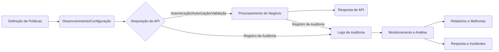

# Documentação da Funcionalidade: APIs|Segurança e Auditoria de APIs 

**Autor:** Rodrigo Marques
**Total de Palavras:** 4419
## 1. O que faz?

A funcionalidade de **Segurança e Auditoria de APIs** na Plataforma FIDC é um módulo robusto e essencial projetado para garantir a integridade, confidencialidade e disponibilidade das interfaces de programação de aplicações (APIs) que orquestram as operações de Fundos de Investimento em Direitos Creditórios (FIDC). Em sua essência, esta funcionalidade atua como um guardião, monitorando, controlando e registrando todas as interações que ocorrem através das APIs da plataforma. Seu propósito principal é estabelecer um ambiente seguro para a troca de dados sensíveis e transações financeiras, ao mesmo tempo em que fornece mecanismos transparentes para rastrear e verificar cada evento.\n\n**Ações Principais:**\n\n*   **Autenticação e Autorização:** Implementa rigorosos protocolos de autenticação (e.g., OAuth 2.0, JWT) para verificar a identidade de cada entidade (usuário, sistema externo) que tenta acessar uma API. Após a autenticação, aplica políticas de autorização baseadas em papéis (RBAC) ou atributos (ABAC) para determinar quais recursos e operações cada entidade está permitida a executar. Isso garante que apenas usuários e sistemas autorizados possam interagir com dados e funcionalidades específicas, como a consulta de carteiras de recebíveis, a aprovação de operações de cessão ou a emissão de relatórios financeiros.\n\n*   **Validação de Requisições e Respostas:** Intercepta e inspeciona todas as requisições de entrada e respostas de saída das APIs. Realiza validações de esquema (JSON Schema, XML Schema) para assegurar que os dados estejam em conformidade com os formatos esperados, prevenindo injeções de código malicioso, manipulação de dados e outros ataques baseados em payload. Além disso, verifica a integridade dos dados e a conformidade com as regras de negócio antes do processamento.\n\n*   **Monitoramento em Tempo Real e Detecção de Anomalias:** Coleta métricas detalhadas sobre o uso das APIs, incluindo volume de requisições, latência, taxas de erro e padrões de acesso. Utiliza algoritmos de detecção de anomalias para identificar comportamentos incomuns, como picos repentinos de requisições de um único IP, tentativas de acesso a recursos não autorizados ou padrões de falha que possam indicar um ataque de negação de serviço (DoS) ou tentativa de força bruta. Alertas são gerados e enviados às equipes de segurança e operações em tempo real.\n\n*   **Registro Detalhado (Logging) e Auditoria:** Mantém um registro imutável de todas as chamadas de API, incluindo metadados como: IP de origem, identidade do usuário/sistema, timestamp, endpoint acessado, parâmetros da requisição, status da resposta e, opcionalmente, partes do payload (com mascaramento de dados sensíveis). Esses logs são armazenados de forma segura e são cruciais para investigações forenses, conformidade regulatória (e.g., LGPD, BACEN) e auditorias internas e externas. A funcionalidade permite a consulta e filtragem desses logs para análise retrospectiva.\n\n*   **Gerenciamento de Chaves e Credenciais:** Oferece um cofre seguro para o armazenamento e gerenciamento de chaves de API, tokens de acesso e outras credenciais. Implementa rotação automática de chaves, expiração de tokens e políticas de acesso granular para garantir que as credenciais sejam usadas de forma segura e revogadas quando necessário.\n\n*   **Controle de Acesso Baseado em Políticas (Policy Enforcement):** Permite a definição e aplicação de políticas de segurança personalizadas, como limitação de taxa (rate limiting) para prevenir abusos e ataques DoS, listas de permissão/bloqueio de IPs, e restrições de acesso baseadas em geolocalização ou horário. Essas políticas são configuráveis e podem ser aplicadas a APIs específicas ou a todo o ecossistema de APIs da plataforma.\n\n**Diagrama de Fluxo de Requisição de API (Exemplo):**\n\n\n\nEste diagrama ilustra o caminho de uma requisição de API através do módulo de segurança, destacando os pontos de autenticação, autorização, validação e registro, antes de chegar ao serviço de negócio e retornar a resposta ao cliente. Cada etapa é crucial para a segurança e rastreabilidade das operações na Plataforma FIDC.


## 2. Para que serve?

A funcionalidade de **Segurança e Auditoria de APIs** serve a múltiplos propósitos críticos dentro do ecossistema da Plataforma FIDC, visando principalmente: 

*   **Garantir a Conformidade Regulatória:** Em um setor altamente regulamentado como o financeiro, especialmente para FIDCs, a conformidade com leis como a LGPD (Lei Geral de Proteção de Dados), normas do Banco Central do Brasil (BACEN) e outras regulamentações específicas é imperativa. Esta funcionalidade fornece os registros detalhados e os controles de acesso necessários para demonstrar aderência a essas exigências, facilitando auditorias e prevenindo sanções.

*   **Proteger Dados Sensíveis e Transações Financeiras:** A plataforma lida com informações financeiras confidenciais e operações de cessão de recebíveis. A segurança das APIs impede acessos não autorizados, vazamento de dados, fraudes e manipulação de transações, protegendo tanto a plataforma quanto seus usuários e investidores.

*   **Manter a Integridade e Disponibilidade do Sistema:** Ao validar requisições, monitorar o tráfego e aplicar políticas de controle, a funcionalidade ajuda a prevenir ataques que poderiam comprometer a integridade dos dados ou a disponibilidade dos serviços da plataforma, como ataques de negação de serviço (DoS) ou injeção de dados maliciosos.

*   **Fornecer Transparência e Rastreabilidade:** Cada interação via API é registrada, criando um rastro de auditoria completo. Isso é fundamental para investigar incidentes de segurança, resolver disputas, identificar a origem de erros e garantir a responsabilização por todas as ações realizadas no sistema.

*   **Facilitar a Integração Segura com Parceiros:** FIDCs frequentemente se integram com diversos parceiros, como originadores de recebíveis, securitizadoras, custodiantes e sistemas de gestão. A funcionalidade de segurança de APIs permite estabelecer canais de comunicação seguros e controlados, garantindo que apenas as informações necessárias sejam compartilhadas e que as operações sejam realizadas dentro dos limites de permissão estabelecidos.

*   **Otimizar a Gestão de Riscos:** Ao identificar e mitigar vulnerabilidades nas APIs, a plataforma reduz a exposição a riscos cibernéticos, operacionais e financeiros, contribuindo para a resiliência e a sustentabilidade do negócio.

Em resumo, esta funcionalidade é a espinha dorsal da segurança e governança de dados na Plataforma FIDC, permitindo que as operações ocorram de forma eficiente, segura e em conformidade com as melhores práticas e regulamentações do mercado.


## 3. Quem usa?

A funcionalidade de **Segurança e Auditoria de APIs** é utilizada por uma gama diversificada de stakeholders, tanto internos quanto externos à Plataforma FIDC, cada um com necessidades e perspectivas distintas:

*   **Desenvolvedores e Equipes de Integração:** Utilizam a funcionalidade para entender os requisitos de segurança ao integrar sistemas externos com a Plataforma FIDC. Eles precisam compreender os mecanismos de autenticação (OAuth 2.0, JWT), os escopos de autorização e os formatos de requisição/resposta para desenvolver integrações seguras e eficientes. A documentação detalhada e os logs de auditoria são ferramentas cruciais para depuração e validação de suas implementações.

*   **Administradores de Sistema e Operações (Ops):** São responsáveis pela configuração, monitoramento e manutenção da infraestrutura da API. Eles utilizam as ferramentas de monitoramento em tempo real para identificar anomalias, gerenciar chaves de API, configurar políticas de controle de acesso (rate limiting, listas de IP) e responder a incidentes de segurança. Os logs de auditoria são essenciais para a análise de desempenho e a resolução de problemas operacionais.

*   **Equipes de Segurança da Informação (CISO, Analistas de Segurança):** Estes são os principais consumidores da funcionalidade, utilizando-a para garantir a postura de segurança da plataforma. Eles analisam os logs de auditoria para detectar atividades suspeitas, investigar incidentes de segurança, realizar análises forenses e garantir a conformidade com as políticas de segurança internas e regulamentações externas. A capacidade de definir e aplicar políticas de segurança robustas é fundamental para o seu trabalho.

*   **Auditores Internos e Externos:** Para fins de conformidade e governança, auditores utilizam os registros detalhados e imutáveis fornecidos pela funcionalidade de auditoria. Eles verificam se os controles de segurança estão funcionando conforme o esperado, se as políticas estão sendo aplicadas corretamente e se há um rastro completo de todas as operações sensíveis, o que é vital para relatórios regulatórios e certificações.

*   **Gerentes de Produto e Negócios:** Embora não interajam diretamente com os aspectos técnicos da funcionalidade, eles se beneficiam indiretamente da segurança e confiabilidade que ela proporciona. A capacidade de garantir a proteção dos dados e a conformidade regulatória permite que a plataforma ofereça serviços financeiros com maior confiança e credibilidade, impactando positivamente a reputação e a atração de novos clientes e investidores.

*   **Parceiros de Negócio (Originadores, Securitizadoras):** Ao integrar seus sistemas com a Plataforma FIDC, os parceiros confiam na segurança das APIs para proteger seus próprios dados e transações. Eles se beneficiam dos controles de acesso que garantem que apenas as informações relevantes sejam expostas e que suas operações sejam processadas de forma segura e auditável.

Em suma, a funcionalidade de Segurança e Auditoria de APIs é um pilar que suporta a confiança e a operação de todos os envolvidos com a Plataforma FIDC, desde o desenvolvimento técnico até a gestão estratégica e a conformidade regulatória.


## 4. Principais benefícios

A funcionalidade de **Segurança e Auditoria de APIs** oferece uma série de benefícios cruciais que impactam diretamente a operação, a reputação e a sustentabilidade da Plataforma FIDC:

*   **Redução de Riscos de Segurança:** Minimiza a exposição a ataques cibernéticos, como injeção SQL, XSS, negação de serviço (DoS), vazamento de dados e acessos não autorizados. Isso protege a integridade dos ativos financeiros e a privacidade das informações dos clientes e parceiros.

*   **Conformidade Regulatória Aprimorada:** Facilita o atendimento às exigências de órgãos reguladores (e.g., BACEN) e leis de proteção de dados (e.g., LGPD), fornecendo os controles, registros e relatórios necessários para auditorias. Isso evita multas, sanções e danos à imagem da instituição.

*   **Maior Confiança e Credibilidade:** Ao demonstrar um compromisso robusto com a segurança e a transparência, a plataforma constrói confiança junto a investidores, originadores, parceiros e clientes. Isso é um diferencial competitivo significativo no mercado financeiro.

*   **Rastreabilidade Completa das Operações:** Cada interação via API é registrada de forma imutável, permitindo um rastreamento detalhado de todas as transações e acessos. Isso é vital para investigações forenses, resolução de disputas e para garantir a responsabilização.

*   **Detecção Proativa de Ameaças:** O monitoramento em tempo real e a detecção de anomalias permitem identificar e responder rapidamente a comportamentos suspeitos ou tentativas de ataque, antes que causem danos significativos.

*   **Controle Granular de Acesso:** A capacidade de definir políticas de autenticação e autorização detalhadas garante que cada usuário ou sistema tenha acesso apenas aos recursos e operações estritamente necessários para suas funções, seguindo o princípio do menor privilégio.

*   **Otimização da Gestão de Incidentes:** Com logs detalhados e alertas em tempo real, as equipes de segurança e operações podem diagnosticar e resolver incidentes de forma mais rápida e eficiente, minimizando o tempo de inatividade e o impacto nas operações.

*   **Suporte à Escalabilidade Segura:** À medida que a plataforma cresce e o volume de APIs e integrações aumenta, a funcionalidade de segurança garante que a expansão ocorra de forma controlada e protegida, sem comprometer a segurança.

Em suma, os benefícios se traduzem em uma operação mais segura, confiável, transparente e em conformidade, elementos fundamentais para o sucesso e a longevidade de uma Plataforma FIDC.


## 5. Como é utilizada?

A funcionalidade de **Segurança e Auditoria de APIs** é utilizada de forma contínua e multifacetada na Plataforma FIDC, integrando-se ao ciclo de vida das APIs desde o desenvolvimento até a operação e monitoramento. Abaixo, detalhamos o fluxo de uso:

**1. Definição e Configuração de Políticas de Segurança (Fase de Design/Desenvolvimento):**
*   **Passo 1: Identificação de Requisitos:** As equipes de segurança e desenvolvimento, em conjunto com a área de negócios, identificam os requisitos de segurança para cada API, considerando a sensibilidade dos dados e as operações envolvidas (e.g., acesso a dados de clientes, aprovação de cessões).
*   **Passo 2: Configuração de Autenticação:** Define-se o método de autenticação (e.g., OAuth 2.0, JWT) e os provedores de identidade. Configuram-se os parâmetros para emissão e validação de tokens.
*   **Passo 3: Definição de Autorização (RBAC/ABAC):** Mapeiam-se os papéis de usuário ou atributos para permissões específicas em endpoints e recursos da API. Por exemplo, um "Analista de Crédito" pode ter permissão para consultar carteiras, mas não para aprovar cessões.
*   **Passo 4: Configuração de Validação de Esquema:** Para cada endpoint, são definidos os esquemas (JSON Schema) esperados para requisições e respostas, garantindo que apenas dados estruturados e válidos sejam processados.
*   **Passo 5: Aplicação de Políticas de Controle:** Configuram-se políticas como rate limiting (limite de requisições por período para evitar abusos), listas de IPs permitidos/bloqueados e outras regras de acesso baseadas em contexto.

**2. Operação e Execução (Fase de Runtime):**
*   **Passo 1: Requisição de API:** Um cliente (sistema externo, aplicação front-end) envia uma requisição para um endpoint da Plataforma FIDC.
*   **Passo 2: Interceptação pelo Gateway/Módulo de Segurança:** A requisição é interceptada pelo módulo de segurança, geralmente um API Gateway ou um componente de segurança dedicado.
*   **Passo 3: Autenticação:** O módulo verifica as credenciais (token JWT, chave de API) presentes na requisição. Se inválidas, a requisição é rejeitada.
*   **Passo 4: Autorização:** Com base na identidade autenticada, o módulo consulta as políticas de autorização para determinar se o cliente tem permissão para acessar o recurso e executar a operação solicitada. Se não autorizado, a requisição é bloqueada.
*   **Passo 5: Validação de Requisição:** O payload da requisição é validado contra o esquema pré-definido. Dados malformados ou maliciosos são rejeitados.
*   **Passo 6: Processamento pelo Serviço de Negócio:** Se todas as verificações de segurança forem aprovadas, a requisição é encaminhada ao serviço de negócio correspondente (e.g., serviço de gestão de recebíveis).
*   **Passo 7: Geração de Resposta e Validação:** O serviço de negócio processa a requisição e gera uma resposta, que também pode ser validada pelo módulo de segurança antes de ser enviada ao cliente.
*   **Passo 8: Registro de Auditoria:** Cada etapa da requisição (autenticação, autorização, validação, sucesso/falha) é registrada em um log de auditoria seguro e imutável, contendo metadados relevantes.

**3. Monitoramento e Análise (Fase Pós-Operação):**
*   **Passo 1: Monitoramento em Tempo Real:** As equipes de Ops e Segurança monitoram dashboards que exibem métricas de uso das APIs, alertas de segurança e anomalias detectadas (e.g., picos de erro, tentativas de acesso não autorizado).
*   **Passo 2: Análise de Logs de Auditoria:** Analistas de segurança e auditores utilizam ferramentas de busca e filtragem nos logs de auditoria para investigar incidentes, verificar conformidade, identificar padrões de ataque ou otimizar o desempenho das APIs.
*   **Passo 3: Geração de Relatórios:** Relatórios periódicos são gerados a partir dos dados de auditoria para demonstrar conformidade, avaliar a postura de segurança e identificar áreas de melhoria.
*   **Passo 4: Resposta a Incidentes:** Em caso de detecção de uma ameaça, a equipe de segurança utiliza os logs e as ferramentas de controle para isolar o problema, mitigar o ataque e realizar uma análise forense.

**Diagrama de Fluxo de Uso (Simplificado):**



Este ciclo contínuo garante que a segurança e a auditoria sejam parte integrante de todas as interações com as APIs da Plataforma FIDC, proporcionando um ambiente robusto e confiável.


## 6. Quais os diferenciais

A funcionalidade de **Segurança e Auditoria de APIs** da Plataforma FIDC se destaca no mercado por uma combinação de características que a tornam particularmente robusta e adaptada às necessidades do setor financeiro e de FIDCs:

*   **Foco Setorial e Conformidade:** Diferente de soluções genéricas, esta funcionalidade é construída com um entendimento profundo das exigências regulatórias e de segurança específicas para o mercado de FIDCs no Brasil (e.g., BACEN, LGPD). Isso se traduz em controles pré-configurados e relatórios que facilitam a conformidade, reduzindo o esforço e o risco para as instituições.

*   **Rastreabilidade Imutável e Detalhada:** A capacidade de registrar cada evento de API com metadados ricos e de forma imutável é um diferencial. Isso não apenas atende a requisitos de auditoria rigorosos, mas também permite uma análise forense precisa em caso de incidentes, fornecendo uma "linha do tempo" completa de todas as operações.

*   **Detecção de Anomalias Contextualizada:** O sistema não se limita a regras estáticas; ele emprega algoritmos que aprendem padrões de uso normais das APIs da FIDC. Isso permite a detecção de anomalias que podem indicar fraudes ou ataques sofisticados, como um volume incomum de consultas a um tipo específico de recebível ou acessos fora do horário comercial para um determinado perfil de usuário.

*   **Gerenciamento Centralizado de Políticas de Segurança:** A plataforma oferece uma interface unificada para definir, aplicar e monitorar todas as políticas de segurança das APIs. Isso inclui autenticação, autorização, rate limiting e validação de esquema, simplificando a governança e garantindo a consistência em todo o ecossistema de APIs.

*   **Integração Nativa com o Ecossistema FIDC:** Por ser parte integrante da Plataforma FIDC, a funcionalidade de segurança e auditoria se beneficia de uma integração profunda com os módulos de gestão de recebíveis, tesouraria e contabilidade. Isso permite que as políticas de segurança sejam mais inteligentes e contextuais, baseadas nos dados de negócio da FIDC.

*   **Flexibilidade para Modelos de Autenticação Avançados:** Suporte a múltiplos protocolos de autenticação (OAuth 2.0, JWT, etc.) e a capacidade de integrar-se com provedores de identidade externos (IDPs) ou sistemas de Single Sign-On (SSO) existentes dos clientes, oferecendo flexibilidade e segurança aprimorada.

*   **Alertas e Notificações Personalizáveis:** A capacidade de configurar alertas em tempo real para eventos de segurança específicos, com diferentes níveis de criticidade e canais de notificação (e.g., e-mail, SMS, integração com SIEM), garante que as equipes responsáveis sejam informadas prontamente sobre qualquer atividade suspeita.

Esses diferenciais garantem que a Plataforma FIDC não apenas atenda, mas supere as expectativas de segurança e conformidade, proporcionando um ambiente confiável e resiliente para a gestão de Fundos de Investimento em Direitos Creditórios.

## 7. Como montar essa funcionalidade em uma plataforma?

A montagem da funcionalidade de **Segurança e Auditoria de APIs** em uma plataforma como a FIDC envolve uma arquitetura multicamadas e a integração de diversas tecnologias e práticas de desenvolvimento. A seguir, uma visão técnica de alto nível:

**1. Camada de Gateway de API (API Gateway):**
*   **Função:** Atua como o ponto de entrada único para todas as requisições de API. É responsável por roteamento, balanceamento de carga, terminação SSL/TLS, e, crucialmente, a pré-autenticação e pré-autorização.
*   **Tecnologias:** Pode ser implementado com soluções como [Kong Gateway](https://konghq.com/kong-gateway), [Apigee](https://cloud.google.com/apigee), [AWS API Gateway](https://aws.amazon.com/api-gateway/) ou [Envoy Proxy](https://www.envoyproxy.io/).
*   **Considerações:** Deve ser configurado para interceptar todas as requisições, aplicar políticas de rate limiting e integrar-se com o serviço de identidade.

**2. Serviço de Identidade e Acesso (Identity and Access Management - IAM):**
*   **Função:** Gerencia a autenticação de usuários e sistemas (OAuth 2.0, OpenID Connect, JWT) e as políticas de autorização (RBAC/ABAC).
*   **Tecnologias:** Soluções como [Keycloak](https://www.keycloak.org/), [Auth0](https://auth0.com/), [Okta](https://www.okta.com/) ou um serviço IAM customizado.
*   **Considerações:** Deve ser altamente disponível e escalável, com suporte a múltiplos fatores de autenticação (MFA) e integração com diretórios corporativos (LDAP, Active Directory).

**3. Módulo de Validação de Requisições e Respostas:**
*   **Função:** Garante que os payloads das requisições e respostas estejam em conformidade com os esquemas definidos (JSON Schema, OpenAPI Specification).
*   **Tecnologias:** Bibliotecas de validação de esquema (e.g., `jsonschema` em Python, `ajv` em Node.js) integradas ao API Gateway ou como um microserviço dedicado.
*   **Considerações:** Deve ser eficiente para não introduzir latência significativa e flexível para suportar diferentes versões de API e esquemas.

**4. Sistema de Logging e Auditoria Centralizado:**
*   **Função:** Coleta, armazena e permite a consulta de logs detalhados de todas as interações de API, de forma segura e imutável.
*   **Tecnologias:** Pilhas ELK (Elasticsearch, Logstash, Kibana), [Splunk](https://www.splunk.com/), [Grafana Loki](https://grafana.com/oss/loki/) ou serviços de logging em nuvem (e.g., AWS CloudWatch Logs, Google Cloud Logging).
*   **Considerações:** Os logs devem ser protegidos contra adulteração, ter retenção configurável e permitir buscas e filtros complexos para auditoria e análise forense. Implementar mascaramento de dados sensíveis nos logs.

**5. Sistema de Monitoramento e Alerta:**
*   **Função:** Monitora métricas de desempenho e segurança das APIs em tempo real, detecta anomalias e dispara alertas.
*   **Tecnologias:** [Prometheus](https://prometheus.io/) + [Grafana](https://grafana.com/), [Datadog](https://www.datadoghq.com/), [New Relic](https://newrelic.com/) ou soluções de APM (Application Performance Monitoring).
*   **Considerações:** Deve ter dashboards configuráveis, regras de alerta baseadas em limiares e padrões, e integração com sistemas de notificação (e-mail, Slack, PagerDuty).

**6. Cofre de Credenciais (Secrets Management):**
*   **Função:** Armazena e gerencia chaves de API, tokens e outras credenciais de forma segura.
*   **Tecnologias:** [HashiCorp Vault](https://www.vaultproject.io/), [AWS Secrets Manager](https://aws.amazon.com/secrets-manager/), [Azure Key Vault](https://azure.microsoft.com/en-us/services/key-vault/) ou [Google Secret Manager](https://cloud.google.com/secret-manager).
*   **Considerações:** Deve suportar rotação automática de credenciais, controle de acesso baseado em políticas e auditoria de acesso aos segredos.

**7. Integração com WAF (Web Application Firewall) e DDoS Protection:**
*   **Função:** Proteção adicional contra ataques comuns da web e ataques de negação de serviço distribuído.
*   **Tecnologias:** [Cloudflare](https://www.cloudflare.com/), [Akamai](https://www.akamai.com/), AWS WAF, Azure Front Door.
*   **Considerações:** Implementado na borda da rede para filtrar tráfego malicioso antes que ele atinja o API Gateway.

**Diagrama de Arquitetura (Exemplo Simplificado):**

```mermaid
graph LR
    A[Cliente/Sistema Externo] --> B(Proteção DDoS/WAF)
    B --> C{API Gateway}
    C -- Autenticação/Autorização --> D[Serviço de Identidade (IAM)]
    C -- Validação --> E[Módulo de Validação]
    C -- Logs --> F[Sistema de Logging/Auditoria]
    C -- Métricas --> G[Sistema de Monitoramento/Alerta]
    C --> H[Serviços de Negócio (Microserviços FIDC)]
    H -- Acesso a Segredos --> I[Cofre de Credenciais]
    H -- Logs --> F
    H -- Métricas --> G
```

Esta arquitetura modular permite que cada componente seja desenvolvido, implantado e escalado independentemente, garantindo robustez, segurança e manutenibilidade para a Plataforma FIDC.


## 8. Prompt para criar telas de Front End no Lovable

**Prompt para Lovable: Telas de Gerenciamento e Auditoria de APIs - Plataforma FIDC**

**Objetivo:** Criar um conjunto de telas de front-end para a funcionalidade de **Segurança e Auditoria de APIs** da Plataforma FIDC, focando em usabilidade, clareza e eficiência para os usuários-alvo (Administradores de Sistema, Equipes de Segurança, Desenvolvedores e Auditores).

**Estilo Visual:**
*   **Paleta de Cores:** Utilizar a paleta de cores padrão da Plataforma FIDC (assumir tons de azul, cinza e branco como primários, com verde para sucesso e vermelho para erro/alerta). Cores neutras para dados e gráficos, com destaque para elementos interativos.
*   **Tipografia:** Fontes sans-serif (e.g., Roboto, Open Sans) para legibilidade. Tamanhos de fonte consistentes para títulos, subtítulos e corpo de texto.
*   **Componentes:** Utilizar componentes de UI modernos e limpos (cards, tabelas responsivas, botões com estados, campos de formulário claros, ícones intuitivos).
*   **Layout:** Design responsivo, otimizado para desktops e tablets. Layouts baseados em grids para organização e alinhamento.

**Telas a Serem Geradas:**

**1. Dashboard de Visão Geral da Segurança de APIs**
*   **Propósito:** Fornecer uma visão consolidada e em tempo real do status de segurança das APIs.
*   **Elementos de UI:**
    *   **Cards de Métricas Chave:** Total de requisições, requisições bloqueadas, usuários autenticados, APIs ativas.
    *   **Gráfico de Linhas/Área:** Volume de requisições de API ao longo do tempo (últimas 24h, 7 dias, 30 dias).
    *   **Gráfico de Barras:** Top 5 APIs com mais requisições bloqueadas (por tipo de violação: autenticação, autorização, validação).
    *   **Tabela de Últimos Alertas de Segurança:** Lista de alertas recentes (timestamp, tipo de alerta, API afetada, status, ação).
    *   **Filtros:** Período (hoje, ontem, última semana, último mês), API específica, tipo de alerta.
    *   **Botão:** "Ver Todos os Alertas", "Configurar Políticas".

**2. Gerenciamento de Políticas de Acesso (Autenticação e Autorização)**
*   **Propósito:** Permitir a criação, edição e visualização de políticas de autenticação e autorização para APIs.
*   **Elementos de UI:**
    *   **Tabela de Políticas Existentes:** Nome da política, API(s) associada(s), tipo (Autenticação/Autorização), status (Ativa/Inativa), data de criação/última modificação, ações (Editar, Desativar, Excluir).
    *   **Formulário de Criação/Edição de Política:**
        *   **Campo de Texto:** Nome da Política.
        *   **Dropdown:** Tipo de Política (Autenticação, Autorização).
        *   **Dropdown/Multiselect:** APIs Afetadas.
        *   **Para Autenticação:** Dropdown para método (OAuth 2.0, JWT), campos para configurações específicas (e.g., Issuer URL, Audience, Chave Pública).
        *   **Para Autorização:** Construtor de regras visuais (e.g., "Se Usuário tem Papel 'Admin' E Acessa Endpoint '/admin/*' ENTÃO Permitir"). Pode ser um editor de regras baseado em JSON/YAML para usuários avançados.
        *   **Toggle:** Ativar/Desativar Política.
        *   **Botões:** "Salvar", "Cancelar".
    *   **Barra de Busca:** Para filtrar políticas por nome ou API.

**3. Visualização e Busca de Logs de Auditoria**
*   **Propósito:** Permitir a busca, filtragem e visualização detalhada dos logs de auditoria das APIs.
*   **Elementos de UI:**
    *   **Campos de Filtro Avançados:**
        *   **Intervalo de Datas/Horas:** Seletores de data e hora.
        *   **Campo de Texto:** IP de Origem, ID do Usuário/Sistema, Endpoint, Status da Resposta (200, 401, 500).
        *   **Dropdown:** Tipo de Evento (Autenticação, Autorização, Validação, Sucesso, Falha).
        *   **Campo de Texto:** Busca por palavra-chave no payload (com opção de mascaramento).
    *   **Tabela de Resultados de Logs:** Timestamp, IP de Origem, Usuário/Sistema, Método HTTP, Endpoint, Status HTTP, Duração, Ação (Ver Detalhes).
    *   **Modal/Painel Lateral de Detalhes do Log:** Exibe o log completo em formato JSON/YAML formatado, com destaque para campos chave e opção de copiar.
    *   **Paginação:** Para navegar entre os resultados.
    *   **Botão:** "Exportar Logs (CSV/JSON)".

**4. Gerenciamento de Chaves de API e Credenciais**
*   **Propósito:** Gerenciar chaves de API para sistemas externos e outras credenciais.
*   **Elementos de UI:**
    *   **Tabela de Chaves de API:** Nome da Chave, ID da Chave, Sistema Associado, Data de Criação, Data de Expiração, Status (Ativa/Revogada), Ações (Revogar, Renovar, Ver Detalhes).
    *   **Formulário de Geração de Nova Chave:**
        *   **Campo de Texto:** Nome da Chave.
        *   **Dropdown:** Sistema Associado.
        *   **Seletor de Data:** Data de Expiração (opcional).
        *   **Botão:** "Gerar Chave".
    *   **Modal de Detalhes da Chave:** Exibe a chave gerada (com opção de copiar e aviso para armazenar com segurança), informações de uso.
    *   **Barra de Busca:** Para filtrar chaves.

**Fluxo de Usuário (Exemplo: Investigação de um Alerta de Segurança):**
1.  Usuário (Analista de Segurança) acessa o **Dashboard de Visão Geral da Segurança de APIs**.
2.  Identifica um alerta de "Tentativa de Acesso Não Autorizado" na tabela de Últimos Alertas.
3.  Clica em "Ver Detalhes" no alerta, que o direciona para a tela de **Visualização e Busca de Logs de Auditoria**, com os filtros pré-preenchidos para o evento específico.
4.  Analisa os logs detalhados, identificando o IP de origem e o endpoint alvo.
5.  Pode então navegar para a tela de **Gerenciamento de Políticas de Acesso** para verificar se a política de autorização para aquele endpoint está configurada corretamente ou para adicionar uma regra de bloqueio para o IP suspeito.

**Considerações Adicionais:**
*   **Feedback Visual:** Mensagens claras de sucesso, erro e carregamento.
*   **Acessibilidade:** Garantir que as telas sejam acessíveis para usuários com diferentes necessidades.
*   **Internacionalização:** Preparar para múltiplos idiomas (embora o foco inicial seja Português).

Este prompt detalhado deve guiar o Lovable na criação de interfaces de usuário que sejam não apenas esteticamente agradáveis, mas também altamente funcionais e seguras para a gestão de APIs na Plataforma FIDC.
