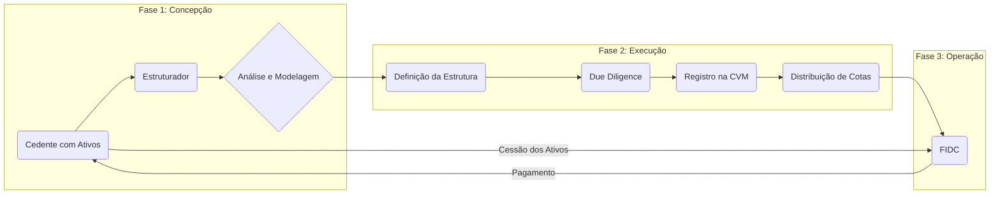
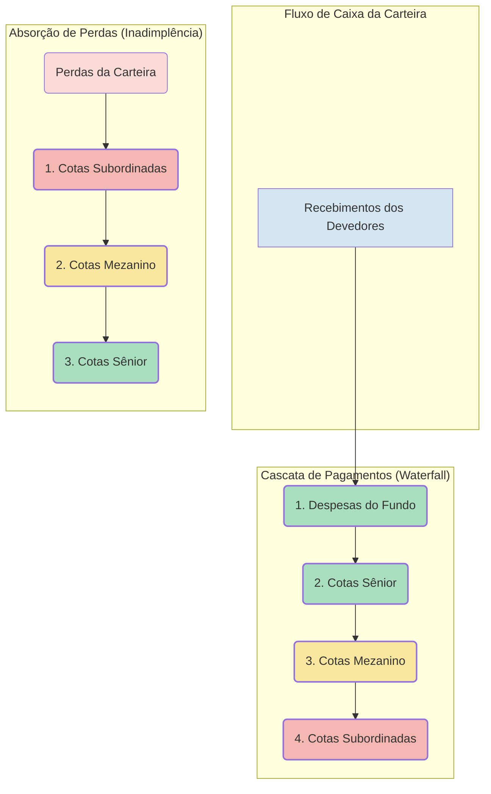
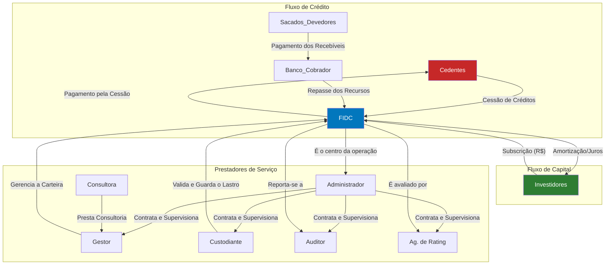

# Mecanismos de Mitigação de Risco

**Autor:** Rodrigo Marques
**Versão:** 1.0

---

## Sumário Executivo

Este documento técnico oferece uma análise aprofundada e detalhada sobre a arquitetura dos Fundos de Investimento em Direitos Creditórios (FIDCs), dissecando o processo de estruturação e os sofisticados mecanismos de mitigação de risco que formam a espinha dorsal desses veículos de securitização. Abordamos o fluxo completo de criação de um FIDC, desde a concepção da operação e a originação dos direitos creditórios até a emissão das cotas e a sua distribuição no mercado de capitais. O foco principal reside na análise dos mecanismos de reforço de crédito (credit enhancement), como a estrutura de cotas em tranches (sênior, mezanino e subordinada), a sobrecolateralização, o excesso de spread e os fundos de reserva. Detalhamos o papel técnico e as responsabilidades de cada agente envolvido na operação — cedente, estruturador, gestor, administrador, custodiante e agência de rating —, cuja atuação coordenada é vital para o sucesso e a segurança do fundo. O objetivo é fornecer a investidores, gestores, estruturadores e demais profissionais do mercado um guia de referência sobre a engenharia financeira por trás de um FIDC, capacitando-os a avaliar a robustez de sua estrutura e a eficácia de seus mecanismos de proteção ao investidor.

---

## 1. Introdução à Engenharia Financeira dos FIDCs

Os Fundos de Investimento em Direitos Creditórios (FIDCs) são um dos pilares do mercado de capitais brasileiro, funcionando como uma ponte essencial entre a economia real e o mercado financeiro. Em sua essência, um FIDC é um veículo de securitização: ele compra um conjunto de direitos creditórios (recebíveis futuros, como duplicatas, aluguéis, cheques, faturas de cartão de crédito) e os transforma em valores mobiliários (cotas) que podem ser adquiridos por investidores. 

Essa transformação, aparentemente simples, é o resultado de um complexo processo de engenharia financeira. A estruturação de um FIDC não se resume a simplesmente empacotar e vender créditos. Trata-se de um processo meticuloso de seleção de ativos, análise de risco, e, crucialmente, de construção de uma arquitetura de proteção que permita transformar um conjunto de ativos com um determinado perfil de risco em títulos (as cotas) com perfis de risco distintos e adequados a diferentes tipos de investidores.

O coração da estruturação de um FIDC reside na **mitigação de risco**. O desafio é pegar uma carteira de créditos, que sempre carrega um risco de inadimplência, e criar, a partir dela, títulos que possam ser considerados de baixo risco (investment grade) por investidores mais conservadores. Isso é alcançado por meio de uma série de técnicas conhecidas como **reforço de crédito (credit enhancement)**, que serão o foco central deste documento.

Este guia técnico se propõe a desvendar a anatomia de um FIDC, detalhando cada etapa de sua estruturação e cada componente de sua arquitetura de segurança. Abordaremos:

*   **O Fluxo de Estruturação:** O passo a passo da jornada de criação de um FIDC, desde a originação dos créditos até a sua colocação no mercado.
*   **A Estrutura de Cotas em Tranches:** A técnica de subordinação, que cria diferentes classes de cotas (sênior, mezanino e subordinada) com diferentes níveis de prioridade e risco, sendo este o principal mecanismo de proteção.
*   **Outros Mecanismos de Reforço de Crédito:** A análise de ferramentas adicionais como sobrecolateralização, excesso de spread e fundos de reserva.
*   **Os Agentes da Operação:** O papel e as responsabilidades de cada um dos participantes (cedente, gestor, custodiante, etc.), cuja atuação coordenada é fundamental para a integridade do fundo.

Compreender a estruturação de um FIDC é compreender a sua alma. É entender como o risco é medido, fatiado e distribuído, e como as salvaguardas são construídas para proteger o capital do investidor. Para qualquer profissional ou investidor que deseje atuar no mercado de crédito estruturado, este conhecimento não é apenas útil, é indispensável.

## 2. O Fluxo de Estruturação: Do Ativo à Cota

A criação de um FIDC é um projeto complexo que envolve diversas fases e a colaboração de múltiplos especialistas. O processo pode levar de três a seis meses, ou mais, dependendo da complexidade da operação. 

**Diagrama Simplificado do Fluxo de Estruturação:**



**Etapas Detalhadas do Processo:**

1.  **Originação e Análise Preliminar:** Tudo começa com uma empresa (o **cedente**) que possui uma carteira de direitos creditórios e deseja antecipar esses recebíveis. O cedente procura um **estruturador** (geralmente um banco de investimento, uma distribuidora ou uma consultoria especializada), que fará uma análise preliminar da carteira para avaliar a viabilidade da securitização.

2.  **Modelagem Financeira:** Caso a análise preliminar seja positiva, o estruturador inicia a modelagem da operação. Com base no histórico de performance da carteira (inadimplência, velocidade de pagamento), ele projeta o fluxo de caixa que os ativos são capazes de gerar. Com essa projeção, ele desenha a estrutura de cotas, define os níveis de subordinação e os demais mecanismos de reforço de crédito necessários para que as cotas sênior atinjam a nota de rating desejada (geralmente, um rating de baixo risco).

3.  **Due Diligence (Diligência Prévia):** Esta é uma das fases mais críticas. Uma equipe multidisciplinar (advogados, auditores) realiza uma investigação aprofundada sobre o cedente e a carteira de créditos. A due diligence legal verifica a validade dos contratos que deram origem aos créditos e a ausência de impedimentos para a sua cessão. A due diligence contábil e financeira audita os números e os processos do cedente.

4.  **Definição dos Prestadores de Serviço:** O estruturador, em conjunto com o cedente, seleciona os demais participantes da operação: o **gestor** (que será responsável pela gestão da carteira do fundo), o **administrador** (responsável legal pelo fundo), o **custodiante** (que validará e guardará os documentos dos créditos), o **agente de cobrança** (se aplicável) e a **agência de classificação de risco**.

5.  **Elaboração dos Documentos Jurídicos:** Os advogados redigem todos os documentos da operação, sendo os principais o **Regulamento do Fundo** e o **Prospecto de Distribuição**. O regulamento é o documento mais importante, pois descreve todas as regras de funcionamento do fundo, a política de investimento, os critérios de elegibilidade dos créditos, a estrutura de cotas, os fatores de risco, etc.

6.  **Classificação de Risco (Rating):** A agência de rating contratada analisa toda a estrutura da operação, os resultados da due diligence e a modelagem financeira para atribuir uma nota de classificação de risco às cotas do FIDC, especialmente às cotas sênior e mezanino. A obtenção de um bom rating é fundamental para o sucesso da distribuição.

7.  **Registro na CVM:** O administrador do fundo submete o pedido de registro do FIDC e da oferta pública de distribuição de cotas à Comissão de Valores Mobiliários (CVM).

8.  **Distribuição (Roadshow e Bookbuilding):** Após a aprovação da CVM, inicia-se o processo de venda das cotas aos investidores. O estruturador e o gestor apresentam a operação a potenciais investidores (o *roadshow*). O processo de coleta das intenções de compra para definir o preço e a quantidade final de cotas é chamado de *bookbuilding*.

9.  **Integralização e Aquisição dos Ativos:** Os investidores pagam pelas cotas que subscreveram (a integralização). Com os recursos em caixa, o FIDC efetiva a compra (cessão) da carteira de direitos creditórios do cedente. A partir deste momento, o fundo está operacional.

## 3. A Estrutura de Cotas (Tranches): O Coração da Mitigação de Risco

A principal e mais engenhosa técnica de reforço de crédito em um FIDC é a criação de diferentes classes (ou subclasses, na terminologia da Resolução 175) de cotas com diferentes níveis de senioridade. Essa técnica é conhecida como **subordinação** ou **tranching** (fatiamento).

A ideia é fatiar o risco da carteira de direitos creditórios. Em vez de todos os investidores correrem o mesmo risco, a estrutura cria cotas para diferentes apetites de risco, desde o mais conservador até o mais arrojado.

### 3.1. As Três Camadas de Risco

Um FIDC típico possui três tranches de cotas:

| Tranche | Perfil de Risco | Perfil de Retorno | Quem Geralmente Investe | 
| :--- | :--- | :--- | :--- | 
| **Cota Sênior** | Baixo Risco | Retorno Menor (prefixado ou pós-fixado) | Investidores em geral, fundos de pensão, seguradoras, fundos de investimento conservadores. | 
| **Cota Mezanino** | Risco Médio | Retorno Intermediário | Investidores qualificados, fundos multimercado, investidores com maior apetite a risco. | 
| **Cota Subordinada (Júnior)** | Alto Risco | Retorno Elevado (variável, residual) | O próprio cedente, o gestor do fundo, investidores profissionais especializados em distressed assets. | 

### 3.2. O Mecanismo da Subordinação e o Fluxo de Pagamentos em Cascata (Waterfall)

A mágica da subordinação acontece na forma como as perdas são absorvidas e os pagamentos são distribuídos. 

**Absorção de Perdas:**

Qualquer inadimplência ou perda na carteira de direitos creditórios é absorvida **de baixo para cima**. 

1.  A **cota subordinada** é a primeira a sofrer o impacto. Ela funciona como um "colchão" ou "escudo" para as classes superiores. Se o valor das perdas for menor ou igual ao valor da cota subordinada, as cotas mezanino e sênior não sofrem nenhum prejuízo.
2.  Se as perdas forem tão grandes que consumam todo o valor da cota subordinada, a **cota mezanino** começa a absorver as perdas subsequentes.
3.  A **cota sênior** só terá alguma perda se a inadimplência for tão catastrófica que consuma integralmente o valor das cotas subordinada e mezanino.

**Distribuição de Pagamentos (Waterfall):**

De forma inversa, os recursos gerados pela carteira (pagamentos dos devedores) são distribuídos **de cima para baixo**, em uma ordem de prioridade chamada de fluxo de pagamentos em cascata (*waterfall*).

1.  Primeiro, pagam-se as **despesas** do fundo (taxas, impostos).
2.  Em seguida, pagam-se os **juros e a amortização** devidos aos titulares das **cotas sênior**.
3.  Apenas se todas as obrigações com os cotistas seniores forem cumpridas, o fluxo de caixa passa para o nível seguinte, pagando os **juros e a amortização** das **cotas mezanino**.
4.  Por último, se sobrar algum recurso após todos os pagamentos anteriores terem sido feitos, esse fluxo de caixa residual (**excesso de spread**) é direcionado aos titulares das **cotas subordinadas**.

É por isso que a cota subordinada tem o maior risco (é a primeira a perder e a última a receber) e, consequentemente, o maior potencial de retorno (recebe todo o lucro residual da operação).

### 3.3. O Papel da Cota Subordinada e o Alinhamento de Interesses

Frequentemente, o próprio cedente (a empresa que vendeu os créditos) é obrigado a reter a cota subordinada. Essa é uma prática de mercado fundamental para o **alinhamento de interesses**. Ao reter a primeira camada de risco, o cedente está sinalizando ao mercado que confia na qualidade dos ativos que está vendendo. Se a carteira performar mal, ele será o primeiro a perder dinheiro. Isso incentiva o cedente a vender para o FIDC apenas créditos de boa qualidade (reduzindo o problema da **seleção adversa**).

## 4. Outros Mecanismos de Reforço de Crédito

Além da subordinação, outras ferramentas são utilizadas para aumentar a segurança da estrutura do FIDC.

*   **Sobrecolateralização (Overcollateralization - OC):** Consiste em manter um valor de direitos creditórios na carteira que seja superior ao valor das cotas emitidas (especialmente as seniores e mezanino). Por exemplo, para cada R$ 100,00 em cotas sênior emitidas, o fundo pode ser obrigado a manter R$ 120,00 em direitos creditórios. Essa "sobra" de R$ 20,00 funciona como uma camada adicional de proteção contra a inadimplência.

*   **Excesso de Spread:** O spread é a diferença entre a taxa de juros média ponderada da carteira de direitos creditórios e a taxa de juros paga nas cotas sênior e mezanino, mais as despesas do fundo. Se a carteira rende, em média, 20% ao ano, e o custo das cotas e despesas é de 15% ao ano, há um "excesso de spread" de 5%. Esse fluxo de caixa excedente pode ser usado para cobrir perdas inesperadas ou ser acumulado em um fundo de reserva, antes de ser pago à cota subordinada.

*   **Fundo de Reserva:** O regulamento pode prever a constituição de um fundo de reserva, uma conta onde parte do excesso de spread é depositada. Esse fundo pode ser usado para cobrir inadimplências temporárias e garantir a pontualidade dos pagamentos aos cotistas seniores, aumentando a estabilidade da estrutura.

*   **Gatilhos de Amortização Antecipada (Triggers):** A estrutura pode conter gatilhos que, se acionados, provocam a amortização antecipada das cotas. Por exemplo, se a inadimplência da carteira ultrapassar um certo nível, o fundo para de reinvestir os recursos (se for revolvente) e passa a usar todo o caixa para pagar as cotas, começando pelas seniores. Isso acelera o desinvestimento e reduz a exposição dos investidores a uma carteira que está se deteriorando.

## 5. Os Agentes da Operação e Suas Funções Técnicas

A robustez de um FIDC depende da competência e da independência dos diversos prestadores de serviço envolvidos.

| Agente | Função Técnica na Estruturação | Responsabilidade Chave | 
| :--- | :--- | :--- | 
| **Cedente** | Vende a carteira de direitos creditórios para o FIDC. | Garantir a existência, a validade e a titularidade dos créditos cedidos. | 
| **Estruturador** | Desenha a arquitetura financeira e jurídica do FIDC. | Modelar a operação de forma a equilibrar os interesses do cedente e dos investidores, criando uma estrutura robusta e vendável. | 
| **Gestor** | Seleciona os ativos e gerencia a carteira do fundo. | Realizar a gestão ativa dos riscos da carteira, buscando a melhor relação risco-retorno dentro dos limites do regulamento. | 
| **Administrador** | Responsável legal e fiduciário pelo fundo. | Garantir a conformidade do fundo com a regulação, supervisionar os demais prestadores de serviço e defender os interesses dos cotistas. | 
| **Custodiante** | Valida e guarda os documentos que lastreiam os créditos. | Realizar a diligência sobre o lastro, verificando, por amostragem, se os créditos cedidos ao fundo realmente existem e cumprem os critérios. | 
| **Agência de Rating** | Avalia e atribui uma nota de risco de crédito às cotas. | Fornecer uma opinião independente e fundamentada sobre a probabilidade de as cotas honrarem seus pagamentos, servindo como um selo de qualidade. | 

## 6. Conclusão: Uma Arquitetura de Confiança

A estruturação de um FIDC é um exemplo primoroso de engenharia financeira, onde o risco é cuidadosamente dissecado, medido e realocado. O objetivo final de toda essa complexa arquitetura é construir confiança. 

Através da subordinação, da sobrecolateralização e dos demais mecanismos de reforço de crédito, a estrutura de um FIDC consegue criar um ativo de baixo risco (a cota sênior) a partir de uma cesta de ativos de risco mais elevado. A atuação diligente e independente dos diversos prestadores de serviço, cada um com sua função técnica específica, adiciona camadas de controle e segurança que são fundamentais para a integridade da operação.

Para o investidor, compreender essa estrutura não é um mero exercício acadêmico. É a ferramenta essencial para avaliar a qualidade de um FIDC. Um investidor deve ser capaz de ler o regulamento e o prospecto de um fundo e perguntar: Qual o nível de subordinação? Existe sobrecolateralização? Quais são os gatilhos de proteção? Qual a reputação e a expertise do gestor, do custodiante e do administrador? A resposta a essas perguntas revela a verdadeira robustez da estrutura e a segurança do investimento. Em última análise, no mercado de crédito estruturado, a confiança não é um sentimento, é o resultado de uma arquitetura bem construída.

_


## 7. Análise Detalhada do Fluxo de Pagamentos em Cascata (Waterfall)

A compreensão do mecanismo de cascata de pagamentos, ou *waterfall*, é absolutamente central para a análise de risco de qualquer FIDC. É neste fluxo ordenado que a mágica da subordinação acontece, distribuindo os fluxos de caixa e alocando as perdas de forma a proteger as tranches mais seniores. Vamos detalhar este mecanismo com um exemplo numérico e um diagrama visual.

### 7.1. O Princípio da Prioridade Absoluta

O *waterfall* opera sob o princípio da **prioridade absoluta**. Um nível da cascata só pode receber recursos após o nível imediatamente superior ter sido integralmente satisfeito. Isso se aplica tanto ao fluxo de pagamentos (distribuição de juros e principal) quanto à absorção de perdas.

**Diagrama Conceitual do Waterfall (baseado na imagem de referência 8):**



### 7.2. Exemplo Numérico de um Waterfall

Vamos imaginar um FIDC hipotético com a seguinte estrutura:

*   **Patrimônio Total:** R$ 100 milhões
*   **Cotas Sênior:** R$ 70 milhões (70% do PL), remuneradas a CDI + 2% a.a.
*   **Cotas Mezanino:** R$ 15 milhões (15% do PL), remuneradas a CDI + 5% a.a.
*   **Cotas Subordinadas:** R$ 15 milhões (15% do PL), recebem o resultado residual.
*   **Carteira de Ativos:** R$ 100 milhões em direitos creditórios, com uma taxa de juros média de CDI + 8% a.a.
*   **Despesas do Fundo:** 0,5% a.a. sobre o PL.

Vamos analisar o fluxo de caixa em um determinado período (mês ou ano).

**Cenário 1: Sem Inadimplência**

Neste cenário, todos os direitos creditórios performam conforme o esperado.

1.  **Geração de Receita:** A carteira de R$ 100 milhões gera uma receita de juros de **R$ 8 milhões** (considerando CDI = 0% para simplificar, então 8% de R$ 100M).

2.  **Início do Waterfall de Pagamentos:**
    *   **Nível 1 (Despesas):** Pagam-se as despesas do fundo. 0,5% de R$ 100 milhões = **R$ 500 mil**.
        *   *Caixa restante: R$ 8.000.000 - R$ 500.000 = R$ 7.500.000*
    *   **Nível 2 (Cotas Sênior):** Pagam-se os juros dos cotistas seniores. 2% de R$ 70 milhões = **R$ 1,4 milhão**.
        *   *Caixa restante: R$ 7.500.000 - R$ 1.400.000 = R$ 6.100.000*
    *   **Nível 3 (Cotas Mezanino):** Pagam-se os juros dos cotistas mezanino. 5% de R$ 15 milhões = **R$ 750 mil**.
        *   *Caixa restante: R$ 6.100.000 - R$ 750.000 = R$ 5.350.000*
    *   **Nível 4 (Cotas Subordinadas):** Todo o caixa restante é o lucro dos cotistas subordinados. **R$ 5,35 milhões**.

**Análise do Retorno:**

*   **Cota Sênior:** Recebeu R$ 1,4M, exatamente a remuneração contratada de 2%.
*   **Cota Mezanino:** Recebeu R$ 750k, exatamente a remuneração contratada de 5%.
*   **Cota Subordinada:** Recebeu R$ 5,35M sobre um investimento de R$ 15M, um retorno de **35,6%**. Isso demonstra o potencial de alavancagem da cota subordinada em um cenário positivo.

**Cenário 2: Com Inadimplência Moderada**

Agora, vamos supor que a carteira teve uma perda (inadimplência) de **R$ 10 milhões**.

1.  **Absorção da Perda:** A perda de R$ 10 milhões é absorvida **de baixo para cima**.
    *   **Nível 1 (Cotas Subordinadas):** A cota subordinada, que tem um valor de R$ 15 milhões, absorve integralmente a perda de R$ 10 milhões. Seu valor é reduzido para R$ 5 milhões (R$ 15M - R$ 10M).
    *   **Níveis 2 e 3 (Mezanino e Sênior):** Como a perda foi totalmente absorvida pela cota subordinada, o valor das cotas mezanino e sênior permanece intacto. Elas não sofreram nenhuma perda de principal.

2.  **Impacto no Fluxo de Caixa:** A carteira de ativos agora é de R$ 90 milhões (R$ 100M - R$ 10M de perda). A receita de juros gerada será menor. Supondo a mesma taxa de 8%, a receita agora é de 8% de R$ 90 milhões = **R$ 7,2 milhões**.

3.  **Waterfall de Pagamentos (com carteira reduzida):**
    *   **Nível 1 (Despesas):** R$ 500 mil.
        *   *Caixa restante: R$ 7.200.000 - R$ 500.000 = R$ 6.700.000*
    *   **Nível 2 (Cotas Sênior):** R$ 1,4 milhão.
        *   *Caixa restante: R$ 6.700.000 - R$ 1.400.000 = R$ 5.300.000*
    *   **Nível 3 (Cotas Mezanino):** R$ 750 mil.
        *   *Caixa restante: R$ 5.300.000 - R$ 750.000 = R$ 4.550.000*
    *   **Nível 4 (Cotas Subordinadas):** O caixa restante é de **R$ 4,55 milhões**.

**Análise do Retorno:**

*   **Cota Sênior e Mezanino:** Mesmo com uma perda de 10% na carteira, elas continuaram recebendo integralmente sua remuneração contratada. Isso demonstra a eficácia do "colchão" de subordinação.
*   **Cota Subordinada:** O principal da cota foi reduzido para R$ 5 milhões, e o retorno do período foi de R$ 4,55 milhões. O retorno ainda é alto, mas o impacto da perda foi totalmente concentrado nesta tranche.

**Cenário 3: Com Inadimplência Severa**

Vamos supor uma perda catastrófica de **R$ 20 milhões** (20% da carteira).

1.  **Absorção da Perda:**
    *   **Nível 1 (Cotas Subordinadas):** A cota subordinada, de R$ 15 milhões, é **completamente dizimada**. Ela absorve os primeiros R$ 15 milhões da perda e seu valor vai a zero.
    *   **Nível 2 (Cotas Mezanino):** Os R$ 5 milhões restantes da perda (R$ 20M - R$ 15M) são absorvidos pela cota mezanino. Seu valor é reduzido de R$ 15 milhões para R$ 10 milhões.
    *   **Nível 3 (Cotas Sênior):** A cota sênior permanece intacta, protegida pela absorção de perdas das duas classes inferiores.

2.  **Impacto no Fluxo de Caixa:** A carteira de ativos agora é de R$ 80 milhões. A receita de juros gerada é de 8% de R$ 80 milhões = **R$ 6,4 milhões**.

3.  **Waterfall de Pagamentos:**
    *   **Nível 1 (Despesas):** R$ 500 mil.
        *   *Caixa restante: R$ 6.400.000 - R$ 500.000 = R$ 5.900.000*
    *   **Nível 2 (Cotas Sênior):** R$ 1,4 milhão.
        *   *Caixa restante: R$ 5.900.000 - R$ 1.400.000 = R$ 4.500.000*
    *   **Nível 3 (Cotas Mezanino):** O pagamento de juros devido era de R$ 750 mil. Como há caixa suficiente (R$ 4,5M), esse valor é pago integralmente.
        *   *Caixa restante: R$ 4.500.000 - R$ 750.000 = R$ 3.750.000*
    *   **Nível 4 (Cotas Subordinadas):** Como o valor da cota subordinada foi a zero, ela não recebe mais nada. O caixa restante (R$ 3,75M) pode ser usado, dependendo do que diz o regulamento, para recompor o principal da cota mezanino ou ser acumulado em um fundo de reserva.

**Análise do Retorno:**

*   **Cota Sênior:** Mesmo em um cenário de estresse severo, com 20% de perda na carteira, o cotista sênior não teve perda de principal e continuou recebendo seus juros em dia. Isso ilustra o poder da dupla camada de proteção (subordinada + mezanino).
*   **Cota Mezanino:** Sofreu uma perda de principal, mas continuou recebendo seus juros.
*   **Cota Subordinada:** O investidor perdeu todo o seu capital.

Este exemplo numérico simplificado demonstra como a estrutura de *waterfall* e a subordinação fatiam o risco da carteira, permitindo a criação de um ativo de baixo risco (cota sênior) a partir de uma cesta de ativos de risco mais elevado. A análise do tamanho da subordinação (o "colchão") é, portanto, a análise mais importante para um investidor de FIDC.


## 8. Outros Mecanismos de Reforço de Crédito (Credit Enhancement)

A subordinação de cotas é o mecanismo de reforço de crédito mais conhecido e fundamental em um FIDC, mas não é o único. Estruturas de securitização sofisticadas frequentemente combinam a subordinação com outras camadas de proteção, criando uma defesa multifacetada contra as perdas da carteira. Esses mecanismos adicionais, conhecidos coletivamente como *credit enhancement*, são cruciais para a obtenção de ratings elevados para as cotas seniores e para aumentar a segurança geral do fundo.

### 8.1. Fundo de Reserva (ou Fundo de Despesas)

O fundo de reserva é uma conta de caixa, ou uma carteira de ativos de alta liquidez e baixo risco (como títulos públicos), que é constituída dentro do próprio FIDC. Sua principal função é prover liquidez para cobrir despesas do fundo ou pagamentos de juros das cotas seniores em caso de uma interrupção temporária no fluxo de caixa da carteira de direitos creditórios.

*   **Constituição:** O fundo de reserva é geralmente financiado no início da operação com uma parte dos recursos captados na emissão das cotas (geralmente, das cotas subordinadas) ou é gradualmente formado com o excesso de spread gerado pela carteira.
*   **Funcionamento:** Se, em um determinado mês, o caixa gerado pelos recebíveis não for suficiente para pagar as despesas do fundo e os juros devidos aos cotistas seniores, o administrador pode sacar recursos do fundo de reserva para cobrir o déficit. 
*   **Recomposição:** O regulamento do fundo geralmente estipula que, uma vez utilizado, o fundo de reserva deve ser recomposto com os primeiros fluxos de caixa excedentes disponíveis no *waterfall*, antes mesmo de se pagar os juros das cotas mezanino ou subordinadas. Isso garante que essa primeira linha de defesa de liquidez esteja sempre disponível.

### 8.2. Excesso de Spread (Excess Spread)

O excesso de spread é uma das formas mais elegantes e contínuas de reforço de crédito. Ele representa a diferença positiva entre a taxa de juros média recebida dos ativos da carteira e a taxa de juros média paga aos cotistas (considerando também as despesas do fundo).

**Excesso de Spread = Taxa da Carteira - (Taxa das Cotas + Despesas)**

*   **Como Funciona:** Esse "lucro" mensal ou periódico gerado pela carteira cria um fluxo de caixa excedente. No *waterfall* de pagamentos, esse excesso de spread fica disponível no fundo após o pagamento de todas as despesas e dos juros das cotas seniores e mezanino. 
*   **Utilização:** O regulamento do fundo define a ordem de utilização desse excesso de spread, que pode ser:
    1.  **Cobrir Perdas Correntes:** O excesso de spread pode ser usado para cobrir as perdas de inadimplência ocorridas no período, antes que essas perdas comecem a consumir o principal das cotas subordinadas. Ele funciona como um "airbag" que absorve os primeiros impactos.
    2.  **Recompor o Fundo de Reserva:** Se o fundo de reserva foi utilizado, o excesso de spread é direcionado para sua recomposição.
    3.  **Amortização Antecipada:** Em algumas estruturas, o excesso de spread pode ser usado para acelerar a amortização das cotas seniores, reduzindo o risco do fundo mais rapidamente.
    4.  **Remuneração das Cotas Subordinadas:** O que sobra do excesso de spread após cumprir todas as outras funções é, finalmente, o lucro destinado aos cotistas subordinados.

Uma estrutura com um excesso de spread robusto e consistente é vista de forma muito positiva pelas agências de rating, pois cria uma proteção renovável contra as perdas da carteira.

### 8.3. Seguro de Crédito e Derivativos de Crédito

Embora menos comuns em FIDCs no Brasil devido ao custo e à complexidade, é possível adicionar mecanismos de transferência de risco para terceiros.

*   **Seguro de Crédito:** O FIDC pode contratar uma apólice de seguro com uma companhia seguradora para cobrir as perdas de crédito da carteira até um determinado limite. Em caso de inadimplência, a seguradora indeniza o fundo. O custo do prêmio do seguro é uma despesa do fundo, mas ele transfere parte do risco de crédito para uma entidade externa, o que pode melhorar significativamente o rating das cotas seniores.

*   **Credit Default Swaps (CDS):** Um CDS é um derivativo de crédito onde o FIDC (comprador de proteção) paga um prêmio periódico a uma contraparte (vendedor de proteção). Em troca, se ocorrer um evento de crédito específico na carteira (como um default), a contraparte se compromete a compensar o FIDC pela perda. Na prática, funciona de forma semelhante a um seguro, mas é um contrato negociado no mercado de derivativos, geralmente com um banco de investimento.

### 8.4. Gatilhos de Performance (Performance Triggers)

Como discutido no contexto da revolvência, os gatilhos de performance são um mecanismo de reforço de crédito proativo. Eles não absorvem perdas, mas mudam a estrutura do fundo para protegê-lo quando a performance começa a se deteriorar. O principal gatilho é a **interrupção da revolvência e o início da amortização total**. Ao parar de comprar novos ativos e começar a pagar o principal das cotas seniores assim que a inadimplência atinge um certo nível, o fundo reduz sua exposição ao risco e acelera o desinvestimento dos cotistas mais protegidos, aumentando sua segurança.

Em conclusão, a análise da estrutura de um FIDC deve ir além do simples cálculo do percentual de subordinação. É preciso avaliar o conjunto completo de mecanismos de reforço de crédito. A existência de um fundo de reserva, um excesso de spread consistente e gatilhos de performance bem desenhados pode tornar um FIDC com uma subordinação aparentemente baixa mais seguro do que outro com uma subordinação mais alta, mas sem essas proteções adicionais. A combinação inteligente desses mecanismos é a marca de uma securitização bem estruturada.


## 9. Aprofundamento: Papéis e Responsabilidades dos Participantes da Estrutura

Um Fundo de Investimento em Direitos Creditórios é um ecossistema complexo, cuja solidez e bom funcionamento dependem da atuação coordenada e diligente de uma série de prestadores de serviço e agentes de mercado. Cada participante possui um papel específico e responsabilidades fiduciárias bem definidas, criando um sistema de freios e contrapesos que visa garantir a segurança da operação e proteger os interesses dos investidores. A Resolução CVM 175 foi um marco ao delimitar com maior clareza essas responsabilidades, especialmente entre o administrador e o gestor.

Vamos analisar em detalhe o papel de cada um dos participantes, usando como referência o fluxograma padrão de uma estrutura de FIDC.

**Diagrama de Participantes de um FIDC (baseado na imagem de referência 1):**



### 9.1. O Administrador Fiduciário

O administrador é o representante legal e o responsável máximo pelo FIDC perante a CVM e os cotistas. A Resolução 175 reforçou seu papel como **administrador fiduciário**, enfatizando seu dever de zelar pelos interesses do fundo. Ele é o maestro da orquestra.

*   **Responsabilidades Principais:**
    *   **Constituição e Registro:** É o responsável por todos os trâmites legais para a constituição do fundo e seu registro na CVM.
    *   **Contabilidade e Cálculo da Cota:** Realiza a contabilidade do fundo, incluindo a apuração do patrimônio líquido e o cálculo diário do valor da cota.
    *   **Contratação e Supervisão:** Contrata e fiscaliza todos os outros prestadores de serviço essenciais, como o gestor, o custodiante e o auditor independente. Esta é uma de suas funções mais críticas. Ele deve garantir que os contratados sejam qualificados e cumpram suas obrigações diligentemente.
    *   **Serviços de Tesouraria:** Controla o fluxo de caixa do fundo, realizando os pagamentos e recebimentos.
    *   **Comunicação com o Cotista:** É o canal oficial de comunicação com os investidores, responsável pela divulgação de todos os relatórios e fatos relevantes.

### 9.2. O Gestor de Recursos

O gestor é o cérebro de investimentos do fundo. Sua função é tomar as decisões de compra e venda dos ativos para executar a política de investimento definida no regulamento.

*   **Responsabilidades Principais:**
    *   **Análise e Seleção de Ativos:** Realiza a *due diligence* sobre os cedentes e as carteiras de direitos creditórios. É o responsável por analisar o risco de crédito e decidir quais ativos serão adquiridos pelo fundo.
    *   **Gestão de Portfólio:** Gerencia ativamente a carteira do FIDC, decidindo sobre a compra de novos ativos (em fundos revolventes) e o momento de vender ou provisionar os ativos existentes.
    *   **Gestão de Riscos da Carteira:** Implementa a metodologia de gerenciamento de riscos (modelos de PD, LGD, testes de estresse) para o portfólio de investimentos.

A clara separação entre administrador e gestor cria um sistema de freios e contrapesos. O gestor decide o que comprar, mas o administrador (através do custodiante) verifica se o que foi comprado é válido e se está de acordo com o regulamento.

### 9.3. O Custodiante

O custodiante é o guardião do lastro, o garantidor da integridade dos ativos do fundo. Sua função é independente e de extrema importância para a mitigação de riscos de fraude e operacionais.

*   **Responsabilidades Principais:**
    *   **Liquidação Física e Financeira:** Garante que a transferência de titularidade dos créditos para o FIDC seja efetivada.
    *   **Verificação do Lastro:** Como detalhado anteriormente, realiza a verificação, por amostragem, da existência e da validade dos documentos que comprovam os direitos creditórios.
    *   **Guarda de Documentos:** Mantém a guarda segura dos documentos originais ou de suas representações eletrônicas.
    *   **Monitoramento de Critérios:** Verifica se os ativos da carteira continuam a cumprir os critérios de elegibilidade do regulamento.

### 9.4. O Cedente e o Originador

O cedente é a empresa que vende seus direitos creditórios para o FIDC. O originador é quem efetivamente realizou a operação comercial ou financeira que deu origem ao crédito. Muitas vezes, são a mesma entidade.

*   **Responsabilidades Principais:**
    *   **Originação de Crédito:** Gerar os direitos creditórios de acordo com sua política de crédito.
    *   **Veracidade das Informações:** É legalmente responsável pela existência, validade e legalidade dos créditos que cede ao fundo. Caso um crédito cedido se prove inválido, o cedente é geralmente obrigado por contrato a substituí-lo.

### 9.5. O Agente de Cobrança (Servicer)

O servicer é o braço operacional do fundo, responsável por transformar os direitos creditórios em fluxo de caixa.

*   **Responsabilidades Principais:**
    *   **Cobrança:** Realiza todo o processo de cobrança dos devedores (sacados), de forma amigável ou judicial.
    *   **Conciliação:** Recebe os pagamentos, concilia com as obrigações em aberto e repassa os valores para a conta do FIDC.
    *   **Relatórios de Performance:** Fornece ao gestor informações detalhadas sobre o desempenho da carteira.

### 9.6. O Auditor Independente

O auditor independente é uma firma de auditoria registrada na CVM, contratada pelo administrador para auditar as demonstrações financeiras do FIDC anualmente.

*   **Responsabilidades Principais:**
    *   **Auditoria das Demonstrações Financeiras:** Emite uma opinião independente sobre se as demonstrações financeiras do fundo representam adequadamente sua posição patrimonial e financeira, em conformidade com as práticas contábeis (IFRS/CPC).
    *   **Avaliação dos Controles Internos:** Como parte da auditoria, avalia a adequação dos controles internos do administrador, incluindo a metodologia de precificação dos ativos (marcação a mercado/modelo).

### 9.7. A Agência de Classificação de Risco (Rating)

Contratada para emitir uma opinião independente sobre o risco de crédito das cotas do FIDC. Sua avaliação é um balizador fundamental para os investidores.

*   **Responsabilidades Principais:**
    *   **Análise de Risco:** Realiza uma análise profunda da estrutura do FIDC, da qualidade da carteira, da robustez dos mecanismos de reforço de crédito e da qualidade dos prestadores de serviço.
    *   **Atribuição de Rating:** Atribui uma nota (rating) a cada classe de cotas, refletindo sua probabilidade de default.
    *   **Monitoramento Contínuo:** Monitora a performance do fundo ao longo do tempo e pode alterar o rating caso o risco da operação mude significativamente.

Compreender a função e a qualidade de cada um desses participantes é um passo essencial na *due diligence* de um FIDC. Uma estrutura pode parecer robusta no papel, mas sua solidez real dependerá da expertise, da independência e da diligência de cada um dos agentes que a compõem.


## 10. Estudo de Caso: Estruturação de um FIDC para uma Fintech de Crédito

Para consolidar todos os conceitos teóricos de estruturação e mitigação de risco, vamos analisar um estudo de caso prático e detalhado da criação de um Fundo de Investimento em Direitos Creditórios (FIDC) para uma empresa de tecnologia financeira (fintech) de crédito.

**O Cenário:**

A "CredFácil" é uma fintech que se especializou na concessão de crédito pessoal não garantido (empréstimos sem garantia) para pessoas físicas, com foco em profissionais liberais. A originação é 100% digital, através de seu aplicativo, e sua análise de crédito utiliza um modelo de *machine learning* que processa fontes de dados alternativas, além dos bureaus de crédito tradicionais. A empresa está em operação há 3 anos e tem uma carteira de R$ 30 milhões, mas precisa de uma fonte de financiamento (*funding*) escalável para continuar crescendo, pois seu capital próprio é limitado.

**O Desafio de Funding:**

A CredFácil enfrenta um desafio clássico das fintechs de crédito: seu modelo de negócio é originar empréstimos, mas ela não tem a estrutura de capital de um banco para manter esses empréstimos em seu balanço. A solução natural é a **securitização**: transformar sua carteira de empréstimos em títulos (cotas de FIDC) que podem ser vendidos a investidores.

**A Solução: O "FIDC CredFácil I"**

O objetivo é estruturar um FIDC de R$ 100 milhões. A CredFácil será a cedente dos créditos e também atuará como *servicer* (agente de cobrança), dado que toda a sua operação e contato com os clientes são digitais.

**Fase 1: A Escolha dos Prestadores de Serviço**

A primeira etapa é montar o time que irá estruturar e operar o fundo:

*   **Estruturador/Coordenador Líder:** Um banco de investimento é contratado para desenhar a operação e distribuir as cotas no mercado.
*   **Gestor:** Uma gestora de recursos especializada em crédito estruturado é selecionada. Sua função será gerir a carteira do FIDC, decidir sobre a compra de novos créditos e monitorar o risco.
*   **Administrador:** Uma administradora de fundos de primeira linha é contratada para ser a responsável legal e fiduciária pelo fundo perante a CVM e os cotistas.
*   **Custodiante:** Um banco especializado em custódia é escolhido. Sua função será crucial: verificar, a cada cessão, se os direitos creditórios realmente existem, são válidos e cumprem os critérios de elegibilidade.
*   **Agência de Rating:** Uma agência de classificação de risco é contratada para analisar a estrutura e a carteira e atribuir um rating às cotas que serão vendidas ao mercado.

**Fase 2: A Due Diligence da Carteira**

A gestora e a agência de rating realizam uma profunda *due diligence* na carteira existente de R$ 30 milhões da CredFácil e em sua capacidade de originação.

*   **Análise de Safras (Vintage Analysis):** Analisam o comportamento de pagamento das safras de crédito originadas mês a mês. Eles observam que a inadimplência se estabiliza em torno de 8% após 12 meses, um nível considerado razoável para o tipo de crédito.
*   **Análise da Política de Crédito:** A equipe de risco da gestora analisa o modelo de *credit scoring* da CredFácil, seus algoritmos e suas variáveis. Eles rodam testes de estresse no modelo para ver como ele se comportaria em uma recessão.
*   **Conclusão da Due Diligence:** A conclusão é que a carteira tem um risco de crédito mensurável e que a política de crédito da CredFácil é sólida, embora o modelo de *machine learning* seja relativamente novo e não testado em um ciclo de crise severa.

**Fase 3: A Estruturação Financeira e de Risco**

Com base na análise de risco, o estruturador, a gestora e a agência de rating começam a desenhar a estrutura de capital do FIDC.

1.  **Definição da Subordinação (Reforço de Crédito):**
    *   A agência de rating, após rodar seus modelos de estresse, determina que, para a cota sênior receber um rating "AA", ela precisa de uma proteção de **25%** contra as perdas da carteira. Essa proteção é a **subordinação**.
    *   Isso significa que a estrutura terá duas classes (subclasses) de cotas:
        *   **Cotas Seniores:** 75% do patrimônio do fundo (R$ 75 milhões). Serão vendidas a investidores profissionais no mercado.
        *   **Cotas Subordinadas:** 25% do patrimônio (R$ 25 milhões). Serão integralmente subscritas pela própria CredFácil. Esta é a "pele em risco" (*skin in the game*) da fintech. Se a carteira performar mal, a CredFácil é a primeira a perder, o que alinha seus interesses com os dos investidores seniores.

2.  **Definição da Estrutura de Revolvência:**
    *   Como os empréstimos da CredFácil têm um prazo médio de 24 meses, a estrutura será revolvente para dar estabilidade ao funding.
    *   Define-se um **Período de Revolvência de 36 meses**. Durante esse período, todo o dinheiro que entrar no fundo (pagamento das parcelas dos empréstimos) será usado para comprar novos empréstimos originados pela CredFácil.

3.  **Definição dos Critérios de Elegibilidade:**
    *   Para mitigar o risco de seleção adversa durante a revolvência, o regulamento estabelece critérios rigorosos para os novos créditos:
        *   Devedor com score mínimo de 700 no modelo da CredFácil.
        *   Nenhum crédito pode estar em atraso no momento da cessão.
        *   O valor máximo por devedor é de R$ 50.000.
        *   O prazo máximo do empréstimo é de 36 meses.

4.  **Definição dos Gatilhos de Performance (Triggers):**
    *   Para proteger os investidores seniores de uma deterioração da carteira, são criados gatilhos que, se acionados, encerram o período de revolvência imediatamente e iniciam a amortização das cotas seniores.
        *   **Gatilho de Inadimplência:** Se o volume de créditos com mais de 90 dias de atraso ultrapassar 12% da carteira total.
        *   **Gatilho de Subordinação:** Se as perdas da carteira consumirem parte da cota subordinada e seu valor cair para menos de 15% do PL total do fundo.

5.  **Desenho da Cascata de Pagamentos (Waterfall):**
    *   O regulamento detalha a ordem de prioridade dos pagamentos com o caixa gerado pela carteira:
        1.  **Primeiro:** Pagamento das despesas do fundo (taxas de administração, custódia, etc.).
        2.  **Segundo:** Pagamento dos juros das cotas seniores (remuneração de CDI + 4,0% a.a.).
        3.  **Terceiro (durante a revolvência):** O caixa remanescente (o **excesso de spread**) é usado para comprar novos direitos creditórios.
        4.  **Terceiro (após a revolvência):** O caixa remanescente é usado para amortizar o principal das cotas seniores até seu pagamento integral.
        5.  **Quarto:** Após o pagamento total das cotas seniores, o caixa remanescente é usado para pagar o principal e a rentabilidade das cotas subordinadas.

**Fase 4: Lançamento e Operação**

Com a estrutura definida e o rating atribuído, o banco de investimento distribui as cotas seniores para sua base de investidores profissionais (fundos de pensão, outras gestoras, etc.). A CredFácil subscreve as cotas subordinadas. O FIDC é lançado e começa a operar, comprando a carteira inicial da CredFácil e iniciando o ciclo de revolvência.

**Conclusão do Estudo de Caso:**

Este caso ilustra como a estruturação de um FIDC é um exercício complexo de alinhamento de interesses e mitigação de riscos. A estrutura criada permitiu que:

*   A **CredFácil** obtivesse R$ 75 milhões em financiamento de longo prazo para escalar sua operação, mantendo 25% de risco no negócio, o que a incentiva a manter a qualidade de sua originação de crédito.
*   Os **Investidores** das cotas seniores tivessem acesso a um ativo de crédito com retorno atrativo (CDI + 4,0%), protegido por uma robusta camada de subordinação (25%) e por uma série de gatilhos e controles que limitam seu risco de perda.
*   O **mercado** como um todo se beneficiasse, com a criação de um novo canal de financiamento para um agente inovador no mercado de crédito.

A combinação de subordinação, critérios de elegibilidade, gatilhos de performance e uma cascata de pagamentos bem definida são os pilares que dão sustentação a essa complexa engenharia financeira.


## 9. Aprofundamento: Estudo de Caso Prático - Estruturação de um FIDC de Crédito Consignado

Para consolidar os conceitos apresentados, vamos percorrer um estudo de caso simplificado da estruturação de um FIDC, desde a origem dos ativos até a emissão das cotas. 

**Cenário:** Uma financeira de médio porte, a "ConsigMais", é especializada na originação de crédito consignado para servidores pùblicos federais. A ConsigMais tem uma carteira de R$ 120 milhões em empréstimos, mas precisa de capital para continuar expandindo suas operações. A solução é securitizar parte de sua carteira através de um FIDC.

### Passo 1: Definição dos Objetivos e Participantes

*   **Cedente:** ConsigMais Financeira.
*   **Objetivo do Cedente:** Captar R$ 100 milhões para financiar a originação de novos empréstimos.
*   **Estruturador e Coordenador Líder:** Um banco de investimento é contratado para desenhar a operação e distribuir as cotas no mercado.
*   **Gestor:** Uma gestora de recursos com experiància em crédito estruturado.
*   **Administrador e Custodiante:** Uma instituição financeira especializada em administração de fundos e custódia.
*   **Agància de Rating:** Uma agància de classificação de risco é contratada para atribuir ratings às cotas sânior e mezanino.

### Passo 2: Due Diligence da Carteira

O gestor e o estruturador iniciam uma profunda due diligence na carteira de R$ 120 milhões da ConsigMais.

*   **Análise Quantitativa:**
    *   **Perfil da Carteira:** A análise revela que a carteira é altamente pulverizada, com 20.000 contratos e um ticket médio de R$ 6.000. O prazo médio é de 48 meses e a taxa de juros média é de 2,0% ao màs.
    *   **Análise de Safras (Vintage):** A análise histórica mostra que a inadimplància (atrasos acima de 90 dias) das carteiras da ConsigMais se estabiliza em torno de 3% ao longo da vida dos contratos. A taxa de pré-pagamento (portabilidade e quitação antecipada) é de cerca de 10% ao ano.

*   **Análise Qualitativa:**
    *   **Política de Crédito:** A política de crédito da ConsigMais é considerada robusta, com a verificação da margem consignável e a consulta a bureaus de crédito.
    *   **Operação:** A empresa possui sistemas adequados para o controle e a cobrança dos empréstimos.

### Passo 3: Modelagem e Estruturação Financeira

Com base nos dados da due diligence, a agància de rating e o estruturador começam a modelar a estrutura de capital do FIDC.

*   **Definição do Tamanho do Fundo:** O FIDC será constituído com um patrimônio de R$ 100 milhões.
*   **Seleção da Carteira:** A ConsigMais irá ceder ao FIDC uma carteira de R$ 100 milhões, selecionada a partir de sua carteira total de R$ 120 milhões, seguindo critérios de elegibilidade (ex: apenas contratos com menos de 30 dias de atraso).
*   **Modelagem de Perdas:** A agància de rating roda seus modelos de estresse. 
    *   **Cenário Base:** Perda esperada de 3% (inadimplància) + impacto do pré-pagamento.
    *   **Cenário de Estresse (Rating AA):** A agància simula uma recessão severa, onde a inadimplància sobe para 15% e os custos de cobrança aumentam. O modelo calcula que, para a cota sânior resistir a esse cenário e ainda pagar principal e juros (merecendo um rating AA), ela precisa de uma proteção (subordinação) de 20%.

*   **Definição das Tranches:** Com base na modelagem, a estrutura de capital é definida:
    *   **Cotas Seniores (80%):** R$ 80 milhões. Serão ofertadas a investidores no mercado. A meta de rentabilidade é CDI + 2,5% a.a.
    *   **Cotas Mezanino (10%):** R$ 10 milhões. Serão ofertadas a investidores qualificados que buscam um retorno maior. A meta de rentabilidade é CDI + 6,0% a.a.
    *   **Cotas Subordinadas (10%):** R$ 10 milhões. Serão integralmente subscritas pela própria ConsigMais. Esta é a primeira tranche a absorver perdas e a ùltima a receber pagamentos. O retorno é variável e depende da performance da carteira.

*   **Mecanismos de Reforço Adicionais:**
    *   **Fundo de Reserva:** É criado um fundo de reserva de 2% do PL (R$ 2 milhões), com recursos da própria emissão, para cobrir quebras de fluxo de caixa.
    *   **Excesso de Spread:** A diferença entre a taxa de juros da carteira (2,0% a.m.) e o custo das cotas sânior e mezanino gera um "excesso de spread" que será usado para pagar despesas e, se sobrar, para pré-pagar as cotas seniores ou ser distribuído à cota subordinada, dependendo do que o regulamento definir.

### Passo 4: Elaboração dos Documentos Jurídicos

Os advogados elaboram todos os documentos da operação:

*   **Regulamento do FIDC:** Contém todas as regras de funcionamento, a política de investimento, e o *waterfall* de pagamentos.
*   **Prospecto de Distribuição:** O documento de oferta das cotas sânior e mezanino ao mercado.
*   **Contrato de Cessão:** O contrato que formaliza a venda dos R$ 100 milhões em créditos da ConsigMais para o FIDC.
*   **Contratos com Prestadores de Serviço:** Contratos com o administrador, gestor, custodiante e a própria ConsigMais, que atuará como *servicer* (agente de cobrança) da carteira.

### Passo 5: Lançamento e Operação

*   **Roadshow e Bookbuilding:** O coordenador líder apresenta a operação a potenciais investidores (fundos de pensão, seguradoras, outros fundos de investimento) para construir o livro de ordens para as cotas sânior e mezanino.
*   **Emissão e Integralização:** O FIDC é registrado na CVM. Os investidores pagam pelas cotas, e o FIDC usa os R$ 100 milhões captados para pagar à ConsigMais pela carteira de créditos cedida.
*   **Operação Contínua:** A ConsigMais (agora como *servicer*) continua a cobrar os devedores. Os pagamentos são depositados na conta do FIDC. O administrador, seguindo o *waterfall* definido no regulamento, utiliza os recursos para pagar as despesas, os juros das cotas sânior e mezanino, e amortizar o principal conforme o cronograma. O custodiante verifica periodicamente, por amostragem, a validade dos créditos da carteira.

**Diagrama da Estrutura Final:**

```mermaid
graph TD
    subgraph Devedores
        D1(Servidor Pùblico 1)
        D2(Servidor Pùblico 2)
        D3(...)
        D4(Servidor Pùblico 20.000)
    end

    subgraph FIDC ConsigMais (PL: R$ 100M)
        subgraph Carteira de Ativos (R$ 100M)
            C1(Crédito 1)
            C2(Crédito 2)
            C3(...)
            C4(Crédito 20.000)
        end
        subgraph Estrutura de Passivo (Cotas)
            S[Cotas Sânior - R$ 80M - Rating AA]
            M[Cotas Mezanino - R$ 10M]
            J[Cotas Subordinadas - R$ 10M]
        end
    end

    D1 --> C1;
    D2 --> C2;
    D4 --> C4;

    Cedente(ConsigMais Financeira) -- Cessão de Créditos --> Carteira de Ativos;
    FIDC ConsigMais -- Pagamento pela Cessão --> Cedente;
    Cedente -- Subscrição --> J;

    Investidores1(Investidores de Mercado) -- Subscrição --> S;
    Investidores2(Investidores Qualificados) -- Subscrição --> M;

    Carteira de Ativos -- Gera Fluxo de Caixa --> FIDC ConsigMais;
    FIDC ConsigMais -- Waterfall de Pagamentos --> S;
    S -- Após quitação --> M;
    M -- Após quitação --> J;
```
    J;
```
    J;

    style J fill:#F5B7B1
    style M fill:#F9E79F
    style S fill:#A2D9CE
```
```

Este estudo de caso ilustra como a engenharia financeira de um FIDC, através da subordinação e de outros mecanismos, consegue transformar uma carteira de crédito pulverizado em um conjunto de títulos com diferentes perfis de risco, atraindo diferentes tipos de investidores e, ao mesmo tempo, provendo uma fonte de financiamento eficiente para a economia real.
