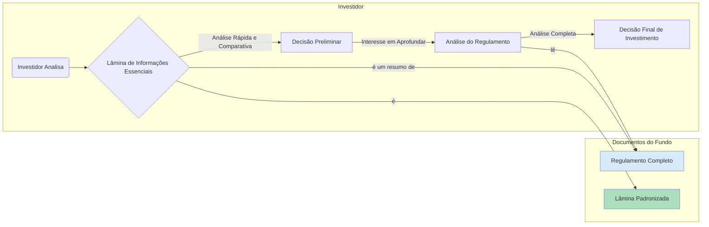

# Regulação e Supervisão 

**Autor:** Rodrigo Marques
**Versão:** 1.0

---

## Sumário Executivo

Este documento técnico oferece uma análise exaustiva da Resolução CVM nº 175, de 23 de dezembro de 2022, o novo marco regulatório da indústria de fundos de investimento no Brasil, com um foco específico e aprofundado em suas implicações para os Fundos de Investimento em Direitos Creditórios (FIDCs). A Resolução 175 representa a mais significativa modernização da regulamentação de fundos em duas décadas, buscando alinhar o mercado brasileiro às melhores práticas internacionais, aumentar a eficiência, a transparência e a segurança jurídica. Dissecamos a estrutura da nova norma, composta por uma parte geral e anexos normativos específicos, detalhando as profundas mudanças trazidas pelo Anexo Normativo II, dedicado exclusivamente aos FIDCs. A análise cobre temas como a nova estrutura de classes e subclasses com patrimônio segregado, a redefinição das responsabilidades dos prestadores de serviço (administrador, gestor, custodiante), as novas exigências de transparência e divulgação de informações (como a Lâmina de Informações Essenciais), e as regras detalhadas para a política de investimento, gestão de riscos e constituição das carteiras. O objetivo é servir como um guia de referência para gestores, administradores, custodiantes, investidores e advogados, decodificando as complexidades da Resolução 175 e fornecendo uma visão clara sobre o novo paradigma regulatório que moldará o futuro do mercado de FIDCs no Brasil.

---

## 1. Introdução: Um Novo Paradigma para a Indústria de Fundos

A indústria de fundos de investimento no Brasil, uma das maiores e mais desenvolvidas do mundo, passou por uma transformação monumental com a edição da Resolução CVM nº 175, em 23 de dezembro de 2022. Este novo marco regulatório, que substituiu um conjunto de normas esparsas, incluindo a emblemática Instrução CVM nº 555 (para fundos em geral) e as Instruções CVM nº 356 e 444 (para FIDCs e FIDC-NPs), representa um divisor de águas, um esforço da Comissão de Valores Mobiliários (CVM) para modernizar, simplificar e fortalecer o ambiente de negócios para fundos de investimento no país.

A Resolução 175 não é uma mera atualização; ela reestrutura a própria lógica da regulamentação. Inspirada em modelos de jurisdições maduras, como a europeia (UCITS) e a americana, a norma adota uma estrutura modular, com uma **Parte Geral**, que estabelece os princípios e regras aplicáveis a todos os fundos de investimento, e **Anexos Normativos**, que tratam das especificidades de cada categoria de fundo. 

Nesse novo cenário, os Fundos de Investimento em Direitos Creditórios (FIDCs) ganharam um anexo próprio, o **Anexo Normativo II**. Essa dedicação exclusiva reflete a importância e a complexidade que os FIDCs adquiriram no mercado de capitais brasileiro, consolidando-se como um instrumento fundamental de securitização e financiamento para a economia real.

Este documento técnico tem como objetivo dissecar o arcabouço da Resolução CVM 175, com um mergulho profundo nas regras aplicáveis aos FIDCs. Nossa análise não se limitará a uma simples descrição das novas regras, mas buscará interpretar suas implicações práticas para a estruturação, gestão, distribuição e supervisão desses fundos. Percorreremos os seguintes temas centrais:

*   **A Arquitetura da Resolução 175:** Compreender a lógica da Parte Geral e a interação com os Anexos Normativos.
*   **A Revolução das Classes e Subclasses:** Analisar a permissão para a criação de classes de cotas com patrimônio segregado dentro de um mesmo fundo, uma das inovações mais impactantes da norma.
*   **A Nova Definição de Responsabilidades:** Detalhar a clara delimitação das obrigações e responsabilidades do administrador fiduciário e do gestor de recursos, um ponto nevrálgico para a governança dos fundos.
*   **O Anexo Normativo II em Detalhe:** Explorar as regras específicas para os FIDCs, incluindo política de investimento, critérios para direitos creditórios, regras de revolvência, e as particularidades dos FIDC-NPs.
*   **Transparência e Proteção ao Investidor:** Examinar as novas ferramentas de divulgação de informação, como a Lâmina de Informações Essenciais, e os mecanismos de proteção ao investidor.

A Resolução CVM 175 não é apenas um novo conjunto de regras; é a fundação sobre a qual a próxima geração de fundos de investimento, incluindo os FIDCs, será construída. Compreendê-la em profundidade é, portanto, uma tarefa indispensável para todos os profissionais que atuam e para os investidores que alocam capital neste mercado dinâmico e vital.

## 2. A Arquitetura da Resolução CVM 175: Parte Geral e Anexos

A grande inovação da Resolução 175 é sua estrutura. Ao separar as regras gerais das regras específicas, a CVM criou um sistema mais flexível, coerente e fácil de navegar. 

### 2.1. A Parte Geral: A Base Comum

A Parte Geral da resolução estabelece os fundamentos aplicáveis a **todos** os fundos de investimento, independentemente de sua classificação. Ela funciona como a "constituição" da indústria de fundos. Seus principais pilares são:

*   **Constituição e Funcionamento:** Define os procedimentos para a criação de um fundo, o conteúdo obrigatório do regulamento e as regras gerais de funcionamento.
*   **Prestadores de Serviço Essenciais:** Define as figuras do **administrador fiduciário** e do **gestor de recursos** e delimita suas respectivas responsabilidades de forma muito mais clara que a regulamentação anterior. Este ponto é crucial e será detalhado mais adiante.
*   **Política de Investimento:** Estabelece os requisitos gerais para a formulação da política de investimento do fundo.
*   **Patrimônio do Fundo:** Reafirma o princípio da segregação patrimonial do fundo em relação aos seus prestadores de serviço.
*   **Emissão e Resgate de Cotas:** Dispõe sobre as regras gerais para a emissão, amortização e resgate de cotas.
*   **Assembleia de Cotistas:** Regulamenta a convocação, instalação e deliberação das assembleias gerais de cotistas.
*   **Informação e Divulgação:** Cria um novo regime informacional, com a introdução de documentos como a Lâmina de Informações Essenciais.
*   **Supervisão da CVM:** Consolida as regras de supervisão e as penalidades aplicáveis.

### 2.2. Os Anexos Normativos: O Detalhamento Específico

Anexados à Parte Geral, estão os anexos normativos, cada um dedicado a uma categoria específica de fundo. É aqui que a Resolução 175 ganha sua granularidade. Para os FIDCs, o documento de referência é o **Anexo Normativo II**.

**Estrutura Modular:**

```mermaid
graph TD
    subgraph Resolução CVM 175
        A[Parte Geral] --> B[Anexo I: Fundos Financeiros (FIF)];
        A --> C[Anexo II: Fundos de Investimento em Direitos Creditórios (FIDC)];
        A --> D[Anexo III: Fundos de Investimento Imobiliário (FII)];
        A --> E[Anexo IV: Fundos de Índice (ETF)];
        A --> F[... Outros Anexos ...];
    end

    style A fill:#D6EAF8,stroke:#333,stroke-width:2px
    style C fill:#A9DFBF,stroke:#333,stroke-width:4px
```

Essa estrutura significa que, para entender completamente as regras de um FIDC, é preciso ler o Anexo Normativo II **em conjunto** com a Parte Geral. O anexo prevalece sobre a parte geral em caso de conflito (princípio da especialidade), mas a parte geral se aplica em tudo o que o anexo for omisso.

Essa modularidade facilita futuras atualizações. Se a CVM precisar alterar uma regra específica para FIDCs, ela pode simplesmente emendar o Anexo II, sem a necessidade de reformar toda a regulamentação de fundos.

## 3. A Revolução das Classes e Subclasses de Cotas

Uma das inovações mais transformadoras da Resolução 175 é a possibilidade de um mesmo fundo de investimento possuir **diferentes classes de cotas com patrimônio segregado**.

### 3.1. Patrimônio Segregado: O Fim do "Contágio"

Na regulamentação anterior, embora um FIDC pudesse ter diferentes séries de cotas (com prazos e remunerações distintas), todo o patrimônio do fundo respondia solidariamente por todas as obrigações. Não havia uma verdadeira separação de risco entre as diferentes séries.

A Resolução 175, em seu Art. 10, permite que o regulamento do fundo crie diferentes classes de cotas, cada uma com:

*   **Direitos e obrigações distintos.**
*   **Patrimônio próprio, segregado do patrimônio das demais classes.**

Isso significa que os ativos que lastreiam uma classe de cotas respondem **apenas** pelas obrigações daquela classe. Não há o risco de "contágio", ou seja, um problema em uma carteira de ativos de uma classe não pode afetar os cotistas de outra classe do mesmo fundo.

**Implicações Práticas:**

*   **Eficiência Estrutural:** Em vez de criar múltiplos FIDCs (com múltiplos CNPJs, administradores, etc.), um gestor pode agora lançar um único FIDC "guarda-chuva" e, dentro dele, criar diferentes classes, cada uma com uma estratégia de investimento específica. Por exemplo, um mesmo FIDC pode ter:
    *   **Classe A:** Investe em direitos creditórios performados do agronegócio.
    *   **Classe B:** Investe em direitos creditórios não padronizados (precatórios).
    *   **Classe C:** Investe em direitos creditórios do setor imobiliário.

*   **Redução de Custos:** A estrutura de classes tende a reduzir os custos de administração, custódia e auditoria, já que muitas das funções podem ser centralizadas no nível do fundo "guarda-chuva".

### 3.2. Subclasses de Cotas

Dentro de cada classe, o fundo ainda pode emitir **subclasses** de cotas. As subclasses compartilham o mesmo patrimônio (da classe), mas podem se diferenciar por:

*   Público-alvo (ex: uma subclasse para varejo e outra para investidores profissionais).
*   Prazos e condições de emissão, amortização e resgate.
*   Taxas de administração, gestão e performance.

Para os FIDCs, a aplicação mais importante das subclasses é a manutenção da tradicional estrutura de subordinação. Dentro de uma mesma classe (com seu patrimônio segregado), o fundo emitirá:

*   **Subclasse de Cotas Sênior.**
*   **Subclasse de Cotas Mezanino.**
*   **Subclasse de Cotas Subordinada.**

O mecanismo de *waterfall* (cascata de pagamentos) e a absorção de perdas ocorrerão no nível das subclasses, dentro do patrimônio segregado daquela classe específica. A Resolução 175, portanto, não apenas manteve a estrutura de tranches dos FIDCs, como a fortaleceu, ao permitir que ela seja replicada em diferentes "bolsões" de risco isolados dentro de um mesmo fundo.

## 4. A Nova Definição de Responsabilidades: Administrador vs. Gestor

A Resolução 175 promoveu uma clara e muito aguardada segregação entre as funções do administrador fiduciário e do gestor de recursos. Essa mudança visa aumentar a especialização, a eficiência e, principalmente, a governança e a mitigação de conflitos de interesse.

### 4.1. O Administrador Fiduciário

O administrador, sob a nova regra, concentra-se em suas funções fiduciárias e de controle, atuando como o guardião dos interesses do fundo e de seus cotistas. Suas principais responsabilidades incluem:

*   **Constituição do fundo e registro na CVM.**
*   **Serviços de controladoria e custódia de ativos** (podendo contratar terceiros).
*   **Cálculo do valor da cota e contabilidade do fundo.**
*   **Supervisão da gestão de riscos** (verificação e monitoramento).
*   **Contratação e supervisão dos demais prestadores de serviço**, incluindo o gestor.
*   **Exercício do direito de voto** decorrente dos ativos do fundo (salvo se o regulamento atribuir ao gestor).

Essencialmente, o administrador é o "dono" do processo, o responsável final pelo fundo perante a CVM e os cotistas. Ele tem o dever de fiscalizar o gestor e os outros prestadores de serviço.

### 4.2. O Gestor de Recursos

O gestor, por sua vez, foca-se exclusivamente naquilo que é sua especialidade: a gestão da carteira de investimentos. Suas responsabilidades são:

*   **Tomada de decisão de investimento e desinvestimento** (compra e venda dos ativos).
*   **Gestão dos riscos** inerentes à carteira de investimentos.
*   **Negociação dos ativos** em nome do fundo.

Essa separação é particularmente relevante para os FIDCs. O gestor é responsável por encontrar e analisar os direitos creditórios, decidir pela sua aquisição e gerenciar o risco de crédito da carteira. O administrador, por outro lado, é responsável por garantir que o gestor atue dentro dos limites do regulamento, por contratar um custodiante diligente para validar os ativos e por assegurar que toda a operação do fundo esteja em conformidade com a lei.

Essa "divisão de poderes" cria um sistema de freios e contrapesos que fortalece a governança do fundo. O administrador tem o dever (e o poder) de questionar e, se necessário, substituir um gestor que não esteja cumprindo suas obrigações ou que esteja expondo o fundo a riscos indevidos.

## 5. O Anexo Normativo II: O Coração da Regulação dos FIDCs

O Anexo II da Resolução 175 é o manual de instruções para a estruturação e operação de FIDCs. Ele detalha as regras específicas que se somam à Parte Geral. Vamos explorar seus pontos mais críticos.

### 5.1. Política de Investimento (Art. 21)

O anexo estabelece um conteúdo mínimo muito mais detalhado para a política de investimento, que deve constar no regulamento. Ela deve dispor, no mínimo, sobre:

*   **Segmentos econômicos e natureza dos direitos creditórios.**
*   **Processos de originação e políticas de concessão de crédito** dos cedentes.
*   **Critérios de elegibilidade dos direitos creditórios** e condições de cessão.
*   **Requisitos de composição e diversificação da carteira** (limites de concentração por devedor, por exemplo).
*   **Limites para aplicação em ativos com partes relacionadas.**
*   **Hipóteses de revolvência** dos direitos creditórios.
*   **Regras para cessão de créditos** para o cedente ou partes relacionadas.

Essa exigência aumenta a transparência e permite que o investidor compreenda exatamente qual o tipo de risco de crédito ao qual estará exposto.

### 5.2. Verificação e Validação dos Ativos

O anexo reforça o papel dos prestadores de serviço na verificação da conformidade e existência dos direitos creditórios. 

*   **Obrigações do Gestor (Art. 37):** O gestor é responsável por realizar uma **diligência prévia** sobre os cedentes e originadores, analisando sua situação econômico-financeira e sua capacidade de originar os créditos.

*   **Obrigações do Custodiante (Art. 38):** O custodiante deve realizar a **verificação do lastro** dos direitos creditórios, ou seja, confirmar se os documentos que comprovam a existência e a titularidade do crédito são válidos e suficientes. Essa verificação deve ser feita por amostragem, com base em critérios estatísticos definidos em seu manual de procedimentos.

*   **Registro em Entidade Registradora (Art. 39):** A regra geral é que os direitos creditórios devem ser registrados em entidades autorizadas pelo Banco Central (como a B3 e a CRDC). Esse registro centralizado é um mecanismo fundamental para evitar a duplicidade na cessão de créditos (venda do mesmo crédito para mais de um FIDC), mitigando o risco de fraude.

### 5.3. FIDC-NP e o Investidor Profissional

O Anexo II consolida as regras para os FIDCs Não Padronizados, mantendo a exigência de que a subscrição de suas cotas, em mercado primário, seja restrita a **investidores profissionais**. A definição de direitos creditórios não padronizados (Art. 4º) foi aprimorada, como já visto, para dar mais clareza sobre quais ativos se enquadram nessa categoria de maior risco.

## 6. Transparência e Supervisão: O Novo Regime Informacional

A Resolução 175 busca empoderar o investidor por meio da informação. Para isso, criou e aprimorou diversos documentos e relatórios.

*   **Lâmina de Informações Essenciais (Lâmina):** Este é um documento padronizado, com linguagem simples e direta, que resume as principais características do fundo (objetivo, política de investimento, perfil de risco, custos, etc.). Para FIDCs, a lâmina deve conter informações específicas sobre a carteira de crédito. O objetivo é permitir que o investidor compare diferentes fundos de forma mais fácil e objetiva.

*   **Relatórios Periódicos:** O anexo detalha o conteúdo dos informes mensais e trimestrais que o administrador deve enviar à CVM e disponibilizar aos cotistas. Esses relatórios devem conter informações sobre a composição da carteira, a performance, os resultados da verificação do lastro pelo custodiante e um relatório do gestor sobre a evolução dos negócios.

*   **Supervisão Baseada em Risco:** Com um regime informacional mais robusto e dados mais estruturados, a CVM aprimora sua capacidade de realizar uma supervisão baseada em risco, focando seus esforços de fiscalização nos fundos e prestadores de serviço que apresentam maiores indícios de problemas.

## 7. Conclusão: Maturidade e Desafios Futuros

A Resolução CVM 175, e em especial seu Anexo Normativo II, eleva a regulamentação dos FIDCs a um novo patamar de maturidade. Ao adotar uma estrutura mais flexível, delimitar claramente as responsabilidades, e exigir mais transparência, a CVM cria as condições para um crescimento ainda mais robusto e sustentável do mercado de securitização no Brasil.

Contudo, a nova norma também traz desafios. A implementação da estrutura de classes, a adaptação aos novos requisitos de informação e a maior responsabilidade na supervisão dos prestadores de serviço exigirão investimentos em sistemas, processos e pessoal por parte de toda a indústria. A segregação de responsabilidades entre administrador e gestor, embora positiva, demandará uma nova dinâmica de relacionamento e fiscalização mútua.

Para o investidor, o resultado final tende a ser muito positivo: um mercado com mais opções de produtos, mais transparente e com uma governança mais sólida. A Resolução 175 não é o fim da linha, mas um passo decisivo na contínua evolução de um dos mais importantes instrumentos do mercado de capitais brasileiro. A capacidade do mercado de se adaptar e inovar sob este novo paradigma definirá o sucesso desta que é, sem dúvida, a mais importante reforma regulatória da indústria de fundos em 20 anos.

_


## 6. Aprofundamento: A Estrutura da Resolução CVM 175 e o Anexo Normativo II

A Resolução CVM 175 é um diploma normativo extenso e modular. Sua estrutura foi pensada para ser flexível e permitir a evolução do mercado sem a necessidade de se reformar todo o texto a cada nova inovação. Ela é composta por uma **Parte Geral** e por **Anexos Normativos** específicos para cada categoria de fundo de investimento.

*   **Parte Geral:** Contém as regras aplicáveis a **todos** os fundos de investimento, independentemente de sua natureza. Ela trata de temas como o registro do fundo, as obrigações e responsabilidades do administrador e do gestor, a divulgação de informações, a distribuição de cotas, etc. É a espinha dorsal da regulação.

*   **Anexos Normativos:** Cada anexo contém as regras específicas para uma determinada classe de fundos. Por exemplo, há um anexo para os Fundos de Investimento Financeiro (FIFs), um para os Fundos de Investimento em Participações (FIPs) e, o mais importante para nós, o **Anexo Normativo II**, que é inteiramente dedicado aos Fundos de Investimento em Direitos Creditórios (FIDCs).

Essa estrutura significa que, para entender a regulação de um FIDC, é preciso ler a Parte Geral **em conjunto** com o Anexo Normativo II. As regras do anexo prevalecem sobre as da Parte Geral em caso de conflito (princípio da especialidade).

### 6.1. Principais Disposições do Anexo Normativo II (FIDCs)

O Anexo Normativo II é o coração da regulação dos FIDCs. Ele detalha as particularidades que diferenciam esses fundos dos demais. Vamos analisar seus pontos mais críticos:

**Definição de Direitos Creditórios (Art. 2º):**

O anexo começa por definir o que pode ser considerado um direito creditório para fins de investimento por um FIDC. A definição é ampla e inclui:

*   Direitos e títulos representativos de crédito, originários de operações realizadas nos segmentos financeiro, comercial, industrial, imobiliário, de hipotecas, de arrendamento mercantil e de prestação de serviços.
*   Contratos de promessa de compra e venda, e contratos de locação.
*   Ações, debêntures, e outros valores mobiliários, desde que a aquisição seja consistente com a política de investimento.

Essa definição ampla é o que permite a existência de FIDCs com carteiras tão diversas, desde duplicatas até precatórios e créditos de carbono.

**Originação e Cessão (Art. 3º e 4º):**

O anexo estabelece que os direitos creditórios devem ser constituídos (originados) e cedidos por um originador ou cedente, que pode ser uma instituição financeira ou qualquer outra companhia que realize operações de crédito. O cedente é corresponsável pela existência e validade dos créditos cedidos ao fundo.

**Estrutura de Cotas (Art. 7º e 8º):**

Esta é uma das seções mais importantes. O anexo formaliza a possibilidade de o FIDC emitir cotas de classes distintas, com direitos e obrigações diferentes, estabelecendo a base para a estrutura de subordinação:

*   **Cotas de Classe Sênior:** Têm preferência no recebimento de amortização e juros.
*   **Cotas de Classes Subordinadas:** Absorvem as perdas da carteira antes das cotas seniores. O anexo exige que o regulamento descreva detalhadamente a relação de subordinação entre as classes.

**Prestadores de Serviço Essenciais (Capítulo V):**

O anexo detalha as obrigações dos prestadores de serviço que são específicos ou particularmente importantes para os FIDCs:

*   **Custodiante (Art. 38):** Como já vimos, o anexo confere ao custodiante o dever de verificar, por amostragem, a existência e a validade do lastro dos direitos creditórios.
*   **Agente de Cobrança (Servicer):** Embora não seja uma função obrigatória pela norma, o anexo reconhece sua importância e exige que, caso contratado, suas funções e responsabilidades estejam claras no regulamento.
*   **Agência de Classificação de Risco (Art. 41):** Para FIDCs cujas cotas se destinem ao público em geral (investidores de varejo), a contratação de uma agência de rating para avaliar as cotas sênior é **obrigatória**.

**Verificação e Registro do Lastro (Art. 38 e 39):**

O Anexo II trouxe um grande avanço na segurança dos FIDCs ao tornar obrigatória a **verificação do lastro pelo custodiante** e o **registro dos direitos creditórios em entidades registradoras** autorizadas pelo Banco Central. Essas duas medidas, combinadas, criam um sistema de controle robusto contra a cessão de créditos inexistentes ou a dupla cessão do mesmo crédito, que eram as principais fontes de fraude no mercado.

**FIDCs Não Padronizados (FIDC-NP) (Art. 42):**

O anexo dedica um artigo específico para os FIDC-NPs, reconhecendo sua natureza de maior risco. A principal regra, como já detalhado, é a restrição de seu público-alvo a **investidores profissionais**, garantindo que apenas os investidores mais sofisticados e com maior capacidade de suportar perdas tenham acesso a esses produtos.

### 6.2. A Responsabilidade do Administrador e do Gestor

A Resolução 175, como um todo, reforça o conceito de **responsabilidade fiduciária** do administrador e do gestor. Eles não são meros executores de ordens; eles têm o dever de agir com lealdade e diligência em relação ao fundo e a seus cotistas.

*   **Dever de Diligência (Due Diligence):** A Parte Geral da resolução (Art. 12) e o Anexo II (Art. 37) deixam claro que o administrador e o gestor têm o dever de realizar uma análise aprofundada (due diligence) dos ativos antes de sua aquisição. Eles são responsáveis por garantir que a política de investimento seja cumprida e que os ativos adquiridos sejam adequados ao perfil de risco do fundo.

*   **Supervisão dos Prestadores de Serviço:** O administrador é o responsável final pelo fundo. Ele tem o dever de selecionar, contratar e **supervisionar** todos os demais prestadores de serviço (gestor, custodiante, auditor, etc.). Se um custodiante for negligente em sua função de verificação do lastro, por exemplo, o administrador pode ser responsabilizado por não ter supervisionado adequadamente seu trabalho.

*   **Gerenciamento de Riscos:** A resolução exige que o administrador e o gestor implementem uma estrutura robusta de gerenciamento de riscos, que seja capaz de identificar, medir, monitorar e controlar todos os riscos relevantes para o fundo, incluindo o risco de crédito, o risco de liquidez, o risco de mercado e o risco operacional.

Em suma, a Resolução CVM 175 e seu Anexo II representam um arcabouço regulatório moderno e abrangente, que busca equilibrar a flexibilidade para a inovação de produtos com a necessidade de proteção ao investidor e de integridade do mercado. Para o analista de FIDCs, o conhecimento profundo dessas regras não é opcional; é a base para entender os direitos, os deveres e os riscos de cada participante dessa complexa estrutura de investimento.


## 7. Aprofundamento: O Novo Regime Informacional e a Lâmina do Fundo

A Resolução CVM 175 promoveu uma reforma completa no regime de divulgação de informações dos fundos de investimento, com o objetivo de tornar a comunicação com o investidor mais clara, objetiva e útil para a tomada de decisão. A filosofia por trás da mudança foi a de substituir um grande volume de documentos prolixos e de difícil compreensão por informações mais diretas e padronizadas. As duas principais inovações nesse campo foram a reestruturação do regulamento e a criação da **Lâmina de Informações Essenciais**.

### 7.1. O Regulamento em Camadas

Na regulamentação anterior, o regulamento do fundo era um documento único, extenso e denso, que misturava informações essenciais para o investidor com cláusulas operacionais e jurídicas complexas. A Resolução 175 instituiu um sistema de **regulamento em camadas**, composto por três partes distintas:

1.  **Lâmina de Informações Essenciais:** Um documento curto, padronizado e em linguagem simples, que apresenta as informações mais importantes para a decisão de investimento. É a porta de entrada para o investidor.
2.  **Regulamento do Fundo:** O documento principal, que contém todas as regras de funcionamento do fundo, seus direitos e obrigações, a política de investimento detalhada, as taxas, etc. Embora ainda seja um documento completo, ele foi reorganizado para ser mais claro.
3.  **Anexos ao Regulamento:** Documentos complementares que podem ser necessários, como o detalhamento da metodologia de precificação de ativos ou o contrato com prestadores de serviço.

Essa estrutura permite que o investidor acesse a informação em níveis de profundidade. Ele pode ter uma visão geral rápida na lâmina e, se desejar, aprofundar sua análise consultando o regulamento completo.

### 7.2. A Lâmina de Informações Essenciais

A Lâmina é a grande estrela do novo regime informacional. Para os FIDCs, ela representa um avanço notável em termos de transparência sobre os riscos específicos desses fundos. O Anexo I da Resolução 175 detalha o conteúdo obrigatório da lâmina, que deve ser apresentada de forma comparável entre todos os fundos, permitindo ao investidor confrontar diferentes opções de investimento.

**Principais Seções da Lâmina para um FIDC:**

*   **Informações Básicas:** Nome do fundo, CNPJ, classificação (FIDC), público-alvo (varejo, qualificado, profissional), nome do administrador e do gestor.

*   **Objetivo e Política de Investimento (Resumida):** Uma descrição concisa e em linguagem clara de qual é o objetivo do fundo e que tipo de direitos creditórios ele pretende adquirir. Deve informar os segmentos econômicos da carteira e se há concentração em poucos devedores ou cedentes.

*   **Público-Alvo e Restrições:** Indicação clara para qual tipo de investidor o fundo se destina e os motivos para tal (ex: "Destinado a investidores profissionais devido ao alto risco e complexidade dos ativos não padronizados").

*   **Fatores de Risco Relevantes:** Esta é uma das seções mais importantes. A lâmina deve apresentar, de forma destacada, os principais riscos do fundo. Para um FIDC, isso inclui, obrigatoriamente:
    *   **Risco de Crédito:** O risco de inadimplência dos devedores dos direitos creditórios.
    *   **Risco de Liquidez:** A dificuldade de vender as cotas do fundo no mercado secundário.
    *   **Risco de Mercado:** O risco de oscilações nas taxas de juros e outros indicadores econômicos afetarem o valor dos ativos.
    *   **Riscos Específicos do FIDC:** A lâmina deve detalhar os riscos relacionados à verificação do lastro, à qualidade do cedente, à performance do servicer e à complexidade da estrutura de subordinação.

*   **Escala de Perfil de Risco:** O administrador deve classificar o fundo em uma escala de risco, de 1 (mais conservador) a 5 (mais arrojado), com base na volatilidade e na complexidade da carteira. Um FIDC, especialmente um FIDC-NP, estará geralmente nas categorias de maior risco.

*   **Informações sobre as Cotas:** Detalhes sobre as diferentes classes e subclasses de cotas, explicando de forma simples a estrutura de subordinação e a ordem de preferência no pagamento e na absorção de perdas.

*   **Despesas do Fundo:** Apresentação clara de todas as taxas que incidem sobre o fundo (administração, gestão, performance, etc.), incluindo um exemplo do impacto percentual dessas taxas sobre o patrimônio.

*   **Histórico de Rentabilidade:** Gráfico comparando a rentabilidade passada do fundo com a de um indicador de referência (*benchmark*) apropriado (ex: CDI).

*   **Composição da Carteira:** Um resumo da composição da carteira de direitos creditórios, mostrando a diversificação por setor, o número de devedores e a concentração nos maiores devedores.

*   **Tributação:** Informações sobre a incidência de Imposto de Renda e IOF, incluindo o regime de come-cotas.

A Lâmina deve ser atualizada mensalmente e disponibilizada no site do administrador e do distribuidor do fundo. Ela se torna o principal documento de marketing e de divulgação do produto, substituindo os antigos materiais publicitários que eram menos padronizados e, muitas vezes, menos transparentes.

Para o mercado de FIDCs, que sempre foi visto como mais opaco e complexo, a Lâmina de Informações Essenciais é uma ferramenta poderosa para desmistificar o produto e para permitir que os investidores tomem decisões mais conscientes, com uma compreensão clara dos riscos que estão assumindo.


## 9. Aprofundamento: O Novo Regime Informacional e a Lâmina do Fundo

A Resolução CVM 175 promoveu uma reforma significativa no regime de divulgação de informações dos fundos de investimento, com o objetivo de tornar a comunicação com o investidor mais clara, direta, padronizada e útil para a tomada de decisão. A filosofia por trás da mudança é substituir a antiga profusão de documentos longos e de difícil compreensão por um conjunto de informações mais enxuto e focado no que é essencial. As duas principais inovações nesse sentido são o Documento de Informações Essenciais (DIE) e a Lâmina de Informações Essenciais.

### 9.1. O Fim do Formulário de Informações Complementares (FIC)

Na regulamentação anterior, o Formulário de Informações Complementares (FIC) era um documento extenso e, muitas vezes, repetitivo em relação ao regulamento, que tentava detalhar as características do fundo. A CVM percebeu que o FIC havia se tornado excessivamente longo e complexo, perdendo sua utilidade como ferramenta de comunicação rápida para o investidor.

A Resolução 175 extinguiu o FIC e redistribuiu suas informações em dois novos documentos, com propósitos distintos: o regulamento do fundo e a lâmina.

### 9.2. O Regulamento do Fundo: O Contrato Central

O regulamento do fundo foi fortalecido como o documento central e o contrato que rege a relação entre o cotista, o administrador e o gestor. Ele contém todas as regras de funcionamento do fundo de forma detalhada e completa. A Resolução 175 estabelece, em seu Anexo A, o conteúdo mínimo obrigatório do regulamento, que deve ser escrito de forma clara e organizada.

Para os FIDCs, o regulamento deve conter, além das informações gerais, todos os detalhes específicos da operação, como:

*   A descrição detalhada da política de investimento e dos critérios de elegibilidade dos direitos creditórios.
*   As regras do período de revolvência e os gatilhos de performance.
*   A descrição da estrutura de subordinação e da cascata de pagamentos (waterfall).
*   A metodologia de precificação dos ativos e a política de provisionamento de perdas.
*   As responsabilidades de todos os prestadores de serviço, incluindo o custodiante e o agente de cobrança.

O regulamento é o documento de referência para uma análise aprofundada, mas, por sua natureza contratual e detalhada, não é um instrumento de comunicação ágil.

### 9.3. A Lâmina de Informações Essenciais: A Comunicação Direta

Para resolver o problema da comunicação ágil e padronizada, a Resolução 175 criou a **Lâmina de Informações Essenciais**. Este é, talvez, o documento mais importante para o investidor de varejo e mesmo para o investidor qualificado em um primeiro momento de análise.

*   **O que é?** A lâmina é um documento eletrônico, padronizado, curto e de fácil leitura, que apresenta as principais características do fundo de forma comparável. A ideia é que o investidor possa colocar as lâminas de diferentes fundos lado a lado e comparar suas características mais importantes.

*   **Conteúdo Padronizado:** O conteúdo da lâmina é estritamente definido pela CVM e deve incluir, entre outras coisas:
    *   **Público-alvo:** Para quem o fundo é destinado (investidores em geral, qualificados, profissionais).
    *   **Objetivo do Fundo:** Uma descrição curta e direta do objetivo do investimento.
    *   **Política de Investimento:** Um resumo da política de investimento, destacando os principais ativos da carteira.
    *   **Informações sobre o Administrador e o Gestor.**
    *   **Escala de Risco:** Uma escala de risco padronizada, de 1 a 5, que classifica o risco do fundo com base em sua volatilidade e outros fatores de risco (como risco de crédito e de liquidez). Para FIDCs, o risco de crédito é o principal componente dessa escala.
    *   **Histórico de Rentabilidade:** Gráficos comparando a rentabilidade do fundo com a de seu benchmark (índice de referência).
    *   **Composição da Carteira:** Um resumo da composição da carteira de ativos.
    *   **Descrição das Taxas:** Todas as taxas cobradas pelo fundo (administração, gestão, performance, etc.) devem ser apresentadas de forma clara.
    *   **Condições de Investimento:** Informações sobre aplicação mínima, prazos de resgate, etc.

*   **Lâmina para FIDCs:** O Anexo Normativo II da Resolução 175 estabelece requisitos específicos para a lâmina de um FIDC. Ela deve conter, adicionalmente:
    *   Uma descrição clara dos tipos de direitos creditórios que compõem a carteira.
    *   Informações sobre a estrutura de subordinação, mostrando o percentual de cada classe de cotas.
    *   Um alerta de risco destacado sobre as particularidades do investimento em direitos creditórios, como o risco de crédito e de liquidez.

*   **Atualização e Acesso:** A lâmina deve ser atualizada mensalmente e disponibilizada de forma fácil e gratuita no site do administrador e, quando aplicável, do distribuidor do fundo.

**Diagrama do Novo Fluxo de Informação:**



O novo regime informacional, centrado na combinação de um regulamento completo e uma lâmina padronizada, representa um avanço significativo na proteção e na educação do investidor. Para os FIDCs, a lâmina se torna uma ferramenta crucial para desmistificar um produto complexo, apresentando seus riscos e características de forma transparente e permitindo que os investidores tomem decisões mais conscientes e bem-informadas.


## 9. Aprofundamento: O Novo Regime Informacional e a Lâmina do Fundo

A Resolução CVM 175 representa uma mudança de paradigma na forma como os fundos de investimento, incluindo os FIDCs, se comunicam com seus investidores. A filosofia central da nova norma é a de que a informação deve ser não apenas completa, mas também clara, concisa e útil para a tomada de decisão. Duas das inovações mais importantes nesse sentido são a reestruturação do regime informacional e a criação da Lâmina de Informações Essenciais do Fundo.

### 9.1. O Novo Regime Informacional: Camadas de Informação

A CVM abandonou o antigo modelo de um único e monolítico regulamento para todos os fundos. A nova estrutura é modular, organizada em camadas de informação, permitindo que o investidor aprofunde seu conhecimento de acordo com sua necessidade e sofisticação.

**A Estrutura em Camadas:**

1.  **Lâmina de Informações Essenciais:**
    *   **O que é:** Um documento curto, padronizado e em linguagem simples, que funciona como a "capa" do fundo. É a primeira camada de informação, projetada para fornecer uma visão geral e comparável dos principais aspectos do FIDC.
    *   **Objetivo:** Permitir que o investidor tenha, em poucas páginas, uma compreensão clara da política de investimento, dos principais fatores de risco, dos custos e do público-alvo do fundo. A padronização facilita a comparação entre diferentes FIDCs.

2.  **Regulamento do Fundo:**
    *   **O que é:** O documento principal que estabelece todas as regras de funcionamento do fundo. Com a Resolução 175, o regulamento foi simplificado, contendo apenas as informações essenciais que são comuns a todas as classes de cotas.
    *   **Objetivo:** Funcionar como o "contrato" central do fundo, definindo os direitos e deveres dos cotistas, do administrador e do gestor.

3.  **Anexo Descritivo da Classe:**
    *   **O que é:** Esta é uma grande inovação. Para cada classe de cotas emitida pelo FIDC, haverá um anexo específico que detalha as regras daquela classe. Se um FIDC tem uma classe de cotas sênior e uma subordinada, haverá um anexo para cada uma.
    *   **Objetivo:** Permitir a criação de estratégias de investimento e estruturas de risco diferentes dentro do mesmo fundo (com patrimônio segregado), sem poluir o regulamento principal. O anexo conterá informações detalhadas sobre a política de investimento da classe, os critérios de elegibilidade dos ativos, os limites de concentração, os gatilhos de performance, a estrutura de taxas e o *waterfall* de pagamentos daquela classe específica.

4.  **Demonstrações Financeiras e Relatórios Periódicos:**
    *   **O que é:** O conjunto de relatórios contábeis e gerenciais que fornecem uma visão detalhada da composição da carteira, da performance e da saúde financeira do fundo.
    *   **Objetivo:** Oferecer transparência contínua sobre a gestão e os resultados do FIDC.

Essa estrutura em camadas permite que um investidor comece pela Lâmina para uma análise rápida, avance para o Regulamento e o Anexo da Classe para entender as regras do jogo em detalhe, e, por fim, analise as demonstrações financeiras para um acompanhamento profundo.

### 9.2. A Lâmina de Informações Essenciais do FIDC

A Lâmina é, talvez, a inovação de maior impacto para o investidor de varejo e qualificado. Ela padroniza a apresentação das informações mais críticas, combatendo a assimetria de informação e o excesso de "juridiquês".

**Conteúdo Obrigatório da Lâmina de um FIDC (conforme Anexo C do Anexo Normativo I da Resolução 175):**

| Seção | Conteúdo Detalhado |
| :--- | :--- |
| **1. Informações Básicas** | Nome do fundo, CNPJ, nome do administrador e do gestor, e a classe e o público-alvo. |
| **2. Política de Investimento** | Descrição clara e sucinta do objetivo do fundo e da política de investimento. Deve informar o tipo de direitos creditórios que o fundo busca adquirir (ex: "crédito consignado para aposentados", "NPLs de cartão de crédito", "precatórios federais"). Deve indicar se é um FIDC padronizado ou não padronizado (FIDC-NP). |
| **3. Principais Fatores de Risco** | Apresentação dos principais fatores de risco associados ao investimento, em linguagem clara. Para um FIDC, isso deve obrigatoriamente incluir o **risco de crédito** (inadimplência dos devedores), o **risco de liquidez** (dificuldade de vender as cotas) e o **risco de mercado** (flutuação de juros e preços). Para FIDC-NPs, os riscos específicos (legal, operacional) devem ser destacados. |
| **4. Cenários de Performance** | O fundo deve apresentar simulações de qual seria o resultado do investimento em três cenários: pessimista, neutro e otimista. Isso ajuda o investidor a ter uma noção da faixa de retornos (e perdas) possíveis. |
| **5. Histórico de Rentabilidade** | Gráfico comparando a rentabilidade passada do fundo com um benchmark (índice de referência) adequado. A lâmina deve conter um aviso claro de que "rentabilidade passada não garante rentabilidade futura". |
| **6. Despesas do Fundo** | Tabela padronizada com todas as taxas que incidem sobre o fundo: taxa de administração, taxa de gestão, taxa de performance (se houver), e uma estimativa do total de despesas anuais (o "Total Expense Ratio" - TER). |
| **7. Informações Complementares** | Informações sobre o processo de compra e venda de cotas, a política de distribuição de rendimentos e os canais de atendimento para o investidor. |

O objetivo da Lâmina é transformar a experiência de análise de um fundo. Em vez de ter que garimpar informações em um regulamento de 80 páginas, o investidor tem em mãos um "raio-x" padronizado, que permite uma análise inicial muito mais rápida e eficiente e, principalmente, a comparação objetiva entre diferentes opções de investimento.

Para os FIDCs, que são produtos estruturalmente mais complexos, a Lâmina tem um papel ainda mais importante em traduzir essa complexidade em informações palatáveis, aumentando a transparência e, consequentemente, a confiança do investidor no produto.
