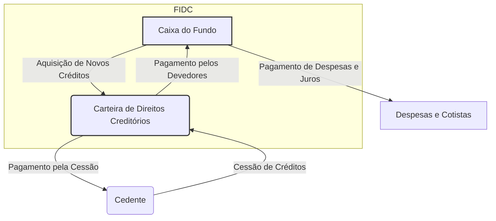
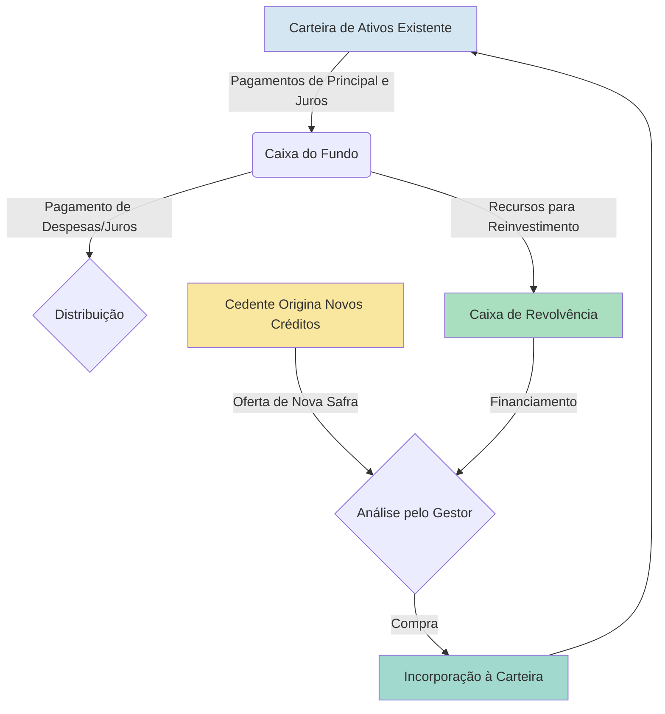
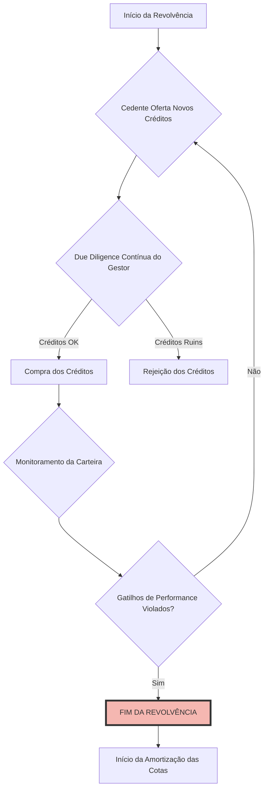
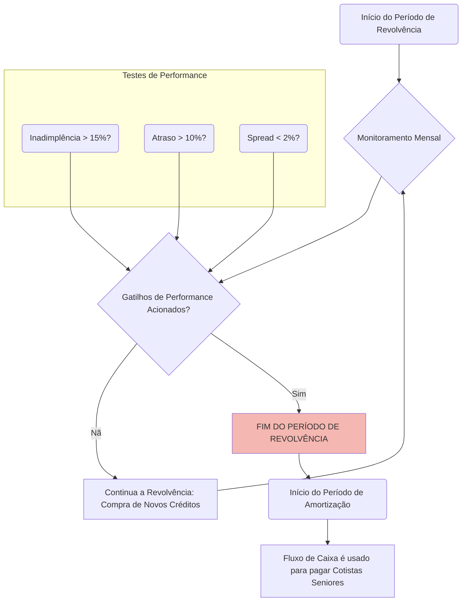

# Revolvência e Gestão

**Autor:** Rodrigo Marques
**Versão:** 1.0

---

## Sumário Executivo

Este documento técnico aprofunda o conceito de revolvência de ativos, uma característica estrutural fundamental para muitos Fundos de Investimento em Direitos Creditórios (FIDCs). A revolvência, ou o reinvestimento dos recursos gerados pela carteira em novos direitos creditórios, permite que o fundo mantenha um patrimônio investido relativamente estável ao longo de sua existência, otimizando a alocação de capital e o potencial de retorno. Analisamos em detalhe o mecanismo operacional da revolvência, os desafios e as estratégias de gestão de fluxo de caixa e liquidez (Asset-Liability Management - ALM) inerentes a essa dinâmica, e o impacto dessa estrutura no perfil de risco e retorno do fundo. Abordamos também os aspectos regulatórios, conforme a Resolução CVM 175, que disciplinam as operações de revolvência, estabelecendo critérios e limites para garantir a transparência e a segurança para os investidores. O objetivo é fornecer a gestores, administradores e investidores um guia completo sobre a complexa arte de gerir um FIDC revolvente, destacando as melhores práticas para o casamento de prazos, a projeção de fluxos de caixa e a mitigação dos riscos de liquidez e de reinvestimento.

---

## 1. Introdução ao Conceito de Revolvência em FIDCs

Os Fundos de Investimento em Direitos Creditórios (FIDCs) são veículos de securitização que transformam ativos de crédito, como duplicatas, cheques, aluguéis e outros recebíveis, em valores mobiliários (cotas) negociáveis no mercado de capitais. A estrutura básica de um FIDC envolve a aquisição de uma carteira de direitos creditórios que irá gerar um fluxo de caixa futuro, utilizado para remunerar os investidores (cotistas).

Em um FIDC "estático" ou de "carteira fechada", o fundo adquire um portfólio de ativos no início de sua operação e, à medida que esses créditos são pagos pelos devedores, os recursos são distribuídos aos cotistas, amortizando o principal e pagando os juros. O patrimônio do fundo, nesse caso, diminui progressivamente até a sua liquidação final.

No entanto, muitas operações de FIDC, especialmente aquelas lastreadas em ativos de curto prazo (como recebíveis de cartão de crédito ou duplicatas mercantis), são estruturadas como **FIDCs revolventes**. Nesses fundos, os recursos provenientes do pagamento dos direitos creditórios originais não são imediatamente distribuídos aos cotistas. Em vez disso, durante um período predeterminado conhecido como **período de revolvência**, esses recursos são reinvestidos na aquisição de novos direitos creditórios que atendam aos critérios de elegibilidade definidos no regulamento do fundo.

Essa dinâmica permite que o fundo mantenha seu patrimônio líquido (PL) relativamente constante durante o período de revolvência, funcionando como um veículo de financiamento contínuo para a(s) empresa(s) cedente(s). Apenas após o término do período de revolvência é que o fundo passa a utilizar os fluxos de caixa para amortizar as cotas, iniciando seu processo de desinvestimento até a liquidação.

Este documento explora em profundidade os aspectos técnicos, operacionais e estratégicos da revolvência de ativos em FIDCs, abordando:

*   **O Mecanismo da Revolvência:** Como funciona o ciclo de reinvestimento e quais são os seus componentes.
*   **Gestão de Fluxo de Caixa e Liquidez (ALM):** Os desafios de casar os prazos dos ativos e passivos em um ambiente dinâmico.
*   **Impacto no Risco e Retorno:** Como a revolvência afeta o perfil de risco do fundo, introduzindo o risco de reinvestimento, e como ela pode otimizar o retorno para os cotistas.
*   **Aspectos Regulatórios:** As regras e os limites impostos pela CVM para as operações de revolvência, visando a proteção dos investidores.

Compreender a revolvência é essencial para analisar e investir em uma vasta gama de FIDCs, pois essa característica altera fundamentalmente a dinâmica do fundo, sua gestão e seu perfil de risco.

## 2. O Mecanismo da Revolvência: Um Ciclo Contínuo

A operação de um FIDC revolvente pode ser visualizada como um ciclo contínuo de conversão de caixa em direitos creditórios e vice-versa. Esse ciclo perdura durante o período de revolvência, que pode durar de meses a vários anos, dependendo da estrutura da operação.

### 2.1. O Ciclo de Reinvestimento

O processo pode ser decomposto nas seguintes etapas, que se repetem continuamente:

**Diagrama do Ciclo de Revolvência:**

1.  **Geração de Caixa:** A carteira de direitos creditórios do FIDC gera caixa à medida que os devedores originais realizam os pagamentos de suas obrigações.
2.  **Acumulação de Caixa:** Os recursos são recebidos em uma conta específica do fundo.
3.  **Aquisição de Novos Ativos:** Em vez de usar esse caixa para amortizar as cotas, o gestor do fundo o utiliza para comprar novos direitos creditórios do cedente (ou de múltiplos cedentes, em um FIDC multicedente). Esses novos ativos devem, obrigatoriamente, seguir os **critérios de elegibilidade** definidos no regulamento do fundo. Esses critérios são a espinha dorsal da manutenção da qualidade da carteira e podem incluir, por exemplo:
    *   Prazo máximo do recebível.
    *   Concentração máxima por devedor.
    *   Rating mínimo do devedor.
    *   Setor de atuação do devedor.
    *   Ausência de histórico de inadimplência.
4.  **Manutenção do Patrimônio:** A aquisição de novos ativos recompõe a carteira, mantendo o montante total de direitos creditórios e, consequentemente, o patrimônio líquido do fundo em um nível relativamente estável.
5.  **Pagamento de Despesas e Juros:** Parte do fluxo de caixa gerado é utilizada para pagar as despesas operacionais do fundo (taxas de administração, gestão, etc.) e, em muitas estruturas, para pagar os juros (rendimentos) periódicos aos cotistas, sem amortizar o principal.

Este ciclo se repete até o **fim do período de revolvência**. A partir dessa data, o fundo para de adquirir novos ativos e passa a utilizar todo o caixa gerado pela carteira para amortizar as cotas, seguindo a ordem de prioridade do *waterfall* (seniores primeiro, depois mezanino e, por fim, subordinadas).

### 2.2. Período de Revolvência vs. Período de Amortização

A vida de um FIDC revolvente é tipicamente dividida em duas fases distintas:

| Fase | Descrição | Atividade Principal | Impacto no PL | 
| :--- | :--- | :--- | :--- | 
| **Período de Revolvência** | O fundo está em fase de "cruzeiro". Os recursos gerados pela carteira são reinvestidos na compra de novos ativos. | Aquisição de novos direitos creditórios. | O Patrimônio Líquido (PL) permanece relativamente estável. | 
| **Período de Amortização** | O fundo entra em fase de desinvestimento. Os reinvestimentos cessam e os recursos gerados são usados para pagar os cotistas. | Pagamento de principal e juros das cotas. | O Patrimônio Líquido (PL) diminui progressivamente até zero. | 

Essa estrutura é particularmente útil para empresas que têm uma necessidade contínua de capital de giro. Ao ceder seus recebíveis para um FIDC revolvente, a empresa estabelece uma fonte de financiamento de longo prazo, mesmo que seus recebíveis sejam de curto prazo.

## 3. Gestão de Fluxo de Caixa e Liquidez (ALM)

A gestão de um FIDC revolvente é significativamente mais complexa do que a de um fundo estático. O gestor precisa não apenas selecionar bons créditos, mas também gerenciar ativamente os fluxos de caixa para garantir que o fundo tenha liquidez para honrar suas obrigações e capacidade de reinvestir os recursos de forma eficiente. Essa disciplina é conhecida como **Asset-Liability Management (ALM)** - Gestão de Ativos e Passivos.

### 3.1. O Desafio do Casamento de Prazos

O principal desafio de ALM em um FIDC revolvente é o **descasamento de prazos** entre os ativos e os passivos.

*   **Ativos:** A carteira de direitos creditórios é dinâmica. O prazo médio da carteira (duration) muda constantemente à medida que créditos antigos são pagos e novos são adquiridos. A velocidade de pagamento dos devedores também pode variar, afetando a geração de caixa.
*   **Passivos:** As cotas do FIDC têm seus próprios cronogramas de pagamento de juros e amortização (especialmente após o período de revolvência). Em FIDCs abertos (mais raros, mas existentes), há ainda o risco de pedidos de resgate.

O gestor precisa garantir que o fluxo de caixa gerado pelos ativos seja suficiente para cobrir o fluxo de pagamentos exigido pelos passivos em todos os momentos. Um descasamento severo pode levar a uma crise de liquidez.

### 3.2. Projeção de Fluxos de Caixa

Uma projeção de fluxo de caixa robusta é a principal ferramenta do gestor. Esse modelo deve ser dinâmico e considerar múltiplas variáveis:

*   **Previsão de Pagamentos:** Estimar a velocidade com que os devedores pagarão suas obrigações. Isso envolve a análise de curvas de amortização, sazonalidade e comportamento histórico.
*   **Previsão de Inadimplência:** Projetar as perdas esperadas na carteira, que representam uma "drenagem" do fluxo de caixa.
*   **Previsão de Pré-pagamentos:** Em algumas classes de ativos (como crédito consignado), os devedores podem quitar suas dívidas antes do prazo. Isso acelera a entrada de caixa, mas também cria a necessidade de reinvestir os recursos mais rapidamente.
*   **Disponibilidade de Novos Ativos:** Projetar a capacidade do cedente de originar novos direitos creditórios que atendam aos critérios de elegibilidade. Uma quebra na originação pode deixar o fundo com excesso de caixa não investido, prejudicando a rentabilidade.

O gestor deve rodar **cenários de estresse** nessas projeções, simulando o impacto de um aumento na inadimplência, uma redução na velocidade de pagamento ou uma interrupção na originação de novos créditos.

### 3.3. Ferramentas de Gestão de Liquidez

Para mitigar o risco de liquidez, os FIDCs revolventes frequentemente utilizam instrumentos adicionais:

*   **Caixa Mínimo (Colchão de Liquidez):** Manter um percentual mínimo do patrimônio em caixa ou em ativos de alta liquidez (como títulos públicos) para cobrir despesas inesperadas ou descasamentos de curto prazo.
*   **Linhas de Crédito de Liquidez:** Contratar linhas de crédito com instituições financeiras que podem ser sacadas em caso de necessidade emergencial de caixa. Essas linhas têm um custo (taxa de compromisso), mas fornecem uma importante rede de segurança.
*   **Fundo de Reserva:** Além de servir como reforço de crédito, o fundo de reserva pode, em algumas estruturas, ser utilizado para prover liquidez em situações específicas.

## 4. Impacto no Perfil de Risco e Retorno

A estrutura de revolvência altera fundamentalmente o perfil de risco e retorno do FIDC quando comparado a uma estrutura estática.

### 4.1. Novos Riscos a Serem Gerenciados

A revolvência introduz ou amplifica certos riscos:

*   **Risco de Reinvestimento:** Este é o risco mais proeminente. É o risco de o gestor não conseguir reinvestir o caixa gerado pela carteira em novos ativos que ofereçam um retorno igual ou superior ao dos ativos originais. Isso pode ocorrer por duas razões:
    1.  **Falta de Ativos (Risco de Originação):** O cedente pode não conseguir gerar novos créditos na velocidade necessária, deixando o fundo com caixa ocioso, que rende pouco ou nada.
    2.  **Piora na Qualidade dos Ativos:** A qualidade dos novos créditos disponíveis pode ser inferior à dos créditos antigos, ou as taxas de juros de mercado podem ter caído, forçando o fundo a reinvestir em ativos menos rentáveis.

*   **Risco de Qualidade da Carteira (Risco de "Contaminação"):** Em um fundo estático, a qualidade da carteira é definida no momento da aquisição. Em um fundo revolvente, a qualidade da carteira é dinâmica. Se os critérios de elegibilidade não forem rigorosos ou se o monitoramento do custodiante for falho, há o risco de a carteira ser "contaminada" por ativos de pior qualidade ao longo do tempo, aumentando o risco de crédito geral do fundo.

*   **Risco de Descasamento (ALM Risk):** Como já discutido, o risco de descasamento de prazos e fluxos de caixa entre ativos e passivos é uma preocupação constante e central na gestão de um FIDC revolvente.

### 4.2. Otimização do Retorno

Apesar dos riscos, a estrutura revolvente oferece vantagens que podem otimizar o retorno para os investidores:

*   **Menor "Arrasto" de Caixa (Cash Drag):** Em um fundo estático, à medida que os ativos são pagos, o caixa se acumula e, se não for distribuído imediatamente, fica parado ou investido em ativos de baixa rentabilidade, reduzindo o retorno geral do fundo (efeito conhecido como *cash drag*). A revolvência minimiza esse efeito ao manter o capital constantemente investido em ativos de crédito, que são o motor de retorno do fundo.

*   **Alavancagem Temporal:** A revolvência permite que o fundo se beneficie do efeito dos juros compostos de forma mais eficiente. Ao reinvestir os recebimentos, o fundo mantém uma base de capital maior gerando juros por mais tempo.

*   **Flexibilidade e Gestão Ativa:** A estrutura revolvente permite que o gestor ajuste a carteira ao longo do tempo, desfazendo-se de exposições a setores ou devedores que se tornaram mais arriscados e concentrando-se em oportunidades mais atraentes, sempre dentro dos limites do regulamento.

## 5. Aspectos Regulatórios (Resolução CVM 175)

A CVM reconhece a importância e a complexidade das estruturas revolventes e, por isso, a Resolução 175 estabelece regras claras para essas operações no Anexo Normativo II.

O **Art. 21, inciso VI**, exige que a política de investimento do fundo, descrita em seu regulamento, disponha, no mínimo, sobre as **"hipóteses de revolvência dos direitos creditórios, se for o caso"**.

Isso significa que o regulamento do FIDC deve ser explícito sobre:

*   **A Existência do Período de Revolvência:** O documento deve afirmar claramente se o fundo terá ou não um período de revolvência.
*   **A Duração do Período de Revolvência:** A data de início e, principalmente, a data de término do período de revolvência devem estar claramente definidas.
*   **As Condições para Revolvência:** O regulamento deve detalhar os critérios de elegibilidade que os novos direitos creditórios devem cumprir para serem adquiridos com os recursos do fundo. Este é um ponto crucial para a proteção do investidor, pois impede que o gestor altere o perfil de risco da carteira discricionariamente.
*   **Gatilhos de Encerramento Antecipado (Triggers):** Muitas estruturas preveem gatilhos que podem encerrar o período de revolvência antecipadamente caso certos eventos de risco se materializem. Esses gatilhos são mecanismos de proteção para os cotistas. Exemplos comuns incluem:
    *   **Gatilho de Inadimplência:** Se a taxa de inadimplência da carteira ultrapassar um determinado percentual.
    *   **Gatilho de Performance:** Se o excesso de spread cair abaixo de um nível mínimo.
    *   **Gatilho de Originação:** Se o cedente não conseguir originar um volume mínimo de novos créditos por um período consecutivo.

Ao acionar um desses gatilhos, o fundo entra imediatamente em período de amortização, utilizando todo o caixa para pagar os cotistas e reduzir o risco da operação. A clareza e a objetividade na definição desses gatilhos no regulamento são fundamentais e objeto de escrutínio pela CVM.

## 6. Conclusão: A Gestão Dinâmica do Crédito

A revolvência de ativos é uma ferramenta poderosa na estruturação de FIDCs, transformando-os de simples veículos de securitização em plataformas de financiamento contínuo e gestão dinâmica de portfólios de crédito. Para as empresas cedentes, ela oferece uma fonte de capital de giro estável e de longo prazo. Para os investidores, ela promete uma alocação de capital mais eficiente e um potencial de retorno otimizado.

Contudo, essa dinâmica introduz camadas adicionais de complexidade e risco. A gestão de um FIDC revolvente exige um alto grau de sofisticação em projeção de fluxos de caixa, gestão de liquidez e análise de risco de reinvestimento. O sucesso de um fundo revolvente não depende apenas da qualidade dos créditos no momento inicial, mas da capacidade do gestor de manter essa qualidade ao longo do tempo, em um ciclo contínuo de desinvestimento e reinvestimento.

A regulação da CVM, ao exigir clareza sobre as regras do jogo no regulamento do fundo, fornece as bases para que os investidores possam tomar decisões informadas. Cabe a eles, e a seus assessores, analisar criticamente a duração do período de revolvência, os critérios de elegibilidade dos novos ativos e, principalmente, os gatilhos que protegem o seu capital caso o cenário se deteriore. Em última análise, a revolvência é um testemunho da maturidade e da versatilidade do mercado de FIDCs, mas que demanda um nível de diligência e monitoramento à altura de sua complexidade.

_

## 6. Aprofundamento Técnico: A Mecânica da Revolvência e Seus Controles

A operação de um FIDC com período de revolvência é significativamente mais complexa do que a de um fundo "estático", cuja carteira é definida no início e simplesmente amortizada ao longo do tempo. A revolvência introduz uma dinâmica de gestão de portfólio ativa, onde o gestor precisa tomar decisões constantes de compra de novos ativos, financiadas pelo fluxo de caixa gerado pela própria carteira. Essa mecânica requer um conjunto robusto de regras e controles, definidos no regulamento do fundo, para garantir que a qualidade de crédito do portfólio não se deteriore ao longo do tempo.

### 6.1. O Ciclo da Revolvência: Como Funciona na Prática

O ciclo de revolvência é um processo contínuo de reinvestimento. Vamos detalhar o fluxo de caixa:

1.  **Geração de Caixa:** A carteira de direitos creditórios existente gera um fluxo de caixa constante, proveniente do pagamento das parcelas (principal + juros) pelos devedores.

2.  **Acumulação no "Caixa de Revolvência":** Esse fluxo de caixa, após o pagamento das despesas do fundo e, em alguns casos, dos juros das cotas, não é distribuído aos cotistas como amortização de principal. Em vez disso, ele é acumulado em uma conta específica, o "caixa de revolvência".

3.  **Originação e Oferta de Novos Créditos:** O cedente (ou múltiplos cedentes) continua a originar novos direitos creditórios em sua operação normal. Periodicamente (diária, semanal ou mensalmente), o cedente oferece esses novos créditos para venda ao FIDC.

4.  **Análise e Decisão de Compra pelo Gestor:** O gestor do FIDC analisa a nova safra de créditos oferecida. Ele verifica se os créditos atendem a todos os critérios de elegibilidade definidos no regulamento. Com base nessa análise e na disponibilidade de recursos no caixa de revolvência, o gestor decide quais créditos comprar e em que quantidade.

5.  **Compra e Reinvestimento:** O FIDC utiliza os recursos do caixa de revolvência para comprar os novos direitos creditórios elegíveis. Os novos ativos são, então, incorporados à carteira do fundo, substituindo o principal dos créditos que foram amortizados. O ciclo, então, recomeça.

**Diagrama do Ciclo de Revolvência:**

### 6.2. Os Critérios de Elegibilidade: A Defesa Contra a Deterioração

O conjunto de **critérios de elegibilidade** é a principal ferramenta de controle de risco em um FIDC revolvente. Ele funciona como um filtro de qualidade, garantindo que os novos créditos que entram na carteira sejam, no mínimo, tão bons quanto os que estão saindo. Se o gestor pudesse comprar qualquer tipo de crédito, o cedente teria um incentivo perverso para vender seus piores ativos ao fundo (seleção adversa). Os critérios de elegibilidade são definidos no regulamento e auditados pelo custodiante. Eles incluem:

*   **Características do Devedor:** Limites de score de crédito mínimo, renda mínima, nível máximo de endividamento.
*   **Características do Crédito:** Tipo de produto (ex: apenas financiamento de veículos), prazo máximo, taxa de juros mínima, valor máximo por contrato.
*   **Status do Crédito:** O critério mais importante é que o crédito deve estar **performado** (adimplente). É proibida a compra de créditos que já estejam em atraso.
*   **Diversificação:** O regulamento pode impor limites para evitar a concentração da carteira. Por exemplo, pode definir que a exposição a um único devedor não pode ultrapassar 1% do patrimônio líquido, ou que a concentração em um único estado não pode ultrapassar 20%.

### 6.3. Gatilhos de Performance e o Fim do Período de Revolvência

O período de revolvência não dura para sempre e não é incondicional. O regulamento do FIDC estabelece um prazo máximo para o período de revolvência (ex: 24 meses). Além disso, e mais importante, ele define um conjunto de **gatilhos de performance (performance triggers)** que, se violados, causam a **interrupção antecipada** do período de revolvência.

Esses gatilhos funcionam como um disjuntor de segurança. Se a qualidade da carteira começar a se deteriorar, o mecanismo de revolvência é desligado automaticamente, e o fundo entra imediatamente em período de amortização. Isso impede que o gestor continue a usar o caixa gerado por uma carteira em deterioração para comprar mais créditos do mesmo cedente, o que agravaria o problema.

Os gatilhos de performance mais comuns são:

*   **Gatilho de Inadimplência:** Se o índice de inadimplência da carteira (ex: percentual de créditos com mais de 90 dias de atraso) ultrapassar um determinado limite (ex: 5%), o período de revolvência é encerrado.
*   **Gatilho de Provisão (PCLD):** Se o saldo da Provisão para Créditos de Liquidação Duvidosa (PCLD) ultrapassar um percentual do patrimônio líquido, a revolvência cessa.
*   **Gatilho de Subordinação:** Se o valor da cota subordinada cair abaixo de um percentual mínimo de seu valor inicial (indicando que ela absorveu perdas significativas), a revolvência é interrompida para proteger os cotistas seniores.
*   **Gatilho de Performance do Cedente/Servicer:** A falência, a recuperação judicial ou o descumprimento de obrigações por parte do cedente ou do agente de cobrança também podem ser gatilhos para o fim da revolvência.

**O que acontece quando a revolvência termina?**

Quando o período de revolvência termina (seja pelo prazo ou por um gatilho), o FIDC para de comprar novos ativos. Todo o fluxo de caixa gerado pela carteira (principal e juros), após o pagamento das despesas, passa a ser utilizado para amortizar as cotas, seguindo a ordem de prioridade do *waterfall* (primeiro as cotas seniores, depois as mezanino e, por último, as subordinadas).

### 6.4. Gestão de Caixa e Risco de Descasamento

A gestão de um FIDC revolvente exige uma gestão de caixa e de liquidez muito mais ativa.

*   **Risco de Caixa Ocioso:** Se o cedente não originar novos créditos elegíveis em um ritmo suficiente, o FIDC pode acumular um grande volume de caixa no fundo de revolvência. Esse caixa ocioso, investido em aplicações de baixo risco (como a Selic), reduz a rentabilidade geral do fundo, pois rende muito menos que os direitos creditórios que deveria estar comprando. Esse fenômeno é conhecido como **"cash drag"**.

*   **Risco de Descasamento (Mismatch):** O gestor precisa gerenciar o descasamento de prazos e taxas entre os ativos que estão sendo amortizados e os novos ativos que estão sendo comprados. Por exemplo, se a carteira original tinha uma taxa de juros média de 20% a.a. e, devido a uma queda nos juros do mercado, os novos créditos estão sendo originados a 15% a.a., a rentabilidade da carteira do FIDC irá diminuir gradualmente ao longo do período de revolvência. O gestor precisa monitorar esse efeito e garantir que a rentabilidade da carteira continue a ser suficiente para cobrir a remuneração das cotas seniores e mezanino.

Em suma, a revolvência é um mecanismo poderoso que permite a um FIDC manter um tamanho de carteira estável e oferecer um investimento de prazo mais longo para os cotistas. No entanto, essa flexibilidade vem acompanhada de uma maior complexidade operacional e de novos fatores de risco. A robustez dos critérios de elegibilidade e dos gatilhos de performance é o que separa um FIDC revolvente bem estruturado de uma armadilha de risco de crédito.

## 7. Aprofundamento: Modelagem Matemática do Fluxo de Caixa em FIDCs Revolventes

A gestão eficaz de um FIDC revolvente depende criticamente da capacidade do gestor de prever o comportamento futuro de sua carteira e de seu fluxo de caixa. A construção de um modelo matemático robusto para a projeção do fluxo de caixa é, portanto, uma ferramenta indispensável. Este modelo não é apenas um exercício acadêmico; ele é a base para a gestão de liquidez, para a definição da estratégia de compra de novos ativos e para a realização de testes de estresse.

Um modelo de fluxo de caixa para um FIDC revolvente é mais complexo que o de um fundo estático, pois precisa incorporar a dinâmica de reinvestimento e a evolução da carteira ao longo do tempo. Vamos detalhar os componentes e a lógica de construção desse modelo.

### 7.1. Os Componentes do Modelo

O modelo é geralmente construído em uma planilha eletrônica (como o Excel) ou em uma linguagem de programação (como Python), e projeta o fluxo de caixa do fundo em uma base mensal, ao longo de todo o seu horizonte de vida. As principais variáveis de entrada (*inputs*) e saída (*outputs*) são:

**Inputs do Modelo:**

1.  **Características da Carteira Inicial:**
    *   Saldo Devedor Total.
    *   Prazo médio ponderado (duration).
    *   Taxa de juros média ponderada.
    *   Curva de amortização contratual.

2.  **Premissas de Performance:**
    *   **Curva de Pré-pagamento:** Uma projeção mensal da taxa de pré-pagamento esperada (percentual do saldo devedor que será quitado antecipadamente pelos devedores).
    *   **Curva de Inadimplência (PD):** Uma projeção mensal da probabilidade de default dos créditos.
    *   **Curva de Recuperação (LGD):** Uma projeção da taxa de recuperação dos créditos que entram em default, e o tempo que essa recuperação leva para ocorrer.

3.  **Premissas da Revolvência:**
    *   **Taxa de Originação de Novos Créditos:** A capacidade do cedente de gerar novos créditos elegíveis por mês.
    *   **Características dos Novos Créditos:** O prazo e a taxa de juros esperados para as novas safras de crédito que serão adquiridas.

4.  **Estrutura de Passivos e Despesas:**
    *   Remuneração das cotas (Sênior, Mezanino).
    *   Taxas de administração, gestão, custódia, etc.

**Outputs do Modelo:**

*   Projeção mensal do Balanço Patrimonial e da Demonstração de Resultados do FIDC.
*   Projeção do fluxo de caixa disponível para reinvestimento.
*   Projeção do saldo da carteira e do caixa ocioso.
*   Cálculo dos gatilhos de performance.
*   Retorno projetado para cada classe de cota.

### 7.2. A Lógica de Cálculo (Passo a Passo Mensal)

O modelo funciona como um motor que simula o FIDC mês a mês. Para cada período `t` (mês), o modelo executa os seguintes cálculos:

**Passo 1: Geração de Caixa da Carteira Existente**

*   **Caixa Contratual (Principal + Juros):** Calcula-se o pagamento contratual esperado da carteira no início do mês `t`.
*   **Caixa do Pré-pagamento:** Aplica-se a taxa de pré-pagamento do mês `t` sobre o saldo devedor para calcular o caixa recebido de liquidações antecipadas.
*   **Caixa da Inadimplência (Negativo):** Aplica-se a taxa de inadimplência do mês `t` para calcular o volume de créditos que não pagarão. Isso representa uma frustração de caixa.
*   **Caixa da Recuperação:** Calcula-se o caixa recuperado de créditos que se tornaram inadimplentes em meses anteriores, com base na curva de recuperação.

**Caixa Bruto Gerado (t) = (Contratual + Pré-pagamento - Inadimplência) + Recuperação**

**Passo 2: Waterfall de Despesas e Juros**

*   O Caixa Bruto Gerado é utilizado para pagar as despesas do fundo e os juros das cotas, seguindo a ordem de prioridade do *waterfall*.

**Caixa Líquido para Reinvestimento (t) = Caixa Bruto Gerado (t) - Despesas (t) - Juros das Cotas (t)**

**Passo 3: Lógica da Revolvência (se aplicável)**

*   O modelo verifica se o FIDC ainda está no período de revolvência e se nenhum gatilho de performance foi violado.
*   Se sim, o **Caixa Líquido para Reinvestimento (t)** é somado ao saldo do **Caixa de Revolvência**.
*   O modelo então simula a compra de novos ativos:
    *   **Volume de Compra (t) = Mínimo ( Saldo do Caixa de Revolvência ; Volume de Novos Créditos Ofertados pelo Cedente )**
    *   O saldo do Caixa de Revolvência é reduzido pelo volume de compra, e o saldo da carteira de direitos creditórios é aumentado pelo mesmo valor.

**Passo 4: Atualização do Saldo da Carteira**

O saldo devedor da carteira para o início do próximo mês (`t+1`) é calculado como:

**Saldo Devedor (t+1) = Saldo Devedor (t) - Principal Contratual Pago (t) - Principal Pré-pago (t) - Saldo Inadimplente (t) + Volume de Compra de Novos Créditos (t)**

**Passo 5: Verificação dos Gatilhos**

*   Ao final de cada mês, o modelo calcula os índices de inadimplência, de provisionamento e de subordinação e os compara com os limites dos gatilhos de performance definidos no regulamento. Se um gatilho é violado, o modelo desliga a chave da revolvência para todos os períodos futuros e passa a simular o período de amortização.

### 7.3. Testes de Estresse e Análise de Cenários

A verdadeira força de um modelo de fluxo de caixa está em sua capacidade de simular diferentes realidades. O gestor deve usar o modelo para realizar testes de estresse, que consistem em alterar as premissas de performance para avaliar a resiliência do fundo.

*   **Estresse de Inadimplência:** Simular um aumento súbito e acentuado na curva de inadimplência (ex: dobrar a PD projetada) e observar se a subordinação é suficiente para proteger as cotas seniores e se os gatilhos de performance funcionam como esperado.
*   **Estresse de Pré-pagamento:** Simular um aumento na velocidade de pré-pagamento. Isso pode parecer bom, mas pode gerar um excesso de caixa e um forte risco de reinvestimento se o cedente não conseguir originar novos ativos na mesma velocidade.
*   **Estresse de Originação:** Simular uma interrupção total ou parcial na originação de novos créditos pelo cedente. O modelo mostrará o aumento do caixa ocioso e a queda na rentabilidade do fundo (o "cash drag").

Ao analisar os resultados desses cenários, o gestor pode tomar decisões mais informadas, como negociar um aumento na subordinação, contratar uma linha de liquidez ou diversificar as fontes de originação de ativos.

Em conclusão, a modelagem matemática do fluxo de caixa é a bússola que guia a navegação de um FIDC revolvente por águas que são, por natureza, dinâmicas e incertas. Um modelo bem construído, alimentado por premissas prudentes e constantemente testado contra cenários adversos, é a principal ferramenta de um gestor para cumprir seu dever fiduciário de proteger e rentabilizar o capital de seus investidores.

## 9. Aprofundamento: Riscos e Controles em Estruturas Revolventes

A estrutura de revolvência, embora seja uma ferramenta poderosa para a otimização de capital e para a manutenção da rentabilidade de um FIDC, introduz uma camada adicional de riscos que precisam ser cuidadosamente gerenciados. O processo contínuo de compra de novos ativos com os recursos gerados pelos ativos antigos cria uma dinâmica de risco que não existe em fundos estáticos. Um gerenciamento inadequado desses riscos pode levar a uma deterioração da qualidade da carteira e a perdas para os investidores.

### 9.1. Principais Riscos da Revolvência

Os riscos associados a uma estrutura revolvente podem ser categorizados em risco de crédito, risco operacional e risco de liquidez.

**1. Risco de Crédito Adverso (Seleção Adversa):**

*   **O Risco:** Este é o risco mais perigoso em uma estrutura revolvente. O cedente, que muitas vezes é também o originador dos créditos, tem um incentivo para vender seus melhores créditos no início da operação (para "fazer o fundo parecer bom") e, com o tempo, começar a vender créditos de qualidade inferior durante o período de revolvência. Como o gestor precisa comprar novos ativos para manter o fundo investido, ele pode ser pressionado a aceitar esses ativos de pior qualidade. Isso leva a um processo de **seleção adversa**, onde a qualidade média da carteira do FIDC se deteriora ao longo do tempo.
*   **Consequência:** Uma deterioração na qualidade do crédito leva a um aumento da inadimplência, o que corrói o excesso de spread e, em última instância, consome a subordinação, causando perdas para os cotistas seniores.

**2. Risco de Desvio de Critérios (Criteria Drift):**

*   **O Risco:** Relacionado ao anterior, este risco ocorre quando o cedente, ao longo do tempo, relaxa sua própria política de crédito. Ele pode começar a aprovar empréstimos para clientes com perfis de risco piores do que os aprovados no início da operação. Se o FIDC continuar a comprar esses novos créditos sem um controle rigoroso, ele estará, na prática, comprando um risco maior do que o inicialmente analisado.
*   **Consequência:** O mesmo que o da seleção adversa: aumento das perdas e deterioração da performance do fundo.

**3. Risco Operacional na Compra de Novos Ativos:**

*   **O Risco:** O processo de compra, análise e custódia de novos ativos durante a revolvência precisa ser contínuo e eficiente. Falhas nesse processo podem levar à compra de ativos inelegíveis, à formalização inadequada da cessão ou a erros na custódia dos lastros. Por exemplo, um erro no sistema pode fazer com que o fundo compre um crédito que já estava inadimplente, violando os critérios de elegibilidade.
*   **Consequência:** Perdas financeiras diretas (se o ativo inelegível não performar) e riscos legais e de conformidade com o regulamento do fundo.

**4. Risco de Liquidez e de "Cash Drag":**

*   **O Risco:** O gestor precisa casar o fluxo de recebimentos com o fluxo de compra de novos ativos. Se o cedente não originar novos créditos na velocidade necessária, o fundo pode acumular um excesso de caixa, que fica investido em aplicações de baixa rentabilidade (como o CDI). Esse fenômeno é conhecido como **"cash drag"** (arrasto do caixa) e prejudica a rentabilidade do fundo.
*   **Consequência:** A rentabilidade do FIDC cai, pois uma parte do seu patrimônio não está alocada nos ativos-alvo de maior retorno. Isso pode levar ao não pagamento da remuneração esperada pelos cotistas.

### 9.2. Controles e Mecanismos de Mitigação

Para mitigar esses riscos, o regulamento do FIDC e os contratos da operação devem prever uma série de controles e gatilhos. A vigilância do gestor e do administrador na aplicação desses controles é fundamental.

**1. Critérios de Elegibilidade Rigorosos:**

*   **O Controle:** O regulamento do fundo deve definir de forma clara, objetiva e detalhada quais são os critérios que um direito creditório deve cumprir para ser elegível à compra pelo FIDC durante a revolvência. Exemplos:
    *   "O direito creditório não pode ter mais de 1 dia de atraso no momento da cessão."
    *   "O devedor não pode ter um score de crédito inferior a 600 pontos."
    *   "O prazo máximo remanescente do crédito não pode ser superior a 48 meses."
*   **Mitigação:** Impede a compra de ativos de qualidade manifestamente inferior.

**2. Due Diligence Contínua:**

*   **O Controle:** O gestor não pode confiar apenas na declaração do cedente de que os novos créditos cumprem os critérios de elegibilidade. É preciso realizar uma **due diligence contínua**, em base amostral, sobre as novas safras de créditos que estão sendo compradas. Isso inclui a re-subscrição de uma amostra de créditos e a verificação dos documentos de lastro.
*   **Mitigação:** Funciona como uma auditoria em tempo real, identificando rapidamente qualquer desvio de qualidade ou seleção adversa e permitindo que o gestor tome medidas corretivas.

**3. Gatilhos de Performance (Triggers):**

*   **O Controle:** Os gatilhos de performance são a principal ferramenta para proteger o fundo contra uma deterioração da carteira. São cláusulas contratuais que, se violadas, disparam eventos pré-definidos, sendo o mais comum o **encerramento do período de revolvência**. Exemplos de gatilhos:
    *   **Gatilho de Inadimplência:** Se a inadimplência da carteira (acima de 90 dias) ultrapassar um certo percentual (ex: 5% do PL), a revolvência é encerrada.
    *   **Gatilho de Subordinação:** Se o valor da cota subordinada cair abaixo de um percentual mínimo do PL do fundo (ex: 3%), a revolvência é encerrada.
    *   **Gatilho de Excesso de Spread:** Se o excesso de spread médio dos últimos 3 meses ficar abaixo de um nível mínimo, a revolvência é encerrada.
*   **Mitigação:** Ao encerrar a revolvência, o gatilho transforma o fundo em um fundo estático. Todos os pagamentos recebidos a partir daquele momento passam a ser usados para amortizar as cotas, começando pelas seniores (conforme a estrutura de cascata). Isso protege os cotistas seniores, pois impede que o caixa seja usado para comprar mais ativos de má qualidade, e acelera o recebimento do principal investido por eles.

**4. Limites de Concentração e Outros Testes de Carteira:**

*   **O Controle:** O regulamento deve estabelecer limites máximos de concentração por devedor, por setor ou por região, que devem ser verificados a cada nova aquisição de ativos. 
*   **Mitigação:** Impede que a carteira, ao longo da revolvência, se torne excessivamente concentrada em um único risco.

**Diagrama de Controles da Revolvência:**

Em conclusão, a estrutura de revolvência é uma faca de dois gumes. Ela pode aumentar a eficiência e o retorno de um FIDC, mas também pode ser uma porta de entrada para a deterioração do risco se não for acompanhada de um conjunto robusto de controles e de uma atuação vigilante e diligente por parte do gestor. Para o investidor, analisar a qualidade dos gatilhos de performance e a robustez dos critérios de elegibilidade descritos no regulamento é tão importante quanto analisar a qualidade de crédito da carteira inicial.

## 9. Aprofundamento: Riscos e Controles em Estruturas Revolventes

As estruturas revolventes, que permitem a um FIDC reinvestir os recursos provenientes do pagamento dos direitos creditórios originais na aquisição de novos direitos creditórios, são um mecanismo poderoso para manter o fundo investido e gerar retornos de longo prazo. No entanto, essa flexibilidade introduz um conjunto único de riscos que devem ser cuidadosamente gerenciados por meio de controles rigorosos definidos no regulamento do fundo.

### 9.1. Riscos Específicos das Estruturas Revolventes

O principal risco de uma estrutura revolvente é a **degradação da qualidade da carteira** ao longo do tempo.

*   **Risco de Seleção Adversa:** O cedente original, que continua a vender novos créditos para o FIDC durante o período de revolvência, pode ser tentado a "empurrar" seus piores créditos para o fundo, retendo os melhores para si. Isso é especialmente perigoso se a saúde financeira do cedente se deteriorar. Ele pode relaxar seus critérios de crédito para gerar mais volume de vendas, e o FIDC se torna o comprador desses créditos de qualidade inferior.

*   **Risco de Desvio de Critérios (Criteria Drift):** Mesmo que não haja má-fé do cedente, a sua política de crédito pode mudar ao longo do tempo. Uma mudança na equipe de gestão, uma nova estratégia comercial ou a pressão da concorrência podem levar o cedente a alterar sutilmente os critérios de elegibilidade que foram analisados na due diligence inicial. O FIDC pode, sem perceber, começar a comprar ativos com um perfil de risco completamente diferente do original.

*   **Risco de Concentração:** Durante o período de revolvência, a carteira pode se tornar excessivamente concentrada em um único devedor, setor ou região, se os novos créditos adquiridos não forem bem diversificados. Isso aumenta a vulnerabilidade do fundo a um único evento de default.

*   **Risco de Incompatibilidade de Prazos (Mismatch):** O fundo pode começar a comprar créditos com prazos mais longos do que os da carteira original. Isso pode criar um descasamento com o prazo de vencimento das cotas do FIDC, gerando problemas de liquidez no futuro.

### 9.2. Controles e Gatilhos (Triggers) para Mitigação de Riscos

Para mitigar esses riscos, o regulamento de um FIDC revolvente deve conter uma série de **critérios de elegibilidade** para os novos créditos e **gatilhos (triggers)** que, se acionados, interrompem o período de revolvência e iniciam a fase de amortização do fundo.

**A. Critérios de Elegibilidade dos Novos Créditos:**

O regulamento deve definir, de forma explícita e objetiva, as características que um novo direito creditório deve ter para ser elegível à compra pelo FIDC. Esses critérios funcionam como um filtro contínuo de qualidade. Exemplos:

*   **Características do Devedor:** Score de crédito mínimo, renda mínima, nível máximo de endividamento.
*   **Características do Crédito:** Valor mínimo e máximo, prazo máximo, taxa de juros mínima.
*   **Critérios de Diversificação:** Limites máximos de concentração por devedor, por setor econômico e por região geográfica.
*   **Critérios de Performance:** O crédito não pode estar vencido ou em atraso no momento da cessão.

O custodiante e o gestor têm o dever de verificar, a cada nova aquisição, se os créditos do novo lote cumprem todos os critérios de elegibilidade definidos no regulamento.

**B. Gatilhos de Performance (Performance Triggers):**

Os gatilhos são a principal linha de defesa contra a deterioração da qualidade da carteira. São testes periódicos (geralmente mensais) que medem a "temperatura" do portfólio. Se a carteira esquentar demais (ou seja, se a performance piorar além de um certo limite), o gatilho é acionado, e o período de revolvência é encerrado. A partir desse momento, todos os pagamentos recebidos dos devedores passam a ser usados para amortizar as cotas do FIDC, começando pelas cotas seniores.

Os gatilhos mais comuns são:

*   **Gatilho de Inadimplência (Default Trigger):** Mede o percentual da carteira que se tornou inadimplente. 
    *   *Exemplo:* "Se o índice de inadimplência acumulada (créditos com mais de 90 dias de atraso) ultrapassar 15% do valor total da carteira, o período de revolvência será encerrado."

*   **Gatilho de Atraso (Delinquency Trigger):** Mede o percentual da carteira com atrasos mais curtos, funcionando como um alerta precoce.
    *   *Exemplo:* "Se o índice de créditos com atraso entre 30 e 90 dias ultrapassar 10% da carteira por três meses consecutivos, o período de revolvência será encerrado."

*   **Gatilho de Excesso de Spread (Excess Spread Trigger):** O excesso de spread é a diferença entre os juros recebidos dos direitos creditórios e os custos do fundo (taxas de administração, custódia, etc.) mais a rentabilidade prometida aos cotistas seniores. Ele é uma "gordura" que serve para absorver as primeiras perdas. Se essa gordura diminuir muito, é um sinal de que a inadimplência está aumentando.
    *   *Exemplo:* "Se o excesso de spread médio dos últimos três meses for inferior a 2% ao ano, o período de revolvência será encerrado."

*   **Gatilho de Subordinação Mínima:** Mede o nível de proteção das cotas seniores.
    *   *Exemplo:* "Se o valor da cota subordinada, somado ao excesso de spread, representar menos de 20% do patrimônio líquido do fundo, o período de revolvência será encerrado."

**Diagrama de Funcionamento dos Gatilhos:**

A definição de gatilhos realistas e bem calibrados é uma das partes mais importantes da estruturação de um FIDC revolvente. Gatilhos muito frouxos podem não proteger o fundo a tempo, enquanto gatilhos muito apertados podem encerrar a revolvência prematuramente, frustrando a expectativa de retorno de longo prazo dos investidores. O equilíbrio é a chave, e ele é encontrado por meio de simulações e testes de estresse durante a fase de estruturação do fundo.
