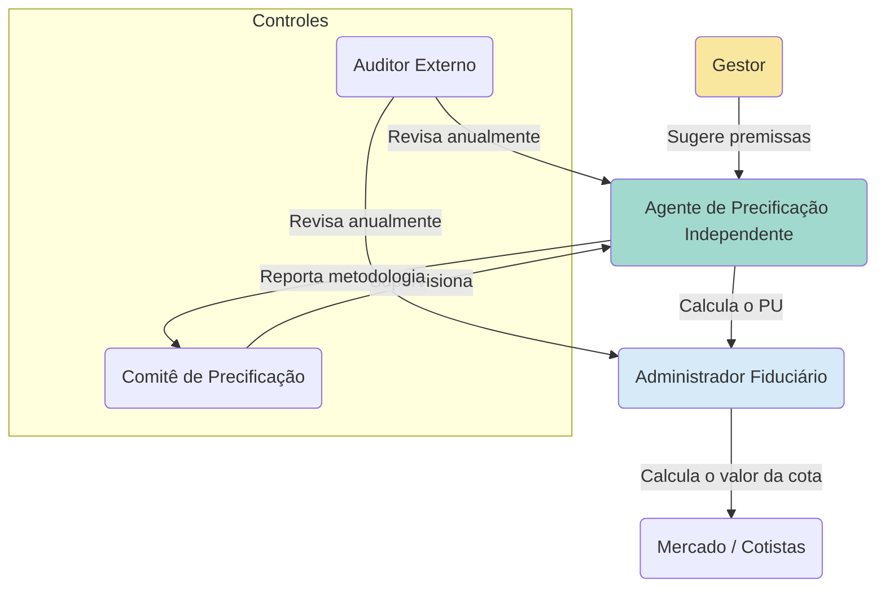

# Valuation e Precificação

**Autor:** Rodrigo Marques
**Versão:** 1.0

---

## Sumário Executivo

Este documento técnico oferece uma imersão profunda nas metodologias e nos desafios do valuation e da precificação de direitos creditórios, um processo conhecido como marcação a mercado (MtM), que é crucial para a transparência, a gestão de riscos e a correta apuração do patrimônio dos Fundos de Investimento em Direitos Creditórios (FIDCs). Dissecamos os principais modelos de precificação, com ênfase no método do Fluxo de Caixa Descontado (FCD), detalhando a construção das projeções, a definição de premissas críticas como as curvas de inadimplência e recuperação, e a determinação da taxa de desconto apropriada. Abordamos os desafios específicos na precificação de ativos ilíquidos e complexos, como os direitos creditórios não performados (NPLs), e analisamos as diretrizes regulatórias da CVM e as melhores práticas de mercado promovidas pela ANBIMA. O objetivo é fornecer a gestores, administradores, auditores e investidores um guia de referência sobre a teoria e a prática da marcação a mercado em FIDCs, capacitando-os a avaliar criticamente a robustez das metodologias de precificação e a fidedignidade do valor da cota divulgado pelos fundos.

---

## 1. Introdução: O Desafio de Atribuir Valor ao Crédito

O valor de um Fundo de Investimento em Direitos Creditórios (FIDC) reside no valor de sua carteira de ativos. A apuração diária, mensal ou periódica do valor justo desses ativos é um dos processos mais críticos e complexos na administração de um fundo. Esse processo, conhecido como **marcação a mercado (Mark-to-Market ou MtM)**, consiste em registrar os ativos financeiros pelo seu preço de mercado corrente ou, na ausência de um mercado líquido, pelo seu valor justo estimado através de modelos de precificação.

Para ativos com alta liquidez e negociação constante em bolsa, como ações ou títulos públicos, a marcação a mercado é um processo relativamente simples: utiliza-se o preço do último negócio ou a cotação de fechamento. No entanto, para a vasta maioria dos direitos creditórios que compõem as carteiras dos FIDCs, essa realidade não existe. Não há um mercado secundário ativo onde uma duplicata, um cheque ou um contrato de aluguel seja negociado diariamente. 

Surge, então, o grande desafio: **como atribuir um valor justo e fidedigno a um ativo que não tem um preço de mercado observável?**

A resposta está no uso de **modelos de precificação (valuation models)**. A marcação a mercado de direitos creditórios é, portanto, um exercício de **marcação a modelo (Mark-to-Model)**. A construção, a aplicação e a auditoria desses modelos são o cerne da gestão de riscos e da transparência de um FIDC. Um modelo falho ou baseado em premissas irrealistas pode levar a uma avaliação distorcida do patrimônio do fundo, induzindo os investidores a erro e mascarando a verdadeira performance da carteira.

Este documento técnico se propõe a desvendar o universo do valuation e da precificação de direitos creditórios em FIDCs. Exploraremos em profundidade:

*   **Os Fundamentos da Marcação a Mercado:** Por que ela é essencial e quais são os princípios que a regem.
*   **A Metodologia do Fluxo de Caixa Descontado (FCD):** O principal método utilizado para precificar direitos creditórios, detalhando cada um de seus componentes: a projeção dos fluxos de caixa, a estimativa de perdas (inadimplência) e a definição da taxa de desconto.
*   **Desafios na Precificação de Ativos Complexos:** As particularidades na avaliação de ativos ilíquidos e de direitos creditórios não performados (NPLs).
*   **O Arcabouço Regulatório e as Melhores Práticas:** As exigências da CVM (Resolução 175) e as diretrizes da ANBIMA para a precificação de ativos em fundos de investimento.

Compreender como os ativos de um FIDC são precificados é fundamental para qualquer investidor ou profissional do mercado. O valor da cota, que reflete a rentabilidade do investimento, é um resultado direto desse processo. Uma análise crítica da metodologia de precificação é, portanto, uma etapa indispensável da due diligence de qualquer FIDC.

## 2. Fundamentos da Marcação a Mercado (MtM)

A marcação a mercado é um princípio contábil e financeiro que visa refletir o valor patrimonial de um fundo ou de uma carteira de investimentos da forma mais próxima possível da realidade do mercado em um determinado momento. 

### 2.1. Por que Marcar a Mercado?

A prática da marcação a mercado é fundamental por várias razões:

*   **Transparência:** Fornece aos cotistas uma visão clara e atualizada do valor de seus investimentos. Sem a MtM, o valor da cota seria baseado no custo histórico dos ativos, o que não refletiria as mudanças nas condições de mercado, no risco de crédito ou na performance da carteira.
*   **Equidade entre Cotistas:** Garante que as aplicações e os resgates sejam feitos por um preço justo. Se um fundo não marca seus ativos a mercado, um novo investidor que aplica recursos pode estar comprando cotas por um preço artificialmente baixo (diluindo os cotistas antigos) ou alto (sendo prejudicado). Da mesma forma, um cotista que resgata seus recursos pode receber um valor que não corresponde ao valor justo de sua participação.
*   **Gestão de Risco:** Permite que o gestor e o administrador do fundo tenham uma visão precisa do risco da carteira. Uma queda no valor de mercado de um ativo é um sinal de alerta sobre a sua qualidade de crédito, permitindo que o gestor tome medidas corretivas.
*   **Apuração de Performance:** É a base para o cálculo correto da rentabilidade do fundo e, consequentemente, para a cobrança da taxa de performance, quando aplicável.

### 2.2. A Hierarquia de Valor Justo (IFRS 13 / CPC 46)

A norma contábil internacional IFRS 13 (no Brasil, CPC 46) estabelece uma hierarquia de três níveis para a mensuração do valor justo, que orienta como a marcação a mercado deve ser feita:

*   **Nível 1:** Preços cotados (não ajustados) em **mercados ativos** para ativos idênticos. Este é o nível de maior prioridade e confiabilidade. Ex: Ações negociadas em bolsa.

*   **Nível 2:** Inputs observáveis no mercado, exceto os preços cotados do Nível 1. Inclui preços de ativos similares em mercados ativos, ou preços de ativos idênticos ou similares em mercados não ativos. Ex: Títulos de dívida corporativa com alguma liquidez, onde se pode usar o preço de ativos de empresas com risco semelhante como referência.

*   **Nível 3:** Inputs **não observáveis** no mercado. A mensuração do valor justo é feita com base em modelos de precificação e premissas desenvolvidas internamente pela entidade. **A grande maioria dos direitos creditórios de FIDCs se enquadra neste nível.**

O fato de os ativos dos FIDCs serem majoritariamente de Nível 3 reforça a importância da robustez e da transparência da metodologia de precificação utilizada. O regulamento do fundo e as notas explicativas de suas demonstrações financeiras devem descrever claramente a metodologia e as principais premissas usadas para valorar os ativos de Nível 3.

## 3. A Metodologia do Fluxo de Caixa Descontado (FCD)

Para ativos de Nível 3, como os direitos creditórios, a principal metodologia de valuation é o **Fluxo de Caixa Descontado (FCD)**. O princípio é simples: o valor de um ativo hoje é a soma de todos os fluxos de caixa que se espera que ele gere no futuro, trazidos a valor presente por uma taxa de desconto que reflete o risco desses fluxos de caixa.

**Fórmula do VPL (Valor Presente Líquido):**

```
VPL = Σ [ FC_t / (1 + k)^t ]

Onde:
FC_t = Fluxo de Caixa Líquido no período t
k = Taxa de Desconto
t = Período de tempo
```

A aplicação dessa fórmula a um direito creditório, no entanto, envolve uma série de etapas e premissas complexas.

### 3.1. Etapa 1: Projeção do Fluxo de Caixa Contratual

O primeiro passo é projetar o fluxo de caixa que o direito creditório geraria se não houvesse nenhum risco de inadimplência. Trata-se do fluxo de pagamentos contratual, com as parcelas e as datas de vencimento definidas no contrato que deu origem ao crédito.

### 3.2. Etapa 2: Estimativa das Perdas de Crédito Esperadas

Este é o passo mais crítico e desafiador. É preciso ajustar o fluxo de caixa contratual para refletir a probabilidade de o devedor não pagar. Isso é feito através da projeção da **Perda de Crédito Esperada (Expected Credit Loss - ECL)**, que, de forma simplificada, é o produto de três componentes:

**ECL = PD x LGD x EAD**

*   **PD (Probability of Default - Probabilidade de Inadimplência):** A probabilidade de o devedor não honrar seus pagamentos em um determinado horizonte de tempo. A estimativa da PD é feita com base em modelos estatísticos que podem usar informações como o histórico de pagamento do devedor, seu score de crédito, sua renda, etc.

*   **LGD (Loss Given Default - Perda Dado a Inadimplência):** O percentual do crédito que se espera perder, caso o devedor se torne inadimplente. Por exemplo, se um devedor se torna inadimplente em uma dívida de R$ 1.000 e, após todos os esforços de cobrança, o credor consegue recuperar R$ 400, a perda foi de R$ 600, e o LGD foi de 60%.

*   **EAD (Exposure at Default - Exposição na Inadimplência):** O valor total da exposição do credor no momento em que a inadimplência ocorre.

Ao projetar a ECL ao longo da vida do crédito e subtraí-la do fluxo de caixa contratual, obtemos o **fluxo de caixa esperado**, que é a melhor estimativa do que o fundo realmente receberá.

### 3.3. Etapa 3: Definição da Taxa de Desconto

Uma vez projetado o fluxo de caixa esperado, é preciso definir a taxa de desconto (k) para trazê-lo a valor presente. A taxa de desconto não é a taxa de juros do contrato. Ela é uma **taxa de retorno exigida pelo mercado** para um ativo com aquele perfil de risco específico. 

A construção da taxa de desconto geralmente envolve a soma de vários componentes:

**k = Taxa Livre de Risco + Spread de Crédito + Prêmio de Liquidez + Outros Prêmios**

*   **Taxa Livre de Risco:** O retorno de um investimento considerado sem risco, como os títulos do governo (a taxa Selic ou uma NTN-B, por exemplo).
*   **Spread de Crédito:** Um prêmio adicional para compensar o risco de a perda de crédito ser maior do que a esperada. Quanto pior a qualidade de crédito do devedor, maior o spread de crédito.
*   **Prêmio de Liquidez:** Um prêmio para compensar a dificuldade de vender o ativo rapidamente sem perda de valor. Como os direitos creditórios são ilíquidos, esse prêmio é uma parte importante da taxa de desconto.
*   **Outros Prêmios:** Pode incluir prêmios por riscos específicos do setor, do cedente, etc.

A taxa de desconto é, talvez, a premissa mais subjetiva do modelo de FCD. Pequenas variações na taxa de desconto podem gerar grandes variações no valor presente calculado. Por isso, a governança sobre a definição e a revisão periódica da taxa de desconto é fundamental.

### 3.4. O Processo na Prática

Na prática, o administrador e o gestor do FIDC não fazem esse cálculo para cada um dos milhares de créditos da carteira individualmente. Eles agrupam os créditos em **segmentos ou buckets** com características de risco semelhantes (mesmo produto, mesma faixa de atraso, mesmo perfil de devedor) e aplicam as premissas de PD, LGD e taxa de desconto para cada bucket.

O resultado final da marcação a mercado é o novo valor do patrimônio líquido do fundo, que, dividido pelo número de cotas, resulta no **valor da cota** do dia ou do mês, que é divulgado aos investidores.

## 4. Desafios na Precificação de Ativos Complexos

A metodologia de FCD se torna ainda mais complexa quando aplicada a ativos não padronizados.

*   **Direitos Creditórios Ilíquidos:** Para a maioria dos ativos de FIDC, a falta de um mercado secundário torna a definição do spread de crédito e do prêmio de liquidez um desafio. Muitas vezes, os gestores recorrem a *proxies*, como os spreads de debêntures de empresas com risco semelhante, mas esses ajustes sempre carregam um grau de subjetividade.

*   **Direitos Creditórios Não Performados (NPLs):** Para NPLs, o conceito de fluxo de caixa contratual perde o sentido. O valuation se baseia inteiramente na estimativa da **curva de recuperação**. O gestor precisa projetar, com base em dados históricos e na estratégia de cobrança, qual o percentual do saldo devedor que será recuperado e em quanto tempo. A taxa de desconto aplicada a esse fluxo de caixa esperado é extremamente alta, refletindo o enorme risco e incerteza da operação.

*   **Precatórios:** Como vimos, a precificação de precatórios depende menos do risco de crédito e mais da estimativa do **tempo de pagamento**. O desafio é projetar a evolução da fila de pagamentos do ente público, o que envolve análises do orçamento, da legislação e do cenário político.

## 5. Regulação e Melhores Práticas

Dada a complexidade e a subjetividade envolvidas na marcação a modelo, a regulação e a autorregulação desempenham um papel vital em garantir a integridade do processo.

*   **Resolução CVM 175:** A nova resolução reforça a responsabilidade do administrador e do gestor sobre a precificação. O Art. 40 da Parte Geral exige que o administrador estabeleça e aplique procedimentos para a apuração do valor justo dos ativos, que devem ser consistentes com as normas contábeis. O regulamento do fundo deve descrever a metodologia de precificação.

*   **Código ANBIMA de Administração de Recursos de Terceiros:** A ANBIMA (Associação Brasileira das Entidades dos Mercados Financeiro e de Capitais) estabelece, por meio de seus códigos de autorregulação, regras detalhadas para a precificação de ativos. O código exige que as instituições tenham um manual de precificação, que descreva as metodologias, as fontes de preços e as premissas utilizadas. A ANBIMA também fornece preços e taxas de referência para diversos ativos, que servem como um balizador para o mercado.

*   **Auditoria Independente:** Os auditores independentes, ao auditarem as demonstrações financeiras do fundo, têm a responsabilidade de avaliar a razoabilidade da metodologia de precificação e das premissas utilizadas pelo administrador, especialmente para os ativos de Nível 3. 

## 6. Conclusão: Entre a Ciência e a Arte

O valuation e a precificação de direitos creditórios em FIDCs são um campo que se situa na intersecção entre a ciência e a arte. A ciência está nos modelos estatísticos, na análise de dados e na metodologia de fluxo de caixa descontado. A arte está na definição das premissas, na interpretação dos cenários e no julgamento necessário para avaliar ativos únicos e complexos.

Para o investidor, a mensagem é clara: o valor da cota de um FIDC não é um número absoluto, mas o resultado de um modelo. Portanto, a due diligence não deve se limitar a olhar a rentabilidade passada. É preciso ir mais fundo e questionar: Qual a metodologia de precificação? Quem é o responsável por ela? As premissas de inadimplência e a taxa de desconto são conservadoras ou agressivas? A metodologia é auditada?

A transparência e a robustez do processo de marcação a mercado são os verdadeiros selos de qualidade de um FIDC. Eles são a garantia de que o valor que o investidor vê em seu extrato reflete, da forma mais fiel possível, a realidade econômica de uma carteira de crédito que, por natureza, é opaca e complexa. Em um mercado construído sobre a confiança, uma precificação bem-feita é o seu alicerce mais sólido.

_


## 7. Aprofundamento Técnico: A Construção da Taxa de Desconto

A determinação da taxa de desconto é, possivelmente, a variável mais sensível e subjetiva em todo o processo de valuation de direitos creditórios pelo método do Fluxo de Caixa Descontado (FCD). Uma pequena alteração na taxa de desconto pode ter um impacto exponencial no valor presente calculado, tornando sua correta especificação um ponto de atenção máximo para gestores, auditores e investidores. 

A taxa de desconto não representa a taxa de juros do contrato de crédito, mas sim o **custo de oportunidade** ou a **taxa de retorno exigida pelo mercado** para um investimento com o mesmo perfil de risco e liquidez. Ela é construída a partir da soma de diversas camadas de risco, em um processo conhecido como "build-up method".

**k = Rf + CS + LP + OP**

Onde:
*   **k:** Taxa de Desconto
*   **Rf:** Taxa Livre de Risco
*   **CS:** Spread de Crédito
*   **LP:** Prêmio de Liquidez
*   **OP:** Outros Prêmios

Vamos dissecar cada um desses componentes.

### 7.1. Taxa Livre de Risco (Rf)

A taxa livre de risco é o ponto de partida, o alicerce da taxa de desconto. Ela representa o retorno de um investimento hipotético com risco zero de inadimplência. No Brasil, a proxy mais comum para a taxa livre de risco é a taxa de juros dos títulos públicos federais, considerados os ativos mais seguros da economia local.

*   **Escolha do Título de Referência:** A escolha do título específico depende do prazo do direito creditório que está sendo avaliado. Para ativos de curto prazo, a **taxa Selic** (a taxa básica de juros) é uma referência comum. Para ativos de prazo mais longo, utilizam-se as taxas dos títulos do Tesouro Direto, como as **NTN-Bs (Notas do Tesouro Nacional - Série B)**, que pagam uma taxa de juros real mais a variação da inflação (IPCA), ou as **LTNs/NTN-Fs**, que são títulos prefixados. É crucial que o prazo do título público de referência seja o mais próximo possível do prazo médio (duration) do direito creditório em análise (princípio do casamento de prazos).

### 7.2. Spread de Crédito (CS)

O spread de crédito é a remuneração adicional exigida pelo investidor para assumir o risco de inadimplência do devedor do direito creditório. Ele é a diferença entre a taxa de retorno de um ativo com risco de crédito e a taxa livre de risco, para o mesmo prazo.

**CS = Taxa do Ativo com Risco - Taxa Livre de Risco**

O grande desafio é que, para a maioria dos direitos creditórios, não existe uma "taxa de mercado" observável. Portanto, o spread de crédito precisa ser estimado. As abordagens para essa estimativa variam em complexidade:

*   **Abordagem Comparativa (Mercado Secundário):** A forma mais direta é buscar no mercado o spread de crédito de instrumentos de dívida negociados que tenham um risco de crédito semelhante ao do direito creditório em análise. Por exemplo, para precificar um direito creditório de uma grande empresa com rating 'AA', o gestor pode observar o spread de crédito das debêntures emitidas por outras empresas com o mesmo rating e prazo similar. A dificuldade desta abordagem é encontrar comparáveis perfeitos, especialmente para créditos de empresas de médio ou pequeno porte ou de pessoas físicas.

*   **Abordagem Estrutural (Modelo de Merton):** Modelos mais sofisticados, como o modelo de Merton, tratam o capital próprio de uma empresa como uma opção de compra sobre seus ativos. A partir da volatilidade das ações da empresa e de sua estrutura de capital, é possível derivar uma probabilidade de default e, consequentemente, um spread de crédito justo. Essa abordagem é mais aplicável a devedores que são empresas com ações negociadas em bolsa.

*   **Abordagem por Perda Esperada:** Uma abordagem prática é relacionar o spread de crédito à perda esperada (EL = PD x LGD). O spread de crédito pode ser visto como o preço que o mercado cobra para cobrir a perda esperada e ainda oferecer um prêmio pelo risco inesperado. A fórmula pode ser simplificada como:

    **CS ≈ EL + Prêmio pelo Risco Inesperado**

    O gestor utiliza as estimativas de PD e LGD de seus modelos de risco para calcular a EL e, a partir daí, adiciona um prêmio subjetivo para chegar ao spread de crédito. Essa abordagem conecta diretamente a análise de risco com o processo de precificação.

### 7.3. Prêmio de Liquidez (LP)

O prêmio de liquidez compensa o investidor pela dificuldade de transformar o ativo em caixa rapidamente e sem perda significativa de valor. Direitos creditórios são, por natureza, ativos ilíquidos. Portanto, o prêmio de liquidez é um componente fundamental e muitas vezes significativo da taxa de desconto.

Estimar o prêmio de liquidez também é um desafio. Algumas abordagens incluem:

*   **Análise de Spreads:** Comparar o spread de crédito de títulos líquidos (como algumas debêntures com muito mercado) com o de títulos ilíquidos de mesmo risco de crédito. A diferença entre os spreads pode ser atribuída à falta de liquidez.
*   **Modelos Acadêmicos:** Existem diversos modelos acadêmicos que tentam quantificar o prêmio de liquidez com base em variáveis como o bid-ask spread, o volume de negociação e o tempo necessário para vender um ativo. Um exemplo é o modelo de Amihud, que relaciona a iliquidez ao impacto no preço causado por um determinado volume de negociação.
*   **Estimativas Subjetivas:** Na prática, muitos gestores utilizam estimativas baseadas em sua experiência de mercado, adicionando um prêmio de 1% a 5%, ou até mais, à taxa de desconto, dependendo do grau de iliquidez do ativo.

### 7.4. Outros Prêmios (OP)

Finalmente, a taxa de desconto pode incluir outros prêmios para cobrir riscos específicos não capturados pelos componentes anteriores:

*   **Prêmio por Risco de Concentração:** Se a carteira do FIDC for muito concentrada em um único devedor ou setor, um prêmio adicional pode ser adicionado para refletir esse risco.
*   **Prêmio por Risco Operacional:** Pode haver um prêmio para cobrir o risco de falhas nos processos do cedente ou do servicer.
*   **Prêmio por Risco de Modelo:** Um prêmio para compensar a incerteza inerente ao próprio modelo de precificação e às suas premissas.

### 7.5. Governança sobre a Taxa de Desconto

Dada a sua sensibilidade e subjetividade, é crucial que o FIDC tenha um processo de governança robusto para a definição da taxa de desconto. As melhores práticas de mercado incluem:

*   **Manual de Precificação:** O fundo deve ter um manual que descreva em detalhes a metodologia utilizada para construir a taxa de desconto para cada tipo de ativo.
*   **Comitê de Precificação:** A decisão sobre a taxa de desconto não deve ser monocrática. Geralmente, ela é tomada por um comitê que inclui o gestor, a área de risco e a área de compliance do administrador.
*   **Revisão Periódica:** As premissas e a taxa de desconto final devem ser revisadas e, se necessário, ajustadas periodicamente (mensal ou trimestralmente) para refletir as novas condições de mercado e da carteira.
*   **Análise de Sensibilidade:** O gestor deve realizar análises de sensibilidade para entender o impacto que variações na taxa de desconto teriam sobre o valor do patrimônio líquido, e essa análise deve ser divulgada aos cotistas nas notas explicativas.

Em conclusão, a taxa de desconto é muito mais do que um número. Ela é a síntese de todas as percepções de risco — crédito, liquidez, operacional — associadas a um direito creditório. Sua construção é um processo técnico e criterioso que representa o coração do valuation por FCD e, consequentemente, da própria fidedignidade do valor da cota de um FIDC.


## 8. Aprofundamento: Aplicação de Modelos de Valuation a Diferentes Tipos de Recebíveis

O arcabouço teórico do Fluxo de Caixa Descontado (FCD) é universal, mas sua aplicação prática na precificação de direitos creditórios deve ser adaptada às características específicas de cada tipo de ativo. A natureza do devedor, o prazo do crédito, a disponibilidade de dados históricos e a liquidez do ativo influenciam diretamente a escolha das premissas de inadimplência, pré-pagamento e, principalmente, a taxa de desconto. Vamos analisar como o modelo de valuation se comporta na prática para diferentes classes de recebíveis comumente encontradas em FIDCs.

### 8.1. Crédito Pessoal e Direto ao Consumidor (CDC)

Esta é uma das classes de ativos mais comuns em FIDCs, especialmente aqueles que financiam fintechs e varejistas. São créditos pulverizados, concedidos a pessoas físicas.

*   **Análise de Dados:** A precificação é altamente dependente de análise estatística de grandes massas de dados (*big data*). O gestor analisa o comportamento histórico de safras de crédito semelhantes para modelar as curvas de inadimplência e pré-pagamento.
*   **Curva de Inadimplência (PD):** A inadimplência em crédito pessoal geralmente segue um padrão de "curva de maturação". A inadimplência é baixa nos primeiros meses, atinge um pico (geralmente entre o 6º e o 18º mês) e depois decai à medida que os maus pagadores já deram default e os bons pagadores continuam a pagar. A modelagem precisa capturar esse comportamento sazonal.
*   **Curva de Pré-pagamento:** O pré-pagamento também é relevante. Pessoas físicas podem quitar seus empréstimos antecipadamente ao receberem uma renda extra (bônus, 13º salário) ou ao refinanciarem a dívida em outra instituição. A análise de dados históricos ajuda a prever essa taxa.
*   **Taxa de Desconto (k):** A taxa de desconto é composta pela taxa livre de risco mais um prêmio de risco de crédito. Esse prêmio é calculado com base na perda esperada da carteira (PD * LGD) e em um prêmio adicional pela incerteza do modelo (risco de a inadimplência futura ser maior que a projetada) e pela iliquidez do ativo.

### 8.2. Duplicatas Mercantis e Recebíveis de Cartão de Crédito

São créditos de curto prazo, originados de vendas de bens ou serviços entre empresas (B2B) ou de empresas para consumidores (B2C).

*   **Análise de Diluição:** O principal risco adicional nesta classe de ativos é o **risco de diluição**. A diluição ocorre quando o valor do recebível é reduzido por motivos que não são a inadimplência do devedor. Exemplos incluem devoluções de mercadorias, abatimentos de preço por defeitos, ou disputas comerciais. O modelo de valuation precisa estimar uma taxa de diluição histórica e aplicá-la como uma dedução do fluxo de caixa esperado.
*   **Prazo Curto:** Como o prazo é muito curto (geralmente 30 a 90 dias), a projeção de inadimplência é mais simples. O foco da análise de crédito está na saúde financeira do sacado (o devedor da duplicata) e na qualidade do processo de cobrança do cedente.
*   **Taxa de Desconto (k):** A taxa de desconto é geralmente uma taxa de juros de curto prazo (como o CDI) acrescida de um spread. O spread reflete o risco de crédito do sacado e o risco de diluição. A precificação desses ativos assemelha-se mais a uma operação de desconto de recebíveis do que a um complexo modelo de FCD de longo prazo.

### 8.3. Crédito Imobiliário (CRI) e do Agronegócio (CRA)

São créditos de longo prazo, geralmente com garantias reais (o próprio imóvel ou a safra).

*   **Análise da Garantia:** A análise da garantia é um componente central do valuation. O valor da garantia e a facilidade de sua execução em caso de inadimplência têm um impacto direto na estimativa da **Perda Dado o Default (LGD)**. Uma boa garantia reduz drasticamente a LGD e, consequentemente, a perda esperada da carteira.
*   **Indexadores:** Esses créditos são frequentemente indexados à inflação (IPCA ou IGP-M) mais uma taxa de juros real. O modelo de valuation precisa incorporar projeções para esses indexadores ao longo de todo o prazo do ativo.
*   **Risco de Pré-pagamento:** O risco de pré-pagamento é muito significativo, especialmente em crédito imobiliário. Se as taxas de juros de mercado caem, os devedores têm um forte incentivo para refinanciar suas hipotecas a taxas mais baixas, pré-pagando a dívida antiga. O modelo precisa incorporar uma função que relacione a probabilidade de pré-pagamento com o diferencial entre a taxa do contrato e a taxa de juros de mercado.
*   **Taxa de Desconto (k):** A taxa de desconto é geralmente uma taxa de juros real (como a taxa de uma NTN-B de prazo equivalente) mais um spread de crédito que reflete a qualidade do devedor e a força da garantia.

### 8.4. Créditos Não Padronizados (NPLs, Precatórios)

Como já detalhado no Documento 7, a precificação desses ativos é um caso extremo de valuation, onde as premissas jurídicas e de recuperação se sobrepõem às premissas de crédito tradicionais.

*   **NPLs (Non-Performing Loans):** O valuation é um exercício de estimar a probabilidade e o valor de recuperação. O modelo de FCD é alimentado por uma curva de recuperação, que estima quanto do valor de face será recuperado e em quanto tempo, seja por meio de renegociação da dívida ou por execução de garantias e cobrança judicial. A taxa de desconto é altíssima, refletindo a enorme incerteza.
*   **Precatórios:** O valuation é quase que exclusivamente uma função do **tempo estimado de pagamento** e de uma taxa de desconto que embute um grande prêmio de risco político e de iliquidez. A análise de crédito do devedor (ente público) é menos relevante que a análise de sua capacidade orçamentária e de seu histórico de respeito à fila de pagamentos.

**Tabela Comparativa de Fatores de Valuation:**

| Tipo de Ativo | Principal Fator de Risco | Variável Chave do Modelo | Complexidade da Taxa de Desconto |
| :--- | :--- | :--- | :--- |
| **CDC** | Risco de Crédito (PD) | Curva de maturação da inadimplência | Média |
| **Duplicatas** | Risco de Diluição | Taxa de diluição histórica | Baixa |
| **CRI / CRA** | Risco de Pré-pagamento | Curva de pré-pagamento vs. juros de mercado | Alta (indexadores) |
| **NPL** | Risco de Recuperação (LGD) | Curva de recuperação e tempo | Muito Alta |
| **Precatórios** | Risco de Prazo (Tempo) | Tempo estimado na fila de pagamento | Extrema (risco político) |

Em suma, a precificação de direitos creditórios é uma disciplina que exige um profundo conhecimento não apenas dos modelos financeiros, mas também das características operacionais, comportamentais e, por vezes, jurídicas de cada classe de ativo. Um modelo de valuation bem-sucedido é aquele que consegue traduzir as nuances de cada mercado de crédito em premissas quantitativas robustas e defensáveis.


## 9. Aprofundamento: Aplicação de Modelos a Diferentes Tipos de Recebíveis

A teoria do Fluxo de Caixa Descontado (FCD) é universal, mas sua aplicação prática varia enormemente dependendo da natureza do direito creditório que está sendo avaliado. Cada classe de ativo possui suas próprias idiossincrasias, que exigem ajustes específicos na projeção dos fluxos de caixa, na modelagem das perdas e na definição da taxa de desconto. Vamos explorar as nuances do valuation para algumas das classes de ativos mais comuns em carteiras de FIDCs.

### 9.1. Valuation de Recebíveis de Cartão de Crédito

Os recebíveis de cartão de crédito são um dos lastros mais tradicionais para FIDCs. Eles representam as vendas futuras que um lojista (cedente) tem a receber das credenciadoras (adquirentes, como Cielo, Rede, etc.).

*   **Projeção do Fluxo de Caixa:** A projeção é relativamente direta. Ela se baseia no histórico de vendas do lojista e na sazonalidade de seu negócio. O fluxo de caixa contratual é o montante de vendas realizadas no cartão que serão liquidadas pela credenciadora em datas futuras (geralmente D+30, D+60, etc.).

*   **Modelagem de Perdas (PD e LGD):** O risco de crédito principal aqui não é o do portador do cartão, mas sim o **risco de performance do lojista**. A perda ocorre se o lojista, por alguma razão, não entregar o produto ou serviço ao cliente. Nesse caso, o cliente pode solicitar o **chargeback** (cancelamento da compra), e a credenciadora não pagará o recebível ao FIDC. Portanto:
    *   **PD (Probabilidade de Default):** É a probabilidade de o lojista falhar em sua performance, levando a um chargeback. Ela é estimada com base no histórico de chargebacks do próprio lojista e de lojistas do mesmo setor.
    *   **LGD (Perda Dado o Default):** Geralmente é de 100%. Se o chargeback ocorre, o FIDC perde o valor integral daquele recebível.

*   **Taxa de Desconto:** A taxa de desconto é composta pela taxa livre de risco mais um spread de crédito. O spread de crédito reflete principalmente o **risco da credenciadora** (que é a devedora final do FIDC, geralmente um risco de crédito muito baixo, de nível bancário) e o **risco de diluição** (chargebacks, cancelamentos, etc.) da carteira do lojista. Como o risco da credenciadora é baixo, o principal componente de risco que define o spread é a qualidade do cedente/lojista e seu histórico de performance.

### 9.2. Valuation de Crédito Consignado

O crédito consignado é um empréstimo cujas parcelas são descontadas diretamente da folha de pagamento do devedor (servidor público, aposentado do INSS, etc.).

*   **Projeção do Fluxo de Caixa:** O fluxo contratual é uma série de parcelas fixas, o que simplifica a projeção.

*   **Modelagem de Perdas (PD e LGD):** O crédito consignado tem um dos menores riscos de crédito do mercado, mas ele não é zero.
    *   **PD (Probabilidade de Default):** A inadimplência pode ocorrer por razões operacionais (erro no repasse do órgão pagador), perda de margem consignável pelo devedor, ou, em casos mais raros, por fraude ou perda do vínculo empregatício/benefício. A PD é muito baixa e é modelada com base em dados históricos de carteiras semelhantes.
    *   **LGD (Perda Dado o Default):** A perda, caso a inadimplência ocorra, tende a ser baixa, pois há mecanismos de recuperação, como a renegociação ou a cobrança direta. No entanto, a recuperação pode ser lenta.
    *   **Risco de Pré-pagamento:** Um fator crucial no consignado é o **pré-pagamento**. Os devedores frequentemente quitam seus empréstimos antecipadamente, seja com recursos próprios ou através da portabilidade para outro banco. O modelo de valuation precisa ter uma premissa de curva de pré-pagamento, que acelera o recebimento do principal, mas também reduz o ganho de juros futuros. Uma taxa de pré-pagamento maior que a esperada pode diminuir a rentabilidade do FIDC.

*   **Taxa de Desconto:** A taxa de desconto é baixa, refletindo o baixo risco de crédito. O spread de crédito é um dos menores entre todas as classes de ativos de FIDC, sendo mais influenciado pelo risco de pré-pagamento e pelo risco operacional do que pelo risco de crédito em si.

### 9.3. Valuation de Financiamento de Veículos (Auto Loans)

Esta classe de ativo envolve o financiamento da compra de carros e motos, onde o próprio veículo serve como garantia (alienação fiduciária).

*   **Projeção do Fluxo de Caixa:** O fluxo contratual é uma série de parcelas fixas.

*   **Modelagem de Perdas (PD e LGD):** Esta é a parte mais complexa.
    *   **PD (Probabilidade de Default):** A PD é significativamente maior do que no consignado e depende fortemente de variáveis macroeconômicas (desemprego, renda) e do perfil do devedor (score de crédito, relacionamento com a financeira). A modelagem de PD para crédito de veículos é uma ciência atuarial sofisticada, que utiliza modelos de regressão logística ou de machine learning.
    *   **LGD (Perda Dado o Default):** O LGD é a chave para o valuation de crédito de veículos. Se o cliente se torna inadimplente, a financeira (ou o FIDC) tem o direito de retomar o veículo e vendê-lo para abater a dívida. O LGD será a diferença entre o saldo devedor e o valor recuperado na venda do veículo. A modelagem do LGD, portanto, depende:
        *   Da **curva de depreciação** do veículo (quanto ele valerá no futuro).
        *   Do **tempo e do custo** para retomar e vender o veículo (custos judiciais, de leilão, etc.).
        *   Da **relação LTV (Loan-to-Value)** original da operação (quanto foi financiado em relação ao valor do veículo).

*   **Taxa de Desconto:** A taxa de desconto é mais elevada, refletindo o maior risco de crédito e a complexidade da recuperação da garantia. O spread de crédito exigido pelo mercado para essa classe de ativo é substancial e varia conforme a qualidade da originadora (a financeira) e o perfil da carteira.

### 9.4. Valuation de Direitos Creditórios Não Performados (NPLs)

Como já mencionado, o valuation de NPLs é um caso extremo de marcação a modelo, onde a incerteza é máxima.

*   **Projeção do Fluxo de Caixa:** Não há fluxo de caixa contratual. O fluxo de caixa é inteiramente baseado na **projeção de recuperação**. O modelo não projeta o pagamento de parcelas, mas sim a probabilidade de se conseguir um acordo de quitação com o devedor em algum momento no futuro.

*   **Modelagem da Curva de Recuperação:** O gestor utiliza dados históricos de carteiras de cobrança para estimar:
    *   **Qual o percentual do saldo devedor que se espera recuperar.** Isso depende da idade da dívida (dívidas mais antigas são mais difíceis de cobrar), do perfil do devedor e da estratégia de cobrança (judicial, extrajudicial).
    *   **Em quanto tempo essa recuperação ocorrerá.** A projeção é feita ao longo de vários anos, com um percentual de recuperação esperado para cada ano.

*   **Taxa de Desconto:** A taxa de desconto para NPLs é a mais alta de todas as classes de ativos, frequentemente na casa de 20% a 30% ao ano, ou mais. Ela precisa embutir:
    *   Um altíssimo **spread de crédito**, refletindo a enorme incerteza sobre a recuperação.
    *   Um grande **prêmio de liquidez**, pois esses ativos são extremamente ilíquidos.
    *   Um prêmio pelo **risco operacional e legal** da atividade de cobrança.

**Tabela Comparativa de Nuances no Valuation:**

| Classe de Ativo | Principal Fator de Risco | Foco da Modelagem de Perda | Complexidade da Taxa de Desconto |
| :--- | :--- | :--- | :--- |
| **Cartão de Crédito** | Risco de performance do lojista (chargeback) | Probabilidade de Diluição | Baixa (ancorada no risco da credenciadora) |
| **Crédito Consignado** | Risco de pré-pagamento e operacional | Curva de Pré-pagamento | Baixa (ancorada na taxa livre de risco) |
| **Financiamento de Veículos** | Risco de crédito do devedor | Modelagem de PD e, principalmente, de LGD (recuperação da garantia) | Média a Alta (depende da qualidade da carteira) |
| **NPLs** | Risco de não recuperação | Curva de Recuperação (quanto e quando será recuperado) | Muito Alta (reflete a alta incerteza) |

Esta análise demonstra que, embora o framework do FCD seja o mesmo, a arte do valuation de direitos creditórios reside na capacidade do gestor de adaptar o modelo às características específicas de cada tipo de crédito, utilizando premissas robustas, dados históricos consistentes e um profundo conhecimento do mercado em que atua.


## 10. A Governança do Processo de Valuation: O Papel do Agente de Precificação

A precisão e a integridade do processo de valuation são tão críticas para um FIDC que a regulação e as melhores práticas de mercado exigem uma estrutura de governança robusta para supervisioná-lo. A subjetividade inerente à marcação a modelo, especialmente para ativos mais complexos, torna imperativo que o processo seja conduzido com independência, transparência e rigor técnico. O elemento central dessa governança é, muitas vezes, a figura do **agente de precificação independente**.

### 10.1. A Necessidade de Independência

O gestor do fundo, embora possua o conhecimento mais profundo sobre os ativos da carteira, enfrenta um conflito de interesses inerente ao processo de valuation. Sua remuneração (taxa de gestão e, principalmente, taxa de performance) está diretamente ligada ao valor do patrimônio líquido e à rentabilidade do fundo. Um gestor mal-intencionado poderia ser tentado a superestimar o valor dos ativos para inflar o valor da cota, mascarar perdas e, consequentemente, aumentar sua própria remuneração.

Para mitigar esse conflito, a Resolução CVM 175 e as melhores práticas de mercado determinam que o processo de precificação seja supervisionado e, em muitos casos, executado por uma entidade independente do gestor.

### 10.2. O Agente de Precificação Independente

O agente de precificação é uma empresa especializada contratada pelo fundo (pelo administrador) com a única função de calcular o valor justo dos ativos da carteira. Ele atua como um terceiro validador, fornecendo uma avaliação objetiva e livre dos conflitos de interesse do gestor.

**Responsabilidades do Agente de Precificação:**

*   **Desenvolvimento e Manutenção de Metodologias:** O agente é responsável por desenvolver, documentar e manter as metodologias de precificação para cada tipo de ativo na carteira do FIDC. Essas metodologias devem estar em conformidade com as normas contábeis (CPC 48) e com as melhores práticas de mercado.
*   **Coleta de Dados e Premissas:** Ele coleta os dados de mercado necessários para alimentar os modelos (taxas de juros, spreads, etc.) e define as premissas-chave, como as curvas de inadimplência e de pré-pagamento, de forma independente.
*   **Cálculo do Preço Unitário (PU):** Periodicamente (diária ou mensalmente), o agente roda seus modelos e calcula o preço unitário (PU) de cada ativo da carteira. A soma dos valores de todos os ativos, líquida das provisões, comporá o valor do patrimônio do fundo.
*   **Relatórios e Justificativas:** O agente fornece ao administrador e ao gestor relatórios detalhados com os preços calculados e as justificativas para as premissas utilizadas. Em caso de divergências significativas com as expectativas do gestor, o agente deve ser capaz de sustentar tecnicamente sua avaliação.

### 10.3. O Comitê de Precificação

Para supervisionar o trabalho do agente de precificação e tomar as decisões finais em casos de maior subjetividade, muitos fundos instituem um **Comitê de Precificação**. Este comitê é geralmente composto por:

*   Membros do administrador do fundo.
*   Membros do gestor do fundo.
*   Membros independentes (profissionais com notório saber em finanças e valuation).

O comitê se reúne periodicamente para revisar a metodologia de precificação, aprovar as premissas utilizadas pelo agente de precificação e deliberar sobre casos excepcionais ou ativos de difícil avaliação. A existência de um comitê com membros independentes adiciona mais uma camada de governança e proteção aos cotistas.

### 10.4. O Papel do Administrador e do Auditor Externo

*   **Administrador:** O administrador fiduciário é o responsável final pelo cálculo do valor da cota perante a CVM e os cotistas. Ele contrata e supervisiona o agente de precificação e garante que a política de precificação, definida no regulamento do fundo, seja cumprida. Ele tem o dever de questionar o gestor e o agente de precificação se identificar inconsistências ou falhas no processo.

*   **Auditor Externo:** Durante a auditoria anual das demonstrações financeiras, o auditor externo tem a responsabilidade de revisar em detalhes o processo de valuation. Ele não recalcula o preço de cada ativo, mas avalia a **razoabilidade da metodologia** e a **consistência das premissas** utilizadas pelo agente de precificação e aprovadas pelo comitê. O auditor verifica se o processo está em conformidade com as normas contábeis e se os controles internos são adequados. Um parecer do auditor com ressalvas sobre o processo de valuation é um grande sinal de alerta para o mercado.

**Diagrama da Governança de Valuation:**



Em conclusão, a marcação a mercado e a modelo são ferramentas poderosas, mas que exigem um ecossistema de controles para funcionar corretamente. A segregação de funções entre o gestor (que toma a decisão de investimento), o agente de precificação (que avalia o valor do investimento) e o administrador (que supervisiona o processo) é a chave para garantir que o valor da cota de um FIDC reflita de forma justa e precisa o valor econômico de sua carteira de crédito.
